

## In this article
1. [What are Dimensions](#what-are-dimensions)
2. [Setting up Dimensions](#setting-up-dimensions)
3. [Defining Dimensions in the General Ledger Setup](#defining-dimensions-in-the-general-ledger-setup)
4. [Adding Dimensions in Documents](#adding-dimensions-in-documents)
5. [Creating Default Dimensions](#creating-default-dimensions)
6. [Correcting Dimensions](#correcting-dimensions)

### What are Dimensions
In Business Central, a dimension is a term used to define an analysis category. Dimensions are used to group or categorise data for analysis. Dimensions consist of dimension values, which are subcategories or 'tags' linked to data to allow meaningful analysis. For example, you can have a **Dimension** as **Branch** and **Dimension Values** as **Main**, **Vehicle Sales** etc. 

Examples of **Dimensions:**:

   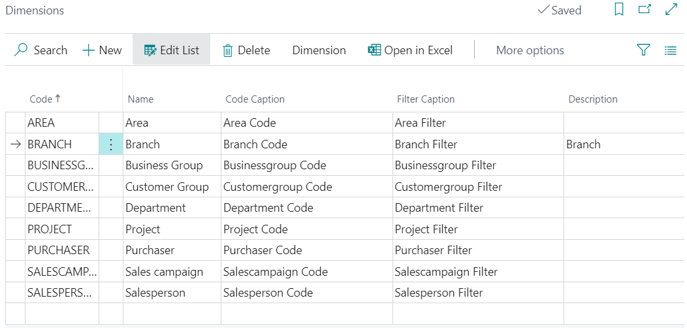

Examples of **Dimension Values:**

   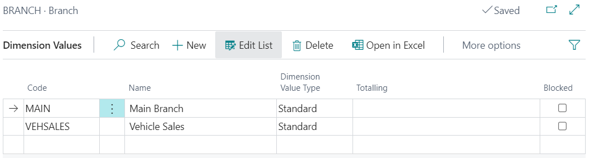

So, when you analyse entries in your system, the branch dimension values show you which branch conducted which jobs and sold which items. The more dimensions you use, the more detailed reports you generate to support your business decisions.

[Go back to top](#top)

### Setting up Dimensions
To set up Dimensions in your system:
1.	Choose the  icon, enter **Dimensions**, and then select the related link.
2.	On the **Dimensions** page, add the dimensions to work with in your system, such as **Area**, **Branch**, **Department** etc.

    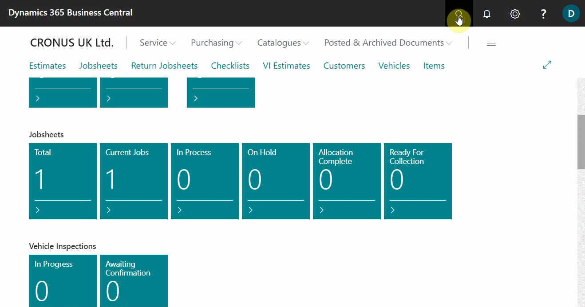

3.	After adding the **Dimensions**, select **Dimension** from the menu bar and choose the **Dimension Values** action to add the subcategories of the dimensions you added.
4.	Add the subcategories on the **Dimension Values** page, such as **Main**, **Vehicle Sales** etc, for the **Branch** dimension. Press the **Esc** key to exit the page.

    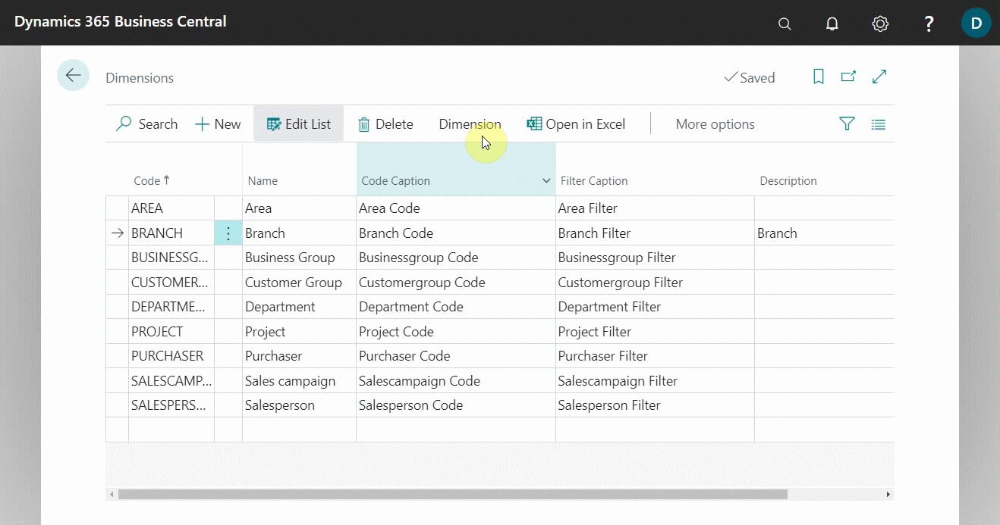

[Go back to top](#top)

### Defining Dimensions in the General Ledger Setup
You can define dimensions on the **General Ledger Setup** page as follows:
1.	Choose the  icon, enter **General Ledger Setup**, and select the related link.

    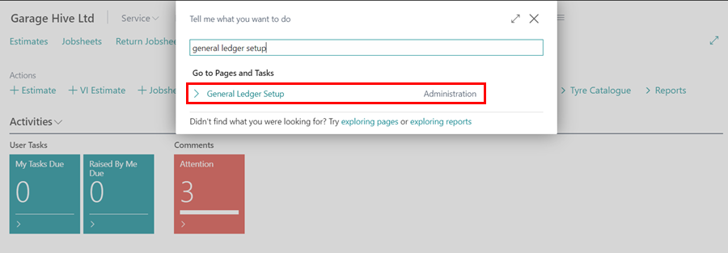

2.	On the **General Ledger Setup** page, choose **Home** from the menu bar and select **Change Global Dimensions** action.

    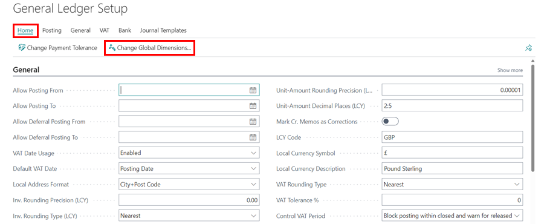

3. In the **Global Dimension 1** Code field and/or **Global Dimension 2** Code field select the dimension(s) to use as a **Global Dimension** from the previously added dimensions.

    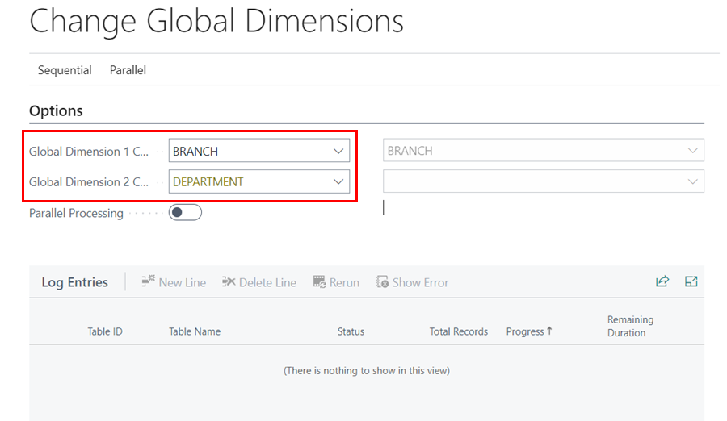

4.	After adding the Global Dimension(s), select either **Sequential** or **Parallel** mode from the menu bar to define which mode the batch job is run.
   - In **Sequential** mode (the default), the change is done in one transaction that reverts all entries to the dimensions they had before the change. In **Sequential** mode, choose the **Start** action.

       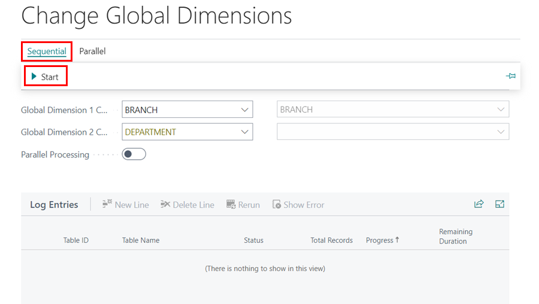

   - In **Parallel** mode, the dimension change happens in multiple background sessions and the operation is split into multiple transactions. To use this option, turn on the **Parallel Processing** slider, and choose the **Prepare** action.

       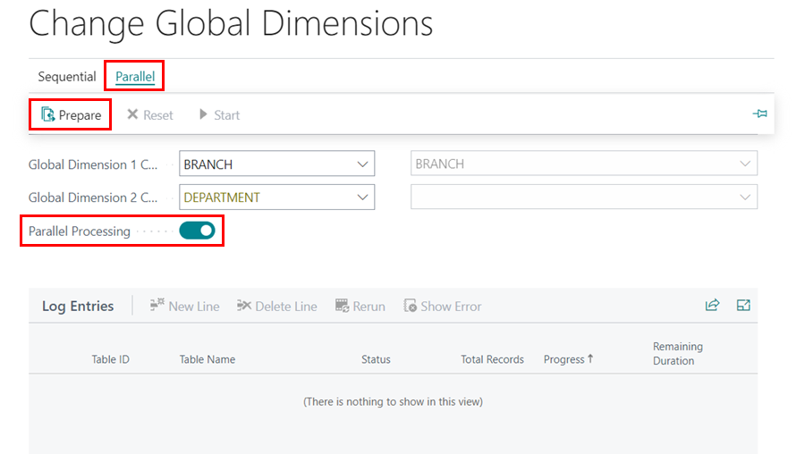

[Go back to top](#top)

### Adding Dimensions in Documents
In documents, such as **Purchase Orders**, **Jobsheets** and so on, you can change dimensions for the whole document (all the document lines) or for particular document lines. To change for the whole documents:
1. Open the document which you want to add/change the dimensions; for the **Purchase Order**, select **Dimensions** from the menu bar, for the **Jobsheets**, select **Related** from the menu bar, then **Jobsheet**, and choose **Dimensions**.

   **Purchase Order:**

      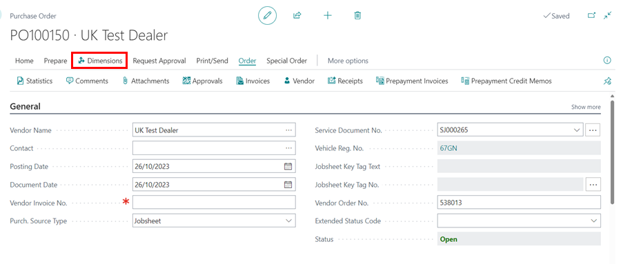
   
   **Jobsheet:**

      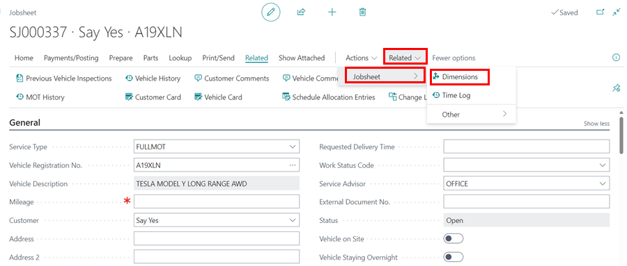

2. To add/change dimensions in specific document lines, open the document and select the line in the document. From the menu bar, click on **Line**, and choose **Dimensions**.

   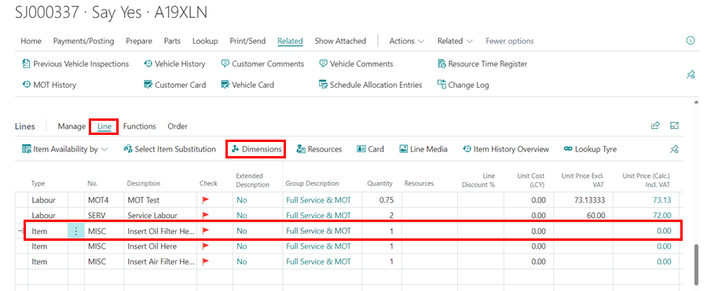

[Go back to top](#top)

### Creating Default Dimensions
You can create **Default Dimensions** to documents for specific accounts, customers, vendors, or items, which helps make reports more consistent. To add **Default Dimensions** for a specific **Vendor**:
1. Select the vendor from the list of **Vendors**, and then from the menu bar select **Vendor** followed by **Dimensions**.

   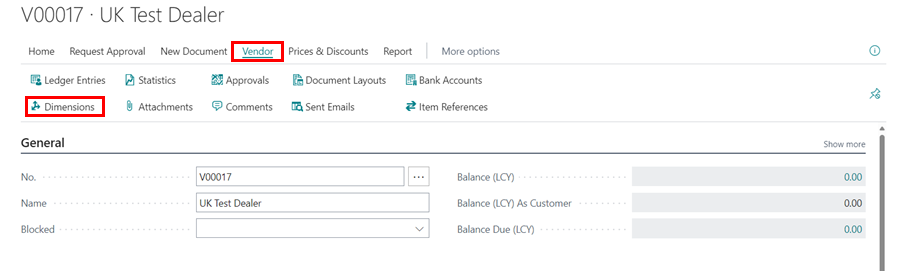

2. From the **Default Dimensions** page, select the dimension in the **Dimension Code** column, followed by the **Dimension Value Code**, and then **Value Posting** which can be: 
   - **Code Mandatory** - is used if you want the **Vendor** account to always have a **Dimension**, but allow any **Dimension Value Code**.
   - **Same Code** - is used if you only want a single **Dimension Value Code** to be allowed for the vendor account. If you try posting the document, it will show an error when the **Dimension Value Code** is not selected.
   - **No Code** - is used if you want to prevent a particular dimension from being used with that vendor account.

   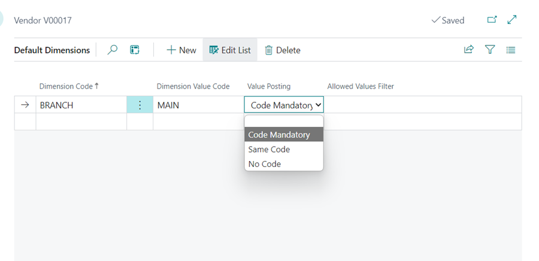

[Go back to top](#top)

### Correcting Dimensions
If you discover that an incorrect dimension has been used on posted general ledger entries, you can correct the dimension values; this helps in keeping the financial reports and analyses accurate. To start a dimension correction:
1.	Choose the  icon, enter **General Ledger Entries**, and choose the related link.

   

2.	On the **General Ledger Entries** page, choose **Entry** from the menu bar and then **Correct Dimensions** action.
3.	In the **Description** field, enter information about the change. Other people might use this information later to understand what was done.

   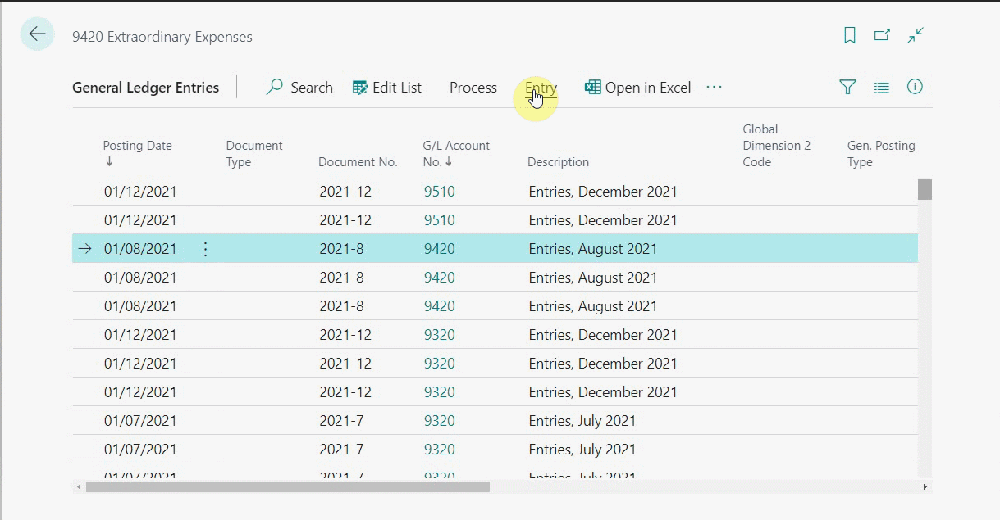

4.	On the **Selected Ledger Entries** FastTab, choose the relevant entries to correct. You have the following options of adding the entries:
   - **Add Related Entries** - Add G/L entries that are in the same G/L register.
   - **Add by Filter** - Use filter criteria when adding G/L entries.
   - **Select Manually** - Select specific G/L entries.
   - **Add by Dimension** - Filter G/L entries by dimensions.
   - **Remove Entries** - Deselect G/L entries.
   - **Manage Selection Criteria** - Keep track of the selection process, and undo selections if needed.

   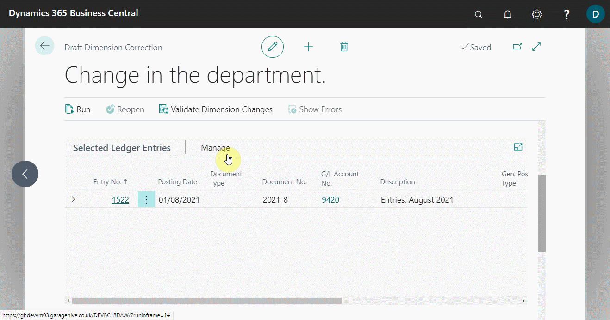

5.	On the **Dimension Correction Changes** FastTab, choose the dimension that you want to change in the **Dimension Code** field and the **New Dimension Value Cod**e field.

   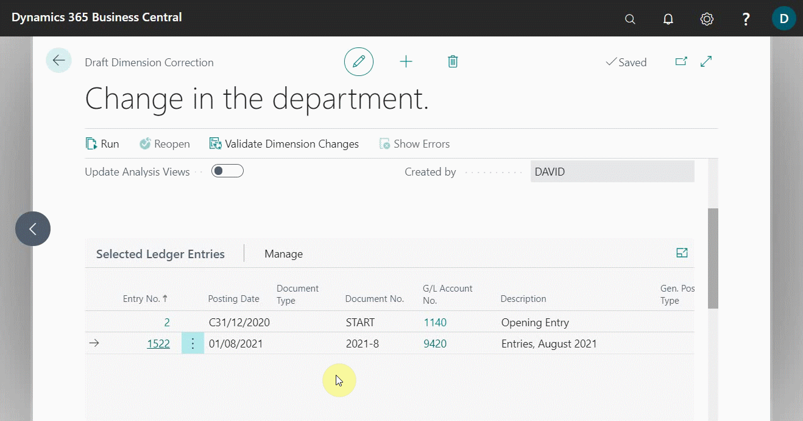

6.	To validate the correction, choose **Validate Dimension Changes** from the menu bar.

   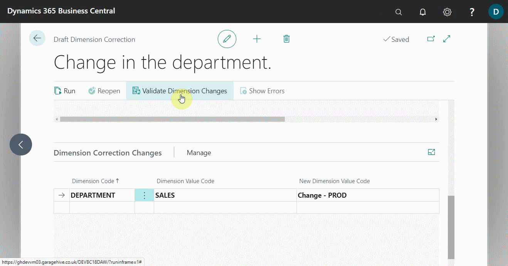

7.	After successfully validating the dimension change, click on **Entry**, select **History of Dimension Corrections**, and then select the validated change. Choose **Run** from the menu bar on the** Draft Dimension Correction** page. You can run it immediately instead of scheduling it by using the **Run Immediately** slider.

   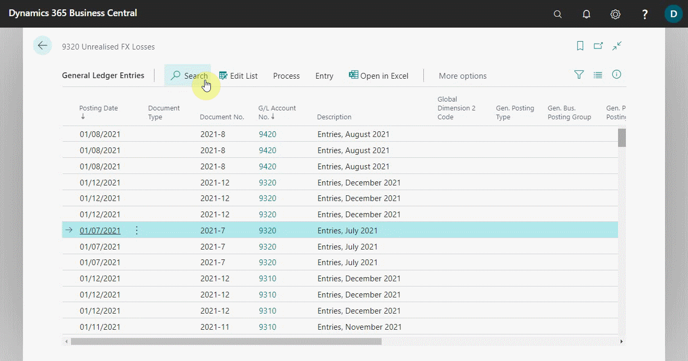

8.	To undo a correction, go to the **General Ledger Entries** page, click **Entry** from the menu bar, and then **History of Dimension Corrections**.

   

9.	Select the change to be reversed, and then, from the **Dimension Correction** page, scroll to the **Dimension Correction Changes** FastTab, select **Manage** from the menu bar, and **Revert Change** for a single change or **Revert All Changes** for all changes made in the entry.

   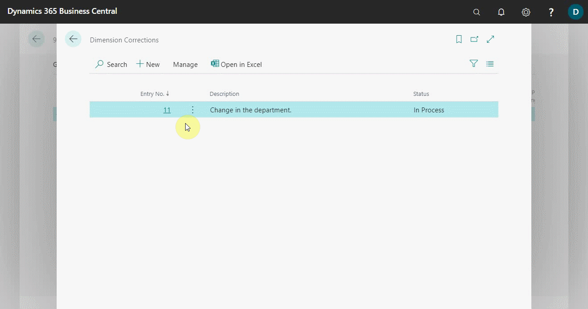

[Go back to top](#top)

