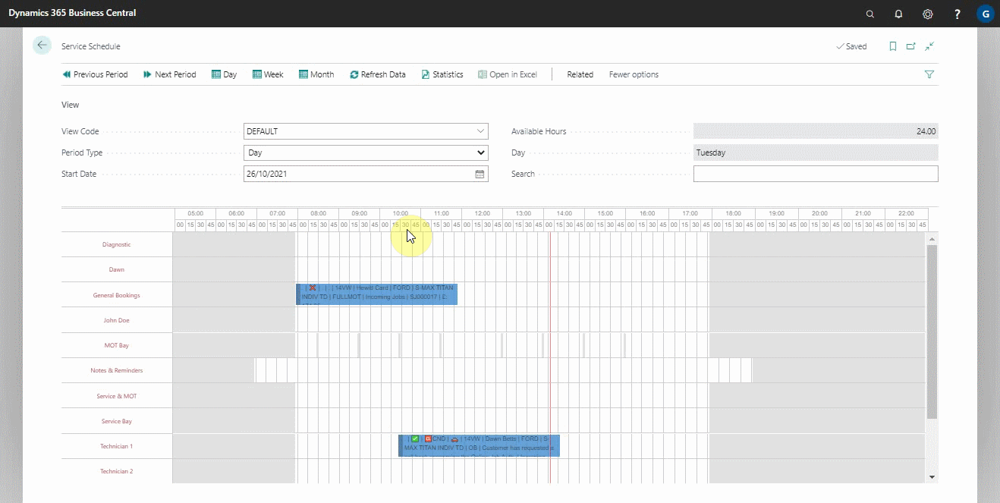

# Understanding the Schedule
The service schedule is a tool predominantly used to manage your workshop. Garage Hive works by allocating time rather than jobsheets within the schedule; this allows you to load time accurately.

## In this article
1. [Understanding the schedule layout](#understanding-the-schedule-layout)
2. [Understanding the colours within the schedule](#understanding-the-colours-within-the-schedule)
3. [Adding resources in the schedule](#adding-resources-in-the-schedule)
4. [Rearranging resources in the schedule](#rearranging-resources-in-the-schedule)
5. [Managing service hours in the schedule](#managing-service-hours-in-the-schedule)
6. [Adding resources calender changes](#adding-resources-calender-changes)
7. [View the statistics of the schedule](#view-the-statistics-of-the-schedule)
8. [Adding a standard event](#adding-a-standard-event)
9. [Understanding the emojis in an allocation](#understanding-the-emojis-in-an-allocation)
10. [Using the search function in the schedule](using-the-search-function-in-the-schedule)
11. [Adding an allocation type](adding-an-allocation-type)

###  Understanding the schedule layout
The service schedule layout is divided into the following parts:

1. **The Actions Bar:** this is where you find the different actions to use as you navigate through the schedule.
2. **The View FastTab:** this helps you to filter what to view in the schedule according to your preference.
3. **The Schedule Timeline:** this shows the day and time in the schedule. The red line in the schedule, running from top to bottom, is the current time of the day. 
4. **The Booking Slots:** this is where the allocations bookings are made and displayed. You can make multiple allocations for a single jobsheet. The colour of the booking changes depending on the allocation status; see [Understanding the colours within the schedule](#understanding-the-colours-within-the-schedule).

    >   **Example**  
    >   If you are booking in a gearbox repair job, you would not be doing all of the work in one go. 
    >
    >    Garage Hive allows you to make multiple allocations of one job, therefore being able to accurately load your day with jobs you will actually be working on, therefore your statistics of available hours will also be accurate. 

5. **The Resources:** these are all the resources available to work. When the resource is clocked as working, the colour changes to green.

###  Understanding the Colours Within the Schedule
The schedule colours are used to help understand the different work statuses for each work schedule. The following table explains the default colours that are set up in the system. You can change the colours to your preference.
 

| Default Colour | | Status | | Notes |
| :--------------------------------- | :--- | :----------- | :--- | :----------- |
 (**Light Green**) | | **IN PROCESS** | | A technician is currently working on this allocation (Do not move this allocation). It is dynamic and will grow or shrink based on the technician's clockings for this allocation. |
| | | | |
 (**Blue**) | | **PENDING** | | This is an allocation that hasn't been started. |
| | | | |
 (**Purple**) | | **FINISHED** | | A technician has clocked onto this allocation and completed their part of this job, whether that be due to requiring additional authorisation or that it is fully completed (Do not move this allocation). |
| | | | |
 (**Green**) | | **READY** | | The jobsheet status has been manually set to **READY**, meaning the vehicle is ready for collection. The customer has been contacted and the invoice has been prepared. (Do not move this allocation) |
| | | | |
 (**Grey with** 📫) | | **POSTED** | | The postbox symbol means that the jobsheet for this allocation has been invoiced and posted to the accounts. |
| | | | |
 (**Grey with** ✅) | | **REALLOCATED** | | The vehicle is still on site and the jobsheet is still open. A new allocation has been made for this vehicle within the schedule, turning any previous allocations grey. |
| | | | |
 (**Red**) | | **ON HOLD** | | A paused allocation can be moved on the schedule during the same day for a technician to resume this job. If it gets to the end of the day and there are still paused allocations, deallocate these and make a new allocation for the next day. |
| | | | |
 (**Pink**) | | **AWAITING AUTHORISATION** | | You are waiting for authorisation from either the customer/ lease/ fleet company (You have to manually change the work status code to awaiting authorisation) |
| | | | |
 (**Brown**) | | **AWAITING PARTS** | | Parts have been ordered and you are waiting for them to arrive before reallocating. (You have to manually change the work status code to awaiting parts) |

 

### Adding resources in the schedule
In Garage Hive, resources refer to all of the assets that the company has that aid and support the business in completing its work, including the technicians. Technicians are added via [User Management](/docs/garagehive-user-management.html), but their appearance in the schedule can be controlled. Here's how to add or manage resources in the schedule in general:
1. In the top-right corner, choose the  icon, enter **Schedule Resource Group** and select the related link.
2. In the list that appears, select the **Default** resource group and then click **Specifications** from the actions bar.

    

3. The **Default** resource group's resources are displayed in the list. You can add a resource to the schedule from here by selecting a cell in the **Resource No.** column and choosing from the drop-down list.

     

4. The resource is automatically added to the schedule after it is added to the list.

    

### Rearranging resources in the schedule
Rearranging the resources, how they appear from top to bottom, helps organize which resources to be at the top and how they should follow each other. 



To rearrange:
1. Search **Schedule Resource Group** from the search icon at the top-right corner, and select it from the options that appear. 
2. From the window that opens, select **Default**, as it is the group the resources are created.
3. Click on **Specifications** from the actions bar.

    

4. From the list of all the resources displayed, select the resource to rearrange and click on **Move Up** or **Move Down** from the actions bar.

    



### Managing service hours in the schedule
The service hours are the hours in the schedule when the resources are available for work. For example, you could add the technicians’ working hours as 08:00 a.m. to 17:00 p.m. every day. To change a resource's service hours:
1. In the top-right corner, choose the  icon, enter **Service Hours** and select related result.
2. The list that appears contains all of the resources that have been added in the system, with their service hours specified for various days of the week.

  

3. Scroll to the resource for which you want to change the service hours, and then click on the line with the day you want to change the time and enter the time.
4. The schedule layout is updated to reflect this change.

  

### Adding resources calender changes
Sometimes there might be a single change of the scheduled work time for the resources, and you have to change it in the schedule:
1. click on **Related** from the actions bar.
2. Select **Resource Calender Changes** in the service schedule page.

    

3. Select the resource to adjust the working time on the **Resource Code** column. 
4. Enter the date in the **Date** column, add a **Description**.
5. Change the **Nonworking** column to either **Work Time Change** (to show the working time for the resource in the schedule) or **Nonworking** (to show the time the resource is not working in the schedule).
6. Finally, add the starting and ending times (if you want to block out the whole day, leave the starting and ending times blank).

    

7. The selected time is blocked out for the resource, which also reduces the available working hours.

### View the statistics of the schedule
The schedule statistical information summarizes the resources capacity, remaining hours after allocations, a list of all the allocations for the day, and the total jobsheets for all the allocations made for the day. To view the statistics for a day:
1. From the view FastTab, select **Period Type** as **Day**.
2. The **Start Date** as the day you want to view the statistics.
3. Click on the **Statistics** from the actions bar.

### Adding a standard event
A standard event is an allocation not related to a jobsheet but adds other considerations about the resources, such as a sick off, etc. To add a standard event:
1. Click and drag in the booking slot along the resource to allocate.
2. Release up to the time when the standard event ends. 
3. Select the **Allocation Type** as **Standard Event**.

    

4. Select a standard event from the list or create a new standard event.
5. Add a **Comment** about the standard event and click **Ok**; this reduces the available hours and ensures that the resource is accurately booked.

### Understanding the emojis in an allocation
The emojis are used in the allocations to visually help the service advisor and technicians understand status and requirements of the job. Here are some of the most commonly used emojis:  

* 📫 This indicates a posted jobsheet.  
* ❌This indicates that the vehicle is not marked on site from the jobsheet.  
* ✅ or ✔ This indicates that the vehicle has been marked as on site from the jobsheet.  
* 🔑 This indicates that the vehicle key has been assigned a key tag.  
* 🆑 This indicates that the vehicle has been marked as requiring collection and delivery.  
* 🚗 This indicates that the customer requires a courtesy car, and it's marked in the jobsheet.  
* 🌛 This indicates that the vehicle has been marked as staying overnight.  
* ⏰ This indicates that the customer has specified a time to collect the vehicle.  
* £ This indicates the amount including VAT.  
* ⚓ This indicates that the vehicle has been assigned a parking location code.  
* 🤷 or 🙋‍♀️ This indicates that the customer is waiting.

### Using the search function in the schedule
When there are many bookings in the schedule, it becomes harder to find an allocation that you are looking for easily. The search function helps you overcome this challenge by enabling you to search for an allocation using the customer name, vehicle registration No., vehicle make or model, or the jobsheet No.:
1. From the view FastTab, under the **Search** field, enter the allocation details to search.
2. Press enter; this hides all the other allocations, leaving the allocation you need.

### Adding an allocation type
To add an allocation type in the schedule:
1. In the top-right corner, choose the  icon, enter **Service Schedule New Allocation Menu** and select the related result.

   

2. The list that appears contains all previously setup allocation menus. To add a new line, select **+New** from the actions bar. In the new line, select a **Work Group Code**. The work group code specifies the type of service work group that will be assigned.
3. The next column, **Line No.**, is a number that will be applied to the allocation to determine the order in which it will appear when selecting an allocation type. The lower the number, the higher it appears in the list, and vice versa.

   

4. The **Type** column specifies the type of allocation; it can be **New Service Order**, **Standard Event**, or **Existing Service Order**. Select the type and enter the **Description** (the text to be displayed when you are selecting an allocation type).

   

5. If you did not select **Standard Event** as the **Type** of allocation, leave the **Standard Event** column blank, and fill out the **Service Type** column if you selected either of the other two types of allocation. If you chose **Standard Event** as the type of allocation, fill in the **Standard Event** column with the available options and leave the **Service Type** column blank.

   

6. After filling in the required columns, exit the current page, and a new allocation type will be created.

 

### See Also

[Video: Understanding the schedule](https://www.youtube.com/watch?v=JSHb-4I0PCY){:target="_blank"} \
[Creating a booking from the schedule](/docs/garagehive-create-a-booking.html) \
[Adding a resource (person or machine) in Garage Hive](garagehive-adding-a-resource.html)

