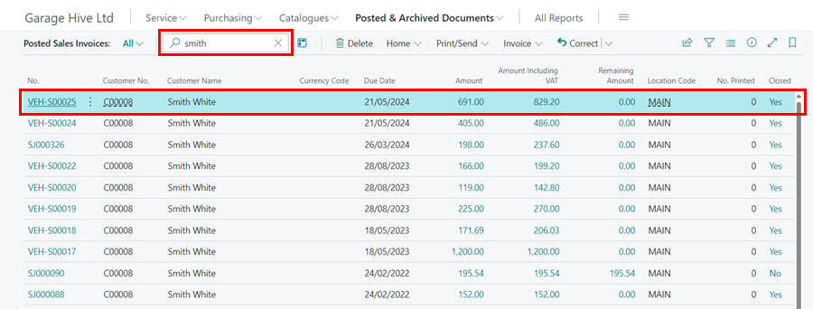
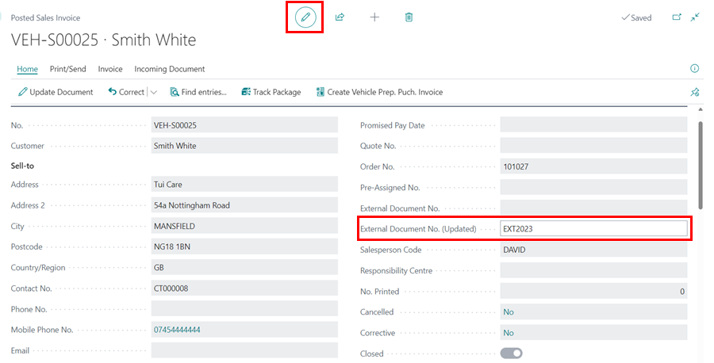

# How to Update an External Document Number of a Posted Dales Invoice
To update the external document number of a posted sales invoice in Garage Hive, follow these steps:
1. From the Role Centre, select **Posted & Archived Documents** and then choose Posted Sales Invoice. 

   

2. Select or search for the **Posted Sales Invoice** to update in the list that opens.

   

3. The document will open in editable mode. If it doesn't open in editable mode, change it using the pencil symbol at the top of the page.
4. Enter the **External Document No. (updated)** in the respective field under the **General** FastTab and press Tab key. 

   

   [Go back to top](#top)

