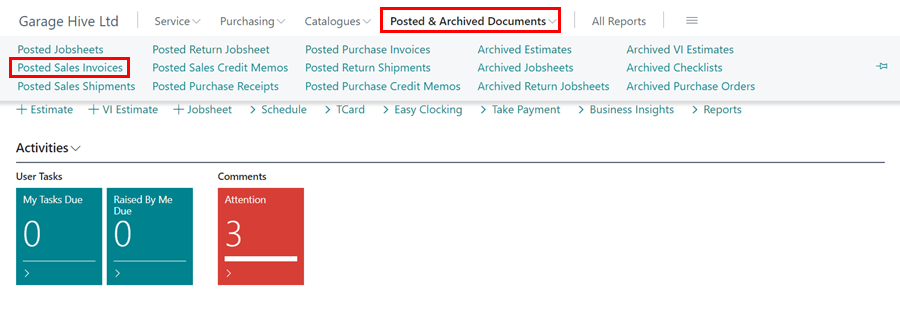

# How to update an external document number of a posted sales invoice

In Garage Hive you have the ability to add an External Document number to a posted sales Invoice. 

First locate the Posted Sales Invoice through the Posted & Archived Documents.

The Document will open in "View Mode", change the document to edit mode using the pencil symbol at the top of the page. 

This will allow you to enter an external document number to update the document. 

