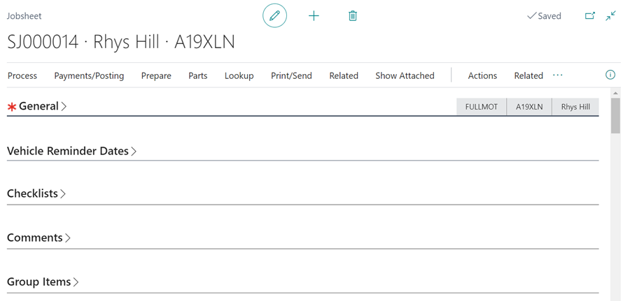
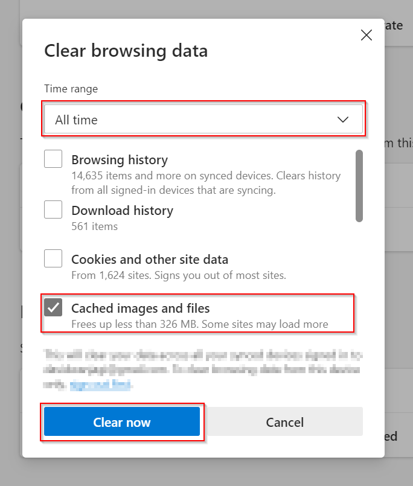
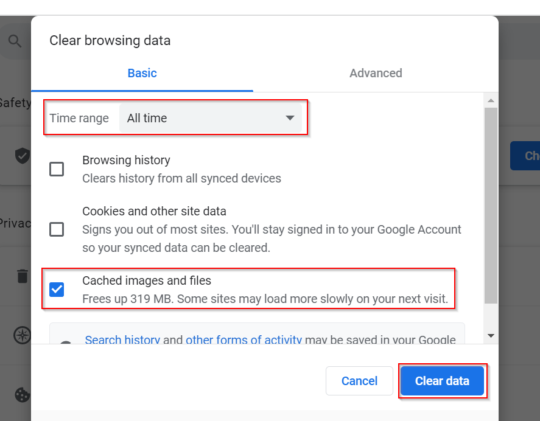

# Upgrade to Version 20 of Business Central Known areas of impact

### 1. The FastTabs are closed by default, you will need to click on them to reopen them.

   

### 2. The Message text field on Send Email Page may disappear.

   

To resolve this:
   - Delete cache and cookies in the new **Microsoft Edge**:
      1. Open Microsoft Edge, select Menu (3 dots icon on top right corner of the browser) > **Settings** > **Privacy & services**.
      2. Under Clear browsing data, select Choose what to clear.
      3. At the top, choose a time range. To delete everything, select **All time**.
      4. Select **Cached images and files** check box and then select **Clear Now**.

      

   - In **Google Chrome**:
       5. On your computer, open Chrome.
       6. At the top right, click **More**.
       7. Click **More tools**. Clear browsing data.
       8. At the top, choose a time range. To delete everything, select **All time**.
       9. Select the **Cached images and files** check boxe.
       10. Click **Clear data**.

      