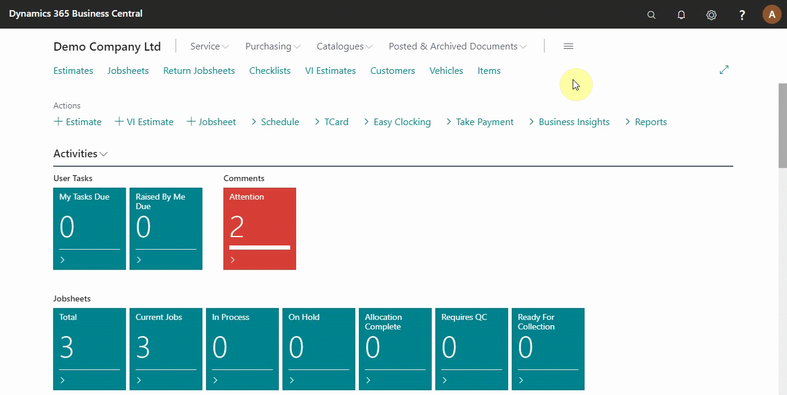
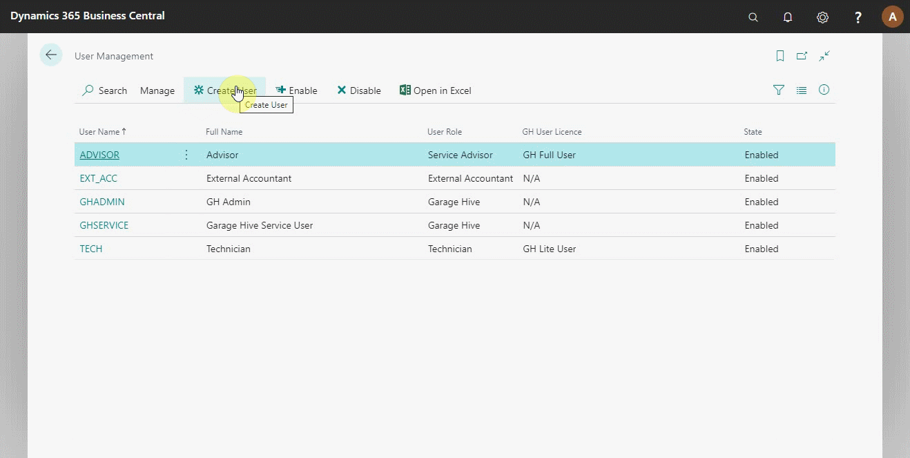
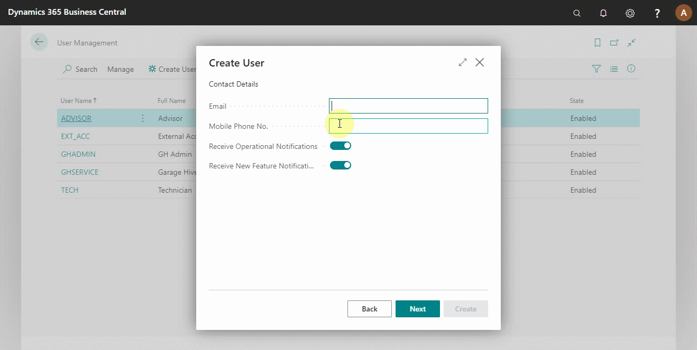
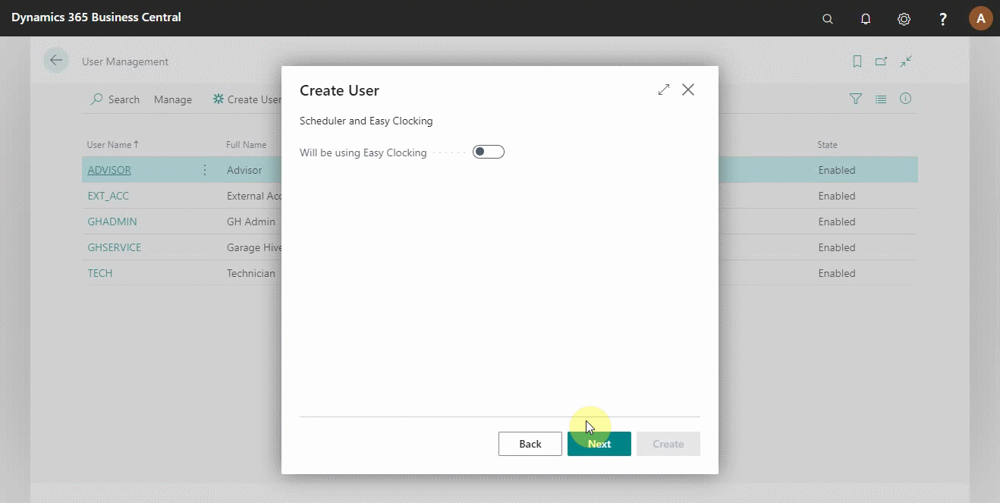
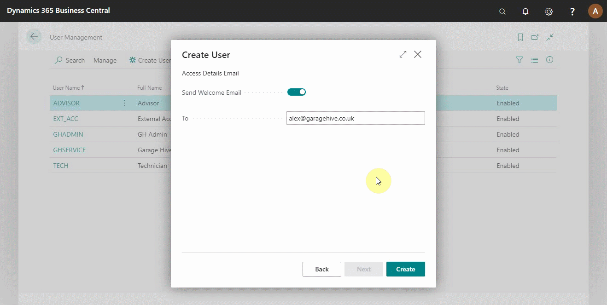
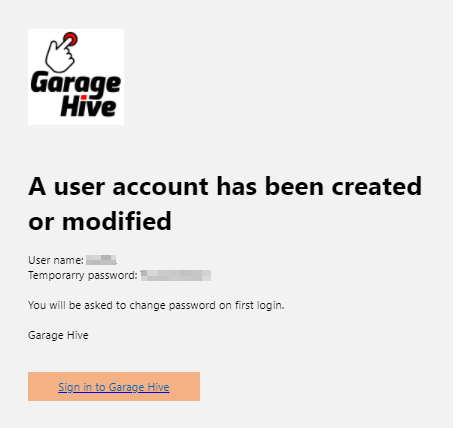
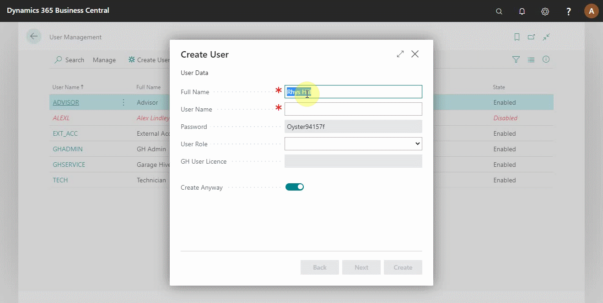
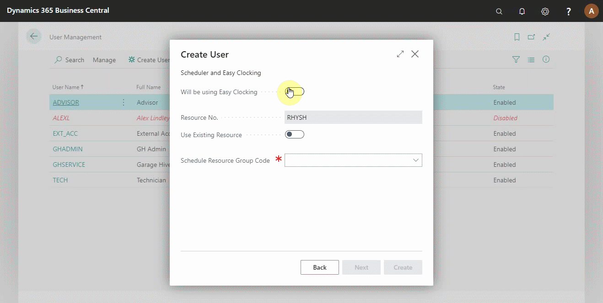
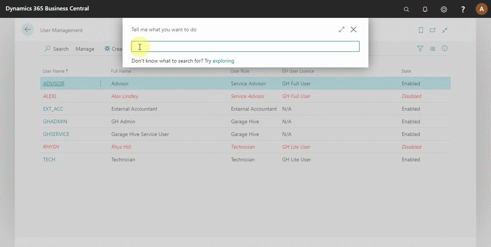
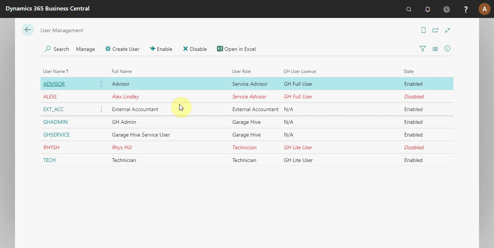

#   How to Manage System Users Within Garage Hive 
In Garage Hive system, you can add and remove users in the system. The **GHADMIN** user is the **ONLY** user who can manage the users.

## In this article
1. [Adding and removing a user licence](#adding-and-removing-a-user-licence)
2. [Creating a Service Advisor user](#creating-a-service-advisor-user)
3. [Creating a Technician user](#creating-a-technician-user)
4. [Enabling and disabling a user](#enabling-and-disabling-the-user)

### Adding and removing a user licence
To be able to use user accounts in the Garage Hive system, they must have a licence. The addition or removal of licences is handled on the development side. So, to initiate the process of adding or removing licence:
1. Use [this link](https://www.garagehive.co.uk/subs) to raise a ticket. It will be taken up by a member of the support team.
2. The user licence will be added or removed, and you will now be able to manage the users in your system, as indicated in the sub-headings below.

### Creating a Service Advisor user
1. Search for **User Management** in the search icon at the top-right corner. 
2. The user management table opens; it displays all the users, their roles, statuses, user licences and the GH User licences for the system (right-hand side).

    

3. To create a new **Service Advisor** user, click on **Create User** from the actions bar and enter the user details in the pop-up window. 
4. The system generates a username and password.

    

5. Click **Next** to enter user contact details and notification settings for the user.
6. Click **next** to specify the clocking preference for the user.

    

7. The following two pages allow you to add the **Salesperson Code** or use an existing salesperson and choose whether to send a welcome email.

    

8. After adding all the required information, click on **Create** to create the user.

    

9. An email is sent to the new user with the login details, and they can now sign in.

### Creating a Technician user
To create a **Technician** user:
1. Click on **Create** from the actions bar and enter the user details and contact details in the following two pages.

    

2. On the third page, select **Will be using Easy Clocking** and add the **Schedule Resource Group Code** that the technician will be using. The **Resource No.** is automatically generated. 
3. No salesperson is required on the following pages, and you can send out a welcome email to the technician.

    

4. After creating the technician user, check the schedule to ensure the technician is added.

### Enabling and disabling the user
To enable or disable the user:
1. Click on **Enable** or **Disable** from the actions bar.

> **Note:**
>
>All users created in the system need a licence; talk to our support team to activate your licences, or [raise a ticket](https://www.garagehive.co.uk/subs).

### **See Also**

[Video: How to manage system users within Garage Hive](https://www.youtube.com/watch?v=Icq0D8j4HIc)