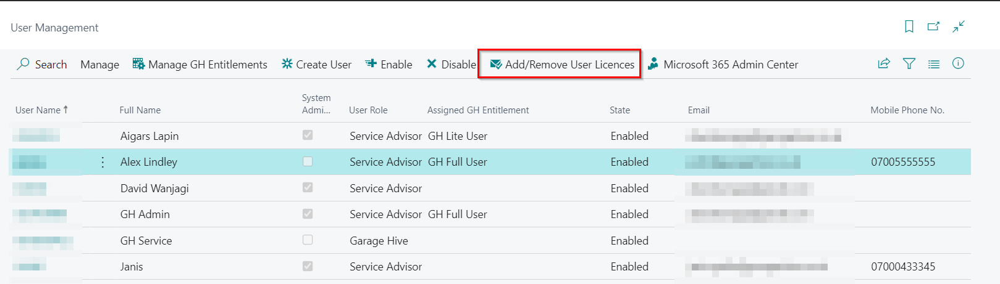
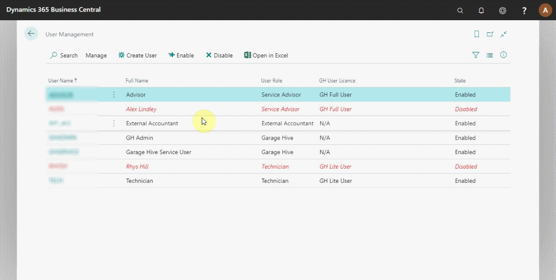
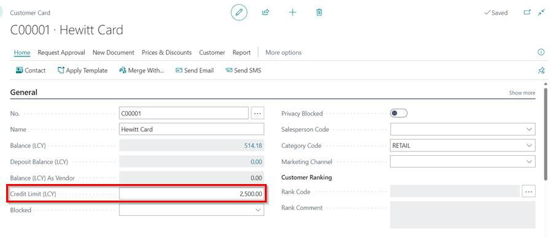
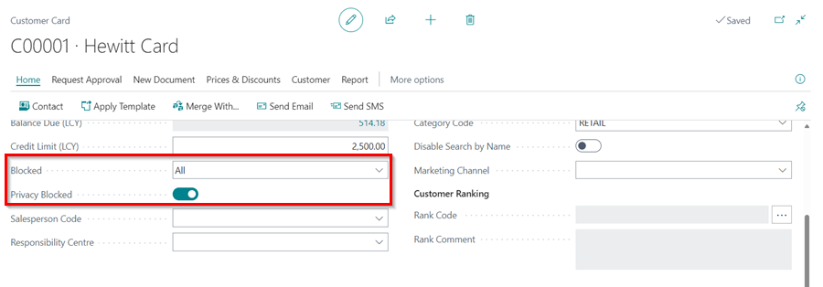
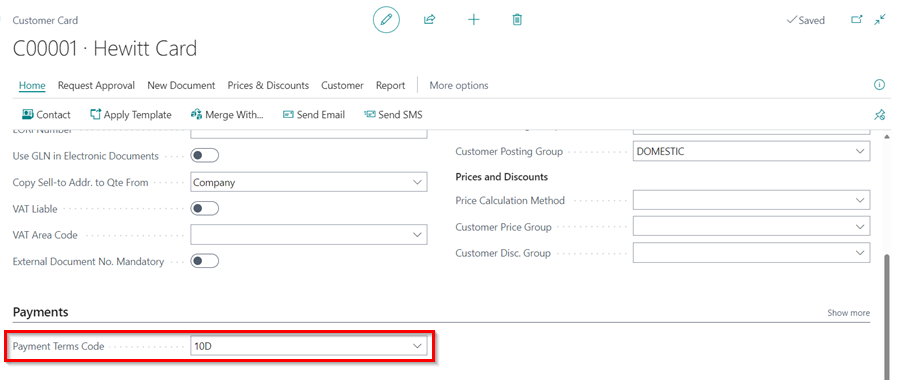
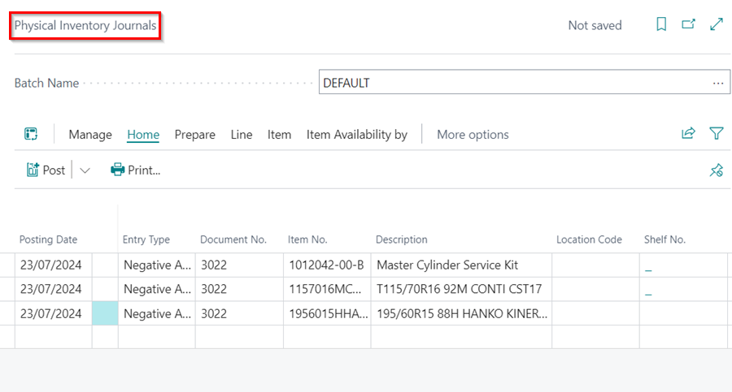
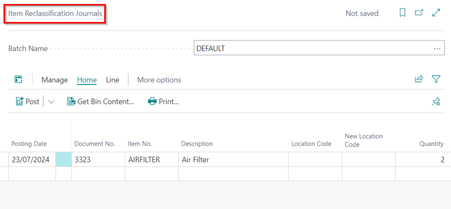

# How to Create Users, Manage Roles and Enable Data Permissions in Garage Hive
In the Garage Hive system, the **User Management** page allows creation of licenced users, management of their roles, and enabling of data permissions. The only user who can create users, manage roles, and enable data permissions for users is the one who is marked as the **System Administrator**.

## In this article
1. [Checking User Licences Available In the System](#checking-user-licences-available-in-the-system)
2. [Adding and removing a user licence](#adding-and-removing-a-user-licence)
3. [Creating a Service Advisor user](#creating-a-service-advisor-user)
4. [Creating a Technician user](#creating-a-technician-user)
5. [Enabling and disabling a user](#enabling-and-disabling-the-user)
6. [Password reset for garage hive user](#password-reset-for-garage-hive-user)
7. [Enabling Data Permissions for a User](#enabling-data-permissions-for-a-user)
8. [Add Authentication Email with Azure Active Directory &#40;AAD&#41;](#add-authentication-email-with-azure-active-directory-aad)
9. [How to Filter Out Service Advisor Tiles For a User](#how-to-filter-out-service-advisor-tiles-for-a-user)

### Checking User Licences Available In the System
To check the number of user licences available in your system:
1. Search for **User Management** in the  icon, at the top-right corner.

   

2. In the top right corner, you'll find an information icon (ℹ️). Click on it.

   

3. This action will open a new sidebar on the right side of the screen, where the total number of GH user licences currently available in your system can be viewed.

   

[Go back to top](#top)

### Adding and removing a user licence
To be able to use user accounts in the Garage Hive system, they must have a licence. The addition or removal of licences is handled by the Garage Hive support team. So, to initiate the process of adding or removing licence:
1. Search for **User Management** in the  icon, at the top-right corner.
2. From the menu bar, select **Add/Remove User Licences**.

    

3. Enter the number of licences to be added, as shown in the image below, and then click **OK**.

    

4. You will receive a notification with the following message:

   **'Your request was submitted to Garage Hive support. You should receive a confirmation email immediately. Please note that processing Microsoft licences can take up to 48 hours.'**

   

[Go back to top](#top)

### Creating a Service Advisor user
1. Search for **User Management** in the  icon, at the top-right corner. 
2. The user management table opens; it displays all the users, their roles, statuses, user licences and the GH User licences for the system (right-hand side).

    

3. To create a new **Service Advisor** user, click on **Create User** from the menu bar and enter the user details in the pop-up window. 
4. The system generates a username and password.

    

5. Click **Next** to enter user contact details and notification settings for the user.
6. Click **next** to specify the clocking preference for the user.

    

7. The following two pages allow you to add the **Salesperson Code** or use an existing salesperson and choose whether to send a welcome email.

    

8. After adding all the required information, click on **Create** to create the user.

    

9. An email is sent to the new user with the login details, and they can now sign in.

[Go back to top](#top)

### Creating a Technician user
To create a **Technician** user:
1. Click on **Create** from the menu bar and enter the user details and contact details in the following two pages.

    

2. On the third page, select **Will be using Easy Clocking** and add the **Schedule Resource Group Code** that the technician will be using. The **Resource No.** is automatically generated. 
3. No salesperson is required on the following pages, and you can send out a welcome email to the technician.

    

4. After creating the technician user, check the schedule to ensure the technician is added.

[Go back to top](#top)

### Enabling and disabling the user
To enable or disable the user:
1. Click on **Enable** or **Disable** from the menu bar.

[Go back to top](#top)

### Password reset for garage hive user
To reset a garage hive user's password:
1. In the top-right corner, choose the  icon, enter **User Management**, and choose the related link.
2. Click on the name of the user you want to reset the password.

   

3. Click on **Reset Password** action, and then **OK**.

   

4. The user will receive an email with the new password and a link to login. When the user logs in, they will be prompted to change the password to a new password. The **Old Password** should be the password received via email, and the **New Password** should be the user coming up with it, and **Confirm Password**.

   

> The password entered must be at least 8 characters long and contain at least one uppercase letter, one lowercase letter, one number and one special character. It must not have a sequence of 3 or more ascending, descending or repeating characters.



[Go back to top](#top)

### Enabling Data Permissions for a User
To manage **Data Permissions** for a user:
1. In the top-right corner, choose the  icon, enter **User Management**, and choose the related link.

   

2. Select the user for which you want to enable data Permissions and scroll down to the **Data Permissions** FastTab in the user card.

   

3. You can enable the following **Data Permissions** for a user:
   * **Change Accountancy Setup** - This should never be enabled unless in consultation with the Garage Hive support team.
   * **Change Customer Credit Limit** - When this is enabled, the user can change the **Credit Limit** field in the Customer Card, which is located under the **General** FastTab.
         
      

   * **Change Customer Blocked** - When this is enabled, the user can block or unblock the Customer Card in the **General** FastTab of the Customer Card.
      
      

   * **Change Customer Payment Terms** - When this is enabled, the user can add or remove the **Customer Payment Terms** from the Customer Card under the **Payments** FastTab or from the Jobsheet under the **Invoicing** FastTab.

      
      
      or 

      

    * **Post Item Journals** - When this is enabled, the user can post the following journals in the system:
         - **Item Journals** - used to adjust the available quantity of an item in the system.

            

         - **Physical Inventory Journals** - Used after a physical stock take to adjust the item quantities in the system to match the physically available inventory.

            

         - **Item Reclassification Journals** - Used to change Location Code, or Branch Code for item quantities in the system.

            

         - **Item Revaluation Journals** - Used to adjust the value of items in the inventory without affecting their quantity.

            

[Go back to top](#top)

### Add Authentication Email with Azure Active Directory (AAD)
To add an authentication email, first create a user in the Azure Active Directory Admin Portal, [learn more](garagehive-azure-active-directory-user.html){:target="_blank"}. After creating the user, add the **Email** as follows:
1. In the top right corner, choose the  icon, enter **User Management**, and select the related link.

   

2. Select the user to add the **Authentication Email**, and enter the email in the **Authentication Email** field.

   

### How to Filter Out Service Advisor Tiles For a User
If you want a specific user to only see the tiles they have created in the Role Centre, you can enable that in the system for the user; this means that if they only created 4 Jobsheets and there are a total of 12 Jobsheets created, they will only see the 4 Jobsheets they have created in their Role Centre tiles. To enable this for a user:
1. In the top right corner, choose the  icon, enter **User Management**, and select the related link.

   

2. Select the user for that you want to enable Service Advisor tile filtering and scroll down to **Other** FastTab. To filter **Service Advisor Tiles (Jobsheets and Estimates),** use the **Filter Service Advisor Tiles** slider; to filter only the **Vehicle Inspection (VI) Tiles**, use the **Filter Service Advisor VI Tiles** slider.

   
   

[Go back to top](#top)

### **See Also**

[Video: How to manage system users within Garage Hive](https://www.youtube.com/watch?v=Icq0D8j4HIc){:target="_blank"} \
[How to Create and Edit Users in Azure Active Directory (AAD) and Reset Password](garagehive-azure-active-directory-user.html){:target="_blank"} \
[How to Manage GH Entitlements](garagehive-gh-entitlements.html){:target="_blank"}