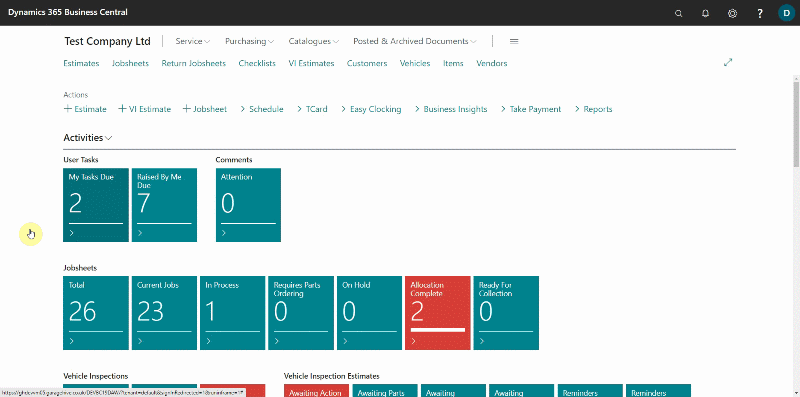
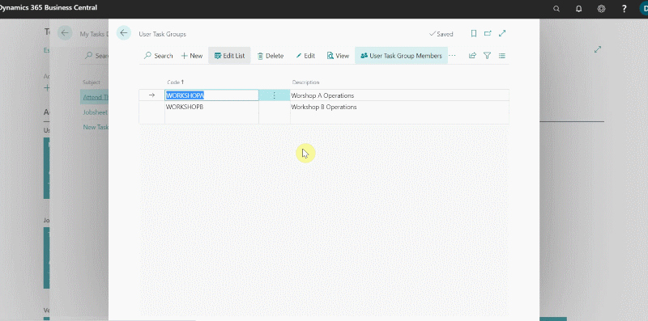
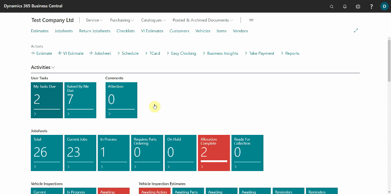
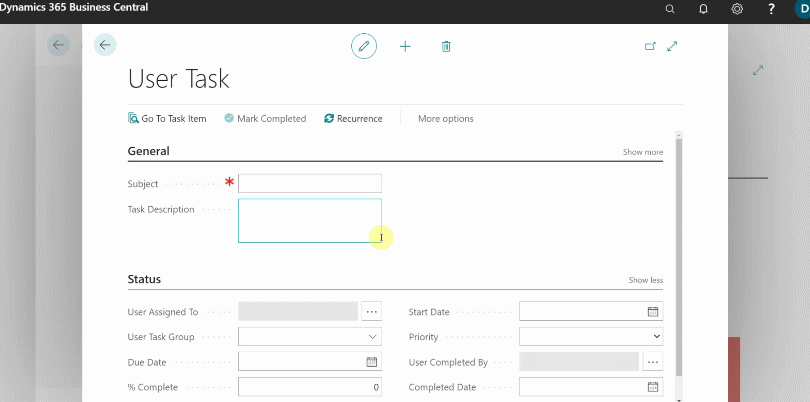
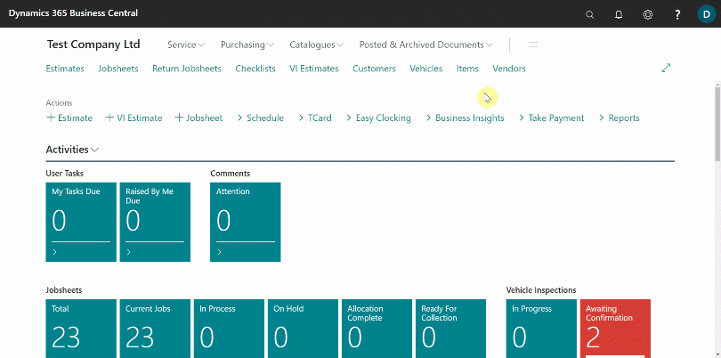
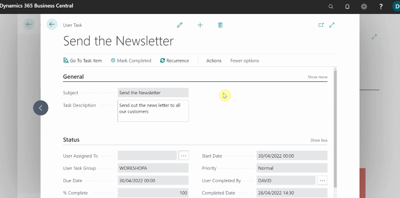
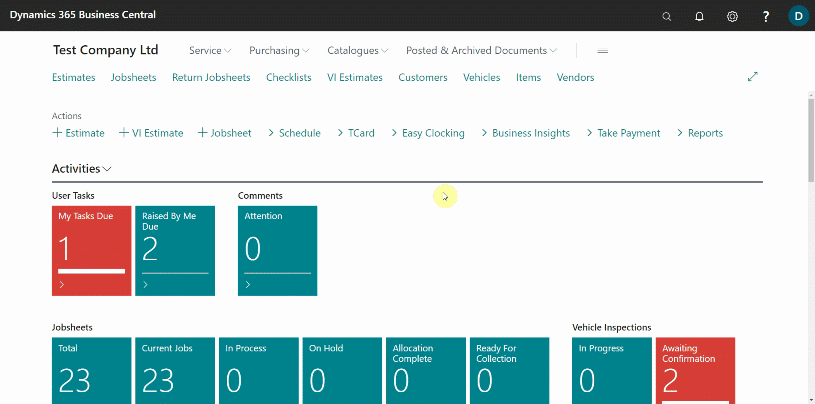

# Creating User Tasks in Garage Hive
**User Tasks** is a feature in Garage Hive that allows tasks to be assigned to users in the system, with the ability to add a due date, group tasks, and add recurrence, among other things.

## In this article
1. [Creating user tasks groups](#Creating-user-tasks-groups)
2. [Add and assign task to a user](#Add-and-assign-task-to-a-user)
3. [Create a recurring task](#Create-a-recurring-task)
4. [Check due tasks and mark as complete](#Check-due-task-and-mark-as-complete)

### Creating user tasks groups
User tasks groups, help in grouping tasks and adding users to the group for easy task management. To create a **User Task Group:**
1. In the top-right corner, choose the search icon, enter **User Group Task**, and select the related link.
2. Click on **New**.

   

3. Add a **Group Code** and the **Description**, for example you can create a group with the code **WorkshopA**, and the description to be **Workshop A Operations.**
4. To add users in the group, click on the **User Name** field and select the users to add.

   

5. The group is now successfully created. Click the back arrow, to go back to the groups list. You can create as many groups as required.

### Add and assign task to a user
After creating the groups, now you can add tasks to assign the user. To Create a task:
1. In the top-right corner, choose the search icon, enter **User Tasks**, and select the related link.
2. Click on **New.**

   

3. Enter the **Subject** of the task, under the **General** FastTab, and then expound more about the subject in the **Description** field.
4. Under the **Status** FastTab, select the user to assing the task in the **User Assigned To** field, and then add the **Start Date** and the **Due Date** for the task.
5. From the **User Task Groups** that you have created, select the group that this task belongs to in the **User Task Group.**
6. In the **Priority** field, select the level of urgency for the task.

   

7. The task now is added. Click on the back arrow to exit.

### Create a recurring task
To create a recurring task:
1. In the top-right corner, choose the search icon, enter **User Tasks**, and select the related link.
2. You can select a previously created task or create a new one. Select the **User Task** to add the recurrence setting by clicking on the **Subject.**

   

3. In the **User Task** card, click on **Recurrence** from the actions bar.
4. Enter the **Recurring Start Date**, which is the start of the recurrence, then the **Recurrence**, which is the number of days after which the recurrence task will occur, for example, enter **30D** for a task recurring every 30 days, and finally the **Occurrences**, which is the number of times the task will recur, for example, enter **12** for a task recurring 12 times only. Click **OK.**
   
   

### Check due tasks and mark as complete
You can check the task that are due from the role centre:
1. Under **Activities**, there are tiles grouped as **User Tasks**, click on the **My Tasks Due** tile, to view the tasks which are due. The tile is setup to turn red, when a task assigned to you is due.
2. When the task is done, select **Mark as Completed** from the actions bar.
3. To check other tasks, that you have created and are due, click on the **Raised by Me Due** tile.

   

 

### See Also 

[Video: How to create and sort item card templates](https://www.youtube.com/watch?v=mbS2QuaEagE) \
[Create item Price/Discount groups and update items](/docs/item-price-discount-groups.html "Create item Price/Discount groups and update items") 
