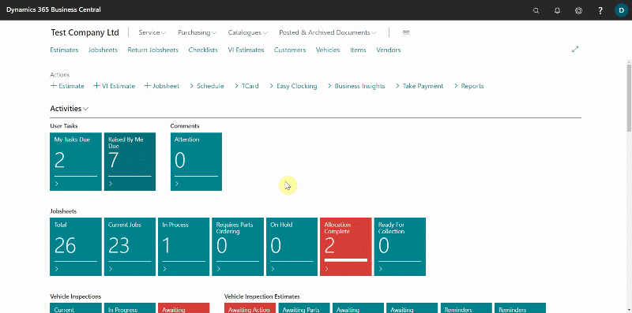

# Creating User Tasks in Garage Hive
**User Tasks** is a feature in Garage Hive that allows tasks to be assigned to system users, with the option to add a due date, group the tasks, and add recurrence for a task, among other things.

## In this article
1. [Creating user tasks groups](#creating-user-tasks-groups)
2. [Assign tasks to a user or user tasks group](#assign-tasks-to-a-user-or-user-tasks-group)
3. [Create a recurring task](#create-a-recurring-task)
4. [Check due tasks and mark as complete](#check-due-task-and-mark-as-complete)

### Creating user tasks groups
**User Task Groups**, help in grouping tasks and adding users to a group for easy task management. To create a **User Task Group:**
1. On the role centre, select either the **My Tasks Due** or the **Raised By Me Due** tile.
2. In the page that opens, select **User Task Groups** from the actions bar.
3. Add a **Group Code** and the **Description** for the group, for example you can create a group with the code **WORKSHOPA**, and the description to be **Workshop A Operations.**

   

4. Select **User Task Group Members** from the actions bar and click on the **User Name** field to add users to the group. Select a user from the list that opens and click **OK**. Repeat this process to add more users.

   

5. The group is now successfully created. Click the back arrow, to go back to the groups list. You can create as many groups as required.

### Assign tasks to a user or user tasks group
After creating the groups, now you can assign tasks to a **User** or the **User Task Group**. To Create a task:
1. On the role centre, select either the **My Tasks Due** or the **Raised By Me Due** tile.
2. Click on **New.**

   

3. Enter the **Subject** of the task, under the **General** FastTab, and then expound more about the subject in the **Description** field.
4. Under the **Status** FastTab, select the user to assign the task in the **User Assigned To** field, and then add the **Start Date** and the **Due Date** for the task.
5. You could, on the other hand, assign the task to the **User Task Group** instead, by selecting from the list in the **User Task Group** field.

   

6. Finally, in the **Priority** field, specify the level of urgency for the task.

   

7. The task now is added. Click on the back arrow to exit.

### Create a recurring task
To create a recurring task:
1. On the role centre, select either the **My Tasks Due** or the **Raised By Me Due** tile.
2. You can choose an existing task or create a new one. Because of the filters applied to the tiles, if you don't find the task you're looking for on the tile you've chosen, close it and choose the other tile.
3. To add the recurrence setting click on the **Subject** of the **User Task**.

   

4. In the **User Task** card, click on **Recurrence** action from the actions bar.
5. Enter the **Recurring Start Date**, which is the start of the recurrence, then the **Recurrence**, which is the number of days after which the recurrence task will occur, for example, enter **30D** for a task recurring every 30 days, and finally the **Occurrences**, which is the number of times the task will recur, for example, enter **12** for a task recurring 12 times only. Click **OK.**
   
   

### Check due tasks and mark as complete
You can check the task that are due from the role centre:
1. Click on the **My Tasks Due** tile, to view the tasks which are due. The tile is setup to turn red, when a task assigned to you is due.
2. When the task is done, select **Mark as Completed** from the actions bar.
3. To check other tasks, that you have created and are due, click on the **Raised by Me Due** tile.

   
