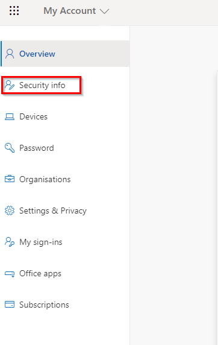
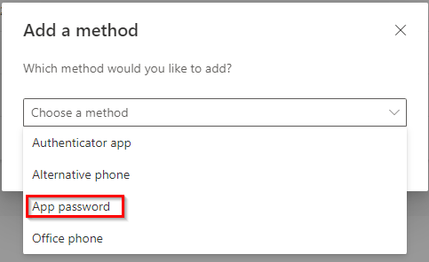
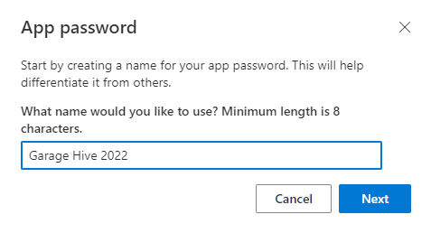
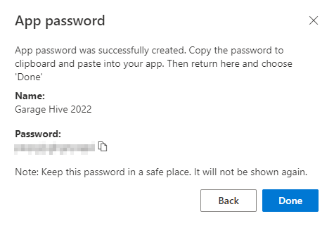
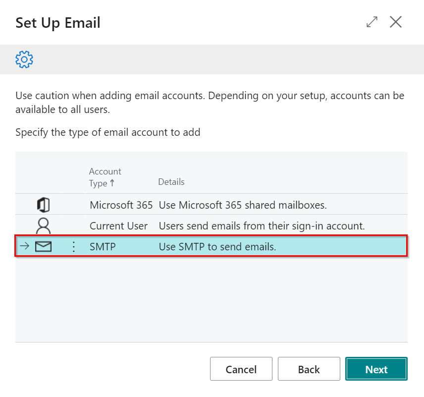
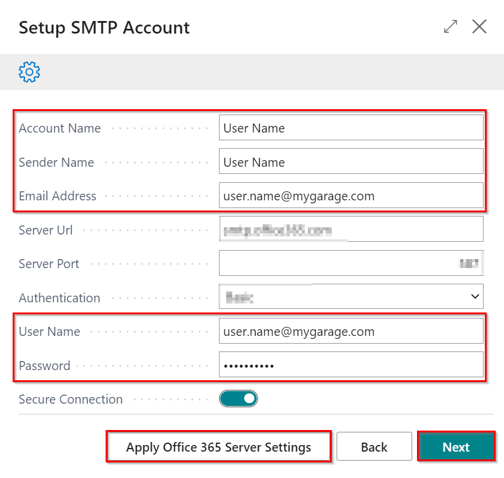
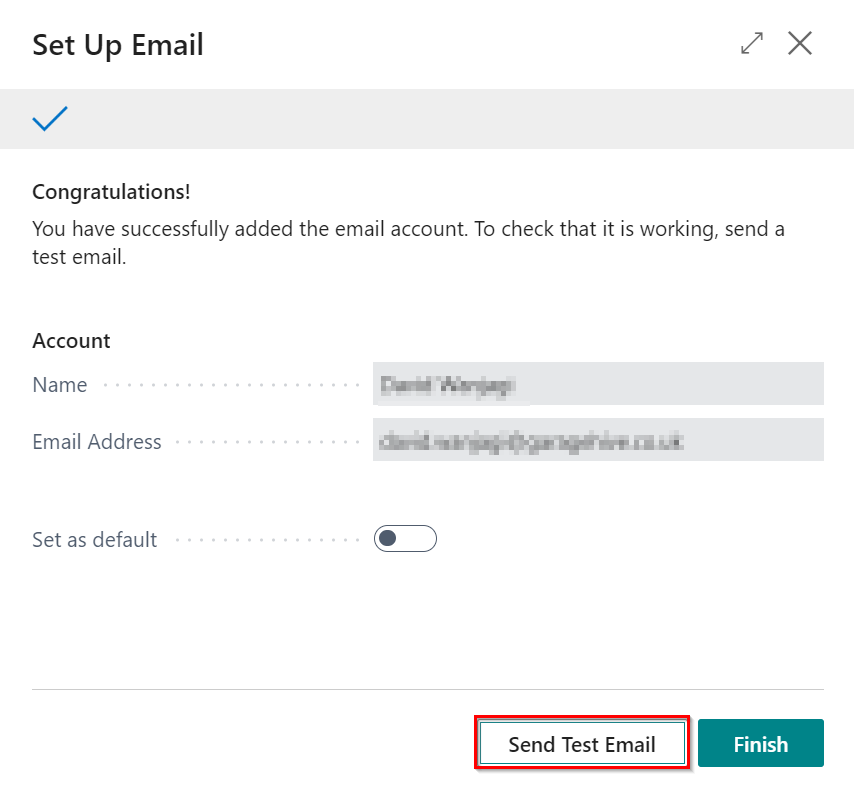
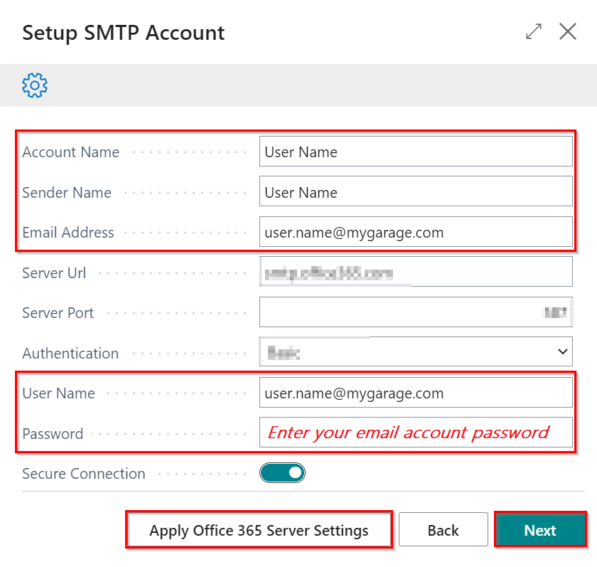
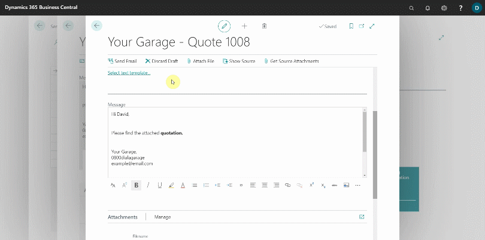

## In this article
1. [Email setup](#email-setup)
2. [Using the emailing feature](#using-the-emailing-feature)
3. [Accessing email outbox](#accessing-email-outbox)
4. [Accessing sent emails](#accessing-sent-emails)

### Email setup
If your system does not have an email setup, you must do the setup before using the emailing feature:
1. In the top-right corner, choose the search icon, enter **Email Accounts**, and select the related link.
2. Select **New** and then **Add an email account**.
3. Read the information in the pop-up window and then press **Next**.

   

4. The email setup uses the **SMTP** account type. We'll go over how to set up a **Microsoft Office 365** email account and a **Gmail** email account. To get to the setup you require, click on any of the links below.
   - [Microsoft office 365 email account setup](#microsoft-office-365-email-account-setup)
   - [Gmail email account setup](#gmail-email-account-setup)

#### Microsoft office 365 email account setup
1. There are two options for setting up the **Microsoft Office 365 email account**, one is when you have a **Multi-factor Authentication** method enabled, this is when the user is required to provide two or more verification factors to gain access to your Microsoft account, and two is when you don't have the **Multi-factor Authentication** enabled. First, let's look at scenario one.
1. When you have the **Multi-factor Authentication** enabled, you will require an **App Password** which you get from your microsoft account, [read more](https://support.microsoft.com/en-us/account-billing/manage-app-passwords-for-two-step-verification-d6dc8c6d-4bf7-4851-ad95-6d07799387e9). 
1. To get the **App Password**, sign in to your Microsoft account, go to the [My Account page](https://myaccount.microsoft.com/) and select **Security info**.

   

1. Select **Add sign-in method**, choose **App password** from the list, and then select **Add**.

   

1. Enter a name for the app password, and then select **Next**; this name helps differentiate the app password from others.

   

1. Copy the password from the **App password** page, and then select **Done**.

   

1. Open the **Set Up Email** page in Garage Hive, choose **SMTP**, and select **Next**.

   

1. In the **Setup SMTP Account** page, select **Apply Office 365 Server Settings**.
1.  Enter the **Account Name** (this can be the user's name), the **Sender Name** (the name that appears in the email header when an email is sent), your **Email Address** (the email address to setup), the **User Name** (this is the email address), and then paste the **App Password**, that you created in your Microsoft account, in the **Password** Field.

   

1. When you're finished, click **Next**.
1. To confirm the settings, click **Send Test Email**, then **Other** and enter the email address to which you want to send the test email. If an email is sent, the email settings are correct; otherwise, please contact the Garage Hive Support team for assistance with the setup.
1. Select **Finish** to add the email.

    

1. If you don't have **Multi-factor Authentication** enabled, repeat steps 8 and 9 and enter your email account password instead of the **App Password** in the **Password** field.

    

#### Gmail email account setup
Details to be updated soon.

# Using Emailing Feature in Garage Hive
The emailing feature is available in Jobsheets, Estimates, Vehicle Inspection Estimates, and Checklists. Here's how to get the most out of the feature:
1. To use the Email feature, go to the document's actions bar and select **Email** for Estimates, Vehicle Inspection Estimates, and Checklists, or **Email Invoice** for the Jobsheets.

   

   
  
2. When you select the email option, the document is automatically attached to the email. You can find it at the bottom of the page under the **Attachments** FastTab.

   

3. The email signature (which includes the company name, phone number, and email address) and the logo on the email message body are obtained from the system's **Company Information** page. You can update them by entering **Company Information** into the top right corner search icon and selecting the related link. Fields to update are: **Name**, **Phone Number**, **Email**, or **Picture**.

   

4. Under **Email Details** FastTab, enter the email address to send to in the **To** field and the subject of the email in the **Subject** field.

   

5. You can now add the email **Message** body for the customer. You can format the message however you want by changing the different formats available at the bottom of the **Message** field, such as the font, font size, text colour, and so on.

   

6. To make it easier to manage the email **Message** body, create **Text Templates** that will allow you to reuse similar text across multiple emails that you send. Click on **Select Text Template** under the **Email Details** FastTab, then select **New** from the actions bar, enter the **Code** for the template (you can name it depending on what you put in the message body), select **Type** as **Email Body**, and then enter the **Message** body in the writing space under the **General** FastTab.

   

7. To add a template, click the **Select Text Template** link, choose the template, and then click the **OK** button. To insert the template into the **Message** body, select the desired position and press the **Ctrl+V** keys to paste the template.

   

8. You could attach a file to the email by selecting **Attach File**. When you're finished editing the email, select **Send Email** from the actions bar to send it.

   

9. If you want to save the email as a draft and return to it later, click the back button and choose **Keep as draft in Email Outbox**; otherwise, choose **Discard email**.

   

### Accessing email outbox
To access the draft emails in the outbox:
1. In the top-right corner, choose the search icon, enter **Email Outbox**, and select the related link.
2. Choose the draft email that you want to continue editing. You can view the document from which the email was created by selecting **Show Source**.

   

### Accessing sent emails
To access the sent emails in the system:
1. In the top-right corner, choose the search icon, enter **Sent Emails**, and select the related link.
2. You can view the sent email by selecting it from the list that appears.
3. Select **Resend** if you want to resend the email, or **Edit and Send** if you made an error and want to correct it.

   

