## In this article
1. [Using emailing feature in Garage Hive](#using-emailing-feature-in-garage-hive)
2. [Email setup](#email-setup)
3. [Accessing email outbox](#accessing-email-outbox)
4. [Accessing sent emails](#accessing-sent-emails)

# Using Emailing Feature in Garage Hive
The emailing feature is available in Jobsheets, Estimates, Vehicle Inspection Estimates, and Checklists. Here's how to get the most out of the feature:
1. To use the Email feature, go to the document's actions bar and select **Email** for Estimates, Vehicle Inspection Estimates, and Checklists, or **Email Invoice** for the Jobsheets.

   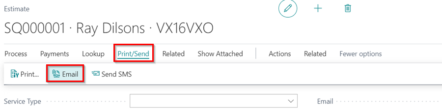

   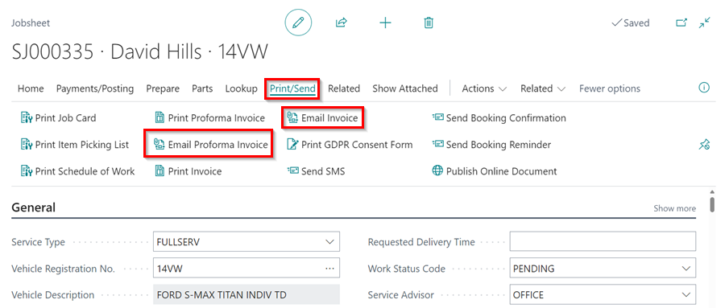
  
2. When you select the email option, the document is automatically attached to the email. You can find it at the bottom of the page under the **Attachments** FastTab.

   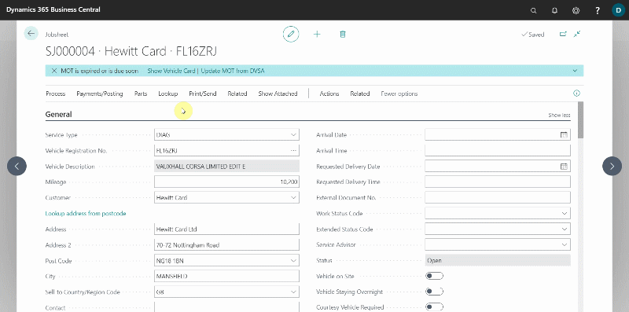

3. The email signature (which includes the company name, phone number, and email address) and the logo on the email message body are obtained from the system's **Company Information** page. You can update them by entering **Company Information** into the top right corner search icon and selecting the related link. Fields to update are: **Name**, **Phone Number**, **Email**, or **Picture**.

   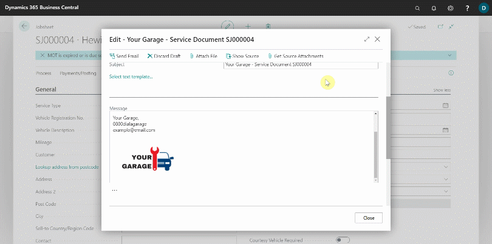

4. Under **Email Details** FastTab, enter the email address to send to in the **To** field and the subject of the email in the **Subject** field.

   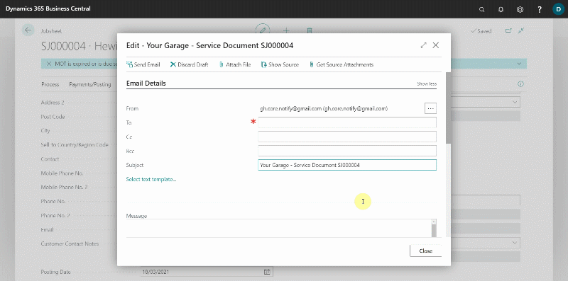

5. You can now add the email **Message** body for the customer. You can format the message however you want by changing the different formats available at the bottom of the **Message** field, such as the font, font size, text colour, and so on.

   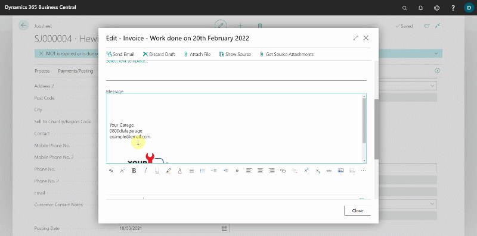

6. To make it easier to manage the email **Message** body, create **Text Templates** that will allow you to reuse similar text across multiple emails that you send. Click on **Select Text Template** under the **Email Details** FastTab, then select **New** from the actions bar, enter the **Code** for the template (you can name it depending on what you put in the message body), select **Type** as **Email Body**, and then enter the **Message** body in the writing space under the **General** FastTab.

   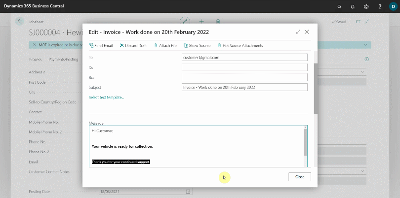

7. To add a template, click the **Select Text Template** link, choose the template, and then click the **OK** button. To insert the template into the **Message** body, select the desired position and press the **Ctrl+V** keys to paste the template.

   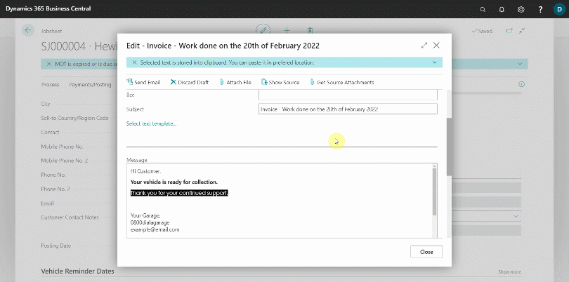

8. You could attach a file to the email by selecting **Attach File**. When you're finished editing the email, select **Send Email** from the actions bar to send it.

   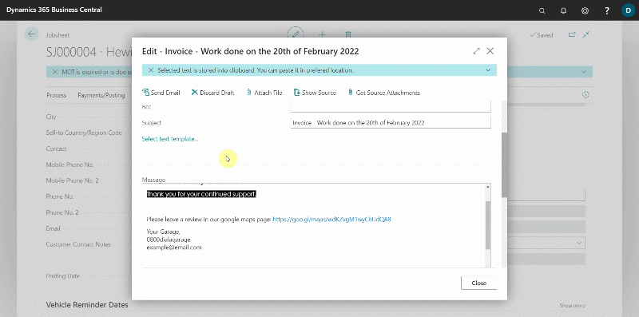

### Email setup
If your system does not have an email setup, you must do the setup before using the emailing feature:
1. In the top-right corner, choose the search icon, enter **Email Accounts**, and select the related link.
2. Select **New** and then **Add an email account** from the page that opens. Follow the prompts or contact the Garage Hive Support team for assistance with the setup.

   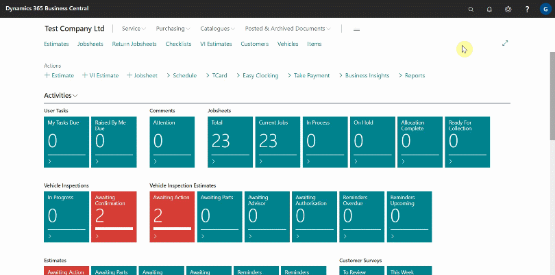

### Accessing email outbox
To access the draft emails in the outbox:
1. In the top-right corner, choose the search icon, enter **Email Outbox**, and select the related link.
2. Choose the draft email that you want to continue editing. You can view the document from which the email was created by selecting **Show Source**.

   

### Accessing sent emails
To access the sent emails in the system:
1. In the top-right corner, choose the search icon, enter **Sent Emails**, and select the related link.
2. You can view the sent email by selecting it from the list that appears.
3. Select **Resend** if you want to resend the email, or **Edit and Send** if you made an error and want to correct it.

   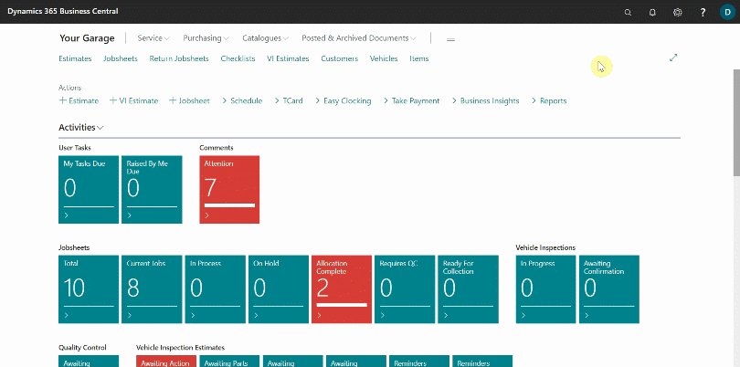

