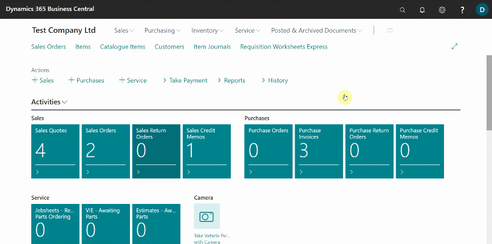
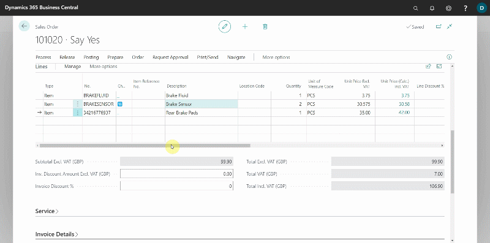
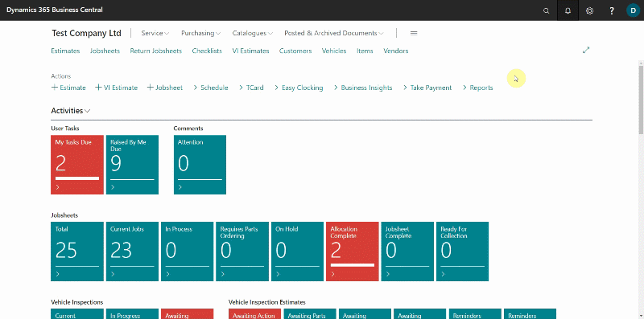
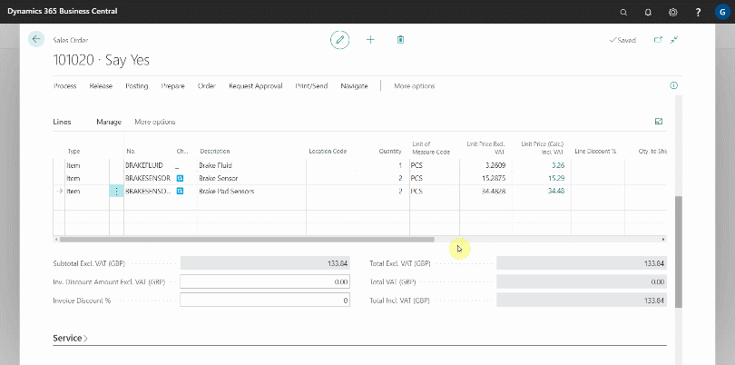
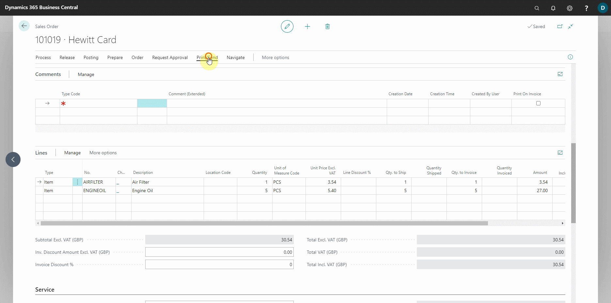
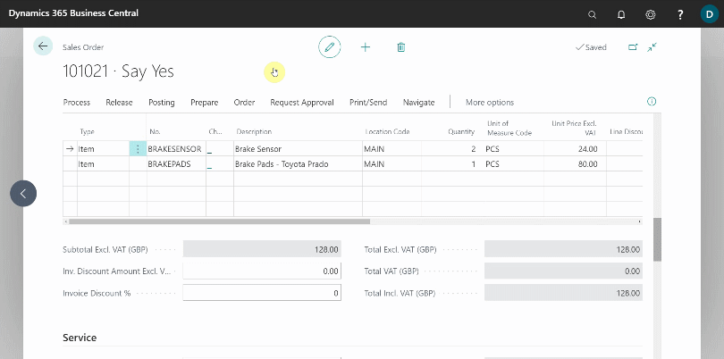

# Using Parts Sales Order in Garage Hive
**Parts Sales Order** is the document in which you record the parts to sell to the customer at the agreed-upon cost and quantity. Sales orders, allow you to ship partially, deliver directly from your vendor to your customer, and initiate inventory processing. The **Sales Order** process integrates sales invoicing. 

Here's how to use the **Sales Order** in Garage Hive:
1. You can create a new **Sales Order** by selecting **Sales Orders** tile from the **Parts Sales Admin** role centre, or by creating one from a [Sales Quote](garagehive-creating-sales-quote.html); select **Process** from the **Sales Quote** actions bar, followed by **Make Order**.
1. From the **Sales Order** list page, select **New** from the actions bar.

   

1. Enter the customer's name in the **Customer Name** field (if the order is new and not created from a sales quote). 
1. Add the items for the parts ordered by the customer to the **Lines** sub-page.

   

1. Scroll down to **Invoice Print Options** and select the **Print Item No.** slider if you want to print the **Part/Item Numbers** in the invoice. **Part Numbers** will be printed in brackets in the invoice line description.

   

1. To change the default **Invoice Print Options** for all **Sales Order** documents, choose the search icon in the top-right corner, enter **Sales & Receivables Setup**, and select the related link. Select the **Print Item No.** slider from the **Document Print Option** FastTab.

   

1. The column **Unit Price (Calc.) Inc. VAT)** assists you in calculating the selling price and margin; click on the amount in the column, and enter the **Unit Price** or **Margin %** in the **Edit - Calc Price** window. For example, you can enter a margin of 60 % for all items and so on.

   

1. Select **Print/Send** from the actions bar, followed by **Email Proforma Invoice** to send the order confirmation to the customer.

   

1. When you are ready to ship or invoice the order, select **Posting** from the actions bar and then **Post**. You are given three options: 
   * **Ship** - if the customer hasn't paid but you have sent the parts to the customer.
   * **Invoice** - can be used once the parts are shipped to create the sales invoice.
   * **Ship and Invoice** - if the customer has paid and you have sent the parts to the customer at the same time.
  
   Choose the suitable one for you and click **OK**.

1. In the next window, select the method of payment from the customer and enter the amount in the **Amount** field to receive the payment. Click the **Close** button.
1. In the next dialogue box, confirm the posting date and click **Yes** to continue. The **Sales Order** has been posted successfully. To view the invoice, open it.

   

1.  If a customer requests that the parts be fitted to the vehicle, you can generate a **Jobsheet** from the **Sales Order**. Enter the vehicle registration number in the **Vehicle Registration No.** field under the **Service** FastTab.
1. Choose **Process** from the actions bar, followed by **Create Jobsheet**.
    
    

   

 

### **See Also**

[Creating a Parts Sales Quote in Garage Hive](garagehive-creating-sales-quote.html) \
[Creating a Sales Parts Invoice](garagehive-creating-sales-invoice.html) \
[Using Parts Sales Return Order in Garage Hive](garagehive-using-sales-return-order.html) \
[Item Substitution Management in Garage Hive](garagehive-item-substitution-management.html)

