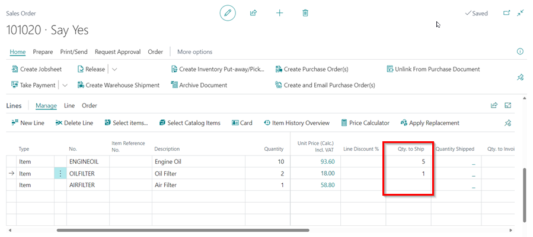
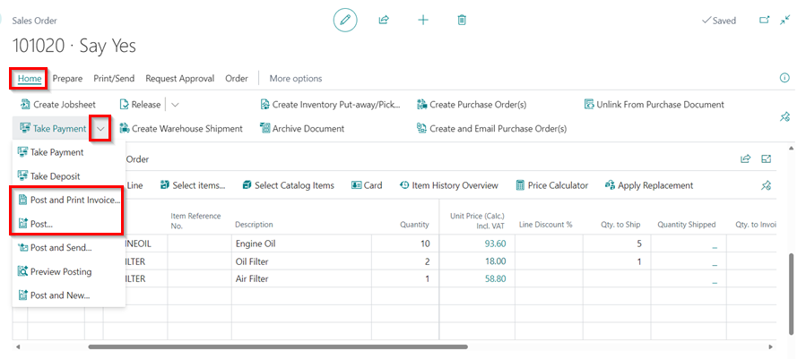
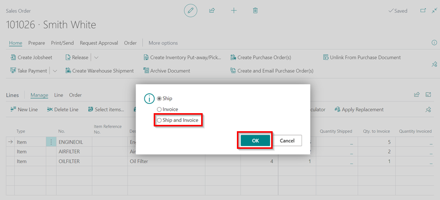
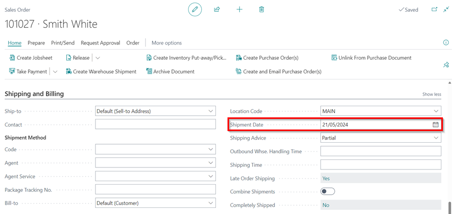

# Using Parts Sales Order in Garage Hive
**Parts Sales Order** is the document in which you record the parts to sell to the customer at the agreed-upon cost and quantity. Sales orders, allow you to ship partially, deliver directly from your vendor to your customer, and initiate inventory processing. The **Sales Order** process integrates sales invoicing. 

## In this article
1. [Creating a Parts Sales Order](#creating-a-parts-sales-order)
2. [Ship or Invoice the Parts Sales Order](#ship-or-invoice-the-parts-sales-order)
3. [Partial Shipping in the Parts Sales Order](#partial-hipping-in-the-parts-sales-order)
4. [Set up of Shipment Date to Be Equal to Work Date](#set-up-of-shipment-date-to-be-equal-to-work-date)
5. [Creating a Jobsheet from a Parts Sales Order](#creating-a-jobsheet-from-a-parts-sales-order)

### Creating a Parts Sales Order
Here's how to create the **Sales Order** in Garage Hive:
1. You can create a new **Sales Order** by selecting **Sales Orders** tile from the **Parts Sales Admin** role centre, or by creating one from a [Sales Quote](garagehive-creating-sales-quote.html){:target="_blank"}; select **Process** from the **Sales Quote** menu bar, followed by **Make Order**.
2. From the **Sales Order** list page, select **New** from the menu bar.

   

3. Enter the customer's name in the **Customer Name** field (if the order is new and not created from a sales quote). 
4. Add the items for the parts ordered by the customer to the **Lines** sub-page.

   

5. Scroll down to **Invoice Print Options** and select the **Print Item No.** slider if you want to print the **Part/Item Numbers** in the invoice. **Part Numbers** will be printed in brackets in the invoice line description.

   

6. To change the default **Invoice Print Options** for all **Sales Order** documents, choose the  icon in the top-right corner, enter **Sales & Receivables Setup**, and select the related link. Select the **Print Item No.** slider from the **Document Print Option** FastTab.

   

7. The column **Unit Price (Calc.) Inc. VAT** assists you in calculating the selling price and margin; click on the amount in the column, and enter the **Unit Price** or **Margin %** in the **Edit - Calc Price** window. For example, you can enter a margin of 60 % for all items and so on.

   

8. Select **Print/Send** from the menu bar, followed by **Email Proforma Invoice** to send the order confirmation to the customer.

   

[Go back to top](#top)

### Ship or Invoice the Parts Sales Order
1. When you are ready to ship or invoice the order, select **Posting** from the menu bar and then **Post**. You are given three options: 
   * **Ship** - if the customer hasn't paid but you have sent the parts to the customer.
   * **Invoice** - can be used once the parts are shipped to create the sales invoice.
   * **Ship and Invoice** - if the customer has paid and you have sent the parts to the customer at the same time.
  
   Choose the suitable one for you and click **OK**.

2. In the next window, select the method of payment from the customer and enter the amount in the **Amount** field to receive the payment. Click the **Close** button.
3. In the next dialogue box, confirm the posting date and click **Yes** to continue. The **Sales Order** has been posted successfully. To view the invoice, open it.

   

[Go back to top](#top)

### Partial Shipping in the Parts Sales Order
To partially Ship some of the items:
1. Scroll to the **Qty. to Ship** column in the lines of a Sales Order. Enter the items to be shipped.

   

2. Select **Posting** from the menu bar, choose **Posting**.

   

3. Select **Ship and Invoice** in the pop-up options and click **OK**. Note, you can select **Ship** only to ship without invoicing.

   

4. Enter the payment details, and click **Close**.

   

5. The items shipped will be updated in the **Quantity Shipped** column, and the remaining items to ship will be updated in the **Qty. to Ship** column.

   

6. When the items in the **Qty. to Ship** column, are ready to ship, you can follow the same procedure above to ship and invoice them.
   

[Go back to top](#top)

### Set up of Shipment Date to Be Equal to Work Date
If you want the shipment date to be set by default equal to the work date:
1. In the top-right corner, choose the  icon, enter **Sales & Receivables Setup** and select the related link.

   

2. In the **General** FastTab, scroll down to the **Shipment Date Equal to Work Date** slider, and enable it. This will always set the **Shipment Date** equal to **Work Date** by default.

   

3. To change the **Shipment Date** manually, open the Parts Sales Order, scroll down to the **Shipping and Billing** FastTab, and change the **Shipment Date** field.

   

4. Or you can change it directly in the **Lines** sub-page, under the column **Shipment Date**.

   

[Go back to top](#top)

### Creating a Jobsheet from a Parts Sales Order
1.  If a customer requests that the parts be fitted to the vehicle, you can generate a **Jobsheet** from the **Sales Order**. Enter the vehicle registration number in the **Vehicle Registration No.** field under the **Service** FastTab.
2. Choose **Process** from the menu bar, followed by **Create Jobsheet**.
    
    

   

[Go back to top](#top)

 

### **See Also**

[Creating a Parts Sales Quote in Garage Hive](garagehive-creating-sales-quote.html){:target="_blank"} \
[Creating a Sales Parts Invoice](garagehive-creating-sales-invoice.html){:target="_blank"} \
[Using Parts Sales Return Order in Garage Hive](garagehive-using-sales-return-order.html){:target="_blank"} \
[Item Substitution Management in Garage Hive](garagehive-item-substitution-management.html){:target="_blank"}

