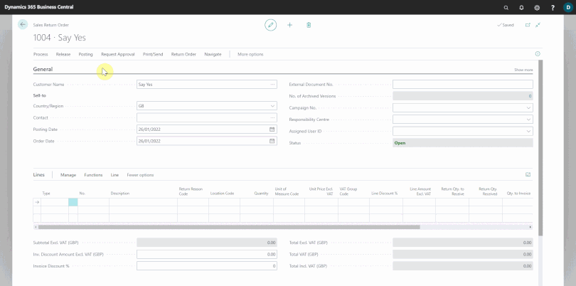

# Using Parts Sales Return Order in Garage Hive
**Parts Sales Return Order** is the document used to credit items sold to customers. **Parts Sales Return Order** allows you to receive parts from multiple sales documents with a single sales return and automatically create related **Parts Sales Credit Memo**. 

Here's how to use the **Parts Sales Return Order** in Garage Hive:
1. Select **Sales Return Orders** tile from the **Parts Sales Admin** role centre.
2. From the **Sales Return Order** list page, select **New** from the menu bar.
3. Enter the customer's name in the **Customer Name** field.

   

4. Select **Process** from the menu bar, followed by **Get Posted Document Lines To Reverse** to copy one or more posted sales document lines and reverse the original order.
5. In the **Posted Sales Document Lines** page, select **Posted Invoices** or **Posted Shipments** at the **Document Type Filter** field to display the different documents and their posted lines under the **Lines** sub-page.

   

6. Under the **Lines** sub-page, select the **Document No.** line with the part that is being returned. If there are multiple parts, repeat the process for all of them. When you're finished, double-check the part quantities and prices.

   

7. After adding the parts to return, select **Posting** from the menu bar in the **Sales Return Order** page, followed by **Post**. Select **Receive and Invoice** to record that you have received the parts from the customer and refunded the payment. If you haven't refunded the payment, choose **Receive**; if you haven't received the parts but have already refunded the payment, choose **Invoice**. Click **OK**.

   

8. The **Sales Return Order** will be posted, and a **Posted Sales Credit Memo** will be generated.

 

### **See Also**

[Creating a Parts Sales Quote in Garage Hive](garagehive-creating-sales-quote.html){:target="_blank"} \
[Using Parts Sales Order in Garage Hive](garagehive-using-parts-sales-order.html){:target="_blank"} \
[Creating a Sales Parts Invoice](garagehive-creating-sales-invoice.html){:target="_blank"} \
[Item Substitution Management in Garage Hive](garagehive-item-substitution-management.html){:target="_blank"}

