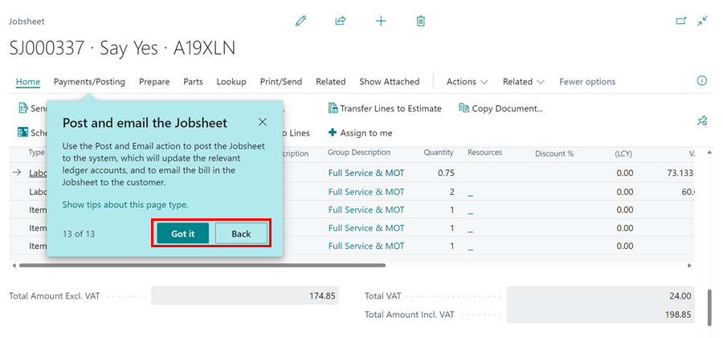
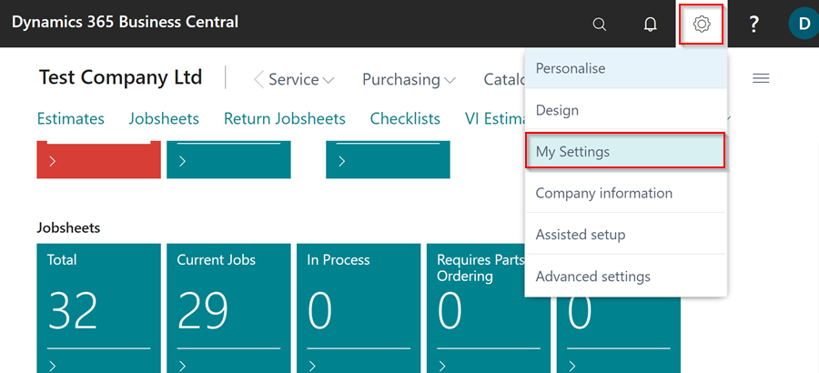

# How to Use the Teaching Tips
In the context of Business Central, teaching tips refer to guided tours of the various pages within the software. These tours are intended to help users with the onboarding process and to educate them on the various functionalities and features available in Business Central. By using teaching tips, users can familiarise themselves with the layout, navigation, and key elements of each page, enabling them to effectively navigate and utilize the software.

## In this article
1. [Using the Teaching Tips](#using-the-teaching-tips)
2. [Enabling and Disabling the Teaching Tips](#enabling-and-disabling-the-teaching-tips)

### Using the Teaching Tips
 Here is how to use teaching tips:
1. When you open a new page that you haven't visited or opened before, the teaching tips will appear automatically. To go through the teaching tips, click the **Take a Tour** button, or the **Close Button** to close them.

   

2. After clicking on the **Take a Tour** button, keep clicking on the **Next** button after reading each teaching tip to move on to the next one.

   

3. At the end of the tour, you can go **Back** and revisit the previous teaching tips, or you can click **Got It** to close the teaching tips.

   

4. If you open a page on which you have already read the teaching tips, they will not appear automatically. To go over the teaching tips again, hover your mouse over the page title and click the **Retake The Tour** button in the pop-up.

   

[Go back to top](#top)

### Enabling and Disabling the Teaching Tips
1. To enable or disable the teaching tips on all pages, click the **Gear Icon** in the top-right corner, then **My Settings**.

   

2. Scroll down to the **Teaching Tips** field on the pop-up window and enable it by sliding the slider to the right, or disable it by sliding the slider to the left.

   

[Go back to top](#top)

