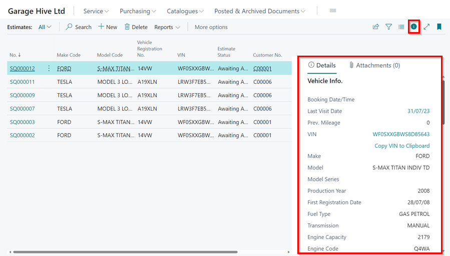
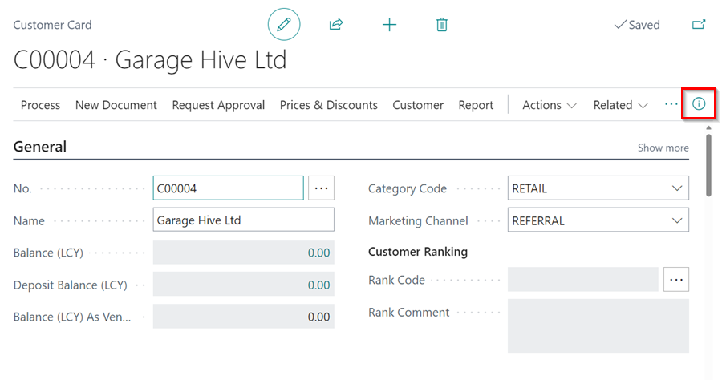
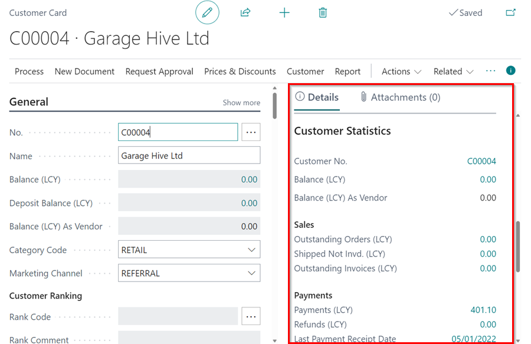
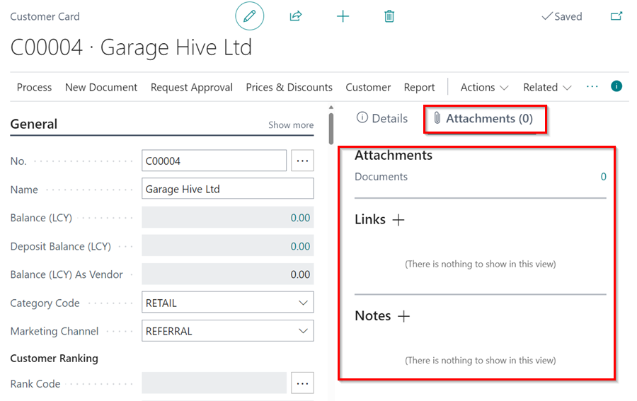

# We are still working on this article!
We are currently reviewing this article before it is published, check back later.

# Using the FactBox in Garage Hive
A FactBox is an information area located on the right-hand side of a page which is represented by the icon ℹ️. The area is divided into several sections for displaying content such as links, attachments, other pages, and tiles. Typically, a FactBox is used to showcase information related to a particular item on the main content page. For instance, if you are viewing a list of vehicles, you can use a FactBox to view details of a selected vehicle in the list as shown below.

   

A FactBox can be found on the following page types:
- Card such as an item card.
- Document such as the Jobsheet.
- List such as the Vehicle List.
- Worksheet such as the Requisition Worksheet.

To use the FactBox in a page:
1.  Open the page where you want to use the FactBox, such as a Customer Card or a Vehicle Card.
2.  Click on the FactBox icon (ℹ️), located at the top right corner of the content page.

   

3. Once the FactBox pane opens, scroll down to the information you want to view, or click on any available link to access related information.

   

4. You can also access the **Attachments** option at the top of the FactBox pane to view or add any related documents, links, or notes.

   

[Go back to top](#top)