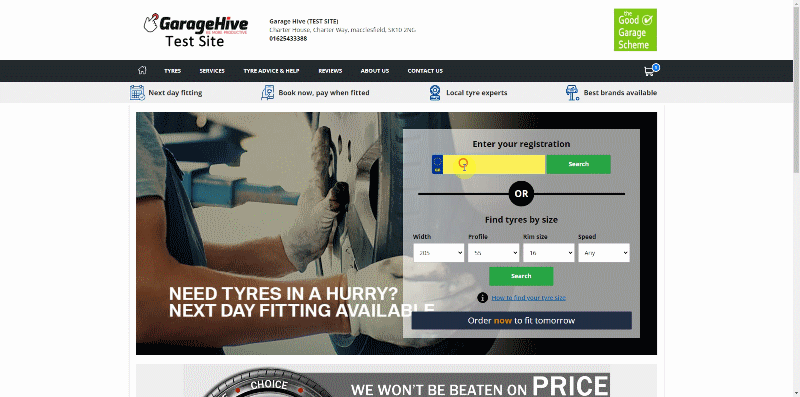

# Using TyreClick Booking System in Garage Hive
**TyreClick** is a [Micheldever](https://www.micheldever.co.uk/){:target="_blank"} tyre supplier online booking service, where customers can buy tyres and have them fitted at your garage at a certain date. TyreClick is now integrated with Garage Hive to enable online booking of tyre services, and creating of Jobsheet from the booking.

Before requesting a connection with the support team, please have the following information ready:
1. What services does your garage offer on Tyre Click? (For example: Tyre Replacement Only, MOT, Tyre Checks, etc.).
2. What time slots does your garage want to use? (Actual times/AM/PM slots with a limited number for each session).
3. What are the opening times for your garage?
4. What is your garage's Tyre Click URL?

## In this article
1. [Online Booking Connection Setup for TyreClick](#online-booking-connection-setup-for-tyre-click)
2. [TyreClick online booking example](#tyre-click-online-booking-example)
3. [Opening the booking in Garage Hive](#Opening-the-booking-in-Garage-Hive)

### Online Booking Connection Setup for TyreClick
1. In the top-right corner, choose the  icon, enter **Online Booking Connections**,  and select the related link.
2. Select **New** from the menu bar on the **Online Booking Connections** page to create a new online connection for TyreClick integration.

   

   > **Important:**
   >
   > The **Online Booking Connections** page is used to connect Garage Hive with various online booking services. Businesses with multiple locations, for example, can create separate pages for each branch, and so on. 

3. Create a code for the **Online Booking Connection** card, select the location on which to apply the integration, enter the **API Connection Key** provided and the **TyreClick URL** provided under the **General** FastTab.
4. To enable the online connection, select the **Enabled** slider.

   

5. Under the **Booking** FastTab, use the following setting:
   * **Default Service Type Code** - This is the default service type used in the jobsheets; set to **Online Booking(OB)**.
   * **Customer Recognition** - This helps in identifying the customers when making an online booking if they are already in the system; set to **Automatic**.
   * **Dummy Customer No.** - This is the customer name the system uses if the actual customer from the online booking is not found in the system; set to **Online Booking**.
   * **VAT Bus Posting Group** - This is the VAT business posting group for the online booking based on the tax obligation; set to **Domestic.
   * **Default Vehicle Status** - This is the system's vehicle status; set to **Customer**.
   * **Service Comment Type** - This is the comment type to be used in the system for the online booking notification; set to **Customer**.
   * **Default Tyre Fitting Service Package** - This is the default tyre fitting service package for use in the online booking setup; set to a tyre service package of your choice, in this case we'll use **1 Tyre**.
   * **Default Tyre Item No.** - This is the default item number for use in the online booking setup; set to **MISC**.

   

6. Under the **Internal Notification FastTab, you can set the following:
   * **Send To Emails** – This is usually left blank, but it can be used for additional email recipients; this is for a confirmation email that’s sent to the branch. Multiple addresses can be entered using the “;” character, as in service@thegarage.com;management@thegarage.com.
   * **Send To BCC Emails** – You can use this if you need to BCC the confirmation somewhere else. Multiple addresses can be entered using the “;” character, as in service@thegarage.com;management@thegarage.com.
   * **Send To Branch Email** - It is best practise to check this box, as this will send the confirmation message to the email address specified in the **Branch Setup**.

   

### TyreClick online booking example
Here is the process of the customer getting to use the TyreClick online booking:
1. To buy and book a tyre, the customer goes to the TyreClick website address provided. They begin by entering their vehicle registration in the **Enter your registration** field, or they can search for tyres by size; we'll use the registration number in this case, and then click on **Search**.
2. On the next page, customers choose a type of tyre that meets their needs and is available for the car registration they specified, then click **Continue**.
3. Then, on the following page, customers can choose the tyre to **Buy** from the many ranges and brands of recommended tyres.

   

4. The tyre will be added to their basket, and they can then move to **Step 2**, where they can **Add Service** that they require in addition to purchasing the tyre, and then click **Complete Order**.
5. The **Complete Order** page allows the customer to select a booking date and time as well as provide their personal information, which is required to complete the order.
6. The consumer must first choose the **I have checked my tyre size and type** checkbox, followed by the **Tick to accept our Terms and Conditions** checkbox under terms and conditions.
7. By selecting **Confirm booking**, the order is completed, and they can print the invoice.

   

8. An **Email** will be sent to the customer after booking.

   

### Opening the booking in Garage Hive
When the customer makes a booking, the booking is recorded in the **Online Booking Entries**. To open the booking:
1.  In the top-right corner, choose the  icon, enter **Online Booking Entries**,  and select the related link.
2.  You can search for the booking's **External Reference** or **TyreClick** in the entries. 
3.  Open the Jobsheet in the booking.

     

4. If the dummy customer was used, select **Lookup** in the Jobsheet notification to enter the actual customer details in the Jobsheet.
5. Process the order for the customer.

     
