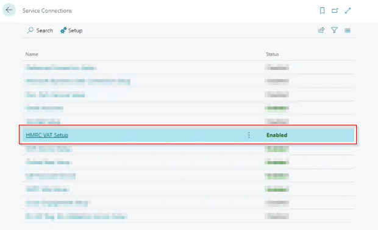
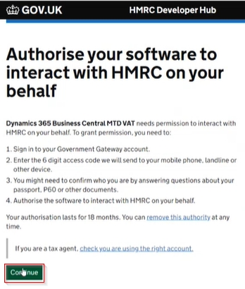
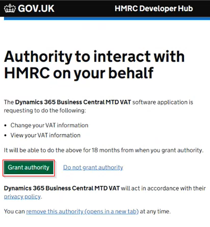
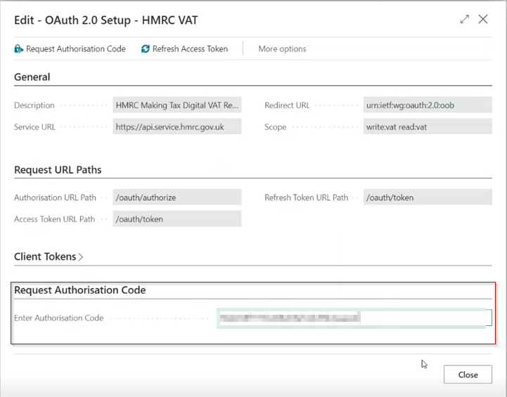

# How to Authenticate VAT Connection in Garage Hive
To authenticate your VAT connection from the HMRC website:
1. In the top-right corner, choose the  icon, enter **Service Connections**, and select the related link.
2. Select **HMRC VAT Setup**, that is already setup in your system.

   

3. On the **HMRC VAT** page, select **Request Authorisation Code** from the menu bar. 

   

4. On the **Data Encryption** pop-up, click **No**. This takes you to the **HMRC Website Authorisation** page; click Continue.

   

   

5. The **HMRC Sign-in**page opens, where you can now enter your **Government Gateway user ID** and **Password.**

   

6. **Grant Authority** on the website, and copy the code in the **Authorisation granted** page.

   

   

7. Paste the code in the **Request Authorisation Code** FastTab, and close the **HMRC VAT** page.

   

8. The authorisation is now completed, and you can open the **Company Information Setup** to verify the VAT registration number by clicking **Yes** on the pop-up.

  

  

