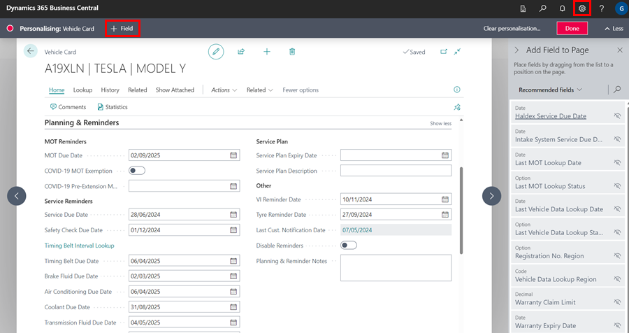
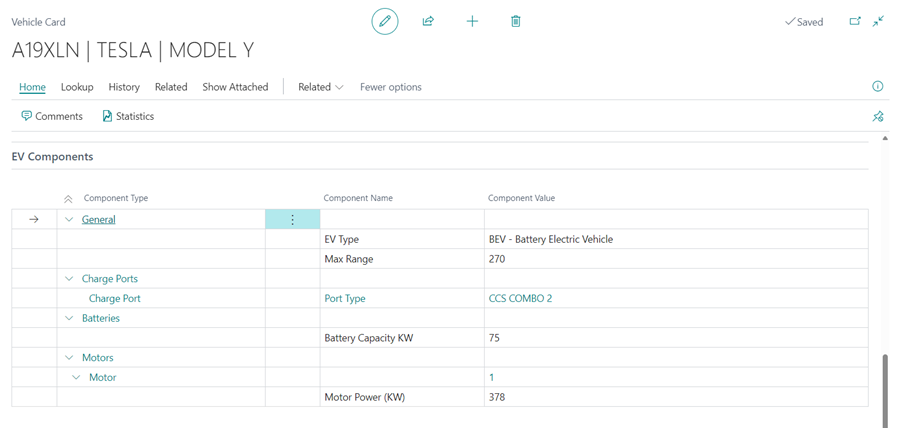
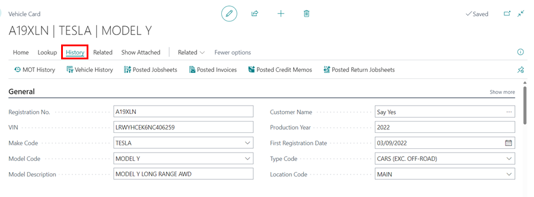
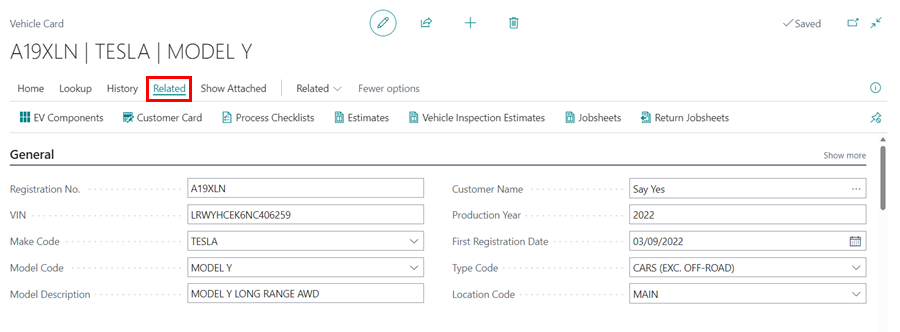

# We are still working on this article!
We are currently reviewing this article before it is published, check back later.

## Vehicle Card
A vehicle card is a valuable tool in Garage Hive, used to store and organize information about a specific vehicle. The information on the card is typically composed of a combination of data obtained through a VRM (Vehicle Registration Mark) lookup, as well as manual input. This information is organized into several sub-headings to make it easy to find and reference. 

The vehicle card is typically only created within the context of a Jobsheet or booking, and is not typically created outside of this context.
You can open a vehicle card by selecting **Vehicles** from the home screen and then selecting the vehicle card to open from the vehicle list.

   

## In this article
1. [Vehicle Card Sections](#vehicle-card-sections)
2. [Available Actions in the Vehicle Card](#available-actions-in-the-vehicle-card)
3. [Adding a Default Location Code to Vehicle Card](#adding-a-default-location-code-to-vehicle-card)

## Vehicle Card Sections
The Vehicle Card is divided in the following sections:

### 1. General 
Basic vehicle information. The VRM lookup is used to generate this.

   

### 2. Planning & Reminders
1. The dates for vehicle planning and reminders can be manually updated, or a default period can be set to update them automatically. Learn more about customising vehicle planning and reminders dates [**here**](/docs/garagehive-customising-vehicle-reminder-dates.html "Customising Vehicle Reminder Dates").

   

2. You can also personalise and add **Vehicle Reminder Dates** such as **Haldex Service**, **Intake System Service**, and **Wheel Alignment**. Select the **Settings** icon in the top-right corner, then **Personlise**, and then **+Field** to add a field to the vehicle card.

   

### 3. Engine 
This section combines information generated by VRM, such as **Engine No.** and **Capacity**, and manual updates, such as **Engine Oil Capacity** and **Engine Oil Specification** A technician can also access and update this section if they are a [**Device User**](/docs/garagehive-device-user.html "Device User").

   

### 4. Transmission 
This section is updated using VRM lookup. 

   

### 5. EV Components
This section is available for electric vehicles and is updated using the VRM lookup.

   

### 6. Body & Features 
This section can be manually updated with information such as radio/immobiliser/key codes. 

   

### 7. Tyre, Wheels & Brakes
This section should be manually updated. You can specify the location of the locking wheel nut, as well as the manufacturer's minimum thickness requirement for brakes. A technician can also access and update this section if they are a [**Device User**](/docs/garagehive-device-user.html "Device User").

   

### 8. Performance & Economy 
This section shows the parameters used to measure the performance and economy of the vehicle.

   

### 9. Classification
This section is linked to the Autodata Repair times; if this section is not filled out, you will need to update the VRM details for access Repair times.

   

### 10. Contacts 
This section shows the current owner of the vehicle. 

   

[Go back to top](#top)

## Available Actions in the Vehicle Card
The following actions are available for use on the menu bar of the vehicle card:

### 1. Lookup 

   * **Timing Belt Interval** - View the timing belt intervals according to the manufacturer's specification, and adding a timing belt due date.
   * **Update Vehicle Data by VIN** - This is useful if a vehicle has a plate change, the information can be updated via VIN.
   * **Lubricants** - View a list of lubricants (other than engine oil) for the vehicle, with the type and capacity of oil indicated.
   * **TPMS** - View the vehicle's technical specifications for tyre pressure monitoring system on the Autodata Workshop Application.
   * **Update Vehicle Data by VRM** - Update all vehicle information.
   * **Oil (Autodata)** -View engine oil data for the vehicle.
   * **Autodata Workshop Application** - View the vehicle's technical specification on the Autodata Workshop Application.
   * **Service Indicator** - View the vehicle's technical specifications for service indicator on the Autodata Workshop Application.

      

### 2. History 

   * MOT History - View all MOT history of the vehicle which is taken from the DVSA website and includes all previous MOT failures and advisories. 
   * [Vehicle History](/docs/garagehive-service-history.html "Vehicle History") - View all Service history of the vehicle.
   * [Posted MOT History](/docs/garagehive-mot-history.html "MOT History") - View all MOT history of the vehicle. 
   * Posted Jobsheets - View all posted jobsheets for this vehicle.
   * Posted Invoices - View all posted invoices for this vehicle including costs. 
   * Posted Credit Memos - View any posted credits for this vehicle. 
   * Posted Return Jobsheets - View any posted credits for this vehicle. 

      

### 3. Related 

   * EV Components - View EV components for the vehicle.
   * [Customer Card](/docs/garagehive-create-a-customer-card.html "Customer Card") - View the Customer information.  
   * Process Checklist - View any completed checklists for this vehicle. 
   * [Estimates](/docs/garagehive-create-an-estimate.html "Estimates") - View any estimates made for this vehicle. 
   * Vehicle Inspection Estimates - View any Vehicle Inspection Estimates  linked to this vehicle.
   * Jobsheets - View any Jobsheets linked to this vehicle. 
   * Return Jobsheets - View any credits for this vehicle. 

      

   
   [Go back to top](#top)

## Adding a Default Location Code to Vehicle Card
When you set the default location code for a vehicle card, it allows for location-specific reminders to be sent. This means that every vehicle that is added to a Jobsheet, Estimate, or Vehicle Inspection Estimate will be assigned a vehicle location code. To enable this feature, follow the steps below:
1. In the top-right corner, choose the  icon, enter **Service Mgt. Setup GH** and select the related link.

   

2. In the **General** FastTab, scroll down to the **Assign Vehicle Location Code** field and enable the slider.

   

3. Once the slider is enabled, the system will update all your vehicle cards to reflect the location code from the last service document. This might take time, so it is recommended to do it outside working hours. You have the option to proceed with the update by selecting **Yes**, or simply enable the slider without updating by choosing **No**.

   

[Go back to top](#top)