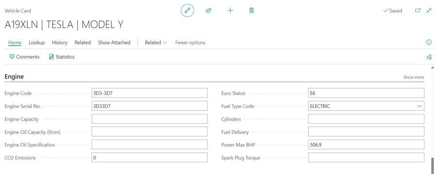
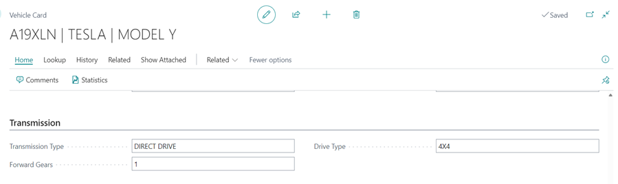

#   Vehicle Card 

The Vehicle Card is made up with a combination of information from the VRM lookup and manual data. 

It is very rare that a vehicle card would ever be made outside of creating it within a jobsheet/booking.

It is made up of several sub-headings. 

### General 

### Planning & Reminders 

### Engine 

### Transmission 

### Body & Features 

### Tyre, Wheels & Brakes 

### Performance & Economy 

### Classification

### Contacts 

Within the action bar there are also several further options: -  

### Lookup 

Update Vehicle Data by VRM - Update all vehicle information. 

Update Vehicle Data by VIN - This is useful if a vehicle has a plate change, the information can be updated via VIN. 

Update MOT Data by VRM - If you specifically want to update the MOT Data. 

### History 

MOT History - View all MOT history of the vehicle which is taken from the DVSA website and includes all previous MOT failures and advisories. 

[Vehicle History](https://docs.garagehive.co.uk/docs/garagehive-service-history.html "Vehicle History") - View all Service history of the vehicle.

[Posted MOT History](https://docs.garagehive.co.uk/docs/garagehive-mot-history.html "MOT History") - View all MOT history of the vehicle. 

Posted Jobsheets - View all posted jobsheets for this vehicle.

Posted Invoices - View all posted invoices for this vehicle including costs. 

Posted Credit Memos - View any posted credits for this vehicle. 

Posted Return Jobsheets - View any posted credits for this vehicle. 

### Related 

[Customer Card](https://docs.garagehive.co.uk/docs/garagehive-create-a-customer-card.html "Customer Card") - View the Customer information.  

Process Checklist - See any completed checklists for this vehicle. 

[Estimates](https://docs.garagehive.co.uk/docs/garagehive-create-an-estimate.html "Estimates") - View any estimates made for this vehicle. 

Vehicle Health Checks 

Jobsheets - See any open jobsheets for this vehicle. 

Return Jobsheets - View any credits for this vehicle. 

