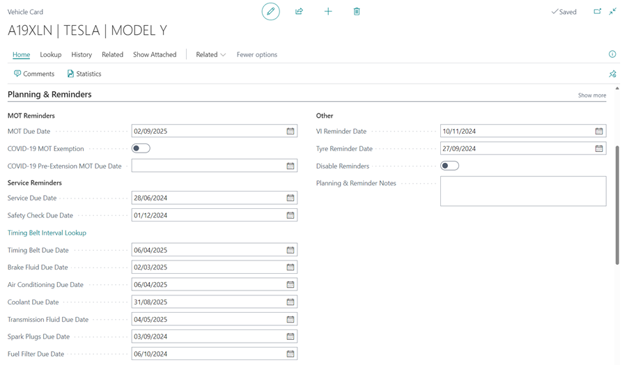
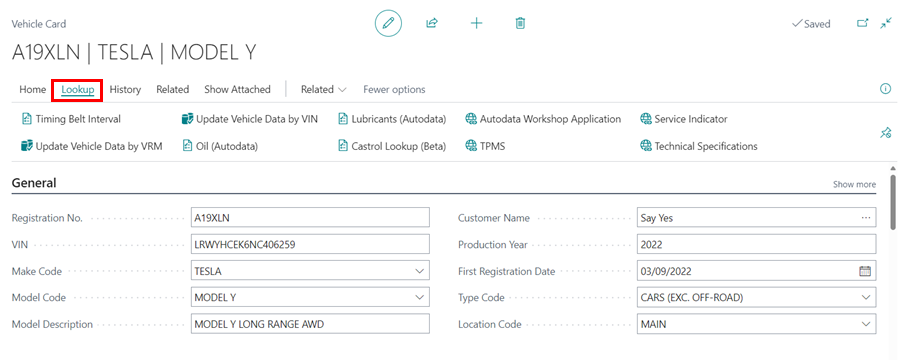

## Vehicle Card
A vehicle card is a valuable tool in Garage Hive, used to store and organize information about a specific vehicle. The information on the card is typically composed of a combination of data obtained through a VRM (Vehicle Registration Mark) lookup, as well as manual input. This information is organized into several sub-headings to make it easy to find and reference. The vehicle card is typically only created within the context of a Jobsheet or booking, and is not typically created outside of this context.
You can open a vehicle card by selecting **Vehicles** from the home screen and then selecting the vehicle card to open from the vehicle list.

   

### General 
Basic vehicle information. The VRM lookup is used to generate this.

   

### Planning & Reminders
The dates for vehicle planning and reminders can be manually updated, or a default period can be set to update them automatically. Learn more about customising vehicle planning and reminders dates [**here**](/docs/garagehive-customising-vehicle-reminder-dates.html "Customising Vehicle Reminder Dates").

   

### Engine 
This section combines information generated by VRM, such as **Engine No.** and **Capacity**, and manual updates, such as **Engine Oil Capacity** and **Engine Oil Specification** A technician can also access and update this section if they are a [**Device User**](/docs/garagehive-device-user.html "Device User").

   

### Transmission 
This section is updated using VRM lookup. 

   

### EV Components
This section is available for electric vehicles and is updated using the VRM lookup.

   

### Body & Features 
This section can be manually updated with information such as radio/immobiliser/key codes. 

   

### Tyre, Wheels & Brakes
This section should be manually updated. You can specify the location of the locking wheel nut, as well as the manufacturer's minimum thickness requirement for brakes. A technician can also access and update this section if they are a [**Device User**](/docs/garagehive-device-user.html "Device User").

   

### Performance & Economy 

   

### Classification
This section is linked to the Autodata Repair times; if this section is not filled out, you will need to update the VRM details for access Repair times.

   

### Contacts 
This section shows the current owner of the vehicle. 

   

## Available Actions in the Vehicle Card
1. ### Lookup 

   * Timing Belt Interval - View the timing belt intervals according to the manufacturer's specification, and adding a timing belt due date.
   * Update Vehicle Data by VIN - This is useful if a vehicle has a plate change, the information can be updated via VIN.
   * Lubricants - View a list of lubricants (other than engine oil) for the vehicle, with the type and capacity of oil indicated.
   * TPMS - View the vehicle's technical specifications for tyre pressure monitoring system on the Autodata Workshop Application.
   * Update Vehicle Data by VRM - Update all vehicle information.
   * Oil (Autodata) -View engine oil data for the vehicle.
   * Autodata Workshop Application - View the vehicle's technical specification on the Autodata Workshop Application.
   * Service Indicator - View the vehicle's technical specifications for service indicator on the Autodata Workshop Application.

      

2. ### History 

   * MOT History - View all MOT history of the vehicle which is taken from the DVSA website and includes all previous MOT failures and advisories. 
   * [Vehicle History](/docs/garagehive-service-history.html "Vehicle History") - View all Service history of the vehicle.
   * [Posted MOT History](/docs/garagehive-mot-history.html "MOT History") - View all MOT history of the vehicle. 
   * Posted Jobsheets - View all posted jobsheets for this vehicle.
   * Posted Invoices - View all posted invoices for this vehicle including costs. 
   * Posted Credit Memos - View any posted credits for this vehicle. 
   * Posted Return Jobsheets - View any posted credits for this vehicle. 

      

3. ### Related 

   * EV Components - View EV components for the vehicle.
   * [Customer Card](/docs/garagehive-create-a-customer-card.html "Customer Card") - View the Customer information.  
   * Process Checklist - View any completed checklists for this vehicle. 
   * [Estimates](/docs/garagehive-create-an-estimate.html "Estimates") - View any estimates made for this vehicle. 
   * Vehicle Inspection Estimates - View any Vehicle Inspection Estimates  linked to this vehicle.
   * Jobsheets - View any Jobsheets linked to this vehicle. 
   * Return Jobsheets - View any credits for this vehicle. 

      

