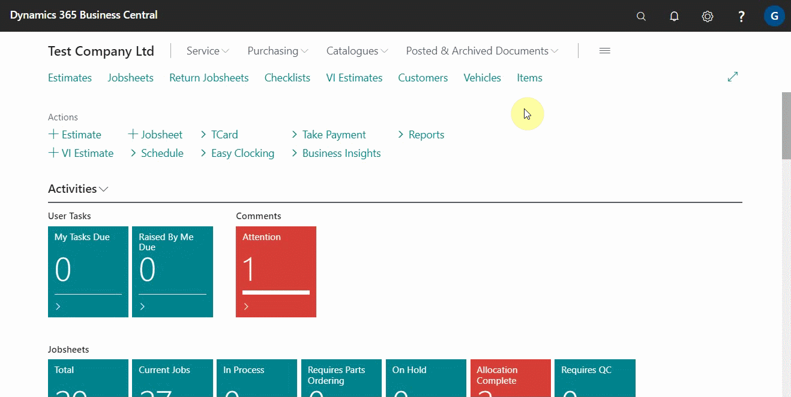
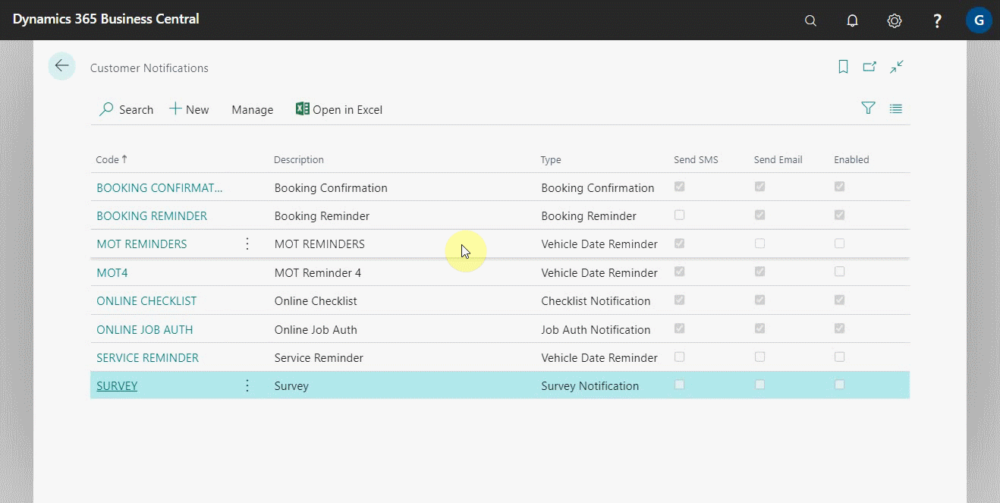
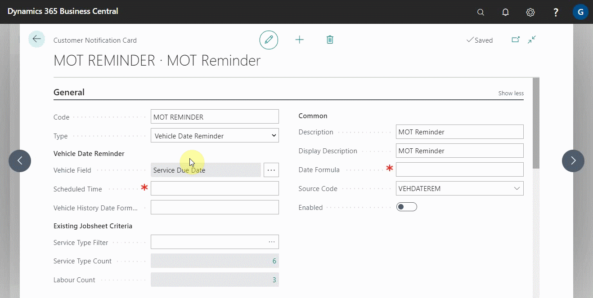
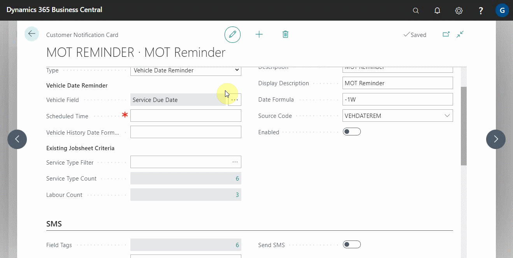
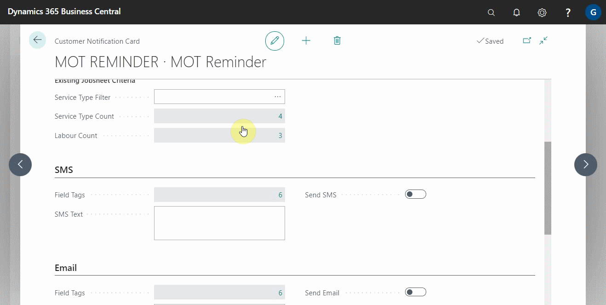
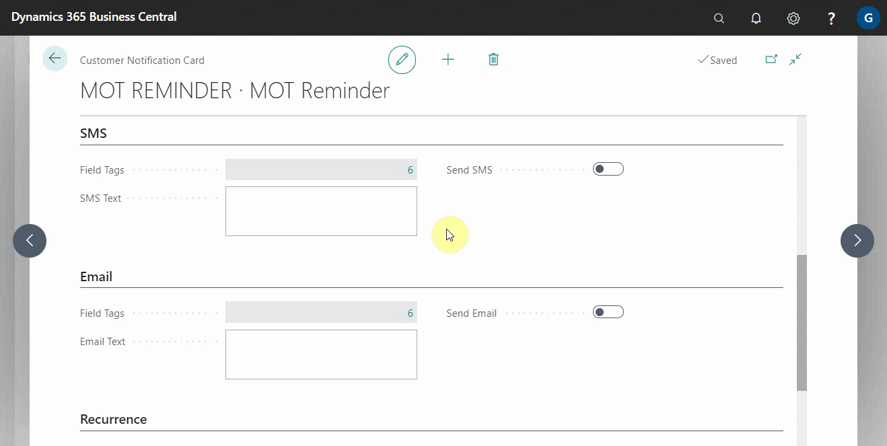
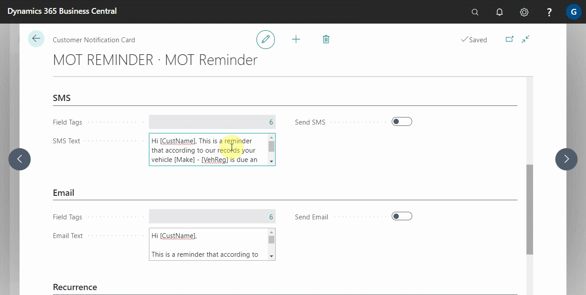
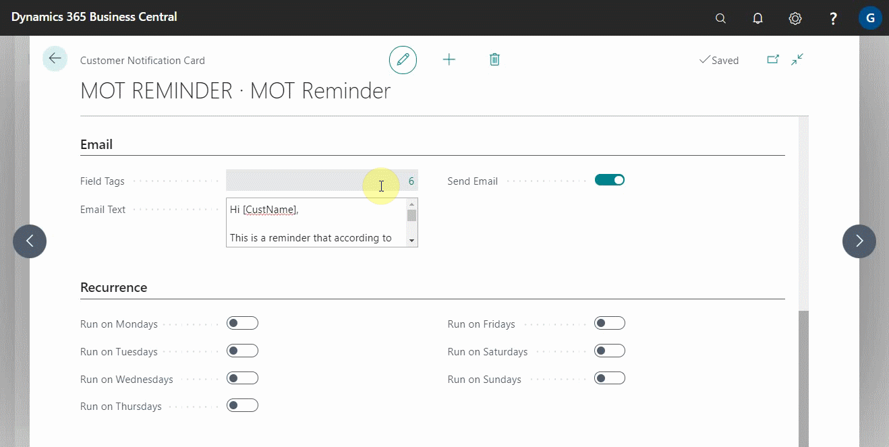
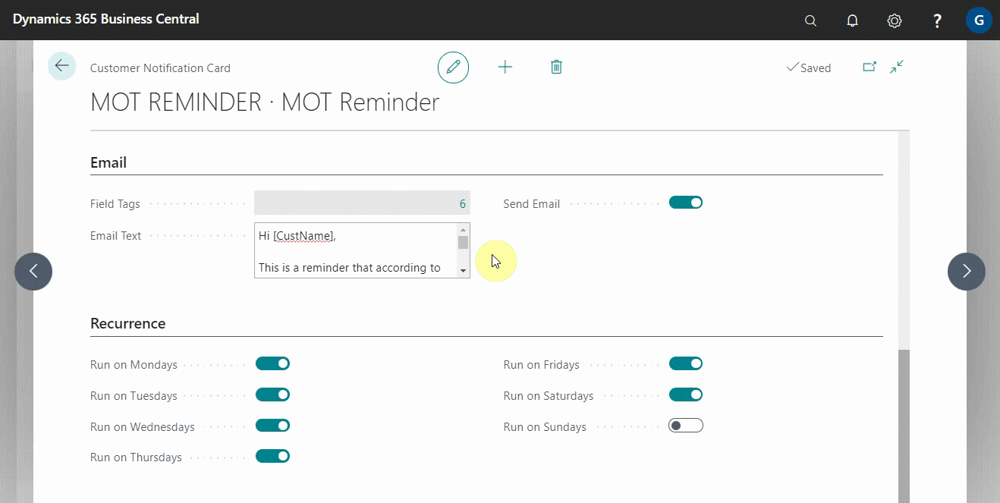

## In this article
1. [How to set up vehicle date reminders](#how-to-set-up-vehicle-date-reminders)
2. [Writing a message template](#writing-a-message-template)
3. [Previewing and verifying message template](#previewing-and-verifying-message-template)
4. [Enabling notification and setting recurrence](#enabling-notification-and-setting-recurrence)
5. [Viewing sent notification messages](#viewing-sent-notification-messages)

### How to set up vehicle date reminders
To set up the vehicle date reminders:
1. Search for **Customer Notifications** in the top right corner and select related result.
2. The window that appears displays a list of all the customer notifications that have been previously set up.

   

3. You can modify existing customer notifications or create a new one. We'll create a new one to help you understand vehicle date reminders better.
4. To create a new notification, click **+New**.
5. From the **General** FastTab, begin by assigning a code to the customer notification in order to identify it in the system. In this case, we'll set up an **MOT Reminder**. So, we'll enter **MOT Reminder** in the field **Code**.
6. Add the **Description** field as well, which also populates the **Display Description** field but can be changed. **Display Description** is what the customer sees when the notification is sent.

   

7. The next step is to add the **Type** of notification to the system; inn this case, select **Vehicle Date Reminder** from the available options.
8. In the field **Date Formula**, enter the number of days (D), weeks(W), or months(M), preceded by a **negative sign**, for which the notification should be sent from the system before the due date. So we'll add **-1W**.

   

9. The following fields are set in the section titled **Vehicle Date Reminder**:
   * **Vehicle Field** - specifies the date from which the reminder date is calculated.
   * **Scheduled Time** - specifies the time at which the notification will be sent to the customer.
   * **Vehicle History Formula** - specifies the time period for which the system will look up the customer's service history; if no service history is found within that time frame, the notification is not sent. For example, adding **-18M** searches any service history for the last 18 months till today.

      

10. The following criteria are set in the section titled **Existing Jobsheet Criteria**: 
   * **Service Type Filter** - Specifies the types of services for which the customer notification will not be sent if the services are booked. To exlude a service and select all the others, use **<>** before the service. This will select all other services and leave out the one that has been added.
   * **Service Type Count** - Indicates the number of service types that have been selected so that no customer notification is sent when they are booked.
   * **Labour Count** - indicates the number of labour services selected so that no customer notification is sent when they are booked.

      

### Writing a message template
After setting up the details above, it's time to create the message that will be sent to the customer. To add a message template, follow the steps below:
1. You can either send a message via the email or the SMS or both. There are two sections to set up the messages for SMS and email.
2. In each section, there is a field called **Field Tags** that defines the specific tags to use in the message template, so that the tagged field is automatically added to the text based on the service document selected. Some examples are as follows:
   * **[CustName]** - When included in the message template, the **Customer's Name** from the service document is automatically added in the message.
   * **[VehReg]** - When included in the message template, the **Vehicle Registration No.** from the service document is automatically added in the message.
   * **[Make]** - When included in the message template, the **Vehicle Make** from the service document is automatically added in the message.
   * **[Model]** - When included in the message template, the **Vehicle Model** from the service document is automatically added in the message.
   * **[DueDate]** - When included in the message template, the **Due Date** from the service document is automatically added in the message.
   * **[OptOutURL]** - When included in the message template, the **Opt Out URL** for the notifications is automatically added in the message.
3. Create a message in the field **SMS Text** and **Email Text**.

> **Example:**
>
> Hello [CustName], This is a reminder that your vehicle [Make] - [VehReg] is due for an MOT on [DueDate] according to our records.
> To schedule an appointment, please contact a member of our team. [OptOutURL] - Unsubscribe

   

### Previewing and verifying message template
To see a preview of the messages you've added:
1. Enable the **Send SMS** and **Send Email** sliders and choose a **Vehicle No.** and **Customer No.** from which you can use the information as a sample. If you are satisfied with the message, click **Yes** for SMS and **OK** for email.

   

### Enabling notification and setting recurrence
Scroll down to the **Recurrence** section and select the slider on the days when you want the notification to be sent.

   

Then, from the **General** FastTab, enable the notification to make it operational. After enabling the customer notification, it cannot be edited unless it is disabled.

### Viewing sent notification messages
To see a list of the customer notifications that have been sent, use the search icon in the top-right corner to search for **Customer Notifications Entries**; the window that appears lists all of the details for the customer notifications that have been sent.

 

### **See Also**
[Customising Vehicle Reminder Dates](garagehive-customising-vehicle-reminder-dates.html)