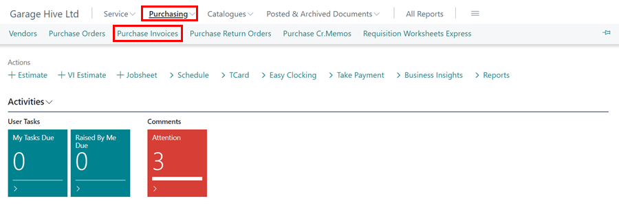
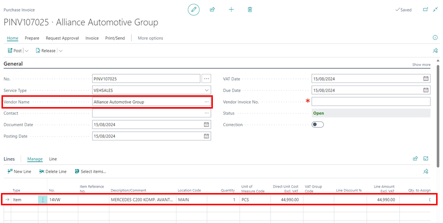
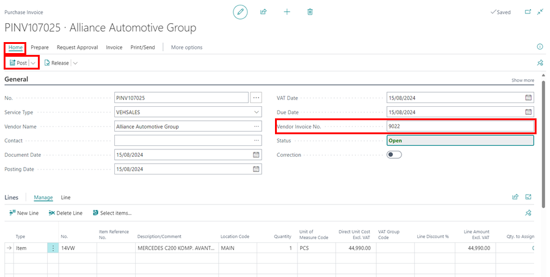

# Purchasing a Vehicle for Stock in Garage Hive
When using the Vehicle Sale Module, you must have vehicles available for sale in your inventory. This article explains how to purchase vehicles for stock in your system. When using Vehicle Sales Module, it is recommended that any data related to vehicle sales be entered by the **Vehicle Sales Admin** user. In this article we’ll use the **Vehicle Sales Admin** user.

## In this article
1. [Create a New Vehicle Item Card](#create-a-new-vehicle-item-card)
2. [Create a Purchase Invoice](#create-a-purchase-invoice)

### Create a New Vehicle Item Card
1. Select **Items** in the Home Screen/Role Centre. 

   

2. Click on **New**, to create a new Item Card.

   

3. Select the **Item Template** for the new item as **Vehicle Sales** and click **OK**.

   

4. Enter the item **No.** as the vehicle registration number, and the description as the make and model of the vehicle.

   

5. The vehicle item card is now successfully created. Click the back arrow (&#8592;) to close the Item card.

[Go back to top](#top)

### Create a Purchase Invoice
1. Select **Purchasing**, and then **Invoices** from the navigation menu in the Role Centre, or click on the **Purchase Invoice** action.

   

2. Choose **New** from the **Invoices** page.

   

3. Enter the **Vendor Name** and choose the vehicle item card that you created in the **Lines** sub-page.

   

4. When you receive the vehicle from the seller, enter the **Vendor Invoice No.** and click on **Posting** followed by **Post**, to post the Invoice.

   

5. Click yes on the *Do you want to post the invoice?* notification.

   

6. The vehicle will now be successfully added to stock.

[Go back to top](#top)