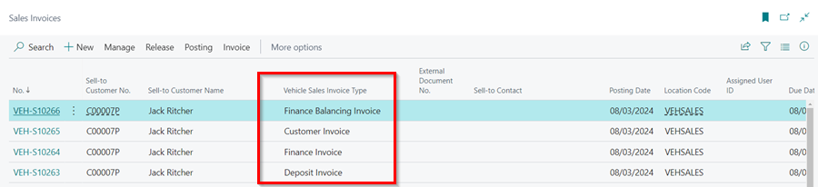
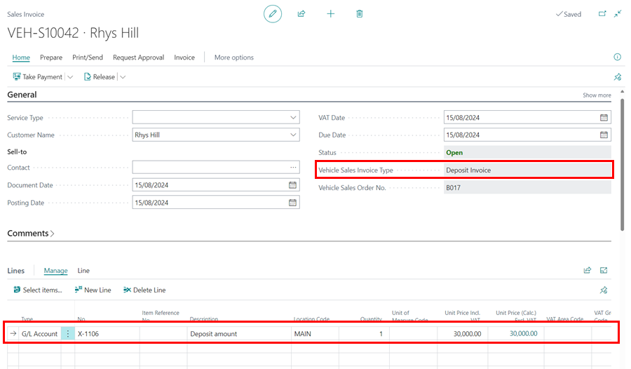
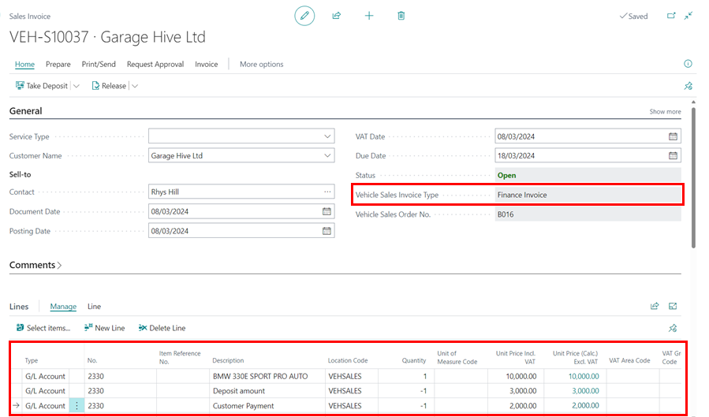
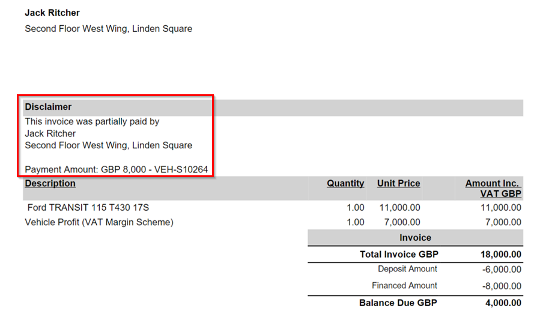
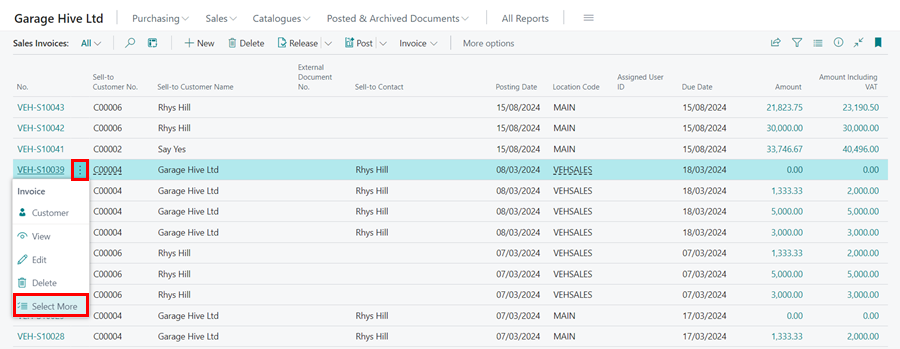
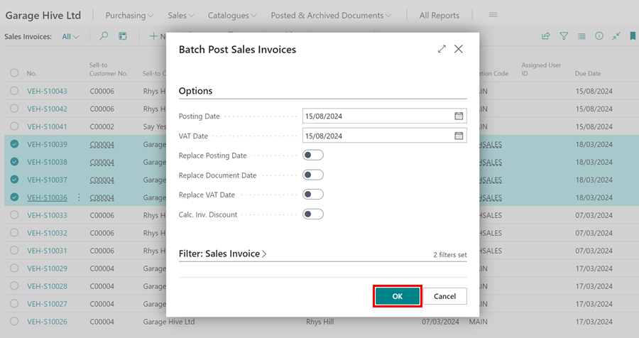

## Using the Vehicle Sales Invoices
Vehicle Sales Invoice is the invoice created in the system when the customer confirms the purchase of the vehicle. There are several types of invoices used for vehicle sales:

   - **Deposit Invoice** - This is created for the deposit given for the vehicle.
   - **Finance Invoice** - This is created for the finance company, when the payment is made by the finance company.
   - **Customer Invoice** - This is created for the customer, for the remaining amount that they will pay.
   - **Finance Balancing Invoice** - This is created for system requirements. It exists to keep the system's books balanced; it may not be printed and will always have a zero value.

The type of invoice is indicated in the **Vehicle Sales Invoice Type** column of the sales invoices list.

   

### Deposit Invoice
1. When a customer makes a deposit toward the purchase of a vehicle, a **Deposit Invoice** is generated. To create the **Vehicle Sales Invoice** from the **Vehicle Sales Order**, select **Actions** from the menu bar and then **Create Sales Invoice**.

   

2. You get the option of creating either the **Deposit Invoice** or create **All Invoices (Including Deposit)**.

   

3. The Deposit Invoice will only include the **Deposit Amount** in the **Lines** FastTab, to show the amount that has been deposited.

   

   

### Finance Invoice
1. The **Finance Invoice** is generated when the option **All Invoices (Including Deposit)** is selected, and when the **Source of Payment** is **Finance Company** in the **Vehicle Sales Order**.

   

2. The **Finance Invoice** shows the **Deposit Amount**, the **Customer Payment** and the cost the vehicle in the **Lines** FastTab.

   

3. When printed both the **Customer** and the **Finance Company** are indicated.

   

### Customer Invoice
1. The customer invoice is also generated when the option **All Invoices (Including Deposit)** is selected, and when the **Source of Payment** is **Customer** in the **Vehicle Sales Order**.
2. It shows the cost of the vehicle being sold, the **Deposit Amount**, the **Financed Amount**, the **Part Exchange** vehicle (if available) and the **Addons** that have bee added to the vehicle.

   

3. A comment is added in the printed **Customer Invoice** when the vehicle is partially paid by the **Finance Company**, to show what has been agreed on the financing.

   

### Finance Balancing Invoice
1. As the name suggests, this invoice is solely used for balancing the accounts in the system and it shows the cost of the vehicle, **Deposit Amount**, **Customer Payment**, and the **Financed Amount** which all amount to zero.

   

   



### Posting All the Invoices
1. To post all of the invoices at once, open the list of **Vehicle Sales Invoices**, select the dots next to the **No.** of any of the invoices, and click **Select More**.
2. Select all of the invoices you want to post at once.

   

   

3. Choose **Posting** and **Post Batch** from the menu bar. This will post all of the selected invoices at once.

   

4. On the page that opens, enter the dates as today's date and click **OK**.

   
   

 

### **See Also**
[Recommended Vehicle Sales Setup](garagehive-vehicle-sales-setup.html){:target="_blank"} \
[Using Vehicle Sales Order](garagehive-vehicle-sales-order.html){:target="_blank"}