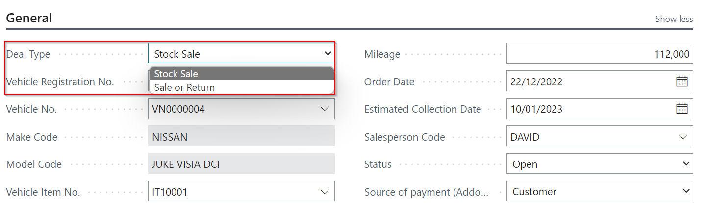
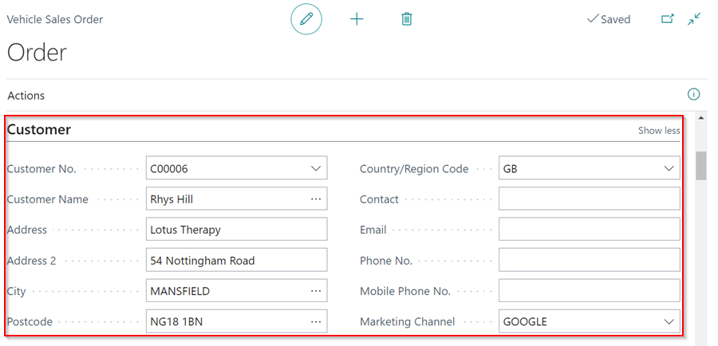

# Using Vehicle Sales Order
Vehicle Sales is a feature in Garage Hive that is used to sell vehicles, both new and used. It was created with vehicle dealers' needs in mind.
When using Vehicle Sales, it is recommended that any data related to vehicle sales be entered by the **Vehicle Sales Admin** user. In this article we'll use the **Vehicle Sales Admin** user.

### Creating a Vehicle Sales Order
1. From the Role Centre, select the **Sales Orders** tiles, and click on **New** from the actions bar in the page that opens.

   

2. Choose whether the vehicle sale **Deal Type** is a **Stock Sale**, in which you sell the vehicles you have in stock, or a **Sale or Return**, in which you return the unsold stock to the wholesaler or manufacturer.
3. Then, in the fields such as **Vehicle Registration No.**, **Mileage**, **Order Date**, **SalesPerson Code** and *Vehicle Item No.** (The number of the vehicle being sold), enter the vehicle's details.
   
   

4. Make sure to specify the **Source of Payments** for **Addons** under the **General** FastTab, which can be either the **Customer** or the **Finance Company**.

   

5. Enter the details of the customer to whom you are selling the vehicle under **Customer** FastTab.

   

6. The **Comments** FastTab allows you to enter any comments about the vehicle being sold.

   

7. Enter the selling price of the vehicle in the **Retail Price Incl.VAT** field under the **Financials** FastTab; if there is a discount, enter the percentage in the **Discount%** field.

   

8. Mark the **Involves Part Exchange** slider to the right if the vehicle involves **Part Exchange**, which means the customer is giving an old vehicle as part of the payment for the new vehicle. The **Part Exchange** FastTab is now activated.

   

9. Enter the Part Exchange vehicle registration number in the **PX Vehicle Reg. No.** field and all the details related to it in the **Part Exchange** FastTab.

   

10. In the **PX Amount Inc. VAT** field under the **Financials** FastTab, enter the amount agreed upon for the Part Exchange vehicle.

   

11. When the vehicle is repaired or serviced before being sold, the items that have been replaced are entered into the **Addon** FastTab.

   

12. You enter the details of the customer or company paying for the vehicle in the **Invoicing** FastTab, so if it is the **Finance Company**, you must enter the details of the finance company.

   

13. If you've added a **Part Exchange** vehicle, go to the menu bar and select **Actions**, then **Create PX Purchase Invoice**. This generates a Purchase Invoice for the Part Exchange vehicle, which you can access via the Purchase Invoices tile to post when the customer brings in the vehicle for exchange.

   

14. After ensuring that all the financials are correct, select **Actions** from the menu bar, and choose **Create Sale Invoice**.

   

15. If you added the **Deposit Amount** in the **Financials**, you'll get a notification to either create a **Deposit Invoice** or **All Invoices (Including Deposit)**. Select the one you want and click **OK**.

   

 

### **See Also**
[Recommended Vehicle Sales Setup](garagehive-vehicle-sales-setup.html){:target="_blank"}
[Using Vehicle Sales Invoices](garagehive-vehicle-sales-invoices.html){:target="_blank"}