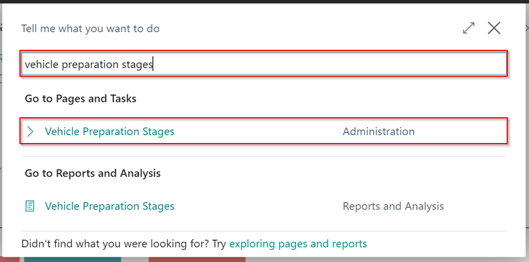
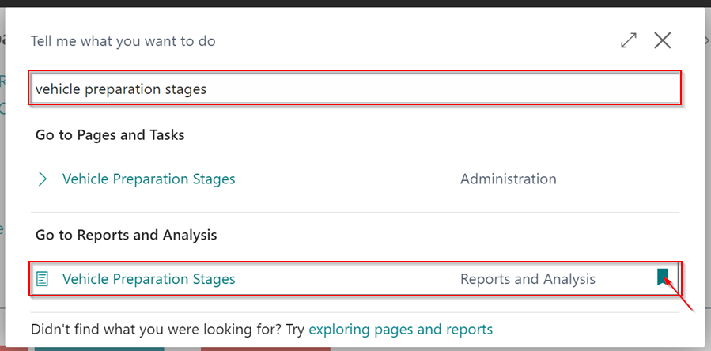
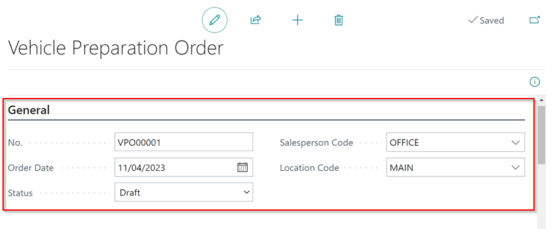

# How to Use Vehicle Preparation Stages in Garage Hive
**Vehicle Preparation Stages** is a feature in Garage Hive that helps you in managing the preparation of vehicles for sale. They enable you to track the progress of each **Vehicle Preparation Order** from the initial preparation stage to the vehicle sale. The stages can be customised to your Garage's specific needs and preferences.

## In this article
1. [How to Create Vehicle Preparation Stages](#how-to-create-vehicle-preparation-stages)
2. [How to Create a Vehicle Preparation Order](#how-to-create-a-vehicle-preparation-order)

### How to Create Vehicle Preparation Stages
To customise the **Vehicle Preparation Stages**:
1. In the top-right corner, choose the  icon, enter **Vehicle Preparation Stages**, and select the related link under **Pages and Tasks**.

   

2. Create the stages with a **Code** and a **Description** in the **Vehicle Preparation Stages** page. After you've finished creating the stages, click the back arrow (&#8592;) to close the page.

   

3. The **Vehicle Preparation Stages** are now available for use.

[Go back to top](#top)

### How to Create a Vehicle Preparation Order
After creating the **Vehicle Preparation Stages**, the next step is to create a Vehicle Preparation Order, which is now used to track the progress of the vehicle preparation:
1. To start, bookmark the **Vehicle Preparation Stages** page. Choose the  icon in the top-right corner, enter **Vehicle Preparation Stages**, and hover your mouse over the related link under **Report and Analysis** and then click on the bookmark icon.

   

1. This will add the **Vehicle Preparation Stages** page to the Role Centre.

   

1. To create a new **Vehicle Preparation Order**, go to the **Vehicle Preparation Stages** page (which you bookmarked in the Role Centre) and click **New**.

   

1. Under the **General** FastTab on the **Vehicle Preparation Order** page, select the **Salesperson** (optional), enter the **Order Date**, select the **Location Code**, and then select the **Status** of the Order. 
1. The status of the **Vehicle Preparation Order** indicates its progress; it can be **Draft** - not started, **In Progress** - started, or **Completed**.

   

1. Scroll down to the **Vehicle Info** FastTab and select the **Vehicle No.** to add in the **Vehicle Preparation Order**, which autofills the rest of the fields.

   

1. You can also use the **Tracking Code** to indicate where the vehicle is in its preparation process.

   

1. Under the **Stages** FastTab, select the **Vehicle Preparation Stage** that the vehicle is currently in, followed by the **Status**. 

   

1.  If there are any comments for the **Preparation Stage**, you can view them in the **No. of Stage Lines** field by clicking on the number in the field.

      

1. It is important to note that you can use any stage in any order, depending on the process you use in your workshop, and you can also add stages in parallel to each other.

   

1.  In the **Vehicle Preparation Stages** list, each stage is updated with an icon depending on the status of the stage.

   

1.  You can create as many **Vehicle Preparation Orders** as needed.

   

[Go back to top](#top)

