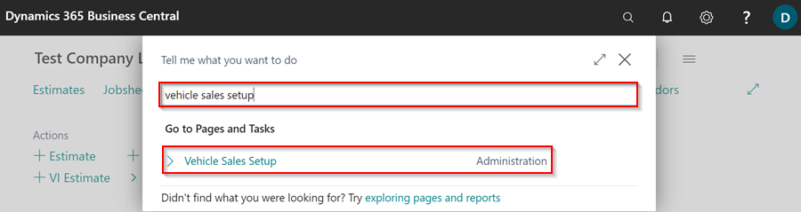
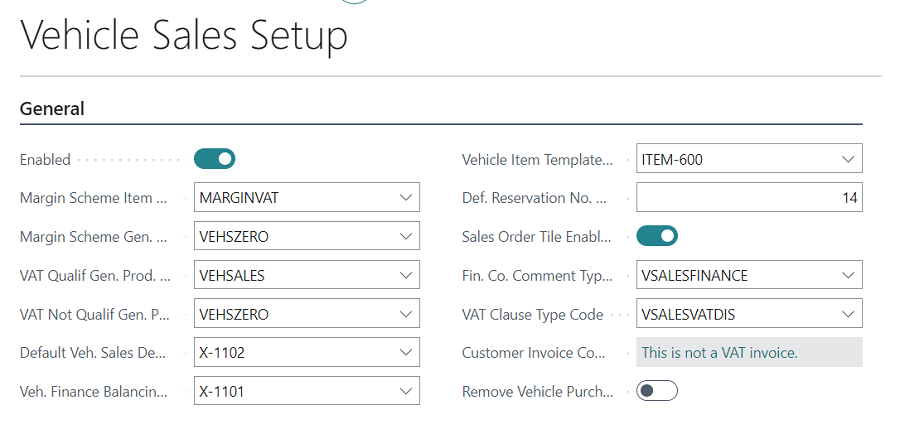
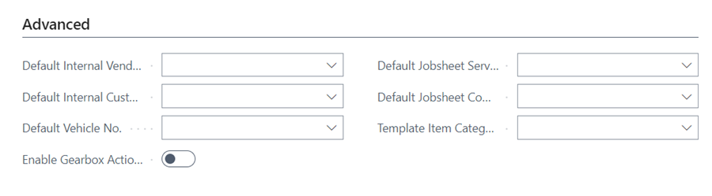
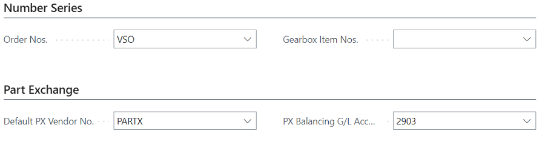

## Recommended Vehicle Sales Setup
For the **Vehicle Sales** features to work as intented, here is the recommended setup:
1. In the top right corner, choose the  icon, enter **Vehicle Sales Setup**, and select the related link.

  

   * For **General** FastTab:

      

   * Leave the **Advanced** FastTab blank:

      

   * For the **Number Series** and **Part Exchange** FastTab:

      