

# Vendor Payment Process in Garage Hive
It is essential to always pay your vendors on time and accurately. However, managing vendor payments can be complex and time-consuming, especially with multiple suppliers with different payment terms. This article will walk you through making vendor payments in Garage Hive.

## In this article
1. [Generate Aged Accounts Payables Report](#generate-aged-accounts-payables-report)
2. [Create and Post Payment Journals](#create-and-post-payment-journals)
3. [Create Payments from Vendor Ledger Entries](#create-payments-from-vendor-ledger-entries)

### Generate Aged Accounts Payables Report
The first thing to do while paying the vendors is to generate an ageing accounts payables report to see the outstanding invoices and their due dates:
1. Select **Purchasing** from the Role Centre, followed by **Vendors**. 

   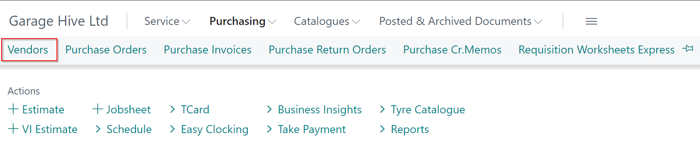

2. Then from the vendor list, choose **Reports**, followed by **Financial Management** and then **Aged Accounts Payable**.

   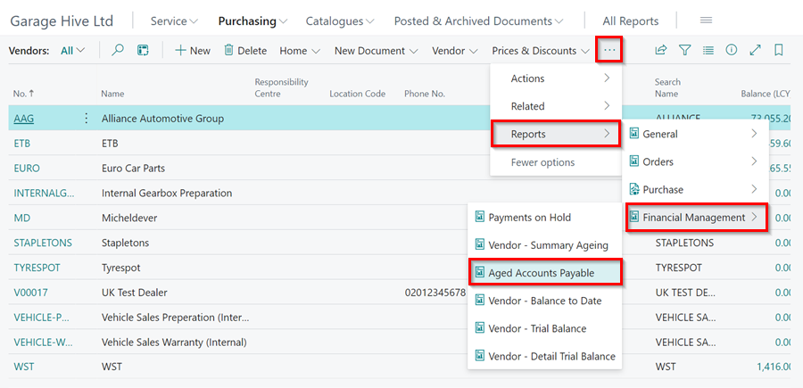

3. In the **Aged Accounts Payable** filter window, select the **Aged as Of** date, select **Ageing by** to be **Due Date** and **Period Length** to be **1M**.
4. Select the **Print Details** slider to view the invoices for the Vendor and **Use External Document No.** slider to print the vendor’s document number.
5. Click on Preview to preview the report.

   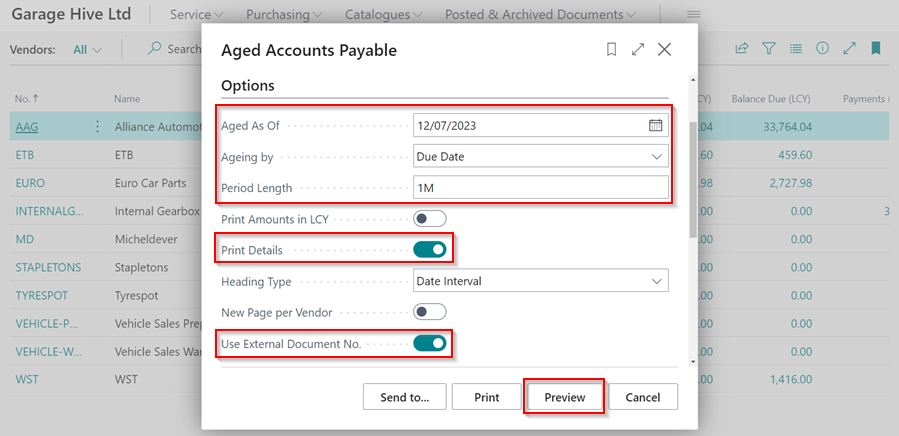

6. The report will be previewed, and you can print it to use it on making payments to the vendors.

   

[Go back to top](#top)

### Create and Post Payment Journals
The first option for making payments to vendors is through the **Payment Journals**. Here is how to go about it:
1. In the top-right corner, choose the  icon, enter **Payment Journals**, and select the related link.

   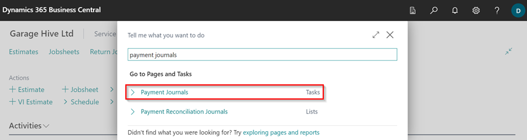

2. Select the **General Journal Template** to use and click **OK**.

   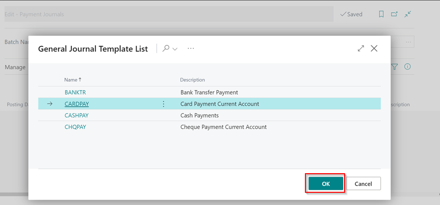

3. To make it easier to enter the **Payment Journals**, choose **Prepare** from the menu bar and then **Suggest Vendor Payments**. This generates payment journal lines based on the last payment date, which checks invoice due dates up to the date specified. The other option is to enter the payment journals manually.

   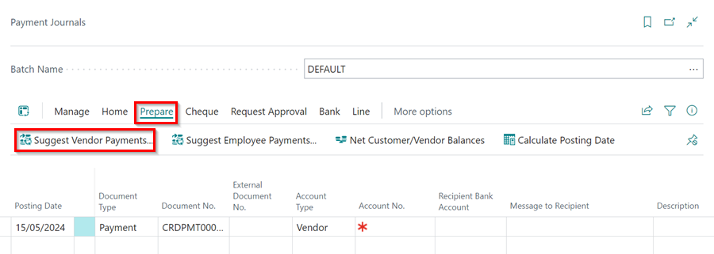

4. In the **Suggest Vendor Payments** filter window, select the **Last Payment Date** for the vendor payments, then select **Skip Exported Payment**, **Check Other Journal Batches** and **Summarise per Vendor** sliders.

   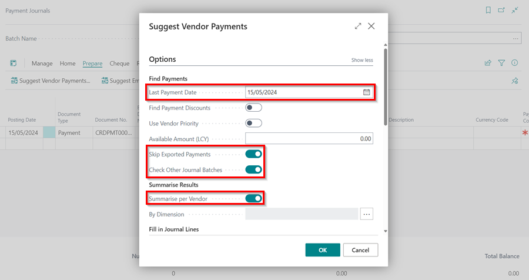

5. Enter the **Balance Account Type**, **Balance Account No.**, and **Bank Payment Type**. This is important if you're doing it for the first time, because whatever you choose now will always be the default setting.
6. Click OK.

   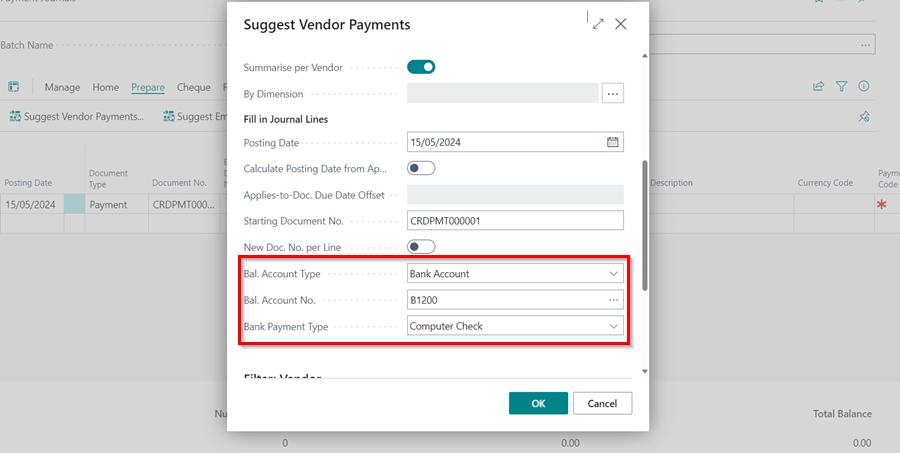

7. To assign a numbers (if there are no numbers) in **Document No.** column, select **Home**, followed by **Renumber Document Numbers**.

   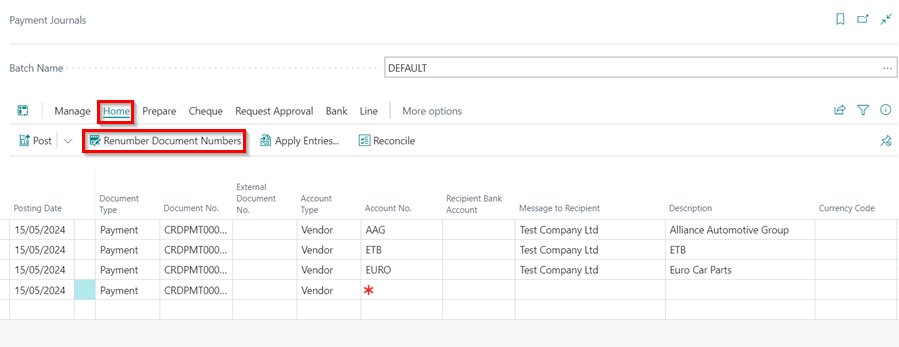

8. Select **Home** from the menu bar and then select the **Post** option from the split button dropdown menu to post the **Payment Journals**. 
9. To see if there are any errors, in the split button dropdown menu, select **Preview Posting**.

   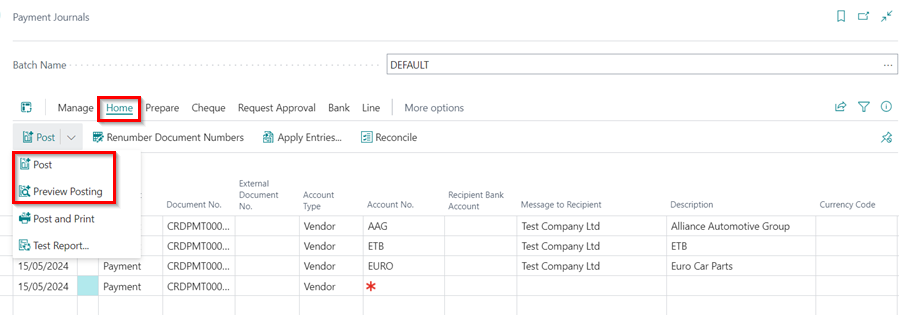

[Go back to top](#top)

### Create Payments from Vendor Ledger Entries
The other option for making payments to vendors is from the Vendor Ledger Entries. Here is how:
1. In the top-right corner, choose the  icon, enter **Vendor Ledger Entries**, and select the related link.

   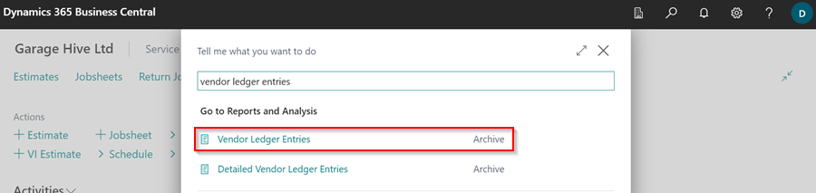

2. Hold down the **Ctrl** key and use your mouse to select all of the **Vendor Ledger Entries** for which you want to create a payment.
3. Select **Home**, followed by **Create Payment**.

   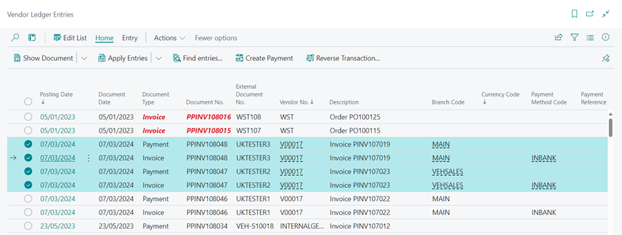

4. Edit the payment details in the pop-up window, and click **OK**.

   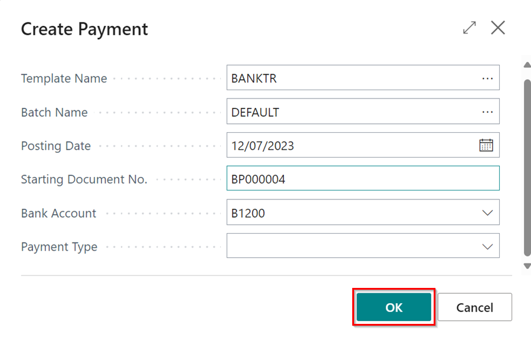

5. This opens the **Payment Journal** page with the payments that you selected to be paid.
6. To Post the **Payment Journals**, select **Home** from the menu bar and then select the **Post** option from the split button dropdown menu to post the **Payment Journals**.

   

[Go back to top](#top)