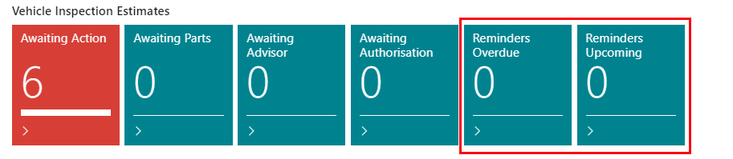
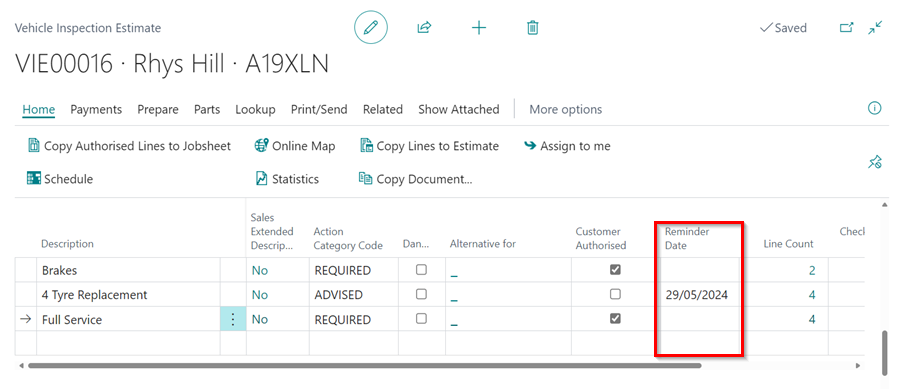
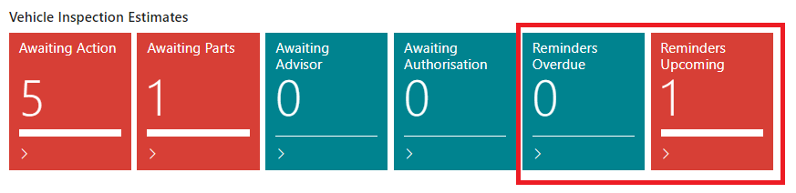
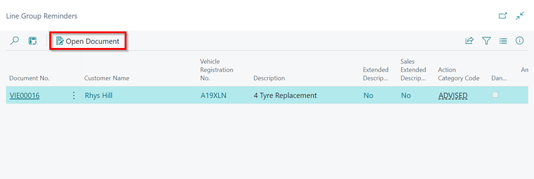
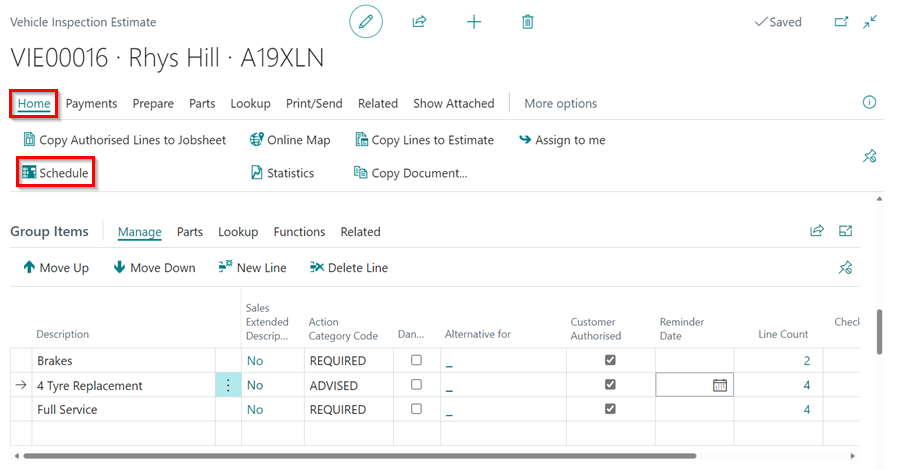

#   Vehicle Inspection Estimates (VIE) Reminder Dates

You have the option to defer any advisory work reported that has not been authorised by the customer within the Vehicle Inspection Estimate. You can provide your customer with a follow-up call for the recommended work.

Once the date has been set within the Vehicle Inspection Estimate, it will appear in the tiles on the home screen 2 weeks prior to the agreed date (this period can be specified by you and does not have to be 2 weeks).

## In this article
1. [How to set reminder date](#how-to-set-reminder-date)
2. [Knowing when the reminder date is coming up and or overdue](#Knowing-when-the-reminder-date-is-coming-up-and-or-overdue)
3. [Following up on the reminders](#Following-up-on-the-reminders)

### How to Set Reminder Date 
1. There is a column for Reminder Date in the Vehicle Inspection Estimate **Group Items** section.
2. Select a date in the cell along the group line for the work you want to set a reminder date for.

### Knowing When the Reminder Date is Coming Up and or Overdue 
When a reminder date is approaching or has passed, it is displayed in the **Role Centre** under the Vehicle Inspection Estimates tiles named **Reminders Upcoming** and **Reminders Overdue**, respectively.

> **Example:**
>
> You could specify that 2 weeks before the reminder date, the items selected will appear in the VIE **Reminders Upcoming** tile, and after the reminder date has passed and the work has not been authorised or the reminder date has not been removed, the items selected will appear in the **Reminders Overdue** tile.

### Following up on the reminders
When the reminder tiles are populated, you should ensure that you have followed up with the customer to obtain authorization for the work. To follow up on the items: 
1. Click on the **Reminders** tile with the jobs to follow up on.
2. The list that appears is for the items in the respective VIE that have been marked for reminder. Select the line containing the item you want to follow up on and then click **Open Document** from the menu bar, or simply click on the **Document No.**.

   

3. After communicating with the customer and obtaining authorisation for the work, and once a date has been agreed upon, you can open the schedule from the Vehicle Inspection Estimate. Simply select **Home** from the menu bar, followed by **Schedule** from the submenus. Make sure to remove the reminder date, which will remove it from the reminders tile.

   

4. Schedule the job for the agreed-upon date, then **Select Existing Jobsheet** and add the Jobsheet linked to the Vehicle Inspection Estimate.
5. After booking, open the Vehicle Inspection Estimate and copy the authorised lines to the Jobsheet.

[Go back to top](#top)

# See Also
 
[How to setup Checklists](garagehive-checklist-how-to-create.html "How to setup Checklists in Garage Hive"){:target="_blank"} \
[How to perform a Vehicle Inspection](/docs/garagehive-technicians-vehicle-inspections.html "How to perform a Vehicle Inspection"){:target="_blank"} \
[How to use Vehicle Inspection Estimates](/docs/garagehive-VHC.html){:target="_blank"}
