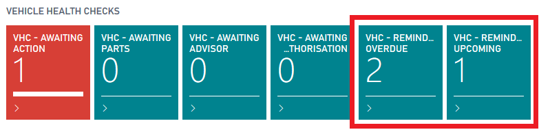
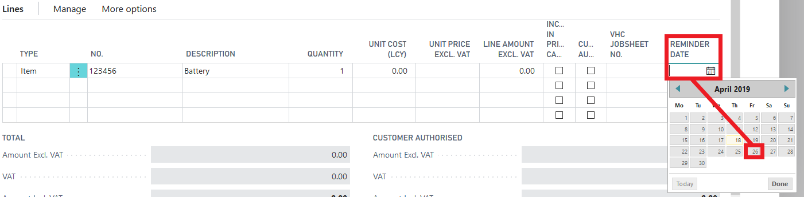
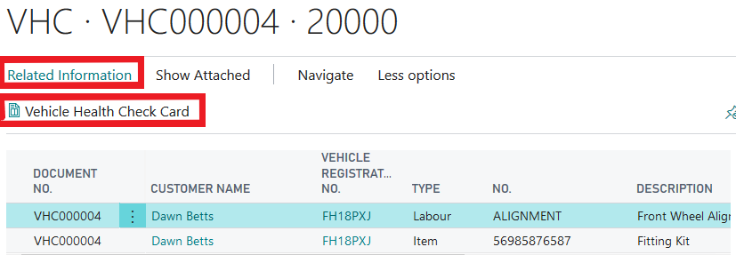
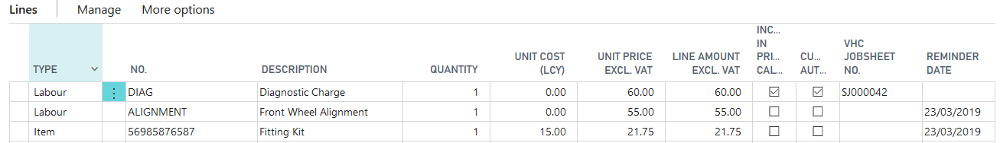
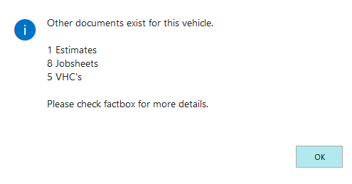
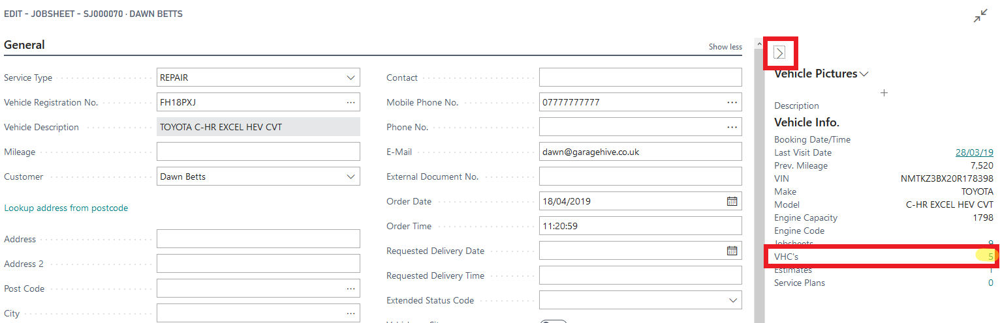
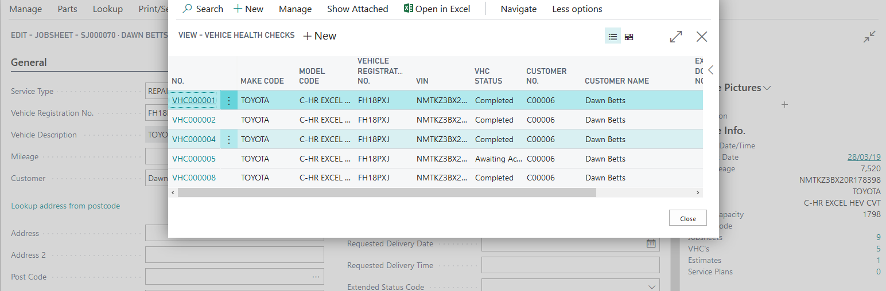
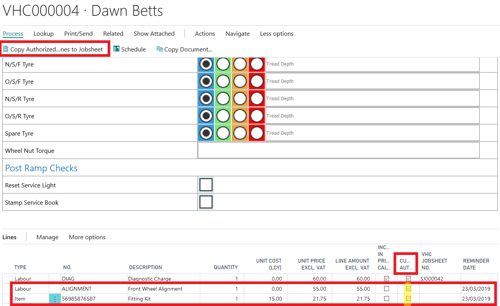

#   VHC (Vehicle Health Check) - Reminder Dates

Within the Vehicle Health Check, you have the ability to deferred any advisory work reported which has not been authorised by the customer. 

You can offer your customer a follow up call for the advised work. 

Once the date has been set within the Vehicle Health Check, 2 weeks prior to the agreed date it will appear in the tiles on the home screen. 

#### How to set Reminder Date 

Within the Vehicle Health Check Lines section, there is a column for Reminder Date. 

This is where you select a follow up date according to when you believe the work may be due. 

####    When the Reminder Date is coming up and or overdue 

2 weeks prior to the reminder date the items selected will appear in the VHC Reminder - Upcoming Tile. 

After the date has passed, if the work has not been authorised or reminder date removed, the reminders will fall into the VHC - Reminder Overdue Tile. 

####    How to add the authorised work to a job from a follow up call. 

When selecting the relevant tile the work deferred will appear as several lines split up into labour and items. 

**Ensure you make a note of the VHC number as there may be multiple open for the vehicle.**

Highlight the relevant line which you are wanting to follow up. Then selected Related Information, followed by the Vehicle Health Check Card. This will open the original Vehicle Health Check and will show all work reported on that visit including any work previously authorised. 

Once the work has been authorised and a date has been agreed you can open the schedule from the Vehicle Health Check Card by selecting Process followed by Schedule. 

Create a booking on the schedule in the relevant bay depending on the type of work which has been authorised.

When creating a new job it will alert you that there are VHC's exist for the vehicle. Select ok.

Within the jobsheet ensure the factbox is open and the select the blue number against the VHCs within the factbox. 

This will show all VHC for the vehicle. Select the VHC which the authorised work was reported on. 

At this point you tick the customer authorised box as you would when authorising work from a Vehicle Health Check, followed by the Copy Authorised Lines to Jobsheet Tab. 

Select the job upon you wish the work to be completed, if multiple jobs are open. 

This is now a booking made and the authorised work added to it. 

If all outstanding work has been authorised the reminder will disappear from within the tiles. 

# How to use VHCs 
