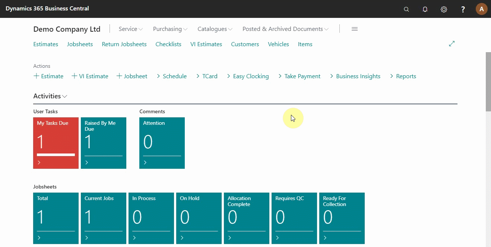
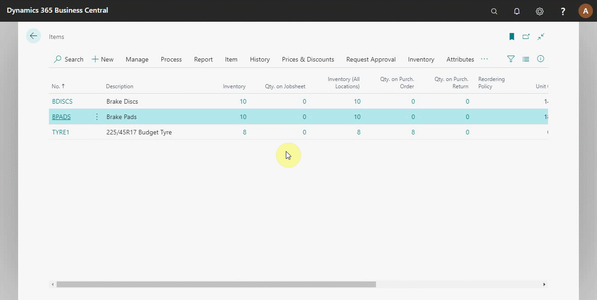

# Viewing Items to Return Report

The items to return report is the report of items you shouldn’t have in stock. The report is generated based on the following:
-	The item is not in a jobsheet
-	The item is not on a return order
-	The item doesn’t have a reordering policy

## In this article

1. [Open the items to return report](#open-the-items-to-return-report)
2. [View the history of items in the return report](#view-the-history-of-items-in-the-return-report)

### Open the items to return report
To access the items to return report from the **Role Centre** (home page). Click on **Reports** from the action bar, point the mouse on **Additional** from the submenus, and select **Items to Return**, which opens a list of items listed to be returned (see below).

### View the history of items in the return report
From the opened report of **Items to Return**, select an item you want to view the history and click on **History** from the action bar. Select **History Overview** (see below).

### **See Also**

[Video: How to view items to return](https://www.youtube.com/watch?v=EyVbV50EwaQ&t=81s).