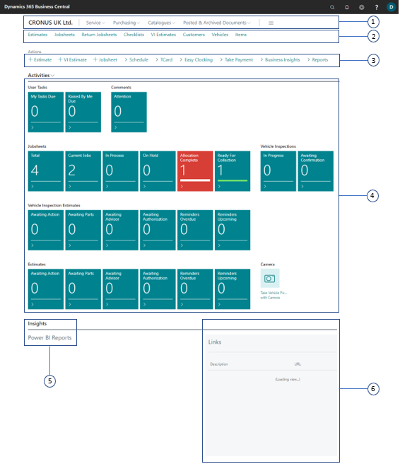
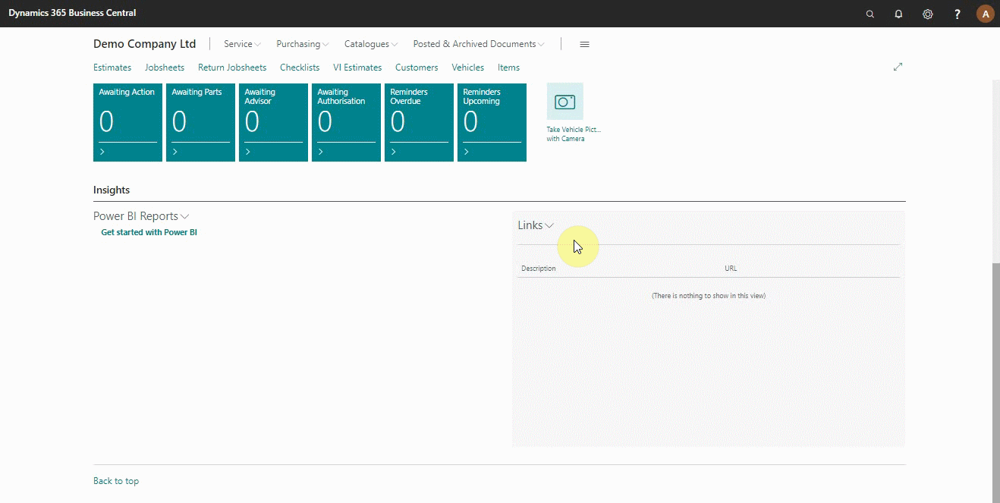

# Welcome to the Role Centre (Home Screen)



### Role Centre Sections

The Service Advisor home screen (Role Centre) is divided into the following areas:    

#### 1. Navigation Menu

The top-level navigation menu provides access to the main roles of the business, with the option to expand/drop-down submenus relevant to the main roles. They include **Service**, **Purchasing**, **Catalogues** and **Posted/Archived Documents**.

To access the submenus under service: Click on **Service** and then select an option from the submenus menu.

#### 2. Navigation Bar

The second-level navigation menu provides access to the most useful entities in the business process, to help in quick navigation as soon as the home screen is opened.

To access the jobsheets page, click on **Jobsheets** from the navigation bar.

#### 3. Actions Bar

The actions bar provides submenus of the most often used tasks. This enables you to create an item quickly.

To create a new estimate, click on **+Estimate**.

#### 4. Data Cues

The data cues provide a visual representation of the business data such as the number of total jobsheets created etc. On every data cue there is a header on it, which explains what the data is about.

Click on a specific data cue to access the specified data content. Sometimes the cues will be red in colour (depending on settings), which means a call to action for the service advisor.

#### 5. Chart

The Chart area shows graphical and interactive representation of your business data from the Power BI report.

To connect to Power BI, click on **Power BI reports** and select get *started with Power BI*, follow the prompts. For any support on this, please contact our support team.

#### 6. Listpart Page

The list Part page displays a list of external link that you oftenly for easier access.

To add external links, click on the search icon (top right corner) and search *branch profile setup*. From the window that appears select *Main* with the *Profile ID* of *GHV Service Advisor*, click *Links +* and add the link with a description. Go back to the role centre (see below).

