# What's new?
Below is a brief list of Garage Hive developments

### 14th December 2019

* VHCs have been renamed to VI-Estimates system wide

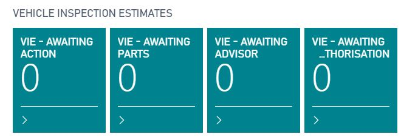
* Confirming a VI and creating a VI-Estimate will automatically open the VI-Estimate
* Line Unit Costs are now copied to the Jobsheet when authorised from a Estimate/VI Estimate
* Imrpoved Survey information visible on phone app
    * NPS Group now visible
    * Number of Answers now visible

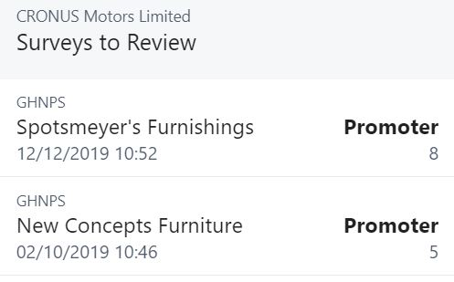
* Fixed a bug that prevented you from going back once viewing customer comments on a survey using the phone app. 
* Added the ability to add extended descriptions to comrpessed service packages
* You can now access VI-Estimates from a vehicle card
* Dual Column VI Printout now includes the Checklist template name
* Dual column VI Printout now date & time stamps technician/authoriser signatures

### 30th November 2019

* Added a Natwest Bankline statement import
* Jobsheets Extended status are now visible on Posted Jobsheets
* Added the ability to view the customer/vendor on the General Ledger entry table
* Labour extended status descriptions will now transfer from an estimate to a jobsheet
* Garage Hive client now has a 2 hour idle timeout instead of 20 minutes

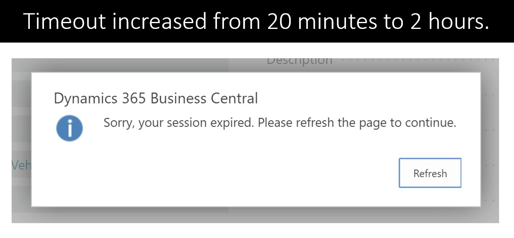

### 24th November 2019

* Autodata repair times now load 4x~ faster
* Reduced the wasted space on the vehicle inspection printouts
* Added the ability to score the quality of a vehicle inspection
* Added the ability to mark a jobsheet as an online booking for reporting purposes when using an external online booking system

### 13th November 2019

* Added the ability to send an SMS from the customer card
* Added Service Advsior name to invoice printout (optional)
* Added vehicle parking locations to jobsheets (Optional)
    * User stamped
    * Date stamped
    * time stamped

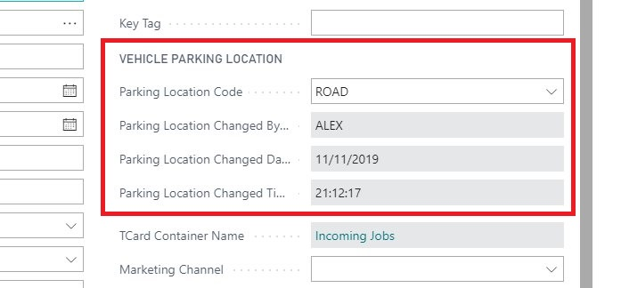
* Compressed the line spacing in labour extended descriptions
* Added the ability to copy/paste service package versions
* Added the ability to share/export/import checklists with other GH users - [Video](https://youtu.be/JT7NcMEEa8Y "Find out more")
* Added the ability to print checklist captions

### 30th October 2019

* Introduced User Tasks - [Video](https://youtu.be/iz7FR3dOQKU "Find out more")
    * Create tasks for yourself
    * Create tasks for other users
    * Set due dates on tasks
    * Monitor tasks set for others
    * Recurring tasks
* Document Description and Work Description on Job sheets, Estimates and VHCs now pop-out into a full screen window. 
    * Pop-out work description window
    * Full-screen work description window
    * Mouse over preview
    * Compatible with templates
    * Spellcheck compatible
    * Available on job sheets, estimates and VHCs
* Added a "Tyre" field checkbox to item cards. 
* Changed the default column layout for technicians job sheets on tablet devices. 
* Clocking terminal now supports different time zones. 
* Introduced Item Overview report. Easily traceable item history, accessible from item lists, item cards and items to return reports with clarity of the following. 
    * Purchase Invoices
    * Customer Card
    * Vendor Card
    * Posted job sheets
    * Open job sheets
    * Job sheets related to PO

### 20th October 2019

* Introduced Open Estimate analysis Power BI report - [Video](https://youtu.be/DOXzAKsTxIo "Find out more")
* Improved VHC analysis Power BI report

### 7th October 2019

* Added the ability to send SMS from survey entries
* Added ability to set a review requested date for survey entries
* Added last survey requested / last review requested fields to customers cards
* Added access to customer comments from survey entries
* Added a 2 column layout printout for vehicle inspections
* Added the ability to view tyre information graphically on vehicle inspections
* Added a "faults and actions" section to vehicle inspections
* Added the ability to add external website lines to any role centre homepage
* Added the ability to opt customers out of booking reminders
* Added vendor invoice number to aged accounts payable report

### 1st October 2019

* Added the ability to let technicians select from a pool of "Group Tasks" [Video](https://youtu.be/oCRC4WCvHeQ "Find out more")

### 29th September 2019

* Added Customer Satisfaction, [Net Promoter Score and Survey feature](https://www.garagehive.co.uk/customer-surveys-nps "Surveys and NPS")
    * Automated SMS/Email feedback requests
    * New detailed Power BI reports
    * Live customer insights from any document
    * Access to previous feedbacks from any document
    * Ability to review and action all feedback recieved
    * More Information available here - [Click here](https://www.garagehive.co.uk/customer-surveys-nps "Surveys and NPS")
* Added the ability to add paragraphs to email reminders and booking confirmations
* Added the ability to display tyre label information on documents
* Added the ability to set estimate reminders
* Added estimate reminders upcoming/overdue tiles to all role centres
* Added the ability to add extended descriptions to items in all documents
* Order numbers can now be made mandatory for specific customers

### 22nd September 2019

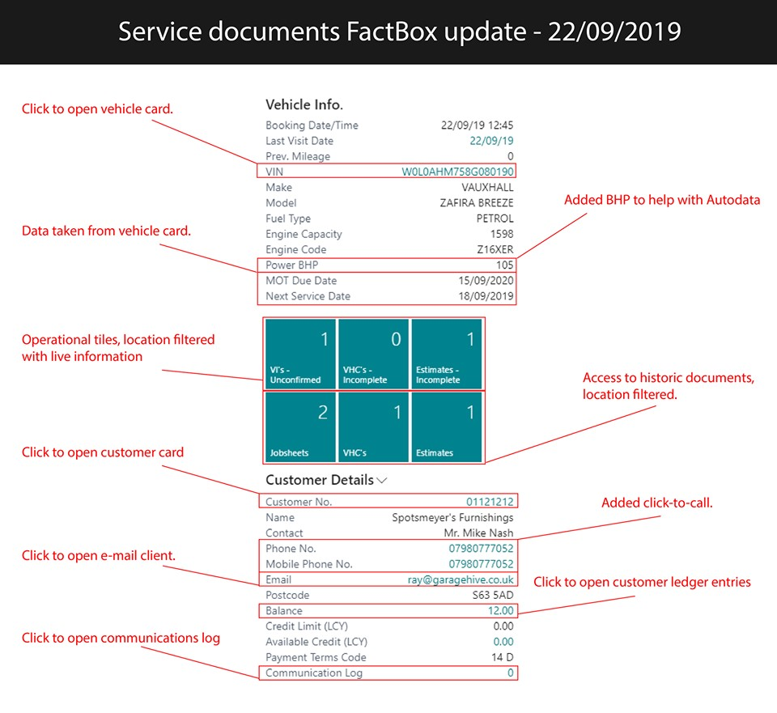

* Added BHP to the Factbox
* Added VIN that is a shortcut to the vehicle card to the Factbox
* Added 6 operational tiles to the Factbox
* Added MOT and Service dates to the Factbox
* Added click-to-call contact numbers to the Factbox
* Extended the part number visibility on printed Purchase Return Orders

### 10th September 2019

* 0% VAT Lines will no longer display a VAT sub-total on invoices
* Added the ability to view caption texts next to radio buttons in Vehicle Inspections
* Added the ability to adjust VAT amounts of documents for any discrepancies - [Video](https://youtu.be/zBXttdf0byg "Find out more")
* Added the ability to counter-sign vehicle inspections

### 2nd September 2019

* Added the ability to search Autodata with Make/Model/Engine Code
* Added Jobsheet Net & Gross Value to Jobsheet list
* Added "Safety Check" to vehicle cards, for Irish Markets

### 21st August 2019

* Technicians now have access to Autodata Oil and Lubricant Data from Easy Clocking
* Added Extended Labour Descriptions to Jobsheets & Estimates and Labour Cards, allowing upto 10,000 characters per description
* Copy Document function will now copy work descriptions
* Added ability for Service Advisors to Assign jobs to themselves - [Video](https://youtu.be/ALZgQyT-Xgg "Filtered Tiles")
* Added ability to have tiles filtered to particular Service Advisors 
* Added ability to attach external documents when emailing customers documents
* Improved Vehicle Inspection print out - [Video](https://youtu.be/VGKiDqAG9bA "Vehicle Inspections")
* Added ability to print signatures with Vehicle Inspection. 
* When emailing a VHC, the Vehicle Inspection will automatically be attached. 
* Added "Total Jobsheets" tile to Service Financial Controller Roll Centre

**Irish Localisation** 
* Ireland - Added VRM/VIN Lookup
* Ireland - Added Support for 2/3 VAT Rule
* Ireland - Added optional second VAT Rate on an Item Card
* Ireland - Added Mobile Number Validation
* Ireland - Added ability to adjust VAT Rate on all documents
* Ireland - Added VAT Statement

### 31st July 2019

* Added ability to view 7 or 5 days on the schedule
* Added Oil and Lubricant information to Estimates and VHCs
* Added the ability to add location/branch information to booking reminders
* Added the ability to send a booking confirmation
* Added support for Sage Cloud Accounting
* Power BI - Created a Web Service for varying labour rates across multiple locations
* Power BI - Added Service Advisor Web Service
* Power BI - Added Service Type / Job Type Web Service
* Power BI - Updated Posted Jobsheet Web Service to include vehicle number for advanced vehicle reports
* Added a pop-out window to checklists/vehicle inspections allowing technicians to see more of what they're typing. 

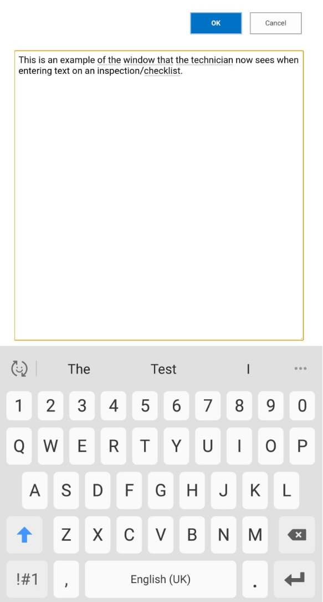

### 21st July 2019

Added Autodata Oil and Lubricant information to Jobsheets
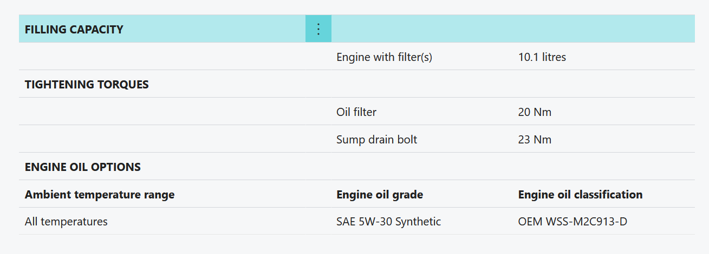

### 14th July 2019

* Added the ability for technicians to add signatures to vehicle inspections
* Added the ability to filter vehicles by service/mot expiry dates that haven't got a booking
* Fixed a bug where Autodata sometimes displayed the wrong registration in the menus

### 7th July 2019

* Added ability for technicians to create Jobsheets and clock onto them (Optional)
* Attachments can now be added to Customer Cards and Vehicle Cards
* Attachments can be added to Purchase Orders
* Attachments can now be accessed by Technicians via Easy Clocking
* Added "Jobsheets Total" tile
* Technicians pausing a job now creates a new allocation with the actual remaining time of the job
* Technicians completing a paused job will remove the paused allocation
* Technicians can now see allocated time, spent time & remaining time on their Jobsheets - [Video](https://youtu.be/B9ol7J_4dhI "Technicians Remaining Time")
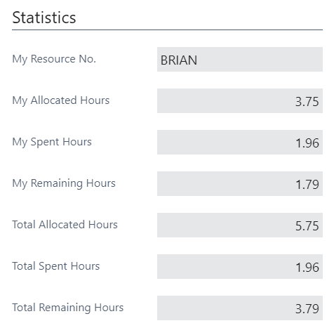
* Requestion Worksheet has been added to the Service Financial Controller role centre
* Added PLEO to bank statement Imports
* Shelf No. can now be added to item lookup search box

### 29th June 2019

* Autodata Open Beta now Live for all customers
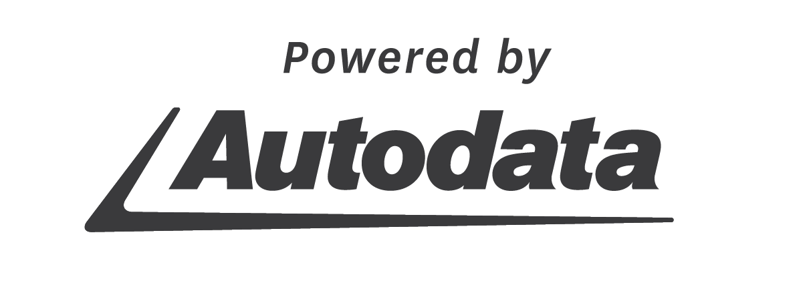
* Multiple lines can now be selected when searching for repairs in Autodata

* The "Day" is now visible on the schedule
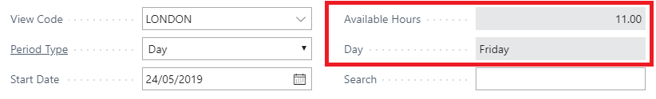
* Available Hours is now visible on the schedule
* Admin staff standard events no longer effect available hours on the schedule
* Added a Jobsheet Statistics feature
  * Clocked Hours per tech
  * Total Clocked Hours
  * Total Labour Quantity
  * Gross Profit
  * Labour Sales
  * Item Sales
  * Item Costs
  * Item Margin

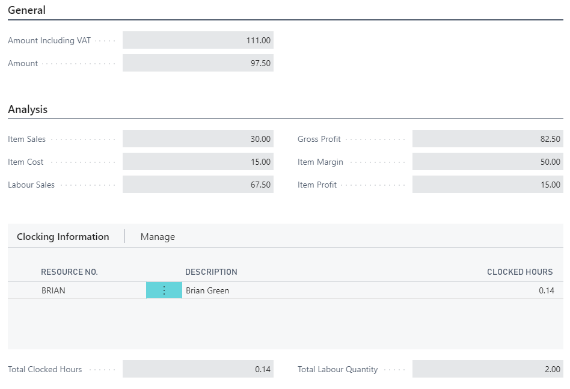
* "Line Check" is now clickable and will display a warning message related to the check
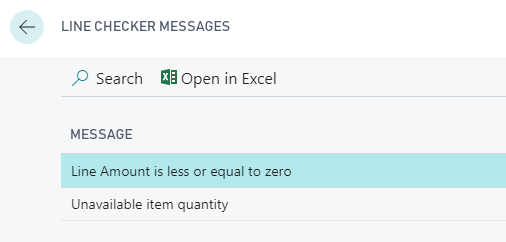
* Added a "Line Check" warning when labour resources haven't been added or equal 100%
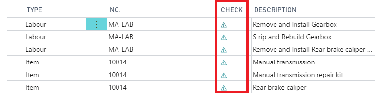
* Added a "Line Check" warning when line amount is 0 or less 
* Added Extended Status to Purchase Orders
* Added Drive to vehicle card transmission
* Added Spark Plug Torque to vehicle card
* Added Creation date field to customer table
* Added Creation date field to vehicle table

### 21st June 2019
* Added VHC Priority column (Advisory, Urgent, Critical)
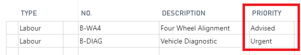
* Booking Date/Time appears immediately on Jobsheets

### 12th June 2019
* Introduced [Non-Inventory Items](https://youtu.be/itE0goMsFCI "Non-Inventory Items")

### 31st May 2019
* Improved the send SMS interface
* Added the ability to attach documents such as PDFs to the following; 
  * Job sheets
  * Return Job sheets
  * Estimates
  * VHCs
  * Posted Job sheets
  * Posted Return Job sheets
  * Archived Job sheets
  * Archived Estimates
  * Archived VHCs
* Added an option to remove the booking time from the customer notification booking reminders

### 24th May 2019
* Added a new method of applying payments to customers - Register Customer Payments - [Video](https://youtu.be/rmfIFULOCKY "Register Customer Payments")
* Fixed an error when printing "Posted Return Jobsheets"
* Added vehicle inspections data to web services for reporting purposes
* Added Estimate tiles to the "Service Financial Controller" Role Centre
* Added Vendor Columns to item lines of VHCs and Estimates, this information will copy to the Jobsheet
* Introduced a warning for technicians when they attempt to clock off a jobsheet without all item/labour lines being confirmed by the technician [Video](https://youtu.be/jX21NVsKeZ4 "Technician Confirmed")
* Added the ability for technicians to access the schedule via easy clocking if required
* Added Customer GDPR Preferences to vehicle lists for data export
* "Stock out warning" won't be given on the item line if the item card has "stockout warning" unticked
* Added "Price Calculator" to Estimates
* The Booking version of the jobsheet now has all the features of a standard jobsheet
* Added a "refund" option to return jobsheets
* Created a new role centre for Multi-location companies with additional multi-location features
* Extended SMS capacity to 900 characters
* Introduced Requisition worksheets & Stock control [Video](https://youtu.be/-RptpsLg2kk "Requisition Worksheets")
  * Stock re-order points on an item number
  * Generate a stock requirement report
  * Auto-creation of purchase orders
  * Considers future & current bookings
  * Considers items already on order

* Added Quickbooks Integration 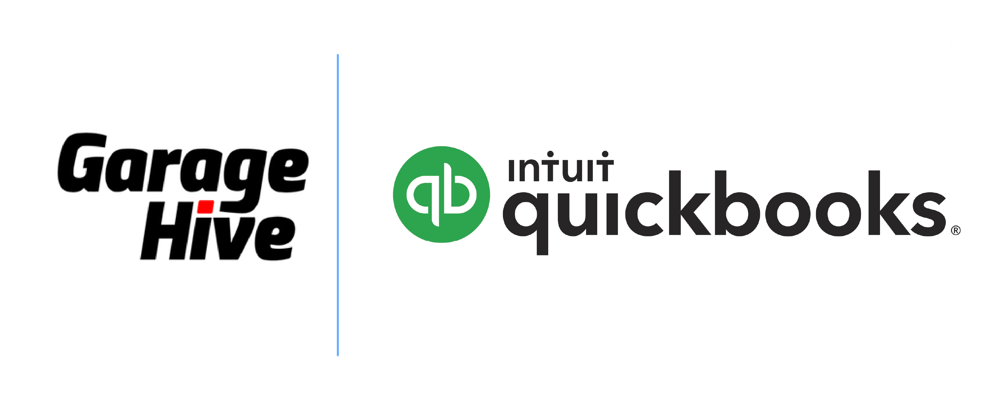

### 17th May 2019
* Added ability to search by Make/Model/Engine code in Autodata Preview
* Added a stock warning to Jobsheet item lines when available stock is 0
* Mileage now transfers from jobsheets, to inspection & VHCs
* Added a feature that allows you to copy from comments to work description
* Added fuel information into the Factbox

### 7th May 2019
* Added ability to copy grouped items and compressed service packages from VHCs and Estimates to Jobsheets
* Added access to items from the services advisors role centre on mobile & tablet devices
* Added the ability to update the customer card from the Jobsheet when changing address details
* Create a new role centre - Service Financial Controller
* Added Xero Integration use Xero's API 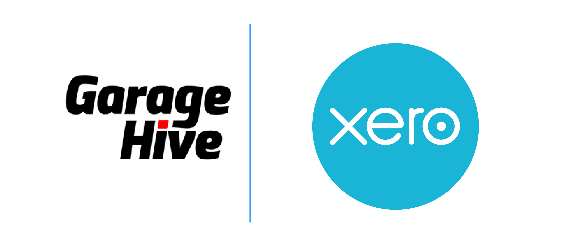

### 28th April 2019
* Added MOT/Service Due Date & Customer Phone/Email/Address details to Vehicle lists. 
* Added the ability to authorise single lines from an estimate to be copied to an existing jobsheet.
* Added two new tiles, Estimates awaiting action and Estimates awaiting authorisation. Completed Estimates will now be hidden from the homepage. 
* Added "Document description" to Estimates and printed Estimates. The "Document Description" will also be added to the Jobsheet when an Estimate is converted to a Jobsheet. 
* Added "Document description" to VHCs and printed VHCs. 
* Added access to previous Vehicle Inspection from a related Jobsheet for the service advisor
* Added "Collection and Delivery" tickbox to Jobsheets with the ability to add an icon to a schedule allocation. 
* Added "Courtesy Vehicle Required" tickbox to Jobsheets with the ability to add an icon to a schedule allocation. 
* Added the ability to categorise Jobsheets comments by types, comment types can also be hidden from technicians if necessary. 
* Added the ability to view historic vehicle inspections from easy clocking for technicians

* Released V2 of Garage Hives Power BI Reports
  * Ability to record standard events such as break times as non-work time
  * More reports made mobile friendly
  * New Efficiency Reports
  * Detailed Item Reports
  * Detailed Labour Category Reports
  * VHC Reports, Inspection rate, up-sell rate
  * WIP & future booking reports
  * Customer heatmaps
  * Top customer reports
  * Vehicle Make and Model Analysis reports

### 14th April 2019

* Added a "Marketing Channel" to Jobsheets and customer cards for monitoring marketing activity. 
* Added "Item Search Description" to fast lookup via a jobsheet
* Added access to historic vehicle pictures from easy clocking for technicians
* Added the ability to create a new inspection without being in a jobsheet for a technician
* Added the ability to create multiple vehicle inspections via easy clocking for technicians

### 31st March 2019
* Added customer Opt Out feature to reminders, allowing customers to manage their own communication preferences via a web link. 

### 24th March 2019
* Mileage Prompt for technicians when clocking off jobs without entering a mileage.
* Added a Payment/Till Report that includes Cash Receipt Journals.
* Added Customer Order Numbers to Customer Statements.
* Added SMS capability to Posted Jobsheets.
* Updated VHC Printout to include Authorised and Identified work totals.
* Added Unposted Jobsheets to Web Services for reporting purposes.
* Added Labour Group Codes to Web Services for reporting purposes
* Improved Statement Layout.
* Transitioned Garage Hive trial to Business Central platform.

### 8th March 2019
* Added VHC Dataset to Web Services for reporting.
* Added Checklist Dataset to Web Services for reporting.
* Added Estimate Dataset to Web Services for reporting.
* Added Reason Code (Reason for refusal) to VHCs for reporting.
* Added Reason Code (Reason for refusal) to Estimates.
* Added Status concept to Estimates, Awaiting Action, Awaiting Authorisation, Completed.
* Added filter to Estimate tile, filters to Awaiting Action and Awaiting Authorisation.

### 7th March 2019

* **Added Making Tax Digital functionality.**
    * Visibility into your VAT obligations
    * Creating VAT returns based on VAT obligations
    * Reminding users of upcoming VAT obligations
    * Submitting the VAT return to HMRC
    * Viewing your VAT liabilities and payments

* Enabled customer GDPR preferences to the customer list for exporting to Excel.
* Added Santander bank import file for Payment Reconciliation Journals and Bank Reconciliation. 
* Added payment method code to cash receipt journal.
* Added Cash receipt journals to external accountancy export. 

### 1st March 2019

* Added BHP VRM Data to Vehicle Card. 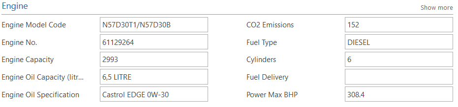
* Removed Zero value invoices from external accountancy export.
* Added ability to refresh MOT data from MOT Notification bar in the Jobsheet. 
* Added SMS and Email preview functionality to customer notification setup (Reminders) 
[View our video guide for Customer Notifications here](https://youtu.be/Bds8JQgDQN4 "How to Setup Customer Notifications in Garage Hive").
* Added Labour No. to Web Services for Power BI and Reporting features.

### 27th February 2019
 [What's New in Garage Hive - Feb '19 Roundup](https://youtu.be/YootXcNrezM "What's New in Garage Hive - Feb '19 Roundup")

* Added ability to automatically clock out users at the end of day at a specified time.
* Extended SMS templates, added additional functionality.
* Improved SMS functionality, added "click to call" and "click to SMS" features to Jobsheets, VHCs & Estimates.
* Added extra fields to the "Brake Section" of a vehicle card. 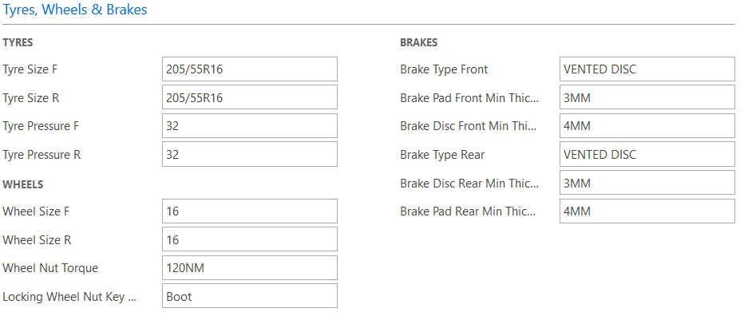
* Added a "Schedule of Work" document, allowing users to print a non financial document for Fleet Companies.
* Improved customer address layout for Invoices and Statements.
* Bug fix - Corrected Credit Memo number missing from the end of day report.
* Added ability to create work description templates. 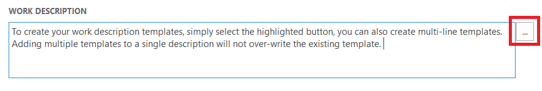
* Created a warning for vehicles with VRM integrity issues, allowing users to override data import.

### 17th February 2019

* Bug fix - Corrected an issue that wasn't recording break times correctly in time registration entries.
* Added the option of displaying the bill-to-customer or sell-to-customer on an invoice.
* Added customer account numbers to customer statements.
* Added "Vehicle staying overnight" feature, allowing Service Advisors to mark vehicles as staying over night - populating a tile on the technicians devices.
* Added key tags to "vehicles staying overnight" list.
* Added ability to export Purchase, sales and payment ledgers to Sage 50.
* Promoted vehicle card access to jobsheet homepage.
* Added vehicle registration number to WIP report.
* Added additional features to jobsheet booking template.
* Added optional "Awaiting Authorisation" tile to Service Advisors role centre.
* Added Service Type column to posted jobsheet. 
* Enhanced the ability to modify Resource Time Registration Entries, added ability to modify start time aswell as total time spent.
* Added optional "Awaiting Parts" tile to Service Advisors role centre. 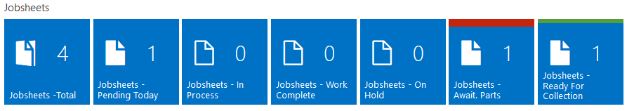

### 31st January 2019
[What's New in Garage Hive - Jan '19 Roundup Part II - Video](https://youtu.be/W0Xpttp1L7Q "What's New in Garage Hive - Jan '19 Roundup Part II")

* Update to the TCard system, now works in conjunction with the schedule and can be updated from the header of a jobsheet. You can also update the status of the TCard/Jobsheet by dragging the job on the TCard system. 
* Email/SMS reminders for booking date reminders now active in the system. 
* Technician confirmed button now automatically assigns the labour allocation to the resource(technician) that ticks the button. 
* Bug fix - Schedule popup now works permanently .
* Added access to the VHC from the vehicle inspection.
* Schedule search has been added, search via registration, customer name, job number, key number or make & model. 
* Added a warning when a user accidentally tries to post a purchase order with a zero value line.
* Added date, time and user ID stamps to comments.
* MOT History can now be accessed from a technicians device.
* Added a popup warning to tell the user when the vehicle has an expired MOT or is expiring soon. 
* Added a new method of purchasing, users can now push parts to a jobsheet even if the purchase order was created independently and not from a jobsheet. 

### 15th January 2019

* Email notifications now available for users to receive upon completion of a vehicle inspection.
* Added Tyre pressures, oil spec, oil capacity and more to the vehicle card.
* Improved access to the vehicle card from the technicians devices, including short cuts to engine details and tyres, wheels & brakes.
* Added the ability to adjust the default quantity of an item added to a jobsheet.
* Added the ability to adjust the time registration entries of technicians, correcting incorrect clocking information for work times, idle times, jobsheet times & break time.
* Improved the service ledger entries, renamed to vehicle history & added the ability to recall previous jobsheets based on the service ledger entries.
* Added the ability for technicians to access the vehicle history from their jobsheet and added the ability for technicians to search the history.
* Added the ability to access the jobsheet from a related open purchase order, as well as the ability to open an associated jobsheet from a posted purchase invoice.
* Adding additional parts to an open purchase order will now ask if you also want to add the new parts to the associated jobsheet .