# What's new?
The following is a list of all new Garage Hive features and updates:

### 7th June 2024
* Added the **Search Vehicle By Engine Code (Autodata)** feature in the documents (Jobsheet, Service Estimate, and Vehicle Inspection Estimates), [read more](garagehive-autodata-checking-servicing-intervals-and-adding-repair-times-using-engine-code.html#auto-selection-of-vehicle-service-schedules-and-repair-times-using-engine-code-from-autodata){:target="_blank"}.

   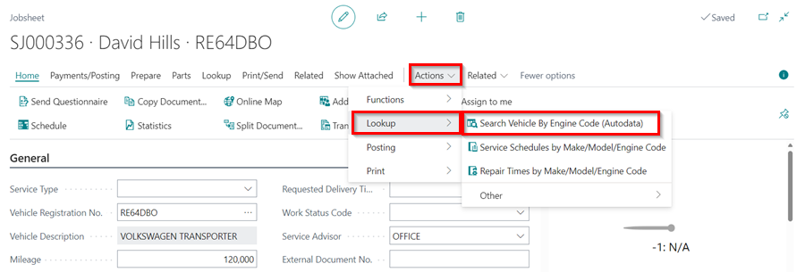

### 30th May 2024
* Added limitations and restrictions for the **Change Accountancy Setup** slider in the user card. If a user's **Change Accountancy Setup** slider is enabled, they can change:
   - General Ledger Setup
   - General Posting Setup
   - VAT Posting Setup
   - Inventory Posting Setup
   - Gen. Business Posting Group
   - Gen. Product Posting Group
   - VAT Business Posting Group
   - VAT Product Posting Group
   - Customer Posting Group
   - Vendor Posting Group
   - Inventory Posting Group

      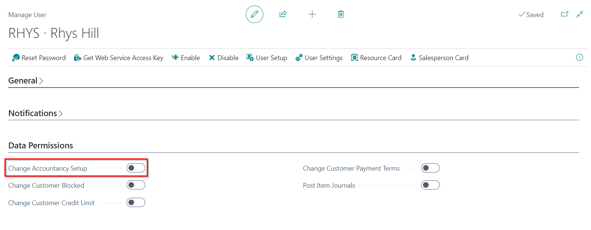

* Added the Resources check before the error page when posting the Jobsheet.

   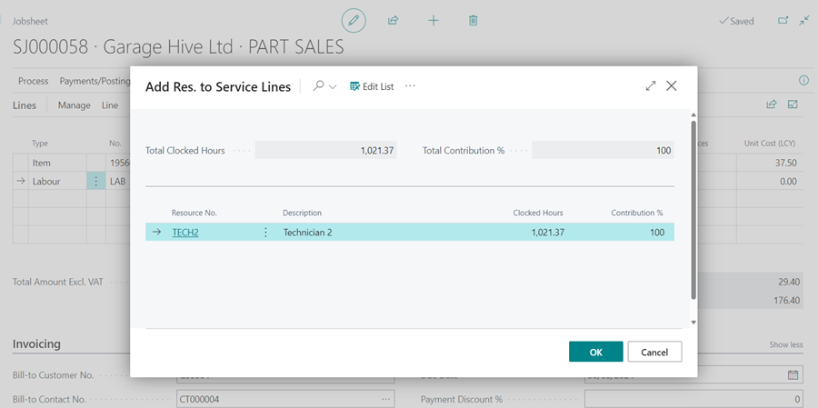

* Improved the **Autodata Timing Belt Lookup** feature.

   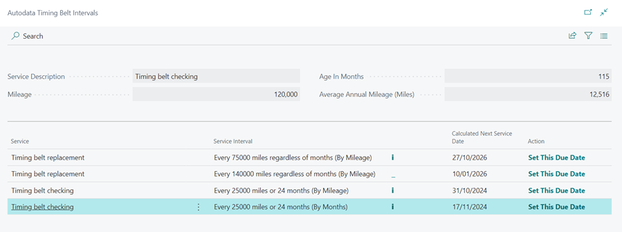

* Created the **Calculated Availability** field for **Line Checker** to show a warning triangle when the calculation of the quantity in the sum below is less than zero.
   
   = “Qty. in stock” - "Qty. in Unposted Jobsheets" - “Qty. in Unposted Sales Docs.” + “Qty in Unposted Sales Credit Memo” + Qty. in Unposted Return Jobs"

     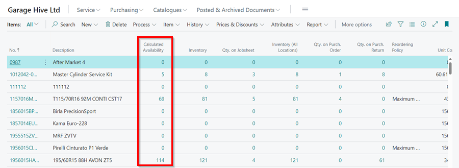

* Added the **Add Related Documents** action to the emailing feature, allowing selection of attachments from other documents when emailing a document.

   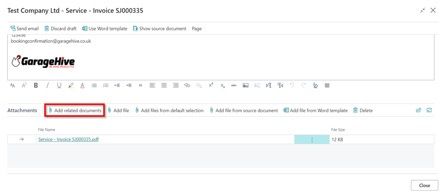

### 15th May 2024
* Added the ability to send out questions to customers prior to their visit, in order to collect more information about the job in advance, [read more](garagehive-diagnostic-questionnaire.html){:target="_blank"}.

   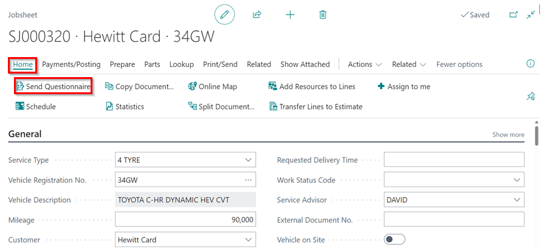

* Added a slider to the schedule header called **Fully Booked**, which, when enabled, prevents new allocations and greys out the diary, [read more](garagehive-understanding-the-schedule.html#block-days-from-booking-in-the-schedule){:target="_blank"}.

   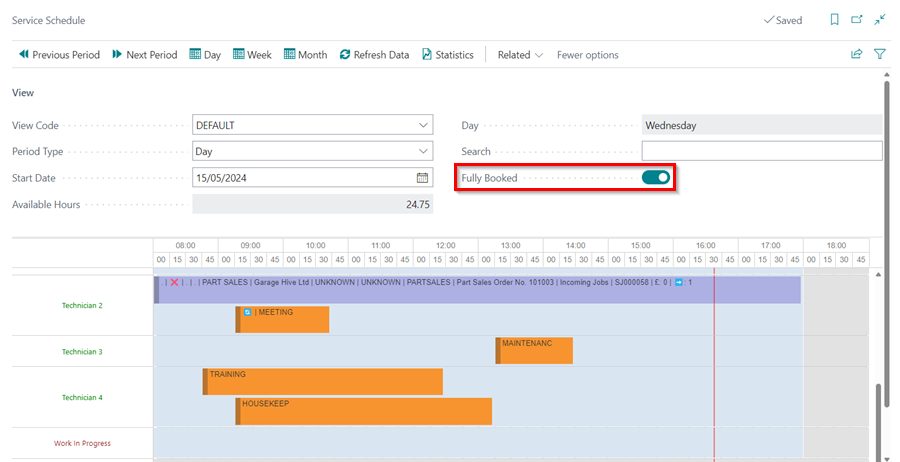

### 18th April 2024
* Added actionable stacked error messages when posting a Jobsheet, minimising the number of clicks required before successfully posting it.

   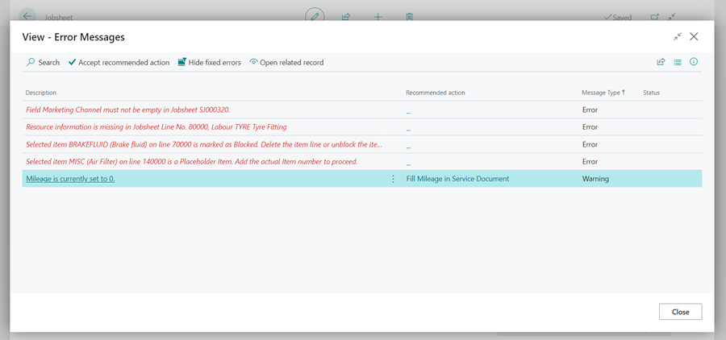

### 5th April 2024
* Added support for multi-location businesses using Sage Accounting.
* Added barcode column to import feature for catalogue items with prices, [read more](garagehive-import-catalogue-items-with-prices.html){:target="_blank"}.

   

### 21st February 2024
* Added a column that shows the number of scheduled allocations that are in progress or pending. This feature allows users to easily identify Jobsheets with multiple ongoing tasks, [read more](garagehive-understanding-the-schedule.html#how-to-add-schedule-allocations-count){:target="_blank"}.

   

### 9th February 2024
* Added the vehicle location code to the **Reminded Not Booked** table and modified the filter to consider the location. This allows for filtering the **Reminded Not Booked** notifications based on location.
* Added the ability of **Vehicle Date Reminders** to incorporate location codes from the vehicle card. This enables reminders to be sent based on the specific location code assigned to the vehicle.
* Added the line checker triangle warning (⚠️) to include information when an item is being listed more than once on the same document, [read more](garagehive-line-checker.html){:target="_blank"}.

   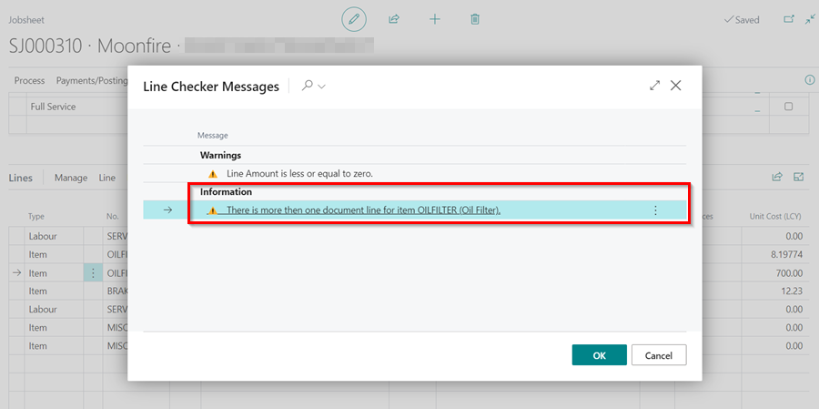

* Added Integration with **QuickBooks Online API** to enable syncing of data to and from Quickbooks, [read more](garagehive-quickbooks-online-integration.html){:target="_blank"}.

   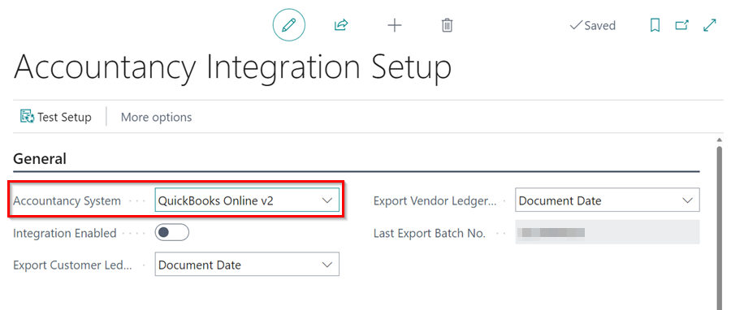

### 30th January 2024
* Added a default branch code for vehicle cards, so that the location specific vehicle reminders can be sent, [read more](garagehive-vehicle-card.html#adding-a-default-location-code-to-vehicle-card){:target="_blank"}.
* Added the capability to include videos from external platforms, such as YouTube and Service Visuals into the online job authorisation, [read more](garagehive-online-documents-adding-and-managing-media.html#adding-media-to-group-lines-and-document-lines){:target="_blank"}.

   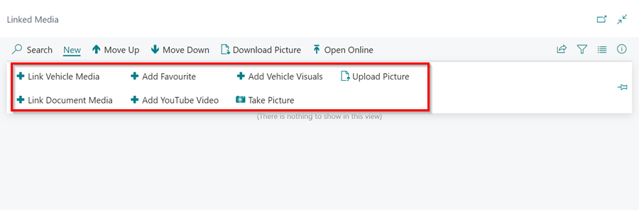

* Added **Reminded Not Booked** tiles which shows a list of reminders sent to customers who have not yet booked. This feature helps you keep track of which customers require follow-up action regarding their booking, [read more](garagehive-reminded-not-booked-setup.html){:target="_blank"}.

   

### 19th January 2024
* Added the ability for the customers to mark their vehicle as sold from a reminder notification to stop receiving further reminders, [read more](garagehive-remove-customer-ownership-from-vehicle.html#using-the-customer-opt-out-link-in-the-reminder-message){:target="_blank"}.

   

### 20th December 2023
* Added the ability to rank customers based on your interactions with them at the garage; for example, you may rank a customer according to their past purchasing behaviours, [read more](garagehive-customer-ranking.html){:target="_blank"}.

   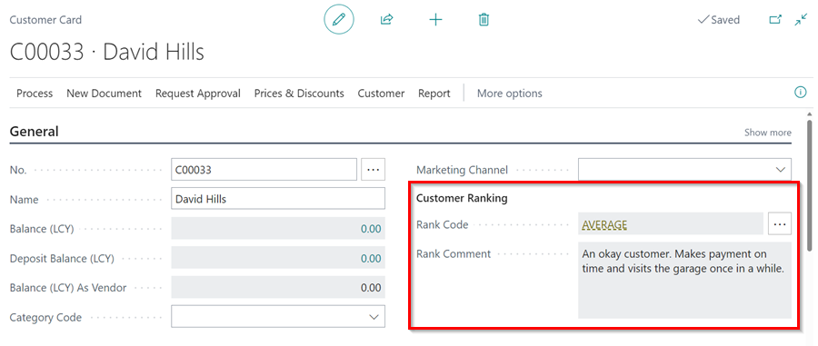

* Added emojis as a prefix to system generated comments that appear in the **Attention** tile to help you understand and prioritise them, [read more](garagehive-system-created-comments-for-attention.html){:target="_blank"}.

   

### 16th November 2023
* The schedule now includes the ability to add recurring **Standard Events**. For example, you can now easily schedule a daily, weekly, or monthly training session for any of your resources, [read more](garagehive-recurring-events.html){:target="_blank"}.

   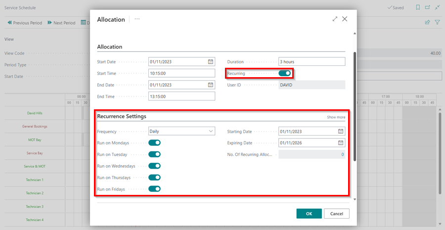

### 27th October 2023
* Added the **Castrol Integration** with Garage Hive, which enables you to view oil types and capacities for the vehicle in a service document, [read more](garagehive-castrol-lookup.html){:target="_blank"}. This feature was first announced at **The Blend 2023**.

   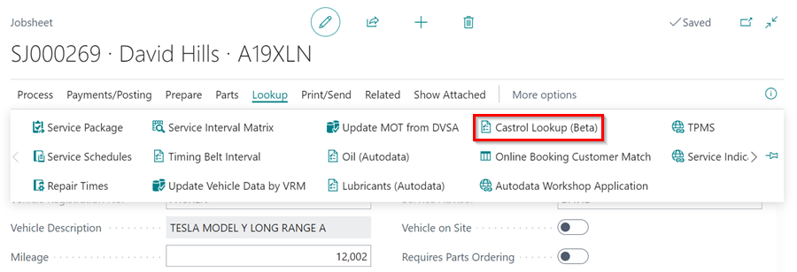

* Added the **Partslink24 Integration** with Garage Hive, which enables you to search for parts in the Partslink24 portal using the vehicle's VIN, and order from authorised dealers, [read more](garagehive-partslink24-integration.html){:target="_blank"}. This feature was first announced at **The Blend 2023**.

   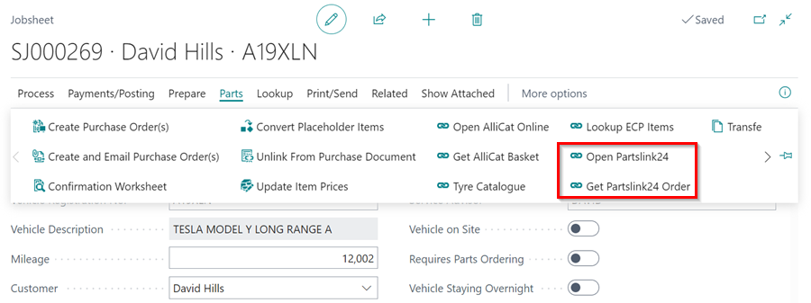

### 3rd October 2023
* Added **MOT and Service** date check before posting a Jobsheet and when transitioning work status (by setup), [read more](garagehive-customising-vehicle-reminder-dates.html#adding-mot-and-service-dates-to-be-checked-when-posting-a-job){:target="_blank"}.

   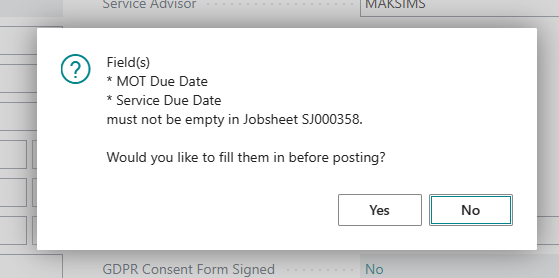

### 27th October 2023
* Added the Micheldever Integration with Garage Hive, which enables you to search for and add items from the Micheldever catalogue and place an online order with Micheldever, [read more](garagehive-micheldever-integration.html){:target="_blank"}.

   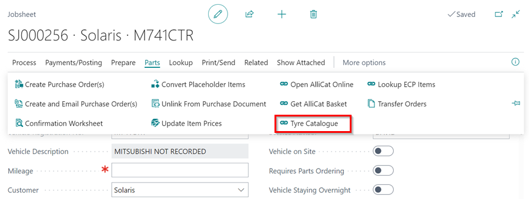

### 21st October 2023
* Made it possible to personalise the [new item lookup](/docs/garagehive-item-lookup-and-advanced-tyre-lookup.html#item-lookup){:target="_blank"} function to include the **Search Description** field.

   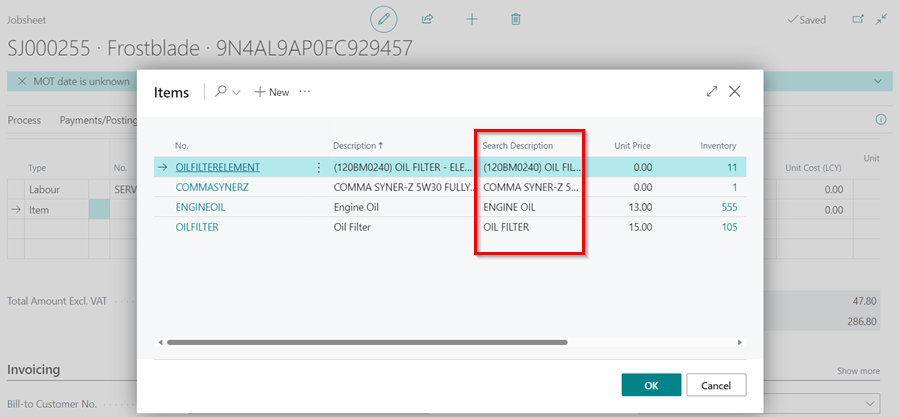

* Added the option to price up tyres by tyre manufacturer code using **Tyre Manufacturer Price Groups**, which link the tyre manufacturers to **Item Price Groups**, [read more](/docs/garagehive-tyre-manufacturer-price-groups.html){:target="_blank"}.

   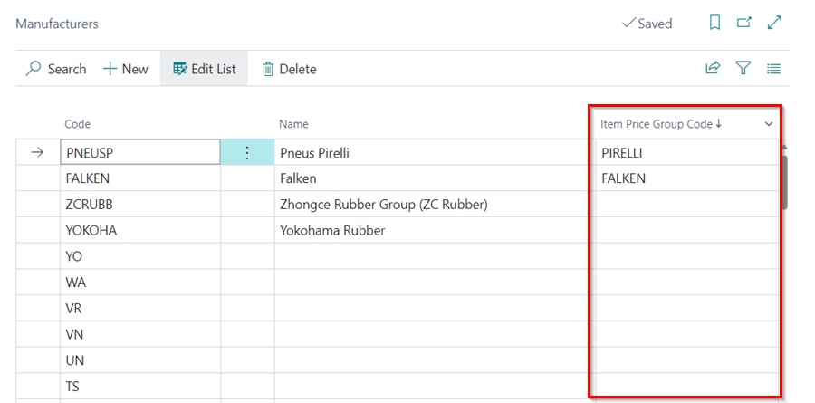

### 31st August 2023
* Added actions that open up the **Time Grids** and **Service Hours** in the Service Schedule page.

   

* Bank statement imports now include the **Monzo Bank Import** functionality, [read more](/docs/garagehive-payment-reconciliation-journals.html){:target="_blank"}.

   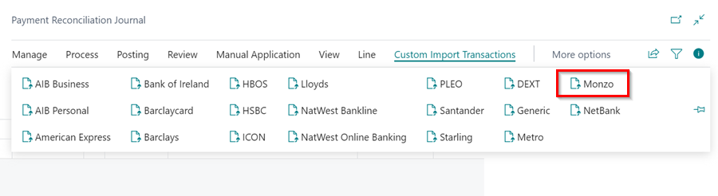

### 26th July 2023
* The report **Reminded Not Booked**, which allows you to view the **Booking Reminders** that have been sent but not booked, is now available for all **Service Types**. It previously only worked with the **MOT** service type, [read more](garagehive-reminders-sent-not-booked-report.html){:target="_blank"}.

   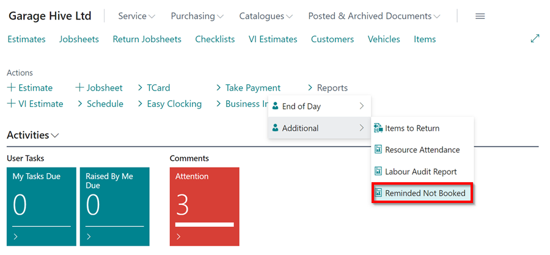

* Added the **Vehicle Card**, **Engine Details**, and **Tyres, Wheels, & Brakes** Details buttons to the Checklist Card from within a Jobsheet on a technician tablet for easy clocking.

   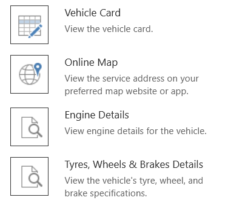

* Created the ability to attach a sales pitch to a service package via the **Sales Extended Description**, the ability to display a separate extended description via the **Extended Description (Work Description),** and the ability to explain why the quoted work needs to be done and what is included in **Estimates** and **VIE's** via the **Online Booking (OB) Extended Description**, [read more](garagehive-extended-descriptions.html){:target="_blank"}.

   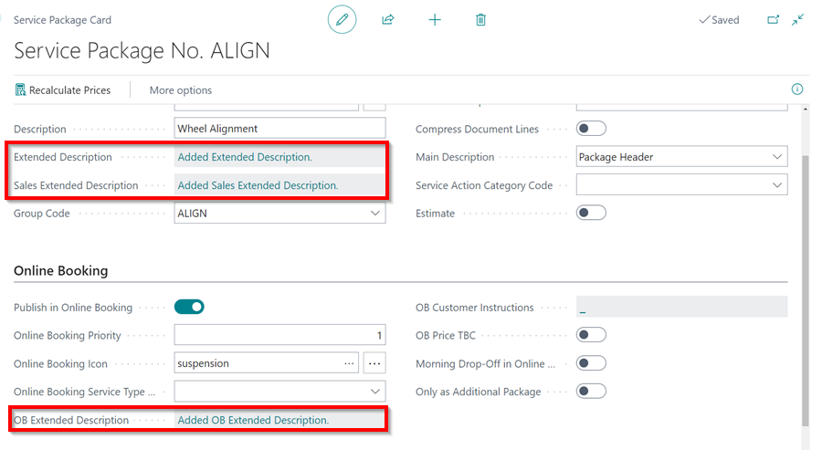

* Added the **External System No.** to **Customer Templates**, allowing the use of a common customer number in an external accounting system. If a customer template has an external system number, it does not use the number series from the accounting system.

   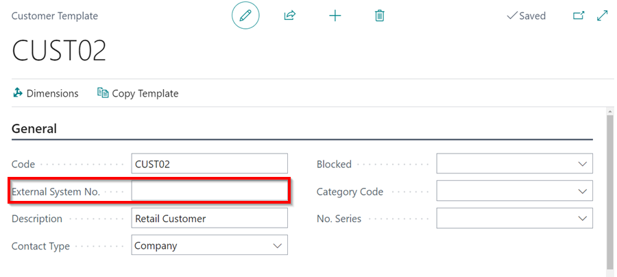

### 14th June 2023
* Added the **Tyre Catalogue** button on the homepage, allowing you to view the tyres available in the local inventory and from suppliers' catalogues, [read more](garagehive-item-lookup-and-advanced-tyre-lookup.html#tyre-catalogue-lookup){:target="_blank"}.

   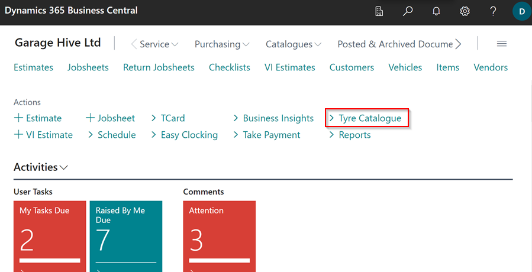

* Added the ability to add an **Attention** comment, when a customer opens an **Online Authorisation Document** for the first time.
* **Online Authorisation** has been made optional for published documents, allowing the option of request callback only when the document is published online, [read more](garagehive-online-documents-previewing-and-publishing-online-documents.html){:target="_blank"}.

   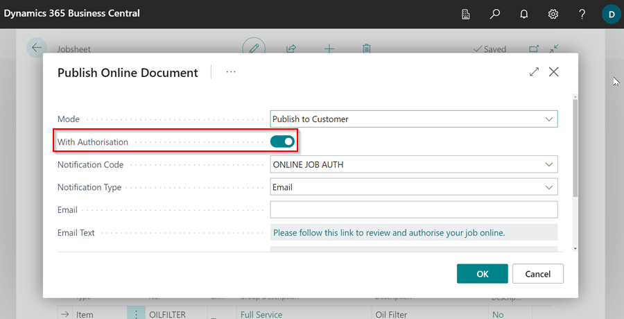

* Added the LKQ Euro Car Parts (ECP) Integration with Garage Hive, which enables you to search for and add items from the LKQ ECP catalogue and place an order with LKQ ECP, [read more](garagehive-ecp-integration.html){:target="_blank"}.

   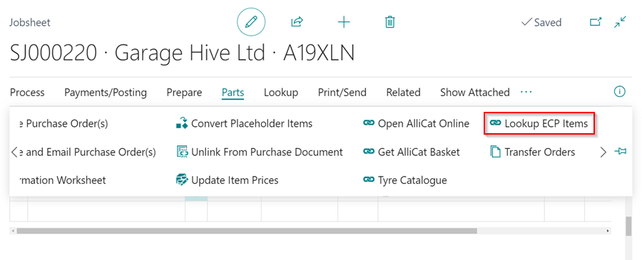

### 31st May 2023
* Released **Version 59 (V59) of PowerBI** with the following changes and refinements:
   - Added the ability to view Garage Industry Trends data within the Power BI App (Only for opted in garages).
   - Labour Audit Report: Added the ability to see count of particular labour types, across document numbers and resources, for auditing purposes.
   - Vehicle Type Analysis.
   - Online Estimate Analysis.
   - GP Potential Business Target Report.
   - Labour Sales / Hours Sold Business Target Report.
   - Added Average Hours Sold & Average Hours Per Job to Monthly/Weekly Analysis.
   - Added hours gained/hours lost to summary reports.
   - Added "this month/last month" to Auto IQ report.
   - Added GP Per hour to Jobsheet Analysis.
   - Added search box to deleted Jobsheet Analysis.
   - Added vehicle type filter & fuel type filter to service type report.
   - Improved refresh speed of reports.

To update your PowerBI App, [follow this link](powerbi-updating-app.html){:target="_blank"}

### 26th May 2023
* Added a new approach to tyre ordering, by introducing **Tyre Stock Groups**. With this feature, you can conveniently create and manage various tyre groups available in the market, allowing you to effectively organize your tyre inventory based on these groups.

   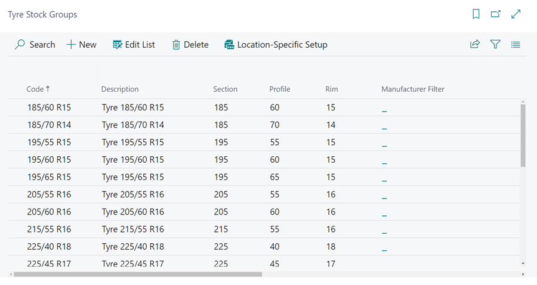

### 25th May 2023
* Added **Metro Bank** import for the fields **Transaction Date**, **Transaction Text**, **Description**, and **Transaction Amount**. 

### 22nd May 2023
* Added **Attention Comment** creation to a **Sales Order** when a successful eCommerce payment is made, just like it is on a Jobsheet.
* Added a new **Service Recharge Type** field within the **Customer Card** with the options of **Item**, **G/L Account**, and **Item Charge** to support the use of **Non-inventory** items. For instance, the Service department can invoice the Body Shop department for interdepartmental work using the **Item** option, eliminating the reliance on **General Ledger (G/L)** Accounts and improve on business reporting.

   

### 9th May 2023
* Added the ability to access Jobsheet, Posted Jobsheet, Estimate, VI, and VI Estimate from the **Vehicle Sales Order** FactBox.

   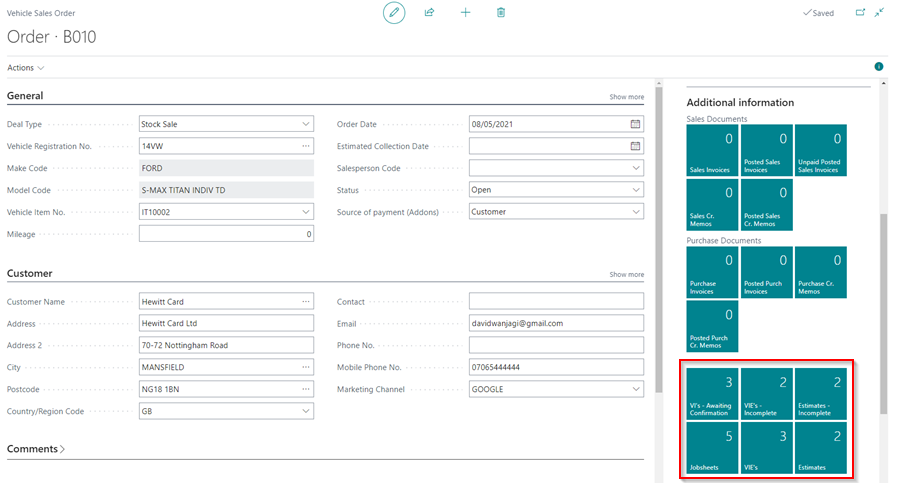

* Replaced the dropdown item/labour lookup in document with a popup window when a keyword of the item is typed. For example, if you type MOT and press the tab or enter key, all items with the word MOT will appear in the popup window.

   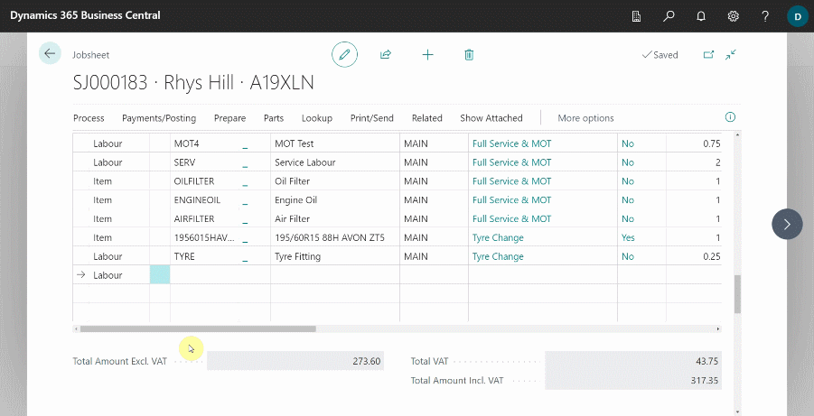

### 25th April 2023
* Enhanced the **Line Checker** column, so that it shows errors and warnings with several icons. To understand more about the icons, [read more](garagehive-line-checker.html){:target="_blank"}.

   

### 19th April 2023
* Added the ability to take a deposit from a document, such as a Jobsheet, Sales Order, or Sales Invoice, by using the **Take Deposit** action, which is located next to the **Take Payment** action, [read more](take-payment-deposit.html#how-to-take-a-deposit-in-a-document){:target="_blank"}.

   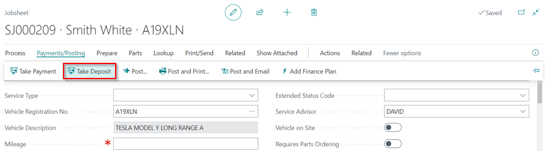

* Added the **Post Items Journals** slider to the **Data Permissions** FastTab in the **User Management** card, which when enabled prevents the user from posting the **Item Journals**, **Physical Inventory Journals**, **Item Reclassification Journals**, and **Item Revaluation Journals**. [Read more](garagehive-user-management.html#enabling-data-permissions-for-a-user){:target="_blank"}.

   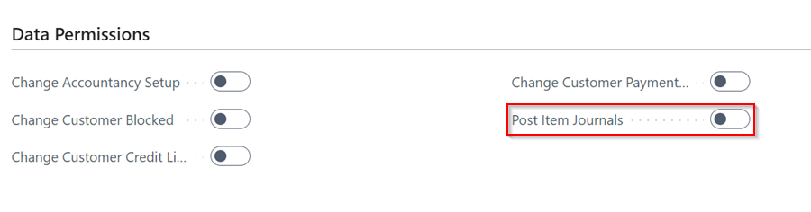

* Added the ability to compose an email directly from the service document when the **ellipsis (...)** at the end of the **Email Address** field is clicked. This enables users to easily compose an email by simply clicking on the ellipsis, which opens up a **Compose an Email** page with the email address automatically filled in the "To" field.

   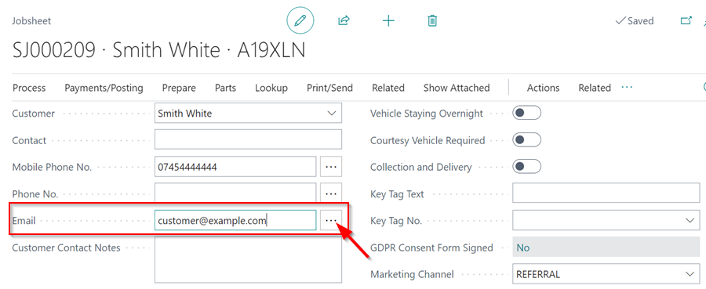

* Added the ability to add comments linked to the **Customer/Vehicle** card when creating a document and adding the customer or the vehicle to the document, so that it appears in the document's **Comments** FastTab, [read more](garagehive-comments-extended.html#adding-comments-in-a-card){:target="_blank"}.

   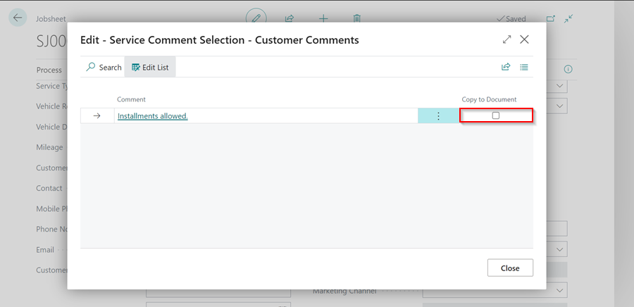

### 5th April 2023
* Added **Vehicle Sales Preparation Workflow**, which helps in tracking the progress of vehicles on sale through the use of **Vehicle Preparation Orders**.

   

* Added the ability to use Location specific Company Information, including logo, in the following places:
    - **Purchase Orders** and **Purchase Return Orders**.
    - **VI/Print Faults** & **Actions Printouts**.
    - When **sending document emails** i.e. Invoices/Proformas/Estimates/VIE.

### 20th March 2023
* Added a **Create and Email Purchase Order(s)** action within the Jobsheet where a Service Advisor can create and email the Purchase Order to the Vendor, [read more](garagehive-create-a-purchase-order.html#create-and-email-the-purchase-order-from-a-jobsheet){:target="_blank"}.

   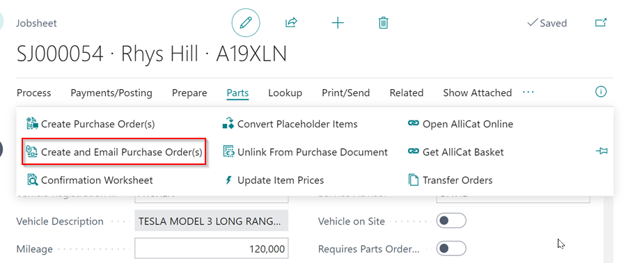

### 12th March 2023
* Added a column called **Item Card Unit Price** in Purchase Orders to the left of Sales Doc. Unit Price column, that shows the value of the unit price field in the item card and it's not editable.

   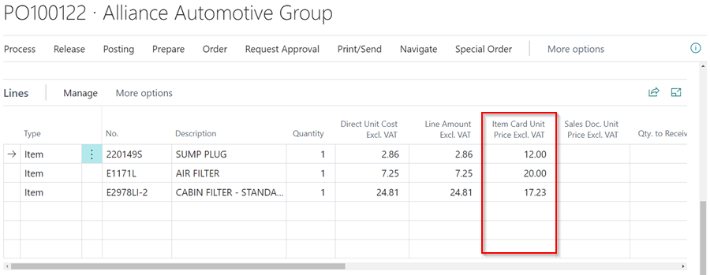

* Added the ability to select which **Comments** to copy from **VIEs or Estimates** when using the **Copy Authorised Lines to Jobsheet** feature.
* Added vehicle **Colour** to **Extended Description** for **Vehicle Sales Invoices**.

   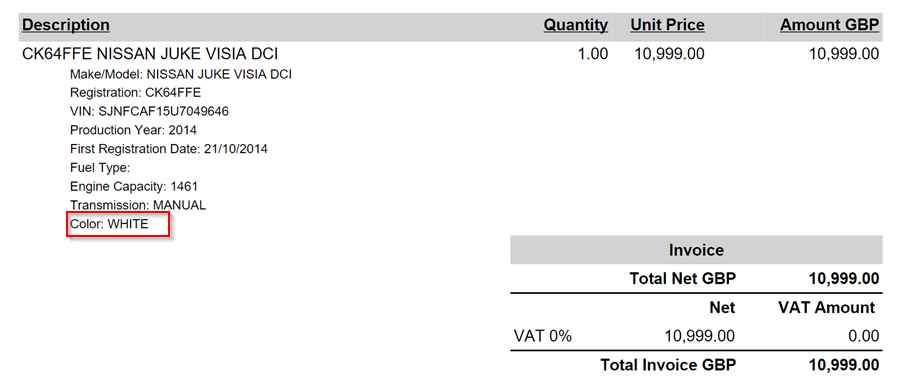

### 2nd March 2023
* **MOT Data Trends** have been added to the **Garage Industry Trends** website. MOT Data Trends is a comprehensive set of reports that analyses 200 million lines of data over three years for MOT failures and item failures by make, model, year, fuel type, item failure, region, and much more. [MOT Data Trends](https://www.garageindustrytrends.com/mot){:target="_blank"} webpage has been added to the Garage Industry Trends website, which demonstrates some of the reports and is mobile-friendly. If you are on a desktop/laptop you can click on [this link](https://app.powerbi.com/view?r=eyJrIjoiMjM5NDRiMWItNzQ4MS00N2U1LWJhMzUtYTMwMjEzYmE1NTA4IiwidCI6IjFiZGU4OWFkLWI0Y2UtNDVkZi1hOTE5LWUxZTA4ZTQ3Mjk0ZCIsImMiOjh9&fbclid=IwAR2jWj9P0ctEUWa46lIDQlfcLYjzTgWFjwnMksYB9B4IMf6mzBr-tOk2iSE){:target="_blank"} to skip directly to the Power BI reports.

   

### 20th February 2023
* **MOT History** view refinements: all MOT failures and advisories are now grouped together and sorted by type.
* The Role Centre now has a **Support Menu** that provides users with a link to the docs site, a link to send a question directly to the support team, and a link to record an issue via screen record or audio.

   

* **Standard Events** are now excluded from the schedule's available hours. This now allows the user to see the actual time that is available for booking.

### 6th February 2023
* Added the **Begins With** filter to **Engine Model Codes** Service Package conditions, which filters out certain engine codes that begin with the specified code, [read more](service-package-conditions.html){:target="_blank"}.
* Added the ability to set the vehicle's age service package condition based on the vehicle's first registration date rather than the production year, [read more](service-package-conditions.html){:target="_blank"}.

### 23rd January 2023
* Garage Hive now includes the **Access PaySuite** integration, which is an online payment service that helps make the payment process more efficient and faster, [read more](garagehive-setting-up-payment-by-glink-access-paysuite.html){:target="_blank"}.
* Added **EV Components** in vehicle cards, such as **EV Type** and **EV Battery Size**.

   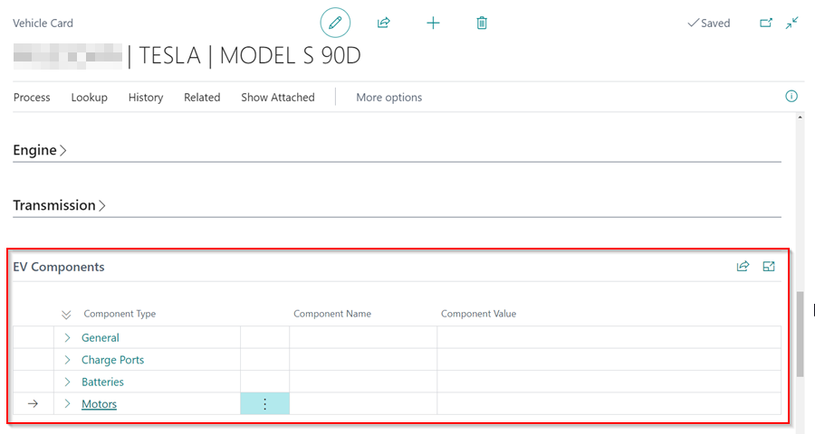

*  Added **Euro Status** to vehicle card and factbox.

### 16th January 2023
* Added the ability to automatically block customers who have exceeded their credit limit, [read more](garagehive-automatically-block-customers-who-have-exceeded-their-credit-limit.html){:target="_blank"}.
* The **System Administrator** can now manage a user's **Data Permissions** in the **Manage User** card.

   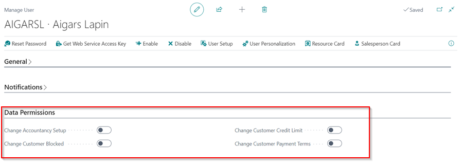

### 11th January 2023
* Added the ability to **Get a Standalone Page URL** for online booking, [read more](https://docs.garagehive.co.uk/docs/garagehive-onlinebooking-setup.html#get-standalone-page-url){:target="_blank"}. The **Standalone Page URL** is suitable for businesses that do not have a website to which to add an **Embed HTML** tag.

   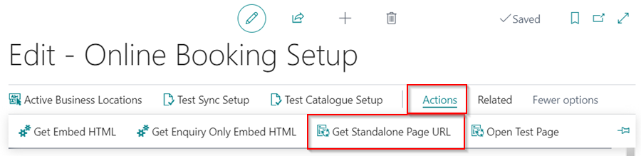

* For accounting, we created the **Sage Accounting API** integration, [read more](https://docs.garagehive.co.uk/docs/garagehive-sage-accounting-integration.html){:target="_blank"}.
* Added **Humm Integration**, which is a service that allows the customer to buy now and pay later, [read more](https://docs.garagehive.co.uk/docs/garagehive-humm-financing.html){:target="_blank"}.
* Added the ability to directly access the vehicle's **TPMS/Wheel Nut Torque**, [read more](https://docs.garagehive.co.uk/docs/garagehive-autodata-tpms.html), and **Service Indicator** reset data, [read more](https://docs.garagehive.co.uk/docs/garagehive-autodata-service-indicators.html), from a service document.

   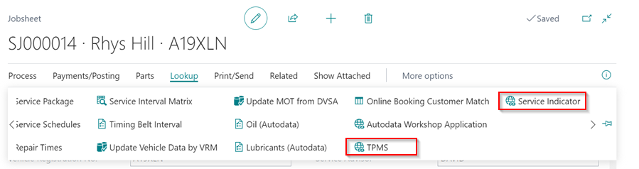

### 16th November 2022
* All service documents now include the ability to add pre-defined comments, [read more](https://docs.garagehive.co.uk/docs/garagehive-comments-extended.html#adding-predefined-jobsheet-comments){:target="_blank"}.

### 7th November 2022
* We made the red and amber blocks open by default within online authorisation, as requested at **The Blend 2022**. This helps to avoid customers missing the advisories.
* Added the **Create Estimate** slider in service packages, for online enquiries, [read more](https://docs.garagehive.co.uk/docs/garagehive-onlinebooking-service-packages.html#setting-up-online-enquiries){:target="_blank"}.

### 24th October 2022
* From the **User Management** page, you can now send a request to Garage Hive support for a licence change.

   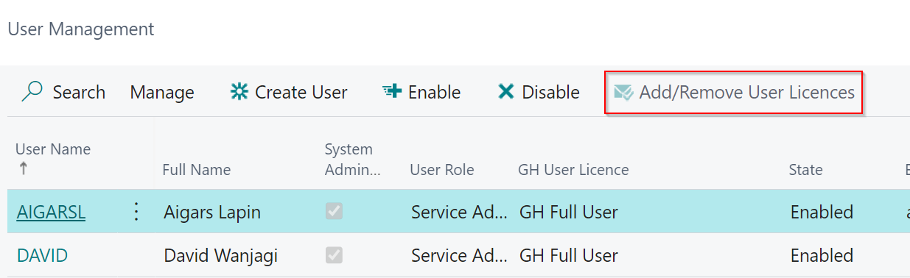

### 11th  October 2022
* Added the **Checklist** page action to vehicle sales admin role centre by default.
* Added the **request call back** function to online checklists.
* As requested at **The Blend 2022**, we made the **Time Log Entries** page accessible from documents operationally.
* As requested at **The Blend 2022**, we added the **Sent-to Emails** column in the **Sent Emails** page.

### 19th September 2022
* Added **Tyre Scanner** integration which enables the Garage Hive System to receive data from the tyre scanner devices and add it to the checklist, [read more](https://docs.garagehive.co.uk/docs/garagehive-tyre-scanner-integration.html){:target="_blank"}.
* Added the ability to follow-up with the customer for a review in **Customer Surveys** for the customer who rate the garage services with the defined NPS score, [read more](https://docs.garagehive.co.uk/docs/garagehive-adding-external-review-follow-up.html){:target="_blank"}.

   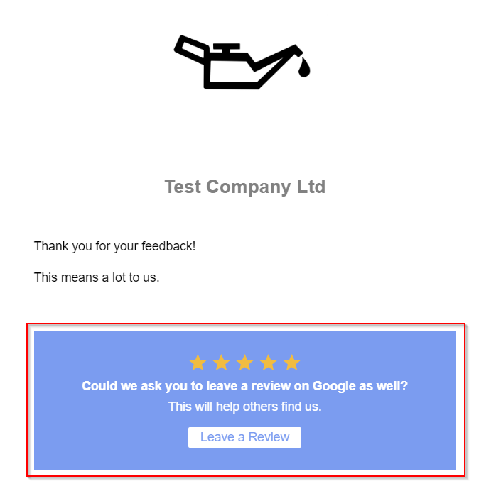

* Added an opt-in service for garages that allows them to anonymously share their data and view the **Garage Industry Trends** based on data shared by other garages who have opted in for the service. The data is based on the KPIs **Average Future Bookings**, **Average Invoice Value**, **Labour Rate**, and **NPS score**, [read more](https://docs.garagehive.co.uk/docs/garagehive-garage-industry-trends.html){:target="_blank"}.

   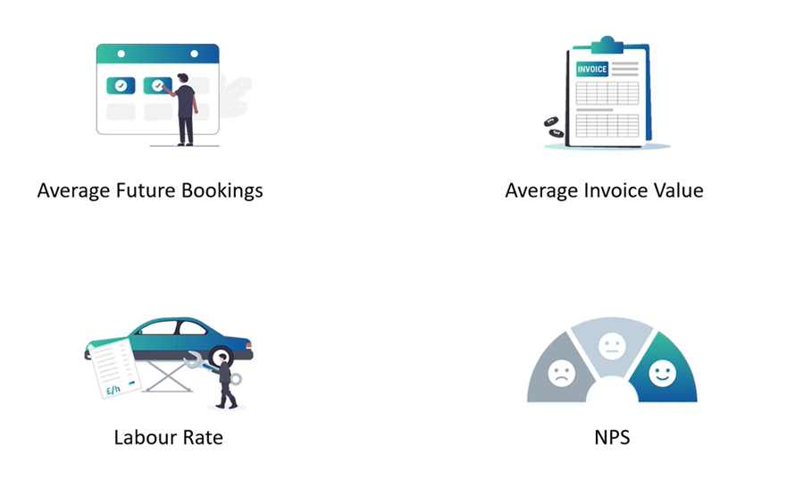

* Added the ability to automatically add pre-defined comments to jobs when using service types or service packages, [read more](https://docs.garagehive.co.uk/docs/garagehive-comments-extended.html#adding-predefined-jobsheet-comments){:target="_blank"}.

### 16th September 2022
* Power BI Changes:
      - Added Published online % to VIE Estimate Analysis.
      - Added Average VIE Value to Monthly/Weekly Analysis Reports.
      - Added a worktime data filter to the WIP report.
      - All reports now sort by descending date.
      - Added GP Per Hour to Service Type report.

* Power BI New Reports:
    - Customer / Vehicle Count - This report displays the ratio of customers/vehicles to posted Jobsheets.
    - Deleted Jobsheet Analysis - This report displays how many Jobsheets are deleted each month by Reason, Service Type and Advisor. 
    - Vehicle On-Site Time Analysis - This report displays the average time a vehicle is on-site by Location and Service Advisors. 
    - VI-E Time Log Analysis - This report displays the time taken to process a Vehicle Inspection Estimate and the time taken during each status. 
    - Tyre Scans - This report displays the number of Tyre scans, average tread depth, count of urgent and advisory tyres and recommended alignments. 
    - GP Targets - This set of reports displays your accumulated Gross Profit for the defined period against your Gross Profit Target. 

### 14th September 2022
* When you open a vehicle's **MOT History**, you'll see a notification that tells you when it was last updated and gives you the option of updating.

   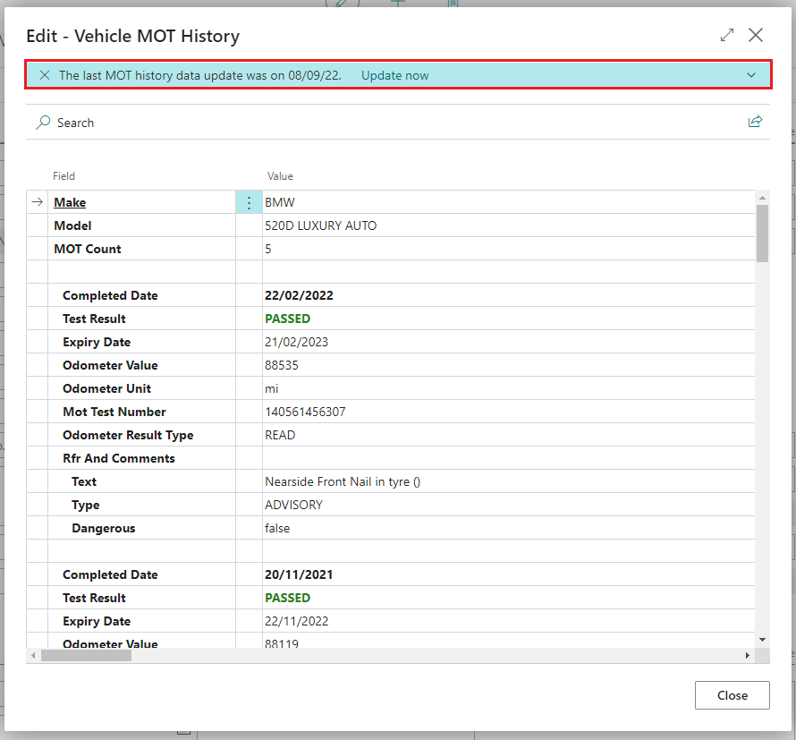

### 15th August 2022
* Added the **Workshop Application** (Autodata) to the Checklist to help technicians in looking up timing belt intervals, minimum brake specifications, and so on.

### 29th July 2022
* Added linking of locations as Xero's tracking categories, to enable exports into Xero to be split for different branches/locations.

### 19th July 2022
* Added **Autodata Workshop Application** action to the Role Centre under the **Service** menu.

   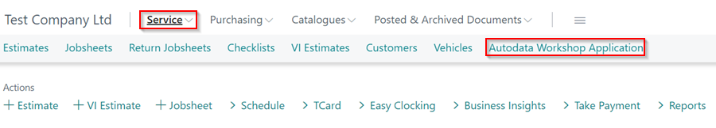

### 4th July 2022
* Added the [Requisition Worksheet Express](garagehive-requisition-worksheet-items-to-order.html){:target="_blank"} tile to the role centre and an automatic recalculation of what needs to be ordered each day.

   
  
### 30th June 2022
* Payment methods and balance due have been added to print layouts, which helps in knowing how the customer has paid and the balance due.
* Added **Reason Code** for deleted jobsheets; when [deleting a Jobsheet](garagehive-create-a-jobsheet.html#setup-for-jobsheet-deletion-reasons){:target="_blank"}, you can now specify the reason for the deletion.

   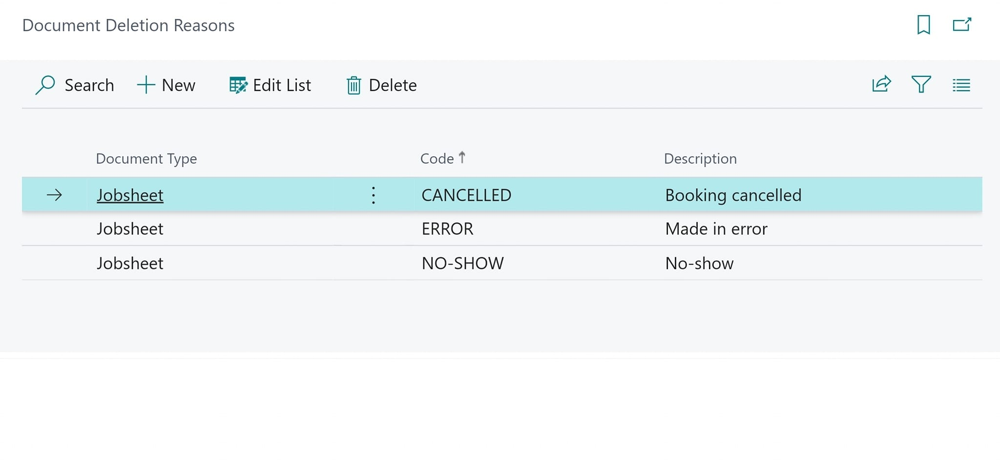

### 17th June 2022
* Improvements to sage accountancy integration.

### 6th June 2022
* Added the schedule action in the **Parts Sales Admin** role centre.
* Added the ability to show the original (full price) and the discounted price in an online job authorisation, if there is a discount applied.
* Added the **Unlink From Purchase Document** action in Jobsheet and Sales Order to unlink the purchase order created from the Jobsheet or Sales Order document.

   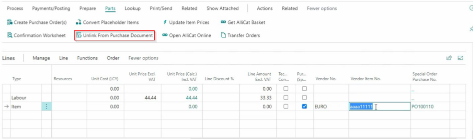

### 2nd June 2022
* Improvements to external accounting exports for vehicle sales invoices. When exporting vehicle sales invoices and credit memos to **Sage 50**, the **Vehicle Reg. No.**, **Make**, and **Model** are included in the description.

### 30th May 2022
* Added the ability to assign user tasks to a group of users; read more [here](garagehive-user-tasks.html){:target="_blank"}.
* Added the ability to set different print layout settings based on document types.

   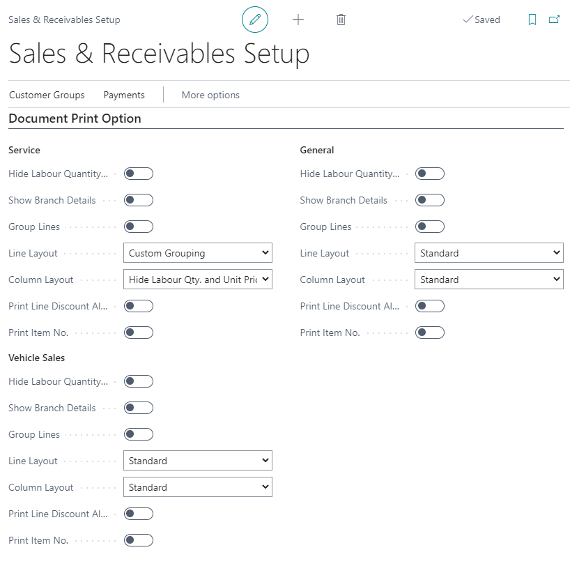

### 19th April 2022
* Added an action in the Jobsheet, Estimate and VI Estimate **Group Items** FastTab, which creates groups based on MOT test lookup data, creates a group for each attention line for one selected MOT test and automatically fills in the description, action category, and dangerous mark.

   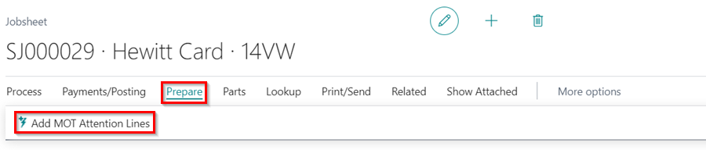

### 7th April 2022
* Added a user-defined Fuel Type Group list.

   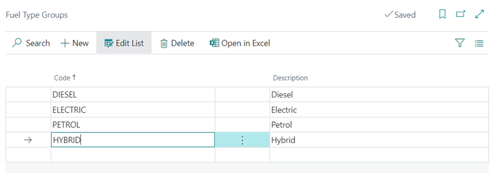

* Added the ability to copy the **VIN** in the factbox, for parts lookup.

   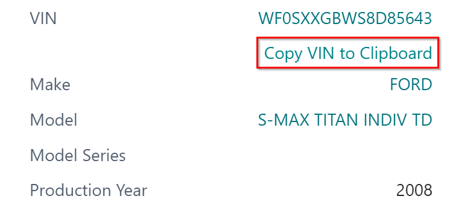

### 25th March 2022
* Added a **Create Alternative** action Within the **Group Item** subpage, read more [here](garagehive-group-items-working-with-group-items-actions.html){:target="_blank"}.

   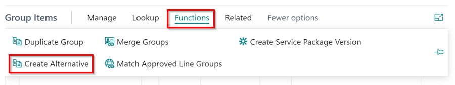

### 23rd March 2022
* eCommerce Garage Link location details are now specific, where if the Sales & Receivables Setup **Show Branch Details** is enabled, it takes the company logo, trading name, and phone number from the **Location Card**, and the registered name and registered number from statutory in **Company Information**.

   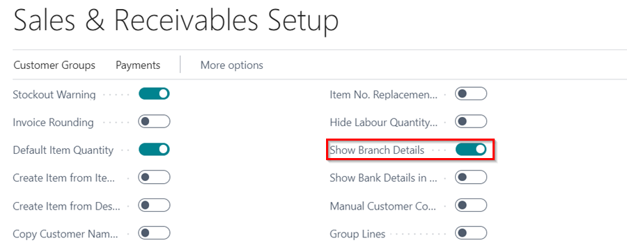

* The **Key Tag No.** field is now available in the header of **Vehicle Inspections(VIs)** and **Vehicle Inspection Estimates(VIEs),** allowing service advisors, technicians, and others to see what bin parts are in and where the keys are.

   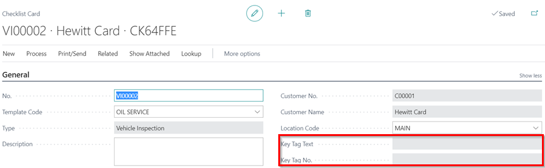

* Added a new emailing feature with rich-text editor that allows you to add text formatting, links, bullet points, and more to improve your emailing experience with customers from the system. Read more [here](garagehive-using-emailing-feature.html){:target="_blank"}.

### 3rd March 2022
* eCommerce Garage Link web layout changes:
    - The logo and company name are displayed at the top, and the company name and registration number are displayed at the bottom.
    - **Terms and Conditions** link added, which hides the text until clicked.

    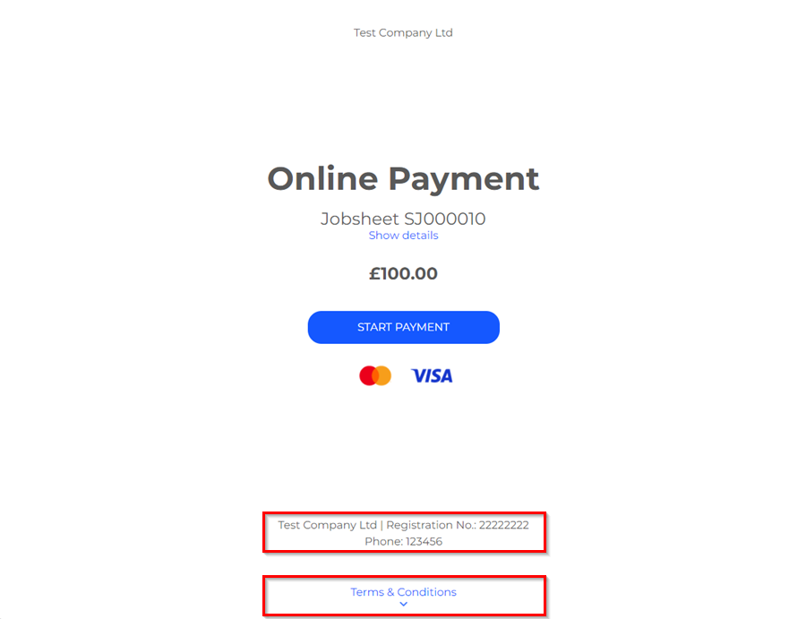

* **Amount Including VAT** column added to Sales Quote, Sales Order, and Sales Invoice lists, as well as the **Calc. Price** column in document lines.

   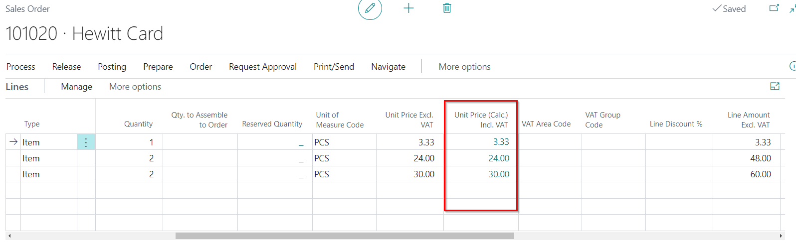

* Created a searchable **Customer Field** within the sales documents.

   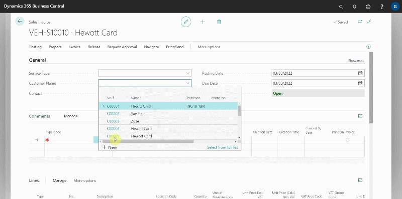

### 22nd February 2022
* Online Job Authorisation Item layout changes, where:
    - The first few lines of the description are now always visible with a "Read More" option to see everything.
    - Group pictures are visible always.
    - Alternative Groups are visible right away.

        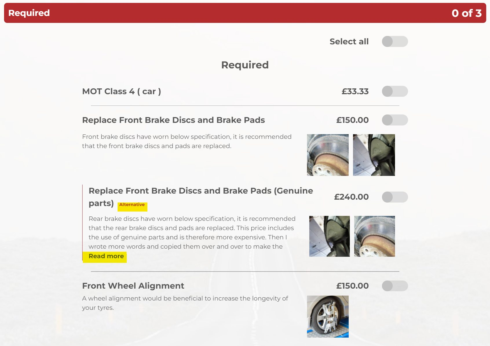

    - On mobile view --OR-- is added to separate alternatives.

        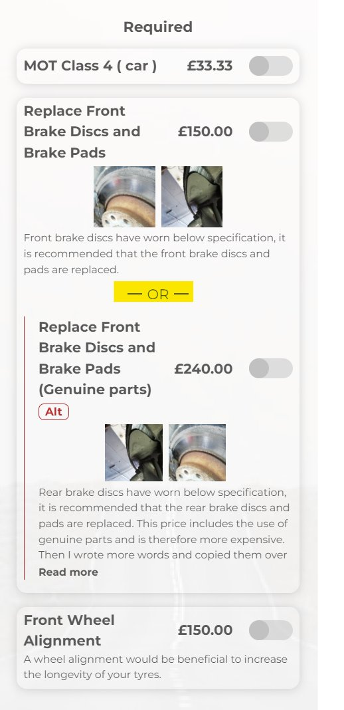

* Added location filter to Booking Confirmation and Booking Reminder Customer notifications to be able to differentiate notification by location.

### 15th February 2022
* Improvement on the Technician Jobsheet:
    - Group Items added into the Technician Jobsheet in read-only mode.
    - Group description column added in the lines.
    - Added a function within the Technician Jobsheet to mark all lines within a group as Tech confirmed.
* Added the **Print Put-Away List** action to **Print/Send** menu in Purchase Orders and Purchase Invoices, which shows the list of items to be purchased and their shelf number.

   

### 18th January 2022
* The Autodata Service Interval Matrix now only has a tick on the replaceable items.
* Move Up/Move Down actions have been added to the line control shortcut menu for Group Items lines.

   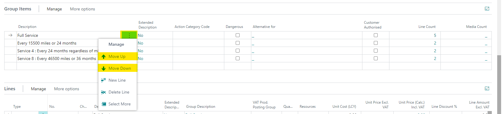

* Nonstock Item features have been renamed Catalogue Item. 
* Added Parts Sales Management function, with the following developments:
  - A role centre for the **Parts Sales Admin** to simplify the management of parts sales.
     
     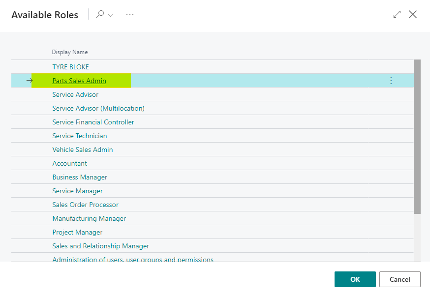

  - An action to create a Jobsheet from a sales order.
  - An SMS action under Print/Send submenus on sales order and sales invoice pages.
  - Parts Sales Proforma Invoice printout.
  - Renamed Service Type Code to Service Type in all sales documents.
  - Sync Unit Price field between Items and Catalogue Items in both ways.
  - The ability to update the related catalogue item description, when the user updates the item description in the system.
  - Take payment wizard on the Parts Sales Admin role centre.
  - Default lines layout for sales orders and sales quote.
  - Card and item history overviews actions to lines in sales orders and quotes.
* Added [item substitution management](garagehive-item-substitution-management.html){:target="_blank"} function, with the following developments:
  - The display of 🔃 in line checker on jobsheets if item has substitutions.

     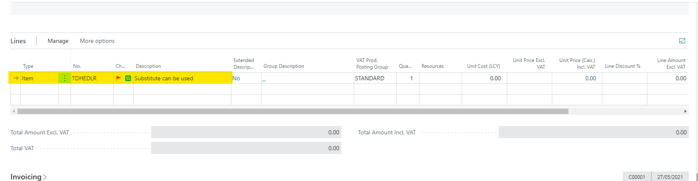

  - Line checker column for sales orders, and quotes.
  - The ability to open the error page and display substitutions if a substitution setting exists for the item.

### 15th December 2021
* [Items to Report](garagehive-items-to-return.html) now considers stock keeping units.
* **Calculate Plan** action in [Requisition Worksheets Page](garagehive-requisition-worksheet-items-to-order.html){:target="_blank"} now works with stock keeping units.
* Added the possibility to correct a posted jobsheet.
* Added the **Mark as Reviewed** button to the **Comments Attention**, **Surveys to Review**, **Online Booking to Review** and **Self Check-in** tiles.
* Added vehicle age filter to [extended calculations for sales price, markups, and discounts v16](garagehive-automatic-price-markup-and-discount-calculations.html){:target="_blank"}.

### 8th December 2021
* Added the ability to login to PowerBI using [Web Service Access Key](powerbi-installing-app.html){:target="_blank"}, instead of Garage Hive System password.
* On the [Payment Reconciliation Journal Page](garagehive-payment-reconciliation-journals.html){:target="_blank"}, a notification has been added to direct users to the documentation site for more information on the payment reconciliation journals.
* External consultants, like the owner, can now view the survey results.

### 1st December 2021
* Customer Online Authorisation (Ninja Cat) developments:
  - Added a summary page to help the customer view a summary of the selected items and amounts to approve.
  - Added the ability to display finance plan option.
  - Moved the preview action to publish page and made it possible to save introduction text in preview until it's published.
  - Changed the payment plan first option from 'blank' to 'Not Available'.

* Added the ability to [adjust the labour time matrix](garagehive-autodata-labour-time-adjustment.html){:target="_blank"} in Autodata with a percentage or hours.

### 22nd November 2021

* Speed improvement for clocking terminal v18.
* Vehicle sales additions such as creating an order at the point of the deal, recording deposits, adding part exchange details, etc.
* Added the option of adding items to return in an existing Purchase Return Order (PRO) [Read More](garagehive-items-to-return.html){:target="_blank"}.
* Added the ability to lookup service interval matrix by Make, Model, and Engine Code.
* Optimized the Garage Hive media upload to handle larger images of up to 20MB JPEG.
* Added key tag number to printed job card.
* Added the possibility to select weekdays when to send out the internal surveys.

### 1st November 2021

* Added customisation for vehicle dates reminders.
* Added a checklist template code to service package so that the service packages can add checklists to jobs.
* Added the ability to fill in the Service Advisor code in the VI Estimate from user setup, when creating a VI Estimate by confirming a Vehicle Inspection (VI).
* Added vehicle reminder dates in estimates and VI estimates same place as jobsheets.
* Added the ability to authorise and deauthorise a group by authorising or deauthorising a line within the group.
* Added **Repair Times** and **Service Interval Matrix** functions to group items sub-page actions, similar to service packages.
* Added a service package number field to the checklist text template, to make it possible to automatically add a service package to a jobsheet when a text template is selected in the checklist.
* Added the ability to group lines from the Autodata Service Interval Matrix and Repair Times.
* Grouped actions in the **Group Items** sub-page.

### 27th October 2021

* [Internal Surveys](garagehive-internal-surveys.html){:target="_blank"}: Similar to NPS surveys, but now for employees, for you as a business owner when providing feedback to external consultants, and so on.
* Added case sensitive search for online booking.
* Added the ability to create service packages from Jobsheets, Vehicle Inspection Estimates and Estimates.
* Added the [comment (extended)](garagehive-comments-extended.html){:target="_blank"} column to the comment setup to allow for the addition of standard comments that can be used multiple times.
* Added an action to duplicate a group and its lines, after which you can change the prices.
* Added the ability to select multiple groups and merge them.
* Added the ability to use document mileage field tag for use in header text.
* Created customer address field tags for use in online job authorisation header.
* Added primary make to V16 pricing.
* Added the ability to take only VIE linked jobsheet groups to online job authorisation.

### 17th October 2021

* Added the ability to ask if the resources should be added automatically when posting a jobsheet.
* Added 'Fuel Filter Due Date' to vehicle reminders.
* Added series description to vehicle card under 'Model Series' field.

### 9th October 2021

* Added a restriction to posting a vehicle sale by ensuring the 'Receipt on Invoice' slider in purchase and payable setup is set to true.
* Added customer category to vehicle list.
* Added the ability to auto-open Purchase/Sales Invoice when creating from vehicle sales orders.
* Included a 'Entry Type' column in the payment gateway entries page.
* Added restrictions for an External Accountant user to create jobsheets/VIEs/Estimates, clock in time, and access service schedule.
* Added ability to copy a line you are on and insert it below in the checklist. This is to help technicians add lines as needed if multiple issues exist for the same area.
* Added 'Planning and Reminder Notes' field in the vehicle card.
* Added the option to [Lookup 'Timing Belt Interval'](/docs/garagehive-timing-belt-intervals-how-to-use-timing-belt-intervals.html) from Autodata.
* Added ability to select multiple service packages to add in a job.
* Added the service advisor's name to customer survey entries.
* The collection and delivery slider now includes a service package selection, so that when enabled, the service package is automatically added to the job.
* System created comments now have the user ID blank.
* Checklist text template increased to maximum length of 2048 characters.
* Added the [key tag number](/docs/garagehive-managing-key-numbers-in-the-system.html) field to help manage key catalogue.
* Added the ability to add the vendor invoice number to the inventory comment in a purchase return order.
* Added vendor number and unit cost column to posted jobsheet lines.
* Made it possible to drill-down on purchase order number column in posted jobsheets.
* Made the 'Attention of User ID' column visible by default in attention comments list.
* Added service advisor code to printed jobsheet card.

### 18th September 2021

* Added [online job authorisation](/docs/garagehive-online-documents-introduction.html) for estimates, vehicle inspection estimates, and jobsheets. 
* Added online sharing for vehicle inspections.
* Improved [grouping of document job lines](/docs/garagehive-group-items-grouping-document-lines.html).
* Improved on [media management](/docs/garagehive-online-documents-adding-and-managing-media.html) in Garage Hive.

### 15th September 2021

* Usability improvements to the 'Items to Return Report'.
* Added 'Statement Report and Aged Receivables Report' drop-down menu in customer's list.
* Added ability to add external services to a jobsheet generated purchase order.
* Added checklist FastTab to posted jobsheets.
* Added 'Placeholder Item' slider to Item Cards.
* Engine Code field length increased from 20 to 30 characters.
* Checklist text box increased to maximum length of 2048 characters.
* Removed the ability to delete online booking customer.
* User management page made as default page to edit users.
* Added a check on resource delete if resource is in schedule resource group.
* Added Item unit cost column in Item History Overview report.

### 24th August 2021

* Added AIB bank account import template.

### 31st July 2021

* Added the ability to display bank details in the footer. 
* Added the ability to display unique footers based on location code.
* Added the ability to display location-based logo details on the footers of sales documents, bookings, and survey emails.
* Added the Print Line Discount Always option to VIE and Estimate printouts.
* Improved how external links are added and removed from the role centre page. 
* It is now easier to change the order of checklist groups by using simple up/down arrows.

### 6th June 2021

* Added the ability to filter service packages by Vehicle Model
* Added the ability to have a separate online booking/service package description
* Added the ability to request deposit payment and account payments by Garage Link

### 31st May 2021

* Added transmission type to service documents factbox
* Improved the checklist UI for technician devices. The textbox will now expand as the technicians are typing
* Added the ability to lookup a new MOT date from within a jobsheet
* Improved the way in which vehicle reminder dates updated
* Introduced the concept of labour types, allowing labour cards to be assigned to vehicle reminder dates. 
* Added the ability to write off deposits as profit
* Introduced Vehicle Sales Orders, with the ability to generate part exchange documents, take deposits and sales produce vehicle sales invoices
* Introduced Vehicles Sales order status tiles
* Improved the Comments for Attention tile, this now works with all service documents including Estimate and Vehicle Inspection Estimates

### 30th April 2021

* Made several UI improvements to Online Booking date selection process
* Added vehicle registration to purchase orders print outs
* Added the take payment feature to vehicle sales invoices
* Added NPS score/gauge to customer list/card factbox
* Created a report to produce a list of customers that have received an MOT reminder that haven't booked in
* Introduced a QC awaiting confirmation tile

### 31st March 2021

* MOT Lookup now works for Northern Ireland Vehicles
* Mileage entered on a vehicle inspection will also be pushed to the jobsheet
* Posting a jobsheet will now automatically complete any allocations
* Added the ability to report on Jobsheet/booking creation date in Power BI
* Extended comments will now print on vehicle sales invoices
* Added the ability to email Purchase Return Orders
* Added the ability to automatically create a corresponding purchase invoice when posting internal jobsheets. 
* Booking reminders will no longer be sent if the vehicle is already marked as onsite
* Added the ability to print/email payment receipts and deposits
* Introduced the ability to take deposits and apply deposits 

### 28th February 2021

* Added access to all customer documents from the customer card/list Factbox
* Added the ability to view comments to archived documents, such as jobsheets
* Added customer category to markups, sales prices and discounts
* Purchase Orders & Purchase Return Orders will now auto re-open when released
* Added a restriction to stop users accidentally correcting a posted sales invoice instead of a posted jobsheet 
* Added the ability to filter vehicle list by booking date for bulk SMS / data export
* Changed the jobsheet line checker to a üö©
* Added the ability to print a posted sales credit memo
* Added the ability to have a default location code selected on an item card
* Added Awaiting Parts and Awaiting Advisor tiles to Estimates
* Added a Jobsheets Requires Parts Ordering tile

### 31st January 2021

* Updated the some of literature used from the customers perspective in online booking
* Added the ability to make a service package in online booking "Morning Drop-Off" only
* Customers booking online will now have the earliest time slot available automatically selected
* Added Vehicle weight to service package conditions
* Added Engine code to service package conditions
* Added Transmission type to service package conditions
* Added Extended Status to purchase return orders
* When items are created, the item card will no longer open
* Added the ability to update the Item Descriptions from documents to the Item card
* Added "Item Price Groups" concept, allowing very detailed Markups rules, such as rim size
* Added the ability to filter customer statements by Branch dimension

### 31st December 2020

* Introduced a Take Payment wizard, this wizard simplifies the payment application process.
* Added the ability to fix the line amount on a Service Package. When changing the quantity of an item such as oil, the line amount will remain fixed and the unit price will be automatically adjusted. 
* Added Vehicle Registration Number to Jobsheets Attention tile list
* Added Customer Category as a condition in Service Packages
* Added the ability to copy service packages versions to new or existing Service Packages
* Added the USER ID column to customer notification entries
* A jobsheet will no longer release if it fails to post

### 31st November 2020

* TCard Major Update
    * Full TCard customisation
    * Tooltips and tooltip customisation
    * TCard priority/ordering
    * Easy clocking integration

* Checklist Major Update
    * Introduced a new checklist type - Quality Control
    * Added a new jobsheet tile - "Requires QC"
    * Added the ability to automatically create a checklist on jobsheet creation, depending on the service type and customer group
    * Added the ability to automatically create a checklist on technician allocation completion, depending on the service type and customer group
    * Added a jobsheet notification for service advisors when there are vehicle inspections awaiting confirmation.
    * Added a jobsheet notification for technicians when there are incomplete checklists associated with the jobsheet they are viewing.
    * Added the ability to view all associated checklists within the jobsheet. We have also moved the "Create Vehicle Inspection" to the submenu.
    * Added a warning to technicians when clocking off a job if they haven't completed all checklists attached to the jobsheet.

* Power BI Update
    * Added System Information Report
    * Added a date selection summary report
    * Added VI-Estimate & Estimate reminder report

* Additional Changes
    * Added a jobsheet complete tile, for jobsheets that are in-between allocation complete and ready for collection 
    * Phone number 2, Mobile number 2, Customer Contact Notes and the ability to add multiple email addresses to a Jobsheet & Customer Card
    * Add a new popup window on allocation completion for technicians that haven't "Tech Confirmed" all labours and items
    * Added bulk SMS to Jobsheet list
    * Service Advisor codes on Jobsheets and now synchronised with checklists
    * Customer Self check-in photos can now be made optional to the end user
    * Added the option to email a pro-forma invoice from a jobsheet
    * Added extended status to purchase return orders
    * Added bank import for AIB Allied Irish Bank

### 31st October 2020

Upgraded all customers to latest platform of Business Central (BC16)

### 30th September 2020

Major Power BI Update

* 50 newly designed business reports
* 3 new embed reports

### 31st August 2020

New Platform Features - [Video](https://youtu.be/3ovTA2JY2No "Find out more"){:target="_blank"}

Including features such as:
* Multi window support
* Ability to personalise the system 
* New keyboard shortcuts
* New ways to navigate Garage Hive
* Ability to save filtered lists
* Ability to add bookmarked pages to any rolecentre
* Ability to customise role centres
* and much more..

New System Features - [Video](https://youtu.be/j55YgyCZzxk "Find out more"){:target="_blank"}

Including features such as:
* New pricing matrix for sales markups
* New discount matrix
* Ability to send multiple customer reminders based on a single date field
* Added lots of new vehicle reminder fields
* Updated and renamed rolecentre tiles
* Improved auto clockout function 

### 31st July 2020

* Added Payment Sense terminal integration. This allows a user to send the payment amount directly to the terminal without having to manually enter the amount on the terminal

* Added a Receipt Bank CSV bank import
* Added amount column to VI-Estimate list
* Added USER ID to customer communication log entries
* Added VIN number to technicians jobsheet
* Added Tech Confirmed columns to posted jobsheets
* Added the ability to filter which reminders are sent based on last visit date
* Fixed a bug that prevents discounts being removed from jobsheets when a part number is added to a purchase order
* Added the ability to define the drop off time in online booking when multiple services are selected. This can be different from the scheduled time. 

### 28th June 2020

* Added access to documents from the vehicle list/card factbox

* Added customer details to vehicle list/card factbox
* Added Reason code to VI-Estimate and Estimate list
* Added the ability to add a "My Tasks Tomorrow" to easy clocking
* Removed non-inventory items from items to return report
* Added access to vehicle history from Vehicle Inspections
* Item card vendor no. is now updated when a vendor no. is added to a jobsheet to create a purchase order
* Prevented the ability to clock onto multiple jobs at the same time unless set to allowed
* Added email templates and the ability to preview emails before sending

* Added email signatures taken from company information

* Added Bank of Ireland bank import
* Contact details are now saved when a customer updates information via self check-in
* You can no longer delete a vehicle associated with an item
* Updated the terminology on the summary report inline with Power BI
* Added the ability to export Sage data to different departments
* Added a simplified way to make payments/refunds to cash receipt journals

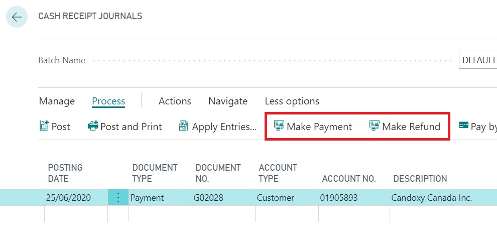

### 29th May 2020

* Added Payment Sense Integration
* Added "Pay By Garage Link" allowing you to send an SMS or Email from a jobsheet requesting payment online
* Added Starling Bank Import
* Added send booking reminder action from jobsheet
* Added the ability to remove certain service types from receiving booking reminders
* Added Document Statistics to Estimate and VI Estimates
* Added the ability to set a minimum item margin for Jobsheets, Estimates and VI-Estimates per service type

### 30th April 2020

* Added a self check-in feature, allowing customers to check in using a link on their booking reminder
* Added Contact Name, Booking Date and Booking Time to printed jobsheets

### 20th April 2020

* Added the ability to add an item retail price from a purchase order
* Added the ability to update an item card retail price from a jobsheet
* Added the ability to update an item card retail price from the purchase order
* Added the ability to bulk update MOT information by VRM
* Added COVID-19 Pre-extended MOT expiry date to vehicle cards
* Added COVID-19 MOT Exemption slider to Vehicle List and Vehicle Card
* Added the Pre-extended MOT due date tag to the bulk-sms feature

### 5th April 2020

* Added the ability to print part numbers on sales invoices
* Added the ability to automatically send booking confirmations
* Added Payment terms to printed/emailed sales invoices

### 27th March 2020 - Covid-19 requested features

* Added MailChimp Export
* Added Finance Plan feature
* Added Bulk SMS feature
* Added COVID-19 Option to online booking system

### 22nd March 2020

* Added the original Jobsheet value to VI-Estimates
* Added VAT details to sales invoice document
* Added the ability to create Vehicle Inspection text templates
* Added "Business Insights" to role centre home page
* Added key numbers to purchase orders
* Added Vendor Email address to vendor list
* Added the ability to print comments on Estimate and Vehicle Inspection Estimates
* Added the ability to filer vehicle list by last visit date
* Improved service schedules from Autodata

### 17th February 2020

* Added Comments for Attention Feature, allowing certain comment types to populate a red tile - [Video](https://youtu.be/X4zGgGS3CJw "Find out more"){:target="_blank"}
* Added the ability to automatically add service packages to documents depending on service type - [Video](https://youtu.be/6y-c47xIYfE "Find out more"){:target="_blank"}
* Post and Print will now open the take payment window unless payment terms are set
* Added Vehicle Sales Web Services for Vehicle Sales Power BI App
* Added the option for VRM to work with UK and Irish plates at the same time
* When converting an estimate to a jobsheet, extended comments will now also copy over
* When a jobsheet is assigned to a service advisor, creating a VI-Estimate will automatically assign it to the same advisor.
* Added VRM Data for Weight, Heigh, Width and Length to the vehicle card
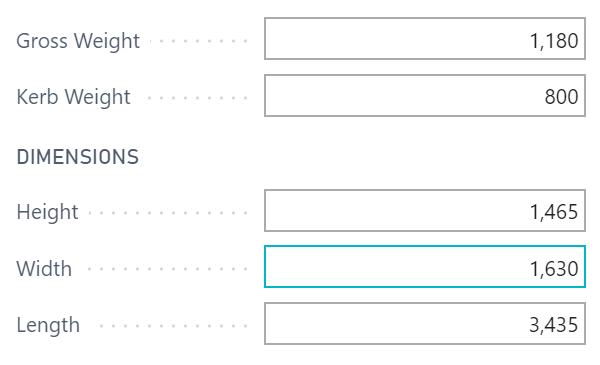
* Added the ability to refresh VRM data from the vehicle list

* Added phone numbers to customer lookup page

* You can now display labour line discounts even if hiding the Unit Price and Qty
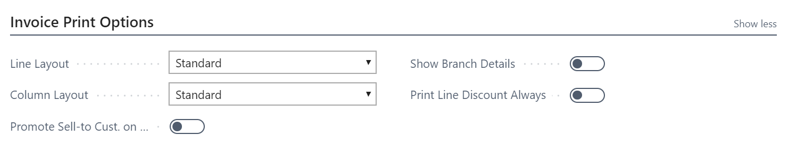

### 29th January 2020

* Add Vehicle Production Year and First Registration Date to the FactBox
* Added Comments (Extended) to Jobsheets, Estimates and VI-Estimates - [Video](https://youtu.be/ebt1UsiP28k "Find out more"){:target="_blank"}
* Added Service Package filtering to Jobsheets, Estimates and VI-Estimates - [Video](https://youtu.be/QUHHTT2wBkM "Find out more"){:target="_blank"}
* Added Customer Arrival Time field to Jobsheets
* Added Mobile Phone Number, Phone Number & Email Address to posted jobsheet list
* Updated Xero API to oAuth 2.0
* Added "Safety Inspection" due date to vehicle cards and reminders

### Online Booking Updates

* Added ability to disabled the expected time of a booking
* Added the ability to add a Google Analytics ID to Embed
* Added "Price From" option to service packages
* Added Make filters to service package versions
* Added "Conditions" feature to service package versions
* Added the ability to make service packages additions only
* Added the ability to hide prices online
* Copy Service Package version line now also copies the conditions 

### 11th January 2020

 * Added Vehicle Sales module 
    * Vehicle Sales Invoices  - [Video](https://youtu.be/CToJ_TIWhoU "Find out more"){:target="_blank"}
    * Vehicle Purchase Invoices  - [Video](https://youtu.be/7AzXrQQwDrM "Find out more"){:target="_blank"}
    * Vehicle Stock Report
    * Vehicle Reservations  - [Video](https://youtu.be/SohtRJMdYoQ "Find out more"){:target="_blank"}
    * VAT Margin Scheme
    * Internal Preparation Jobsheets  - [Video](https://youtu.be/uucqFgWc6I8 "Find out more"){:target="_blank"}

### 29th December 2019

* Release second generation online booking  - [Video](https://youtu.be/QQwRSnH4oyk "Find out more"){:target="_blank"}
    * Works with any website
    * Automated scheduling
    * Automated capacity & availability
    * Jobsheet generation
    * Jobsheet population
    * SMS and Email confirmations
    * and much more

* Added a "Labour Audit" report, allowing users to generate reports for DVSA MOT Audits

### 15th December 2019

* Added the ability to send surveys manually from posted jobsheets
* Added the ability to send custom created surveys

### 14th December 2019

* VHCs have been renamed to VI-Estimates system wide
* Confirming a VI and creating a VI-Estimate will automatically open the VI-Estimate
* Line Unit Costs are now copied to the Jobsheet when authorised from a Estimate/VI Estimate
* Improved Survey information visible on phone app
    * NPS Group now visible
    * Number of Answers now visible

* Fixed a bug that prevented you from going back once viewing customer comments on a survey using the phone app. 
* Added the ability to add extended descriptions to compressed service packages
* You can now access VI-Estimates from a vehicle card
* Dual Column VI Printout now includes the Checklist template name
* Dual column VI Printout now date & time stamps technician/authoriser signatures

### 30th November 2019

* Added a Natwest Bankline statement import
* Jobsheets Extended status are now visible on Posted Jobsheets
* Added the ability to view the customer/vendor on the General Ledger entry table
* Labour extended status descriptions will now transfer from an estimate to a jobsheet
* Garage Hive client now has a 2 hour idle timeout instead of 20 minutes

### 24th November 2019

* Autodata repair times now load 4x~ faster
* Reduced the wasted space on the vehicle inspection printouts
* Added the ability to score the quality of a vehicle inspection
* Added the ability to mark a jobsheet as an online booking for reporting purposes when using an external online booking system

### 13th November 2019

* Added the ability to send an SMS from the customer card
* Added Service Advsior name to invoice printout (optional)
* Added vehicle parking locations to jobsheets (Optional)
    * User stamped
    * Date stamped
    * time stamped

* Compressed the line spacing in labour extended descriptions
* Added the ability to copy/paste service package versions
* Added the ability to share/export/import checklists with other GH users - [Video](https://youtu.be/JT7NcMEEa8Y "Find out more"){:target="_blank"}
* Added the ability to print checklist captions

### 30th October 2019

* Introduced User Tasks - [Video](https://youtu.be/iz7FR3dOQKU "Find out more"){:target="_blank"}
    * Create tasks for yourself
    * Create tasks for other users
    * Set due dates on tasks
    * Monitor tasks set for others
    * Recurring tasks
* Document Description and Work Description on Job sheets, Estimates and VHCs now pop-out into a full screen window. 
    * Pop-out work description window
    * Full-screen work description window
    * Mouse over preview
    * Compatible with templates
    * Spellcheck compatible
    * Available on job sheets, estimates and VHCs
* Added a "Tyre" field checkbox to item cards. 
* Changed the default column layout for technicians job sheets on tablet devices. 
* Clocking terminal now supports different time zones. 
* Introduced Item Overview report. Easily traceable item history, accessible from item lists, item cards and items to return reports with clarity of the following. 
    * Purchase Invoices
    * Customer Card
    * Vendor Card
    * Posted job sheets
    * Open job sheets
    * Job sheets related to PO

### 20th October 2019

* Introduced Open Estimate analysis Power BI report - [Video](https://youtu.be/DOXzAKsTxIo "Find out more"){:target="_blank"}
* Improved VHC analysis Power BI report

### 7th October 2019

* Added the ability to send SMS from survey entries
* Added ability to set a review requested date for survey entries
* Added last survey requested / last review requested fields to customers cards
* Added access to customer comments from survey entries
* Added a 2 column layout printout for vehicle inspections
* Added the ability to view tyre information graphically on vehicle inspections
* Added a "faults and actions" section to vehicle inspections
* Added the ability to add external website lines to any role centre homepage
* Added the ability to opt customers out of booking reminders
* Added vendor invoice number to aged accounts payable report

### 1st October 2019

* Added the ability to let technicians select from a pool of "Group Tasks" [Video](https://youtu.be/oCRC4WCvHeQ "Find out more"){:target="_blank"}

### 29th September 2019

* Added Customer Satisfaction, [Net Promoter Score and Survey feature](https://www.garagehive.co.uk/customer-surveys-nps "Surveys and NPS"){:target="_blank"}
    * Automated SMS/Email feedback requests
    * New detailed Power BI reports
    * Live customer insights from any document
    * Access to previous feedbacks from any document
    * Ability to review and action all feedback recieved
    * More Information available here - [Click here](https://www.garagehive.co.uk/customer-surveys-nps "Surveys and NPS"){:target="_blank"}
* Added the ability to add paragraphs to email reminders and booking confirmations
* Added the ability to display tyre label information on documents
* Added the ability to set estimate reminders
* Added estimate reminders upcoming/overdue tiles to all role centres
* Added the ability to add extended descriptions to items in all documents
* Order numbers can now be made mandatory for specific customers

### 22nd September 2019

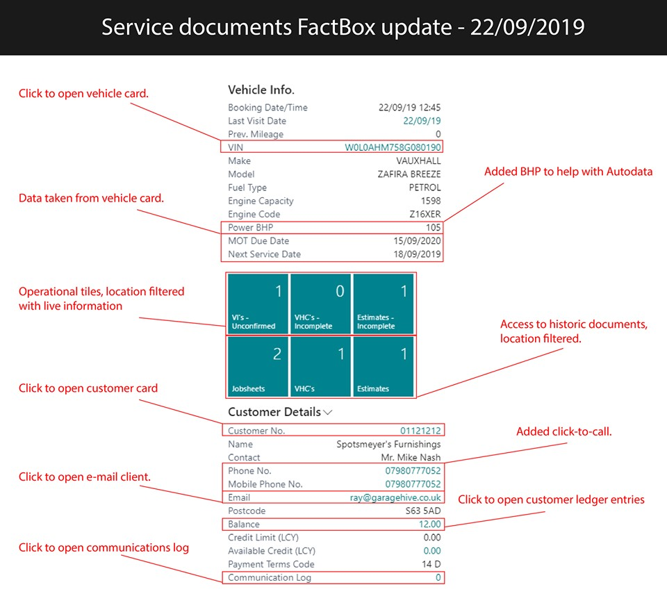

* Added BHP to the Factbox
* Added VIN that is a shortcut to the vehicle card to the Factbox
* Added 6 operational tiles to the Factbox
* Added MOT and Service dates to the Factbox
* Added click-to-call contact numbers to the Factbox
* Extended the part number visibility on printed Purchase Return Orders

### 10th September 2019

* 0% VAT Lines will no longer display a VAT sub-total on invoices
* Added the ability to view caption texts next to radio buttons in Vehicle Inspections
* Added the ability to adjust VAT amounts of documents for any discrepancies - [Video](https://youtu.be/zBXttdf0byg "Find out more")
* Added the ability to counter-sign vehicle inspections

### 2nd September 2019

* Added the ability to search Autodata with Make/Model/Engine Code
* Added Jobsheet Net & Gross Value to Jobsheet list
* Added "Safety Check" to vehicle cards, for Irish Markets

### 21st August 2019

* Technicians now have access to Autodata Oil and Lubricant Data from Easy Clocking
* Added Extended Labour Descriptions to Jobsheets & Estimates and Labour Cards, allowing up to 10,000 characters per description
* Copy Document function will now copy work descriptions
* Added ability for Service Advisors to Assign jobs to themselves - [Video](https://youtu.be/ALZgQyT-Xgg "Filtered Tiles")
* Added ability to have tiles filtered to particular Service Advisors 
* Added ability to attach external documents when emailing customers documents
* Improved Vehicle Inspection print out - [Video](https://youtu.be/VGKiDqAG9bA "Vehicle Inspections")
* Added ability to print signatures with Vehicle Inspection. 
* When emailing a VHC, the Vehicle Inspection will automatically be attached. 
* Added "Total Jobsheets" tile to Service Financial Controller Roll Centre

**Irish Localisation** 
* Ireland - Added VRM/VIN Lookup
* Ireland - Added Support for 2/3 VAT Rule
* Ireland - Added optional second VAT Rate on an Item Card
* Ireland - Added Mobile Number Validation
* Ireland - Added ability to adjust VAT Rate on all documents
* Ireland - Added VAT Statement

### 31st July 2019

* Added ability to view 7 or 5 days on the schedule
* Added Oil and Lubricant information to Estimates and VHCs
* Added the ability to add location/branch information to booking reminders
* Added the ability to send a booking confirmation
* Added support for Sage Cloud Accounting
* Power BI - Created a Web Service for varying labour rates across multiple locations
* Power BI - Added Service Advisor Web Service
* Power BI - Added Service Type / Job Type Web Service
* Power BI - Updated Posted Jobsheet Web Service to include vehicle number for advanced vehicle reports
* Added a pop-out window to checklists/vehicle inspections allowing technicians to see more of what they're typing. 

### 21st July 2019

Added Autodata Oil and Lubricant information to Jobsheets

### 14th July 2019

* Added the ability for technicians to add signatures to vehicle inspections
* Added the ability to filter vehicles by service/mot expiry dates that haven't got a booking
* Fixed a bug where Autodata sometimes displayed the wrong registration in the menus

### 7th July 2019

* Added ability for technicians to create Jobsheets and clock onto them (Optional)
* Attachments can now be added to Customer Cards and Vehicle Cards
* Attachments can be added to Purchase Orders
* Attachments can now be accessed by Technicians via Easy Clocking
* Added "Jobsheets Total" tile
* Technicians pausing a job now creates a new allocation with the actual remaining time of the job
* Technicians completing a paused job will remove the paused allocation
* Technicians can now see allocated time, spent time & remaining time on their Jobsheets - [Video](https://youtu.be/B9ol7J_4dhI "Technicians Remaining Time"){:target="_blank"}
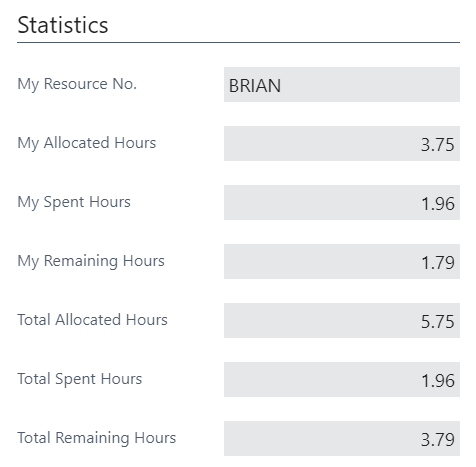
* Requestion Worksheet has been added to the Service Financial Controller role centre
* Added PLEO to bank statement Imports
* Shelf No. can now be added to item lookup search box

### 29th June 2019

* Autodata Open Beta now Live for all customers

* Multiple lines can now be selected when searching for repairs in Autodata

* The "Day" is now visible on the schedule

* Available Hours is now visible on the schedule
* Admin staff standard events no longer effect available hours on the schedule
* Added a Jobsheet Statistics feature
  * Clocked Hours per tech
  * Total Clocked Hours
  * Total Labour Quantity
  * Gross Profit
  * Labour Sales
  * Item Sales
  * Item Costs
  * Item Margin

* "Line Check" is now clickable and will display a warning message related to the check

* Added a "Line Check" warning when labour resources haven't been added or equal 100%

* Added a "Line Check" warning when line amount is 0 or less 
* Added Extended Status to Purchase Orders
* Added Drive to vehicle card transmission
* Added Spark Plug Torque to vehicle card
* Added Creation date field to customer table
* Added Creation date field to vehicle table

### 21st June 2019
* Added VHC Priority column (Advisory, Urgent, Critical)

* Booking Date/Time appears immediately on Jobsheets

### 12th June 2019
* Introduced [Non-Inventory Items](https://youtu.be/itE0goMsFCI "Non-Inventory Items"){:target="_blank"}

### 31st May 2019
* Improved the send SMS interface
* Added the ability to attach documents such as PDFs to the following; 
  * Job sheets
  * Return Job sheets
  * Estimates
  * VHCs
  * Posted Job sheets
  * Posted Return Job sheets
  * Archived Job sheets
  * Archived Estimates
  * Archived VHCs
* Added an option to remove the booking time from the customer notification booking reminders

### 24th May 2019
* Added a new method of applying payments to customers - Register Customer Payments - [Video](https://youtu.be/rmfIFULOCKY "Register Customer Payments"){:target="_blank"}
* Fixed an error when printing "Posted Return Jobsheets"
* Added vehicle inspections data to web services for reporting purposes
* Added Estimate tiles to the "Service Financial Controller" Role Centre
* Added Vendor Columns to item lines of VHCs and Estimates, this information will copy to the Jobsheet
* Introduced a warning for technicians when they attempt to clock off a jobsheet without all item/labour lines being confirmed by the technician [Video](https://youtu.be/jX21NVsKeZ4 "Technician Confirmed"){:target="_blank"}
* Added the ability for technicians to access the schedule via easy clocking if required
* Added Customer GDPR Preferences to vehicle lists for data export
* "Stock out warning" won't be given on the item line if the item card has "stockout warning" unticked
* Added "Price Calculator" to Estimates
* The Booking version of the jobsheet now has all the features of a standard jobsheet
* Added a "refund" option to return jobsheets
* Created a new role centre for Multi-location companies with additional multi-location features
* Extended SMS capacity to 900 characters
* Introduced Requisition worksheets & Stock control [Video](https://youtu.be/-RptpsLg2kk "Requisition Worksheets"){:target="_blank"}
  * Stock re-order points on an item number
  * Generate a stock requirement report
  * Auto-creation of purchase orders
  * Considers future & current bookings
  * Considers items already on order

* Added Quickbooks Integration 

### 17th May 2019
* Added ability to search by Make/Model/Engine code in Autodata Preview
* Added a stock warning to Jobsheet item lines when available stock is 0
* Mileage now transfers from jobsheets, to inspection & VHCs
* Added a feature that allows you to copy from comments to work description
* Added fuel information into the Factbox

### 7th May 2019
* Added ability to copy grouped items and compressed service packages from VHCs and Estimates to Jobsheets
* Added access to items from the services advisors role centre on mobile & tablet devices
* Added the ability to update the customer card from the Jobsheet when changing address details
* Create a new role centre - Service Financial Controller
* Added Xero Integration use Xero's API 

### 28th April 2019
* Added MOT/Service Due Date & Customer Phone/Email/Address details to Vehicle lists. 
* Added the ability to authorise single lines from an estimate to be copied to an existing jobsheet.
* Added two new tiles, Estimates awaiting action and Estimates awaiting authorisation. Completed Estimates will now be hidden from the homepage. 
* Added "Document description" to Estimates and printed Estimates. The "Document Description" will also be added to the Jobsheet when an Estimate is converted to a Jobsheet. 
* Added "Document description" to VHCs and printed VHCs. 
* Added access to previous Vehicle Inspection from a related Jobsheet for the service advisor
* Added "Collection and Delivery" tickbox to Jobsheets with the ability to add an icon to a schedule allocation. 
* Added "Courtesy Vehicle Required" tickbox to Jobsheets with the ability to add an icon to a schedule allocation. 
* Added the ability to categorise Jobsheets comments by types, comment types can also be hidden from technicians if necessary. 
* Added the ability to view historic vehicle inspections from easy clocking for technicians

* Released V2 of Garage Hives Power BI Reports
  * Ability to record standard events such as break times as non-work time
  * More reports made mobile friendly
  * New Efficiency Reports
  * Detailed Item Reports
  * Detailed Labour Category Reports
  * VHC Reports, Inspection rate, up-sell rate
  * WIP & future booking reports
  * Customer heatmaps
  * Top customer reports
  * Vehicle Make and Model Analysis reports

### 14th April 2019

* Added a "Marketing Channel" to Jobsheets and customer cards for monitoring marketing activity. 
* Added "Item Search Description" to fast lookup via a jobsheet
* Added access to historic vehicle pictures from easy clocking for technicians
* Added the ability to create a new inspection without being in a jobsheet for a technician
* Added the ability to create multiple vehicle inspections via easy clocking for technicians

### 31st March 2019
* Added customer Opt Out feature to reminders, allowing customers to manage their own communication preferences via a web link. 

### 24th March 2019
* Mileage Prompt for technicians when clocking off jobs without entering a mileage.
* Added a Payment/Till Report that includes Cash Receipt Journals.
* Added Customer Order Numbers to Customer Statements.
* Added SMS capability to Posted Jobsheets.
* Updated VHC Printout to include Authorised and Identified work totals.
* Added Unposted Jobsheets to Web Services for reporting purposes.
* Added Labour Group Codes to Web Services for reporting purposes
* Improved Statement Layout.
* Transitioned Garage Hive trial to Business Central platform.

### 8th March 2019
* Added VHC Dataset to Web Services for reporting.
* Added Checklist Dataset to Web Services for reporting.
* Added Estimate Dataset to Web Services for reporting.
* Added Reason Code (Reason for refusal) to VHCs for reporting.
* Added Reason Code (Reason for refusal) to Estimates.
* Added Status concept to Estimates, Awaiting Action, Awaiting Authorisation, Completed.
* Added filter to Estimate tile, filters to Awaiting Action and Awaiting Authorisation.

### 7th March 2019

* **Added Making Tax Digital functionality.**
    * Visibility into your VAT obligations
    * Creating VAT returns based on VAT obligations
    * Reminding users of upcoming VAT obligations
    * Submitting the VAT return to HMRC
    * Viewing your VAT liabilities and payments

* Enabled customer GDPR preferences to the customer list for exporting to Excel.
* Added Santander bank import file for Payment Reconciliation Journals and Bank Reconciliation. 
* Added payment method code to cash receipt journal.
* Added Cash receipt journals to external accountancy export. 

### 1st March 2019

* Added BHP VRM Data to Vehicle Card. 
* Removed Zero value invoices from external accountancy export.
* Added ability to refresh MOT data from MOT Notification bar in the Jobsheet. 
* Added SMS and Email preview functionality to customer notification setup (Reminders) 
[View our video guide for Customer Notifications here](https://youtu.be/Bds8JQgDQN4 "How to Setup Customer Notifications in Garage Hive"){:target="_blank"}.
* Added Labour No. to Web Services for Power BI and Reporting features.

### 27th February 2019
 [What's New in Garage Hive - Feb '19 Roundup](https://youtu.be/YootXcNrezM "What's New in Garage Hive - Feb '19 Roundup"){:target="_blank"}

* Added ability to automatically clock out users at the end of day at a specified time.
* Extended SMS templates, added additional functionality.
* Improved SMS functionality, added "click to call" and "click to SMS" features to Jobsheets, VHCs & Estimates.
* Added extra fields to the "Brake Section" of a vehicle card. 
* Added a "Schedule of Work" document, allowing users to print a non financial document for Fleet Companies.
* Improved customer address layout for Invoices and Statements.
* Bug fix - Corrected Credit Memo number missing from the end of day report.
* Added ability to create work description templates. 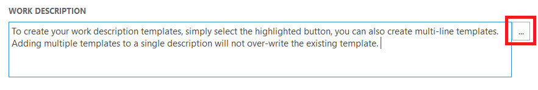
* Created a warning for vehicles with VRM integrity issues, allowing users to override data import.

### 17th February 2019

* Bug fix - Corrected an issue that wasn't recording break times correctly in time registration entries.
* Added the option of displaying the bill-to-customer or sell-to-customer on an invoice.
* Added customer account numbers to customer statements.
* Added "Vehicle staying overnight" feature, allowing Service Advisors to mark vehicles as staying over night - populating a tile on the technicians devices.
* Added key tags to "vehicles staying overnight" list.
* Added ability to export Purchase, sales and payment ledgers to Sage 50.
* Promoted vehicle card access to jobsheet homepage.
* Added vehicle registration number to WIP report.
* Added additional features to jobsheet booking template.
* Added optional "Awaiting Authorisation" tile to Service Advisors role centre.
* Added Service Type column to posted jobsheet. 
* Enhanced the ability to modify Resource Time Registration Entries, added ability to modify start time aswell as total time spent.
* Added optional "Awaiting Parts" tile to Service Advisors role centre. 

### 31st January 2019
[What's New in Garage Hive - Jan '19 Roundup Part II - Video](https://youtu.be/W0Xpttp1L7Q "What's New in Garage Hive - Jan '19 Roundup Part II"){:target="_blank"}

* Update to the TCard system, now works in conjunction with the schedule and can be updated from the header of a jobsheet. You can also update the status of the TCard/Jobsheet by dragging the job on the TCard system. 
* Email/SMS reminders for booking date reminders now active in the system. 
* Technician confirmed button now automatically assigns the labour allocation to the resource(technician) that ticks the button. 
* Bug fix - Schedule popup now works permanently .
* Added access to the VHC from the vehicle inspection.
* Schedule search has been added, search via registration, customer name, job number, key number or make & model. 
* Added a warning when a user accidentally tries to post a purchase order with a zero value line.
* Added date, time and user ID stamps to comments.
* MOT History can now be accessed from a technicians device.
* Added a popup warning to tell the user when the vehicle has an expired MOT or is expiring soon. 
* Added a new method of purchasing, users can now push parts to a jobsheet even if the purchase order was created independently and not from a jobsheet. 

### 15th January 2019

* Email notifications now available for users to receive upon completion of a vehicle inspection.
* Added Tyre pressures, oil spec, oil capacity and more to the vehicle card.
* Improved access to the vehicle card from the technicians devices, including short cuts to engine details and tyres, wheels & brakes.
* Added the ability to adjust the default quantity of an item added to a jobsheet.
* Added the ability to adjust the time registration entries of technicians, correcting incorrect clocking information for work times, idle times, jobsheet times & break time.
* Improved the service ledger entries, renamed to vehicle history & added the ability to recall previous jobsheets based on the service ledger entries.
* Added the ability for technicians to access the vehicle history from their jobsheet and added the ability for technicians to search the history.
* Added the ability to access the jobsheet from a related open purchase order, as well as the ability to open an associated jobsheet from a posted purchase invoice.
* Adding additional parts to an open purchase order will now ask if you also want to add the new parts to the associated jobsheet .