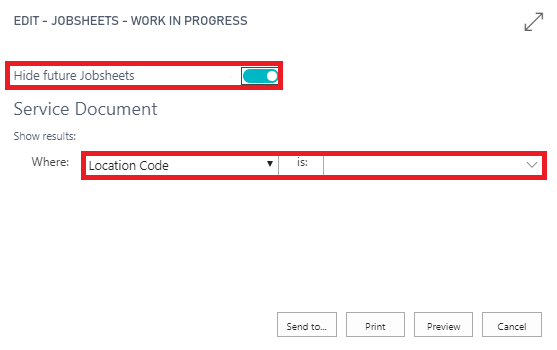

#   Work In Progress Report 

*   In the home screen select Report tab.

*   Then select End of Day followed by Jobsheets – Work in Progress. 

*   Ensure the Hide future jobsheets slider is selected. 

*   Ensure Location Code is completed and press print.

***This has produced your WIP report. Use this report to keep your system cleansed. Ensure all jobs on this report are live jobs, if not close/invoice any no shows/ account customer invoices.***

***It also allows you to see how much value you have in the WIP you have yet to be invoiced*** 

