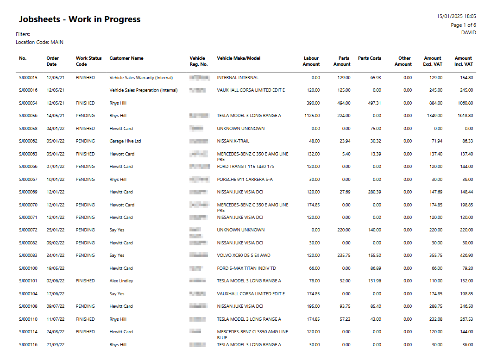

## Work In Progress Report 
The **Work in Progress** report generates detailed insights into Jobsheets that are in progress, including information about items, labour, costs, total amounts, and other relevant details. 
1. In the the Role Centre, select **Report**, followed by **End of Day** and then **Jobsheets - Work in Progress**.

   

2. Ensure the **Hide Future Jobsheets** is selected. 
3. Select the **Location Code** and click on **Print** or **Preview** to generate the report.

   

### Using the WIP Report
1. **System Maintenance:** Use this report to keep your system organised. Ensure all jobs listed are active. For inactive jobs, take the appropriate action:
 * Close or invoice jobs for no-shows.
 * Invoice outstanding account customer jobs.
2. **Financial Insights:** This report helps you monitor the total value of work in progress that has not yet been invoiced. 

   
