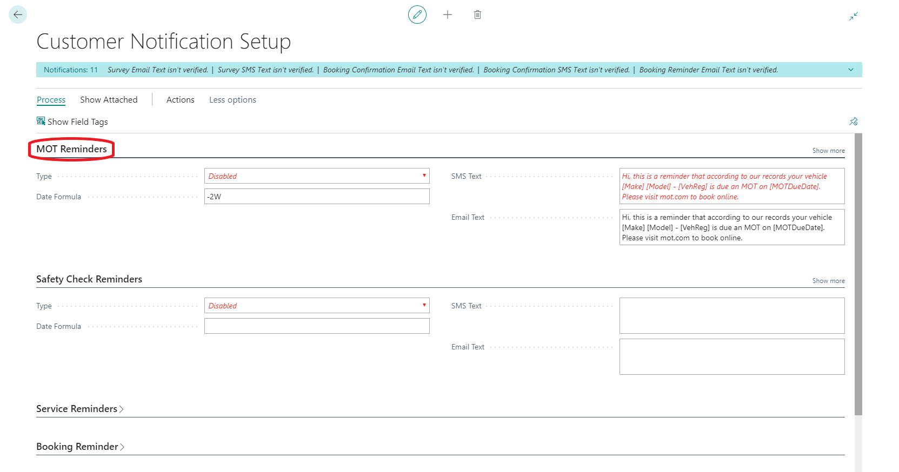
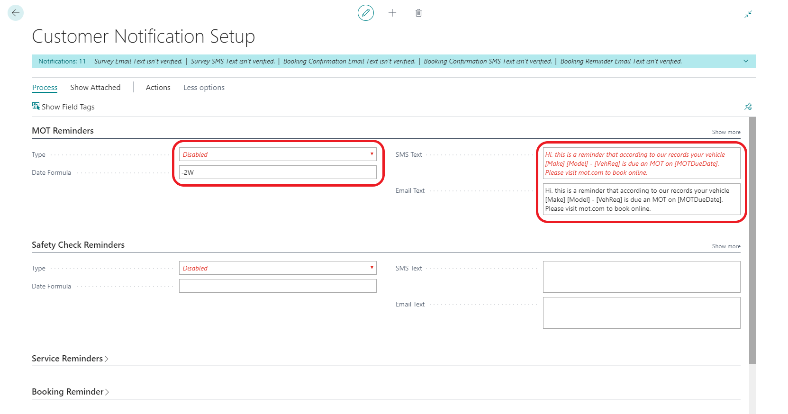
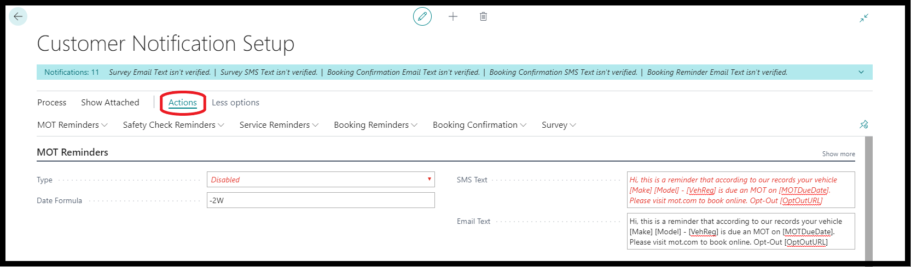
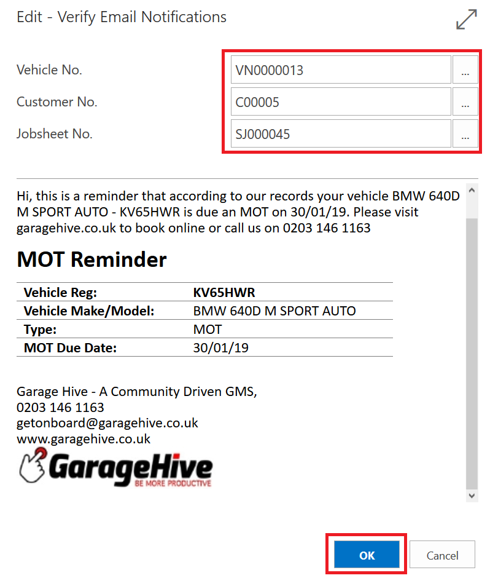
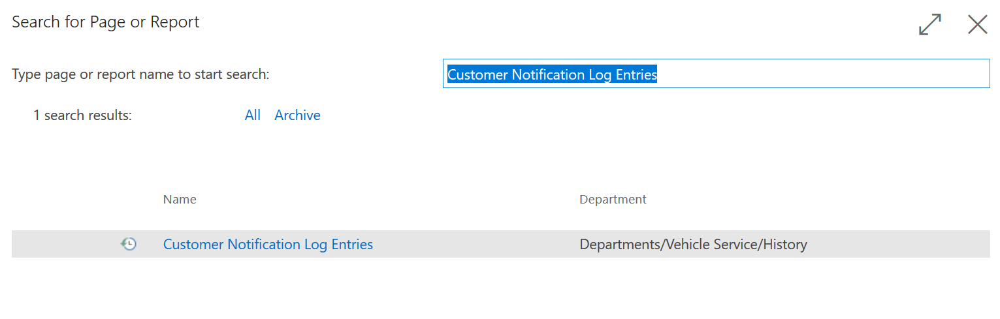
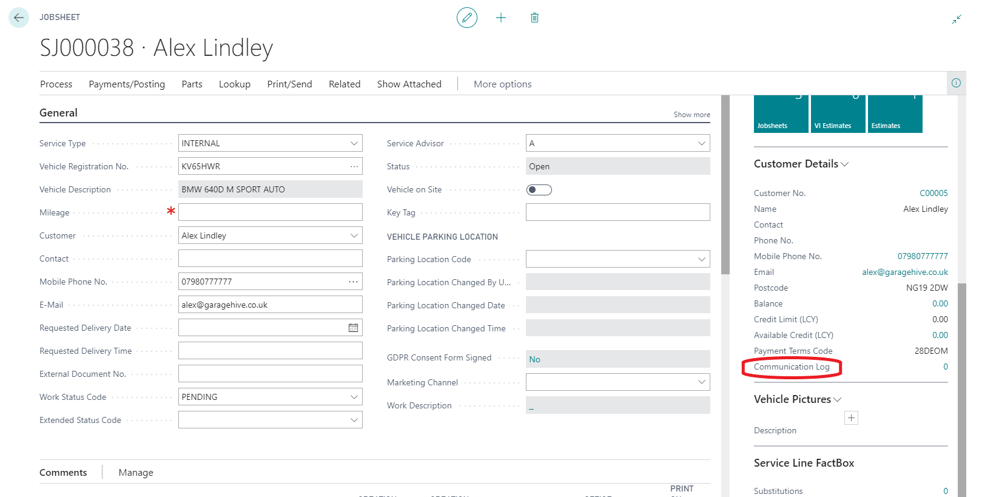

#   Customer Notification Setup  

 
---

In Garage Hive, there are several customer notifications, such as MOT Reminders, Service Reminders & online booking confirmations. In the Customer Notification Setup you can change settings such as how reminders are received, you can customise the templates and adjust the times in which messages are sent. 

You can find Customer Notification by searching for **Customer Notification Setup.**

# How to setup Customer Notifications

Clicking on the "Fast tab" heading will expand the tab 

Each customer notification type has different setup, in this example we will focus on how to setup reminders, Each reminder requires you to setup the following.
* **Type** - _Select the type of reminder you want to send._
    * Disabled
    * SMS
    * Email
    * SMS & Email

*  **Date Formula** - _This is where you state the time you wish to send the reminder before the due date._
    * -1D _(1 Day before date)_
    * -3D _(3 Days before date)_
    * -1W _(1 Week before date)_
    * -2W _(2 Weeks before date)_
    * -1M _(1 Month before date)_

    **Please note, you must only type the "-1D" and it is essential you have a -(negative sign) before the formula.**

*  **SMS Text** - _This is where you create the message template the customer will receive via SMS._

*  **Email Text** - _This is where you create the message template the customer will receive via Email._

>Garage Hive will not send a reminder to a customer if they already have a booking made in the system for what the reminder is for. 

# How to write your message template

When creating your message template you can choose from the following field tags, these tags will change the message dynamically based on the customer information.

* [CustName]
* [VehReg]
* [BookingDate]
* [BookingTime]
* [BookingRef]
* [SelfCheckInURL]
* [ServiceType]
* [Make]
* [Model]
* [MOTDueDate]
* [SafetyCheckDueDate]
* [ServiceNextDate]
* [OptOutURL]
* [LName]
* [LAddr]
* [LAddr2]
* [LCity]
* [LPostcode]
* [SurveyURL]

Here is an example template
> Hi, this is a reminder that according to our records your vehicle [Make] [Model] - [VehReg] is due an MOT on [MOTDueDate]. Please visit mot.com to book online. Opt-Out [OptOutURL]

# How to preview and verify your template

You have the ability to preview and verify the  notification template you have created.

To do this, click "actions" in the ribbon, then select the message you wish to verify. 

Simply select the customer and vehicle you want to preview the message for, if you are happy with the message press OK. 

# How to view sent messages

You can find Customer Notification Logs by searching for **"Customer Notification Log Entries"**

Alternatively, customer communication logs can also be accessed from a jobsheet.

[Next step 2/3 ->](/docs/golive-sms-email.html)