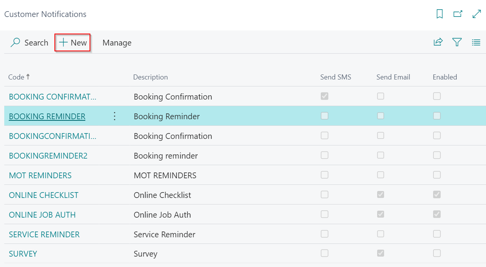

## Customer Notification Setup  
In Garage Hive, there are several customer notifications, such as **MOT Reminders**, **Service Reminders** & **Online Booking Confirmations**. In the **Customer Notifications** you can change settings such as how reminders are received, you can customise the templates and adjust the times in which messages are sent.

To access the **Customer Notifications**, select the icon in the top right corner, enter **Customer Notifications**, and select the related link.

   

## In this article
1. [How to setup Customer Notifications](#how-to-setup-customer-notifications)
2. [How to write your message template](#how-to-write-your-message-template)
3. [How to preview and verify your template](#how-to-preview-and-verify-your-template)
4. [How to view sent messages](#how-to-view-sent-messages)

### How to setup Customer Notifications
1. Select the type of customer notification to setup from the list on the **Customer Notifications** page, or click **New** in the actions bar to create a new one.
2. Each customer notification type has a different setup; this article will focus on how to setup reminders. 

   

3. For the **Reminders** you are required to setup the following:
   * **Code** - This is the customer notification identification code in the system.
   * **Type** - Select the type of reminder you want to send.

      

   * For the booking reminder:
     * Enter the **Scheduled Time** - This is the time the reminder will be sent.
     * Add the **Service Type Filter** - This defines which jobsheets to send the reminder to if they have the service type specified here. If the reminder is to be sent for all Jobsheets, leave this field blank.
     * Add the **Location Filter** - This narrows down the location(s) to which the reminder will be sent. Leave this field blank if the reminder is to be sent to all locations.

      

   * For the vehicle date reminder:
     * **Vehicle Field** - This is the vehicle date field to be used for the reminder.
     * **Scheduled Time** - This is the time the reminder will be sent.
     * **Vehicle History Date Formula** - This is the number of days or weeks during which the service history is available. If the vehicle service history is within the given period, a reminder will be sent for the vehicle. For example, 18M is for 18 months and 100D is for 100 days.

      

   * **Date Formula** - This is the number of days or weeks before the due date that the reminder should be sent. For example:
    * **-1D** is 1 Day before date
    * **-3D** is 3 Days before date
    * **-1W** is 1 Week before date
    * **-2W** is 2 Weeks before date
    * **-1M** is 1 Month before date

     

      

* **SMS Text** - This is where you create the SMS message template that the customer will receive.

*  **Email Text** - This is where you create the email message template that the customer will receive.

    

### How to write your message template
When creating your message template, you may select from the following field tags, which will dynamically update the message based on the customer information.

* [CustName] for the **Customer Name**.
* [VehReg] for the **Vehicle Registration No.**.
* [BookingDate] for the **Booking Date**.
* [BookingTime] for the **Booking Time**.
* [BookingRef] for the **Booking Reference**.
* [SelfCheckInURL] for the **Self Check-in URL**.
* [DueDate] for the **Due Date**.
* [Make] for the vehicle **Make**.
* [Model] for the vehicle **Model**.
* [OptOutURL] for the **Opt Out URL**.
* [LName] for the **Location Name**.
* [LAddr] for the **Location Address**.
* [LAddr2] for the **Location Address 2**.
* [LCity] for the **Location City**.
* [LPostcode] for the **Location Postcode**.
* [SurveyURL] for the **Survey URL**.
* [JobAuthURL] for the **Online Job Authorisation URL**.

Here's an example of a message template:

> _Hello, this is a reminder that your vehicle [Make] [Model] - [VehReg] is due for a MOT on [DueDate] according to our records. To book online, please go to mot.com. Opt-out using [OptOutURL]._

   

### How to preview and verify your template
You can preview and verify the notification message template you've created. To do so, enable the **SMS** or **Email** using the slider on the right of the message, and then choose the **Jobsheet**, **Vehicle No.**, and **Customer No.** for which you want to preview the message. If you are satisfied with the message, click **OK**.

   

### How to view sent messages
To view the sent messages, select the icon in the top right corner, enter **Customer Notifications Entries**, and select the related link. The page that appears shows all of the details for the processed notifications.

   

[Next step 2/3 ->](/docs/golive-sms-email.html)