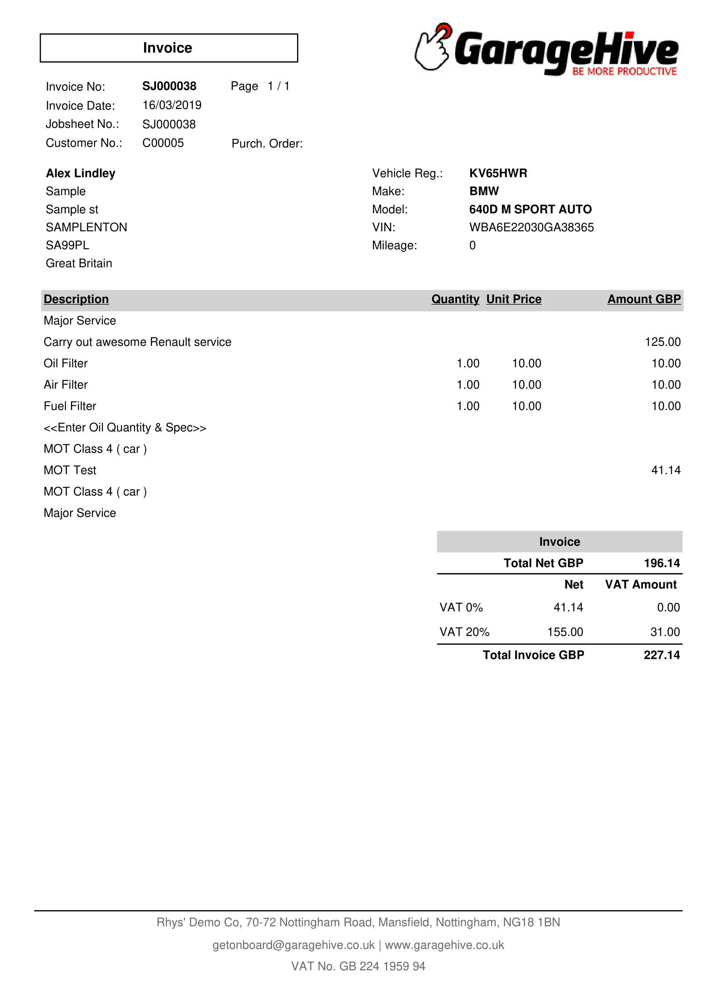
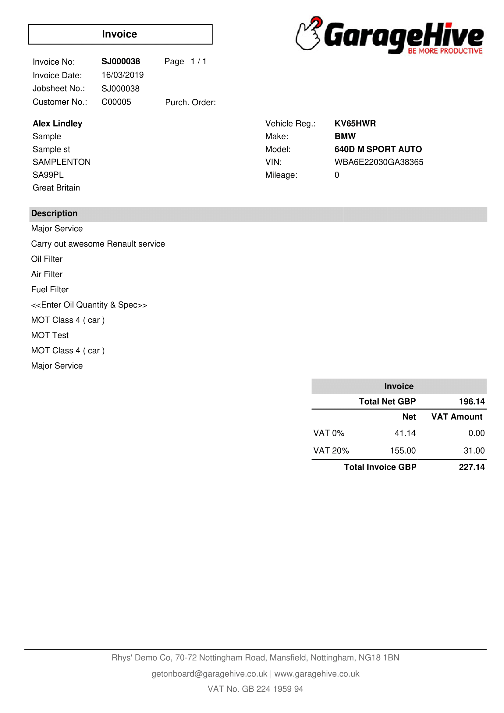
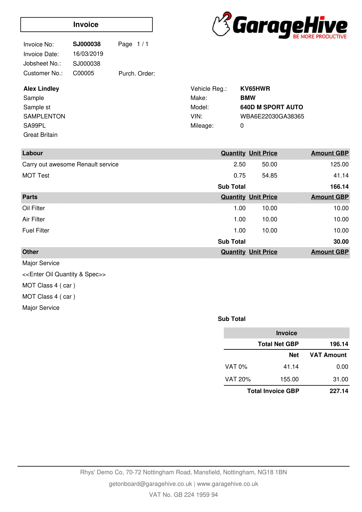
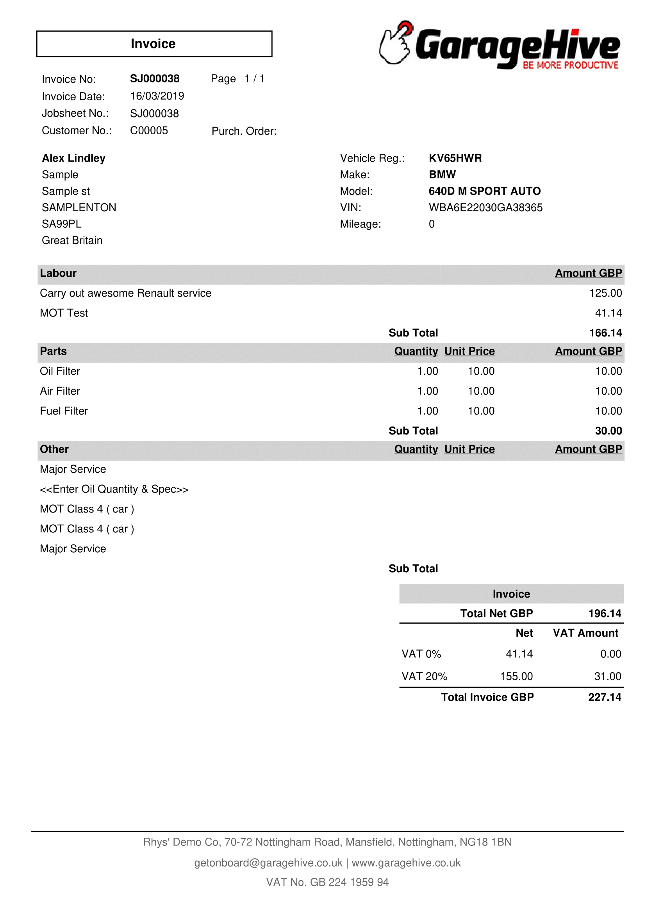
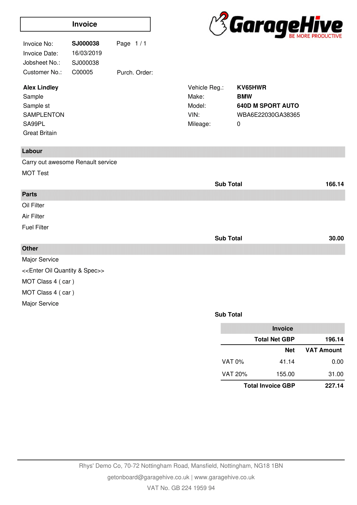
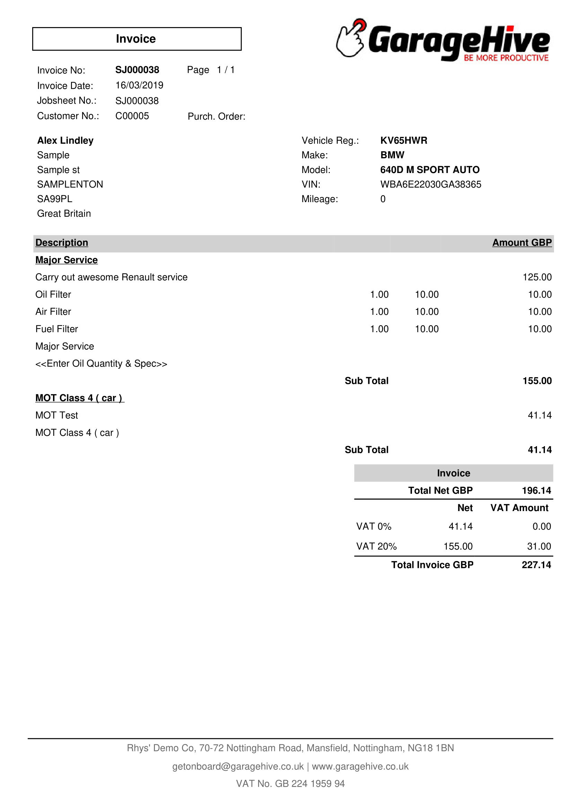
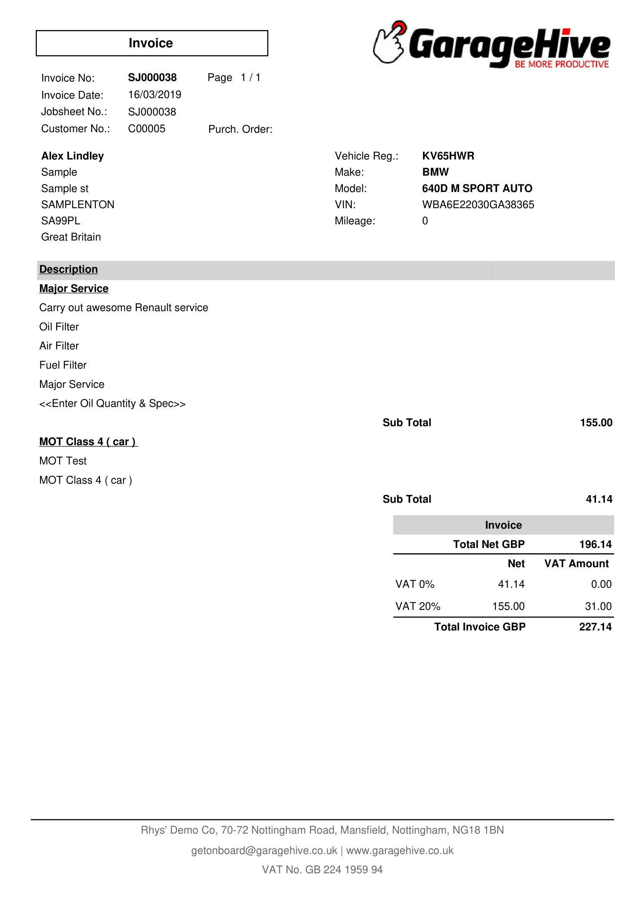

#   Print an invoice   

Open your "Jobsheets - Total" tile 

Open any of the jobsheets via the job number on the left 

Select "Print/Send" from the top and "Print Invoice"

Review the document for your company logo, quality and and line layout 

# Line layout options



---

There are 9 line layout options to choose from 

* Standard - Standard 
* Standard - Hide labour Qty. and Unit Price 
* Standard - Show Totals Only 
* Group by Line Type - Standard 
* Group by Line Type - Hide labour Qty. and Unit Price 
* Group by Line Type - Show Totals Only 
* Custom Grouping - Standard 
* Custom Grouping - Hide labour Qty. and Unit Price 
* Custom Grouping - Show Totals Only 

# **Standard - Standard** 

# **Standard - Hide labour Qty. and Unit Price**

# **Standard - Show Totals Only** 

# **Group by Line Type - Standard** 

# **Group by Line Type - Hide labour Qty. and Unit Price**

# **Group by Line Type - Show Totals Only**

# **Custom Grouping - Standard** 

# **Custom Grouping - Hide labour Qty. and Unit Price**

# **Custom Grouping - Show Totals Only**

# [<- PREVIOUS STEP 2/3](/docs/golive-test-sms-email.html)
