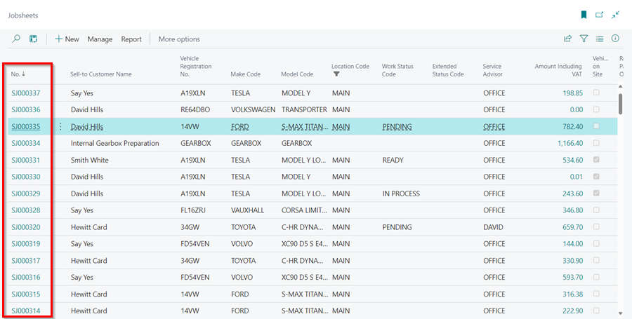
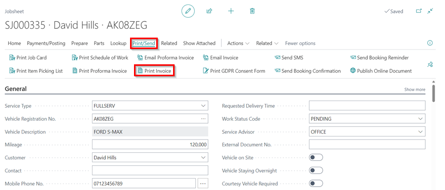
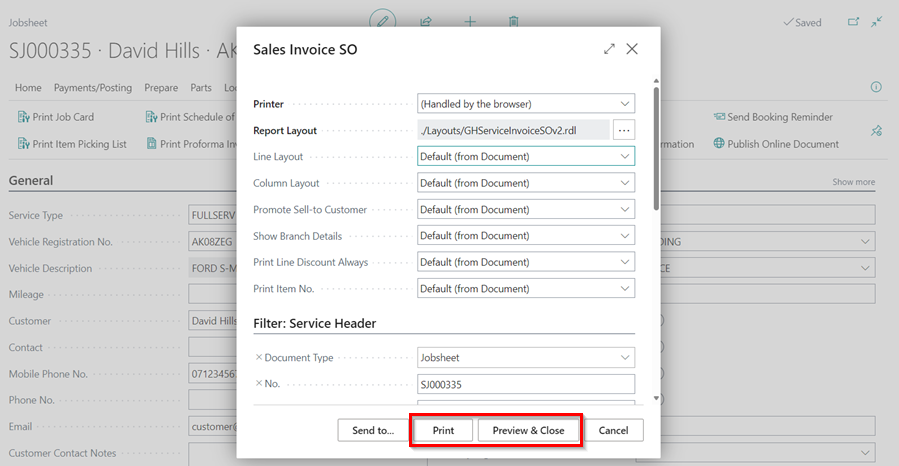
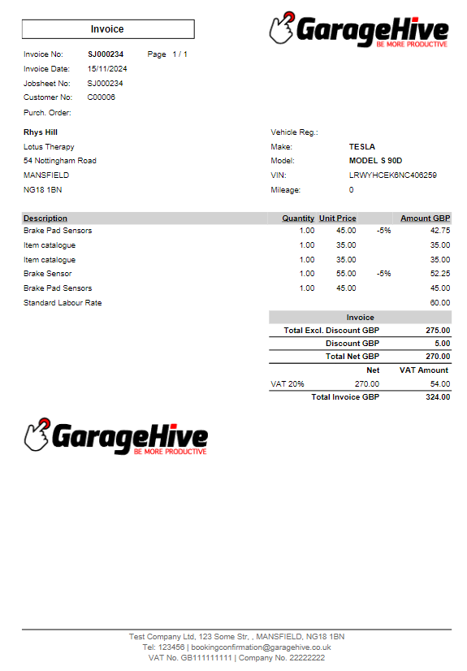
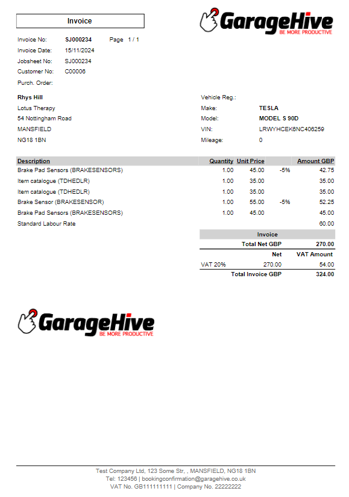

## In this article
1. [Print an Invoice](#print-an-invoice)
2. [Available Print Layout Options](#print-layout-options)

### Print an Invoice   
To print an invoice:
1. Open the Jobsheet by clicking on the **Total** tile in the Role Centre and then select print by clicking on the Jobsheet **No.**.

   

2. Select **Print/Send** menu, then **Print Invoice** from the menu bar.

   

3. Select **Preview/Close** from the options at the bottom of the pop-up window to preview the document, and then select **Print** to print.

   

4. Check the document for your company's logo, quality, and line layout. 

### Print Layout Options
There are several middle section print layout options for the document to choose from:
* Standard - Standard 
* Standard - Hide labour Qty. and Unit Price 
* Standard - Show Totals Only 
* Group by Line Type - Standard 
* Group by Line Type - Hide labour Qty. and Unit Price 
* Group by Line Type - Show Totals Only 
* Custom Grouping - Standard 
* Custom Grouping - Hide labour Qty. and Unit Price 
* Custom Grouping - Show Totals Only
* Print Line Discount Always
* Print Discount Totals
* Print Item No.

To select your preferred print layout, scroll down to the **Invoice Print Options** FastTab in the document.

   

Here is an example of each print layout:

#### Standard - Standard

#### Standard - Hide labour Qty. and Unit Price

#### Standard - Show Totals Only 

#### Group by Line Type - Standard

#### Group by Line Type - Hide labour Qty. and Unit Price

#### Group by Line Type - Show Totals Only

#### Custom Grouping - Standard 

#### Custom Grouping - Hide labour Qty. and Unit Price

#### Custom Grouping - Show Totals Only

#### Print Line Discount Always

#### Print Discount Totals

#### Print Item No.

[<- PREVIOUS STEP 2/3](/docs/golive-sms-email.html)

 

### **See Also**
[Video: Invoice Print Options](https://www.youtube.com/watch?v=ZV_f6X9wVHk){:target="_blank"}
