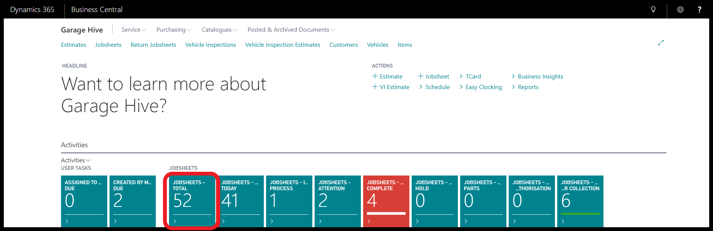
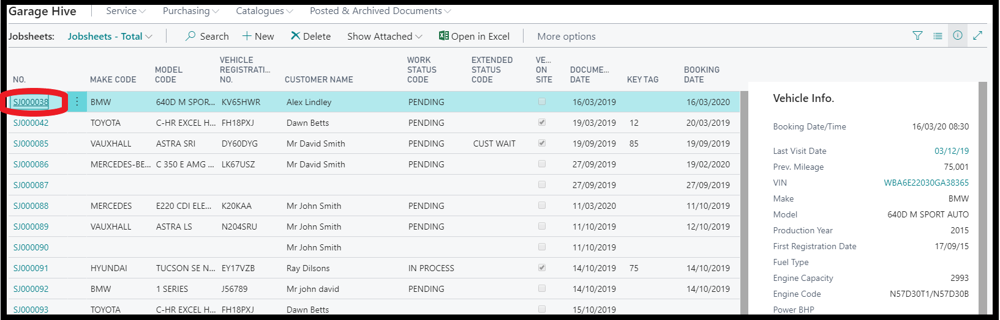
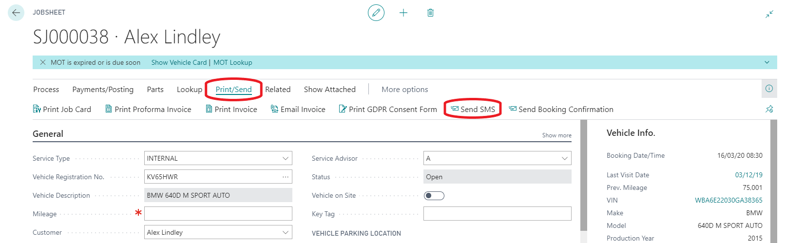
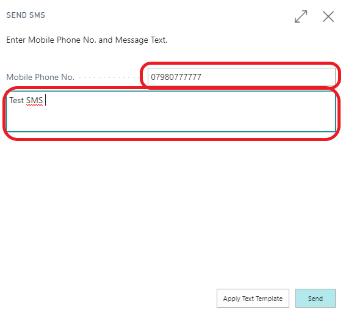
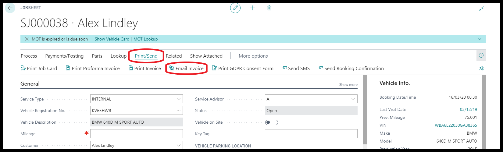
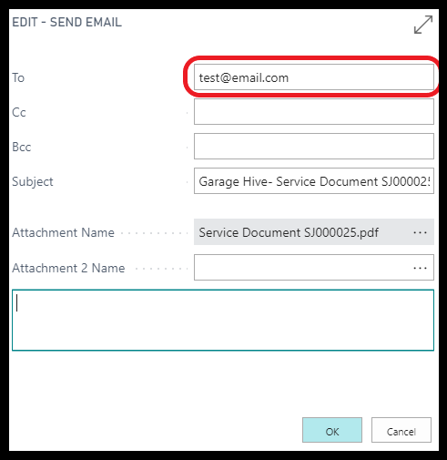

#   Send an SMS and Email  

Open your "Jobsheets - Total" tile 

Open any of the jobsheets via the job number on the left 

Select "Print/Send" from the top and "Send SMS"

Enter your phone number and some text to the body and send

Then do the same for "Email Invoice" 

Enter your email address and some text to the body and send

Review the document sent via Email for your company logo and quality

[<- 2/3 Previous step](/docs/golive-cust-not-set.html)

[Next step 3/3 ->](/docs/golive-print-invoice.html)