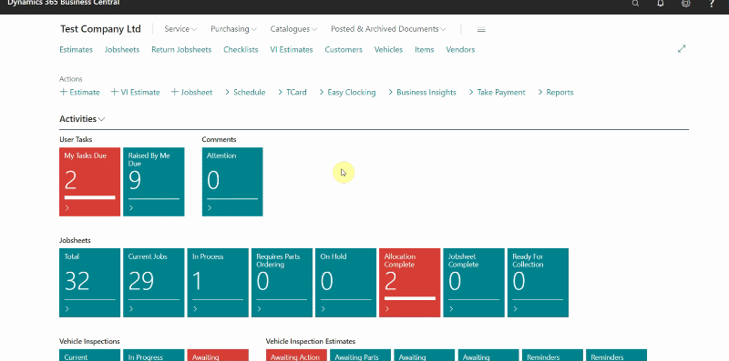
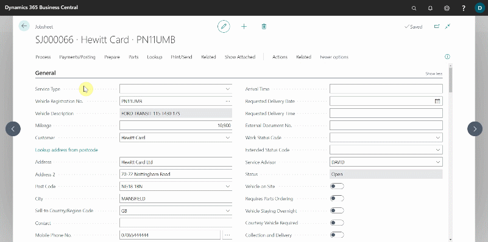

## Send an SMS and Email
To send an SMS or an Email from a jobsheet:
1. Open the Jobsheet by clicking on the **Total** tile in the Role Centre and then selecting the Jobsheet.

   

2. Select **Print/Send** menu, then **Send SMS** from the menu bar. In the **Mobile Phone No.** field, enter the phone number, and in the **Message Body** area, enter the message.
3. When done, click **Send**.

   

4. To send an email, select **Print/Send** menu and then select **Email Invoice**. Enter the email address in the **To** field and the message in the **Message** field.
5. When done, select **Send Email** from the menu bar.

   

[<- 2/3 Previous step](/docs/golive-cust-not-set.html)

[Next step 3/3 ->](/docs/golive-print-invoice.html)