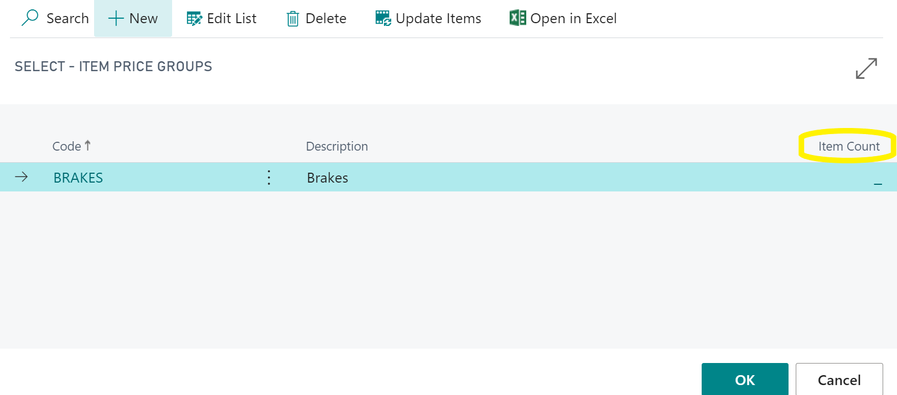
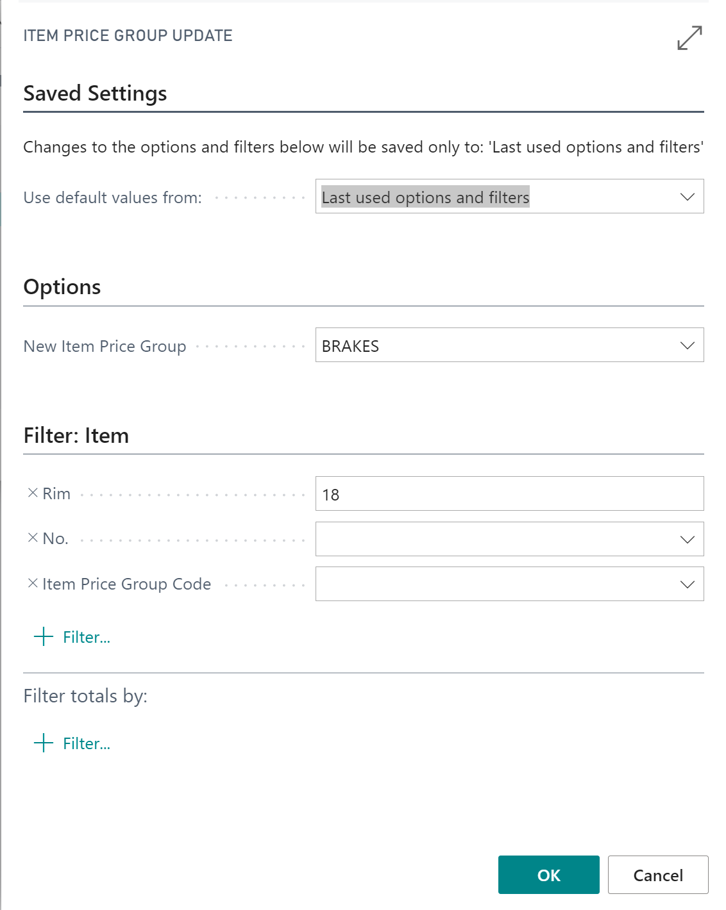
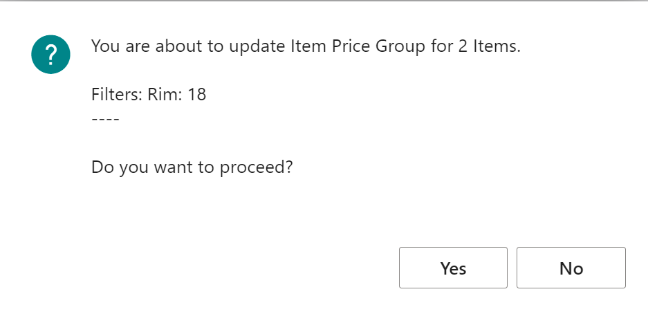

#   Create item Price/Discount groups and update items.



Item price/Discount groups can be used to set up markups, pricing and discounts for specific items. 

Search for the related table "Item price groups" or "item discount groups." 

Create any groups required, give them a code and a description. You will see the number of items that belong to that group in the column on the far-right "item Count".

---

---

Select "update Items" form the top of the page, here you can apply filters to select the item you want to update, for example, you may want to but all tyres with a rim of 18" in a new item price group called "18tyres."

---

---

Once you have set the filters and selected "OK" you will be informed about how many items will be updated and asked if you want to proceed. 

---

---

Pressing "Yes" will update the item cards.
