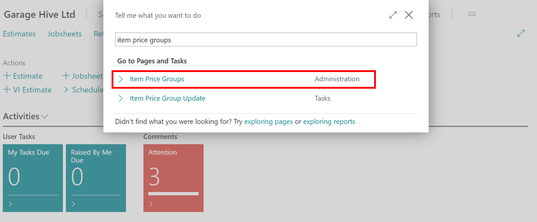
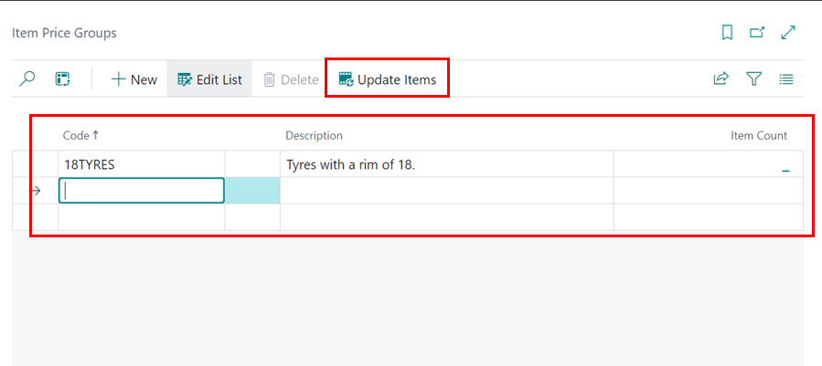
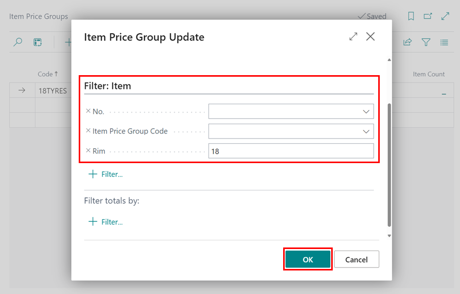
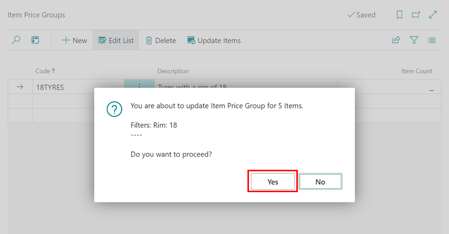
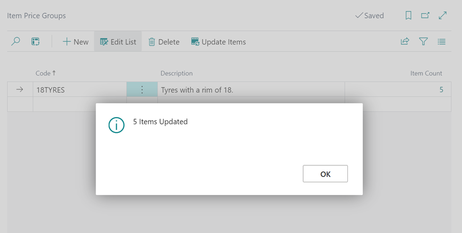

## How to Create Item Price and Discount Groups
Item price/Discount groups can be used to set up markups, pricing and discounts for specific items. To create Item Price or Discount groups: 

1. In the top-right corner, choose the  icon, enter **Item Price Groups** or **Item Discount Groups** depending on which one you wish to create. Select the related link. 

   

2. Create any groups required, give them a **Code** and a **Description**. The **Item Count** column shows the number of items in that group when they are added.
3. From the menu bar, select **Update Items** to begin adding items to the groups you’ve created.

   

4. TThe **Item Price Group Update** popup will appear. Here, you can apply filters to choose the items you want to include. For instance, you might use the **Rim** filter set to 18 to add all tyres with an 18-inch rim. Once you've made your selections, click **OK**.

   

5. After clicking **OK**, you’ll receive a notification indicating how many items will be updated. You’ll be prompted to confirm whether you want to proceed. Click **Yes** to continue.  

   

6. The selected items will now be updated with the new item price group or discount group.

   

 

[Video - How to create item price/discount groups](https://www.youtube.com/watch?v=Q7uRrSmHyMk){:target="_blank"}