> **Important:**
> 
> Before installing the **Power BI App**, you should first setup your **Average Labour Rate** in Garage Hive. - [How to set your **Average Labour Rate**](https://docs.garagehive.co.uk/docs/garagehive-labour-rate.html "Set Average Labour Rate"){:target="_blank"}.

# Installing the Power BI App on Business Central Online

> # Power BI installation link: <ins>[Garage Hive Power BI App For BC Cloud - V1 Download](https://app.powerbi.com/Redirect?action=InstallApp&appId=44d2cec5-65d3-42b3-8327-30913727847d&packageKey=9fb1ca65-5c32-4152-9913-9736a138285340-H93cU8k32wvk-E3icMw-WOtx4woyztb-nbWJgSvU&ownerId=1bde89ad-b4ce-45df-a919-e1e08e47294d&buildVersion=1 "Power BI V1 Download"){:target="_blank"}</ins>

To install the app:
1. Click on the installation link above. Make sure you are logged into your **Garage Hive Power BI** on the same web browser. 
2. After clicking the link, you will receive a notification in **Power BI** asking if you want to install the app. Select **Install**. If you are having any trouble when installing, read about [admin portal settings](#admin-portal-settings).

   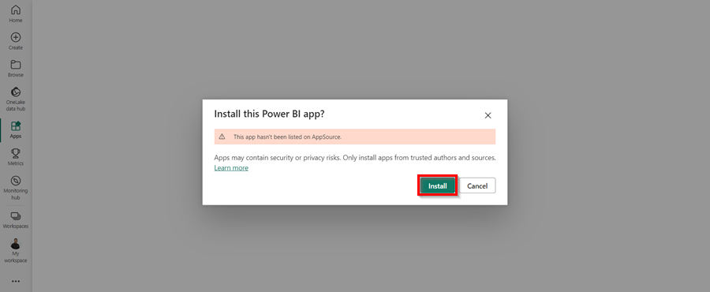

3. Once the app  has installed, go to your apps on Power BI and open the **Garage Hive Power BI** app for BC cloud. Select the app to open. 

   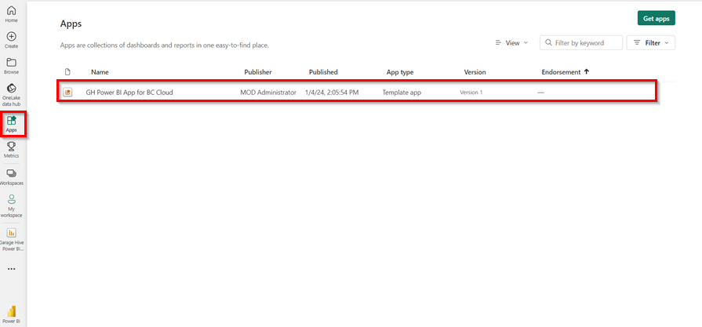

4. When you open the app, you will see a warning at the top that says, "You're viewing this app with sample data. **Connect Your Data**." Select **Connect Your Data**. 

   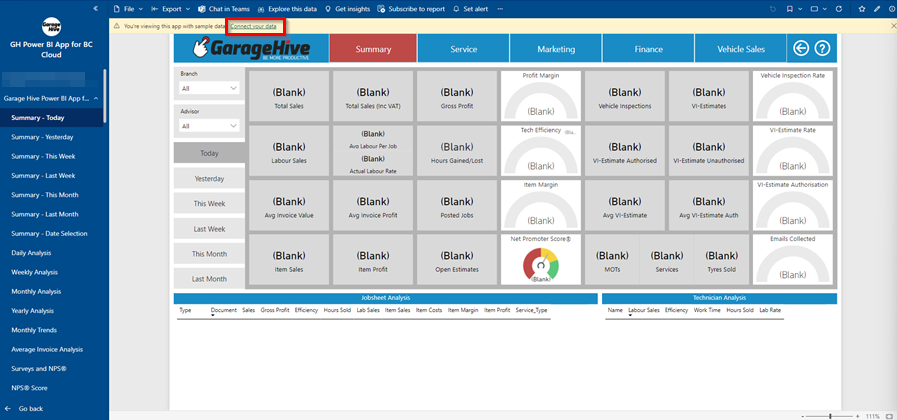

5. A page to enter your **Company Details** opens.

   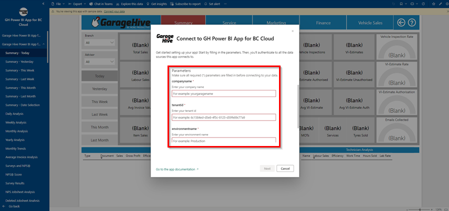

6. Enter your **Company Details**; you can find these by using the search function to find **GH Power BI App Setup** within **Garage Hive**. Make sure that the setup is **Enabled**.

   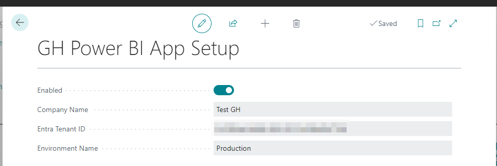

7. Enter these details into the relevant fields and click **Next**.
8. You will now be asked to authorise the connection to your **Garage Hive** system. 
9. Select the Authentication method as **OAuth2**.   
10.  Leave the **Privacy Level Setting** as it is and **Sign In and Connect**. 

     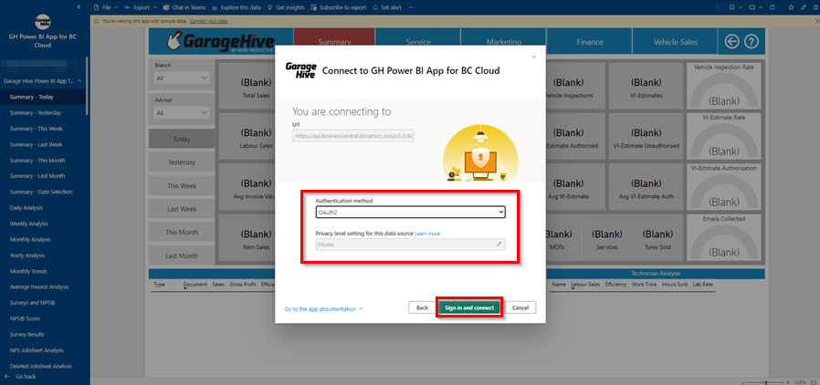

11. You will be redirected to the Business Central cloud sign-in page. Select the account to connect with.

     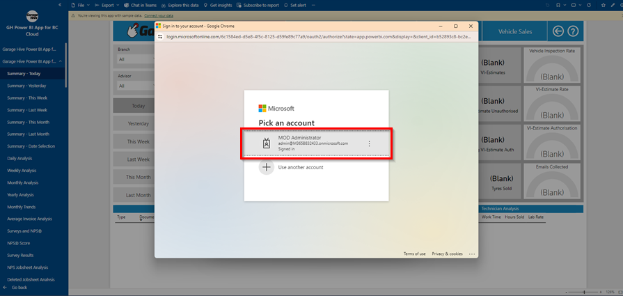

12. If you successfully authorise your **Garage Hive** system, you should see the data refreshing.
13. You can view the refresh progress in **Workspaces**, select the **Garage Hive Power BI** app.

     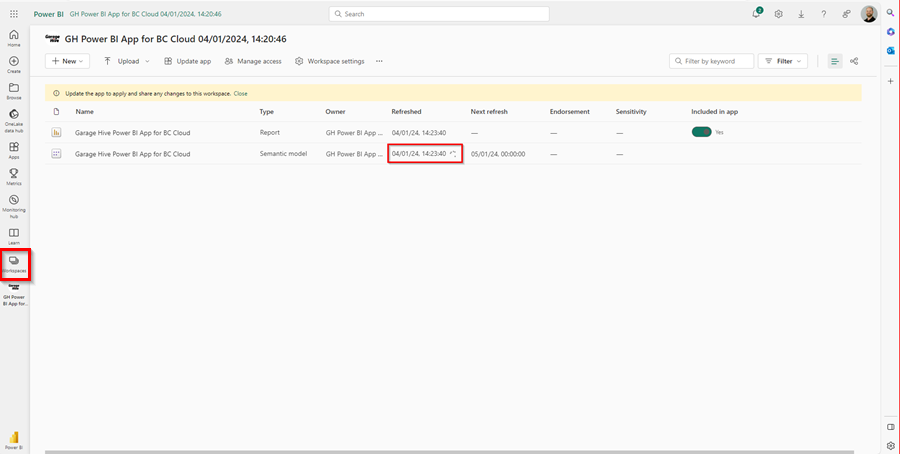

14. You can now add the app to your **Favourites**, for easier accessibility.

     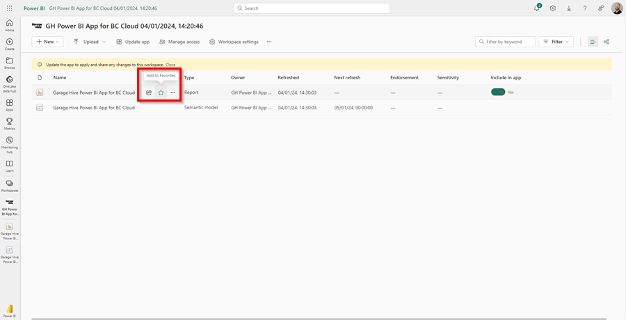

The app is now ready to use.

You can setup a refresh schedule, learn more here - [How to refresh your data.](https://docs.garagehive.co.uk/docs/powerbi-refresh-data.html "How to refresh your data"){:target="_blank"}

## Admin Portal Settings
If you are having any trouble when installing, check the **Admin Portal Settings**.

To do this:
1. login to your **Garage Hive Power BI** and go to your **Admin Portal**. 

   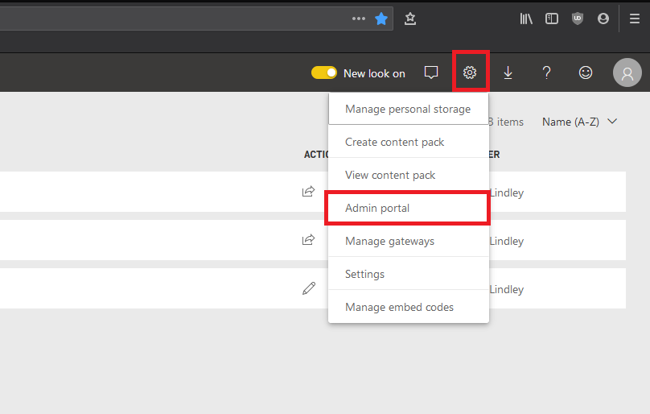

2. Once you are in your **Admin Portal**, select **Tenant settings**, scroll to the bottom of the page and enable **Install Template Apps Not Listed in AppSource** and click **Apply**. 

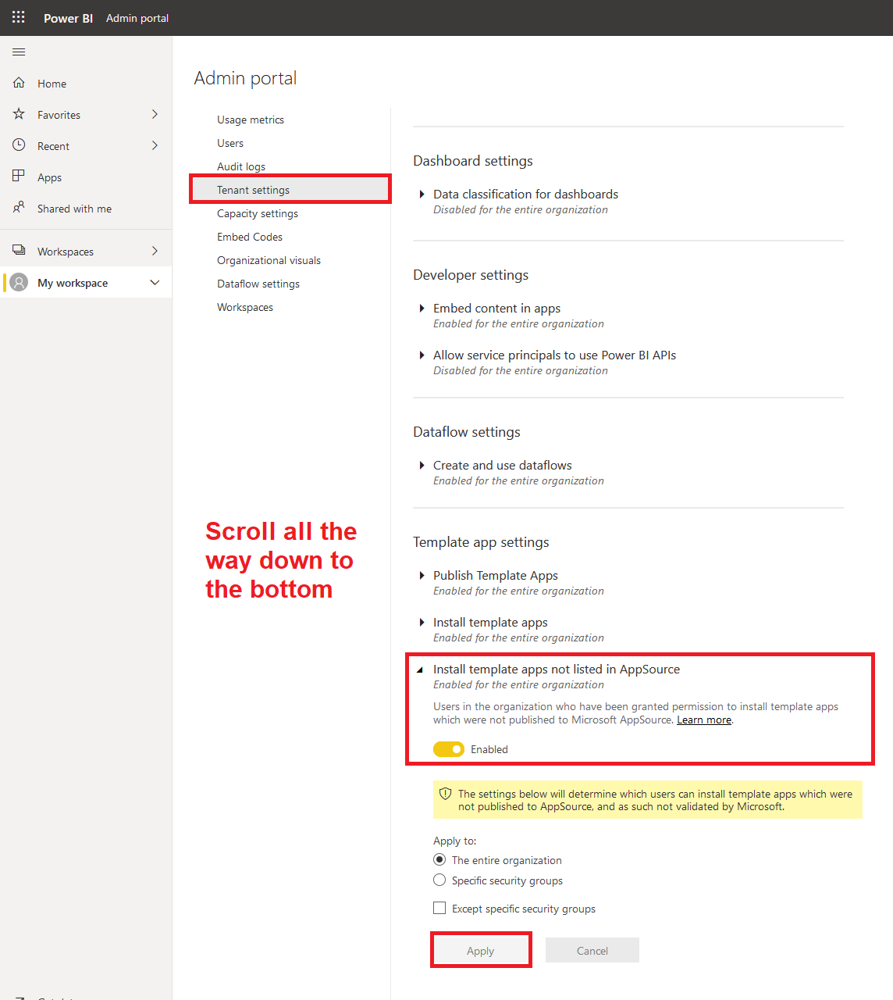

 

### **See Also**
[Video - How to install the Garage Hive Power BI report](https://youtu.be/iO17qPjBAc0){:target="_blank"} \
[How to set your Average Labour Rate](garagehive-labour-rate.html){:target="_blank"} \
[Refreshing your Power BI data](powerbi-refresh-data.html){:target="_blank"} \
[Updating your Power BI App](powerbi-updating-app.html){:target="_blank"} \
[Updating your Power BI credentials](powerbi-updating-app.html){:target="_blank"} \
[Deleting the Power BI and installing a new one](garagehive-delete-old-powerbi-app-and-install-new-one.html){:target="_blank"} \
[How to Set Business Targets](garagehive-how-to-set-business-targets.html){:target="_blank"}

