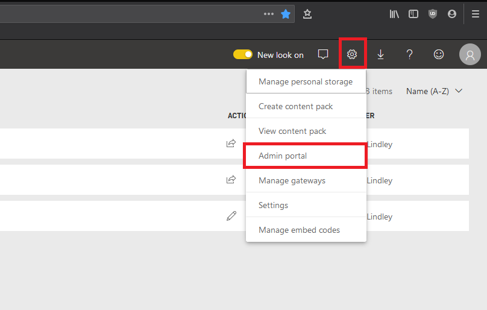
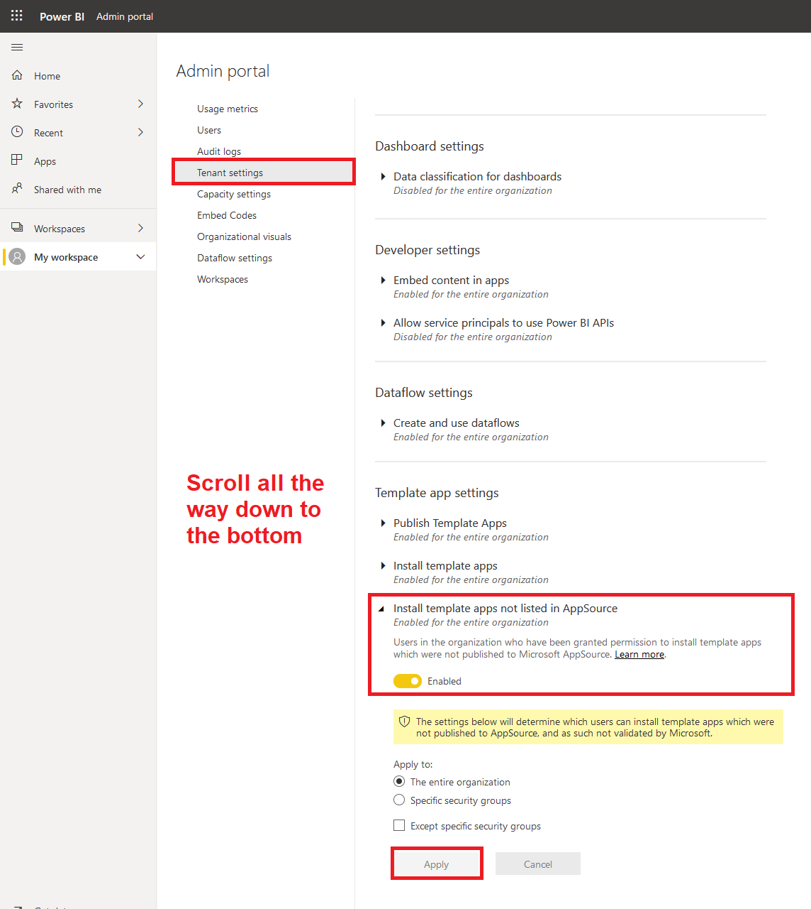
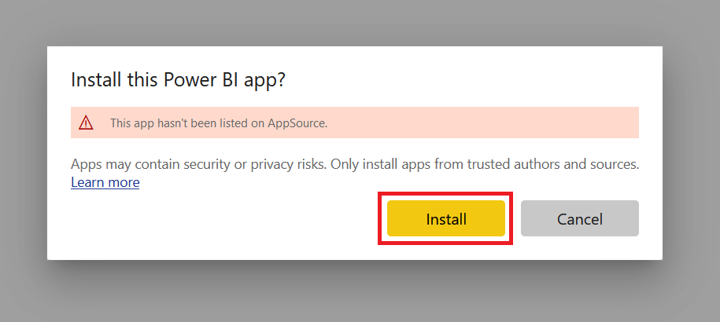
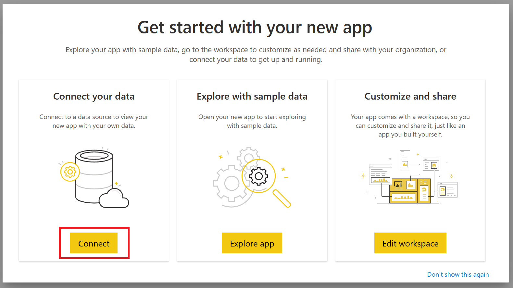
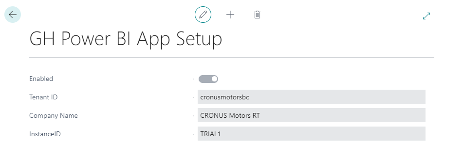
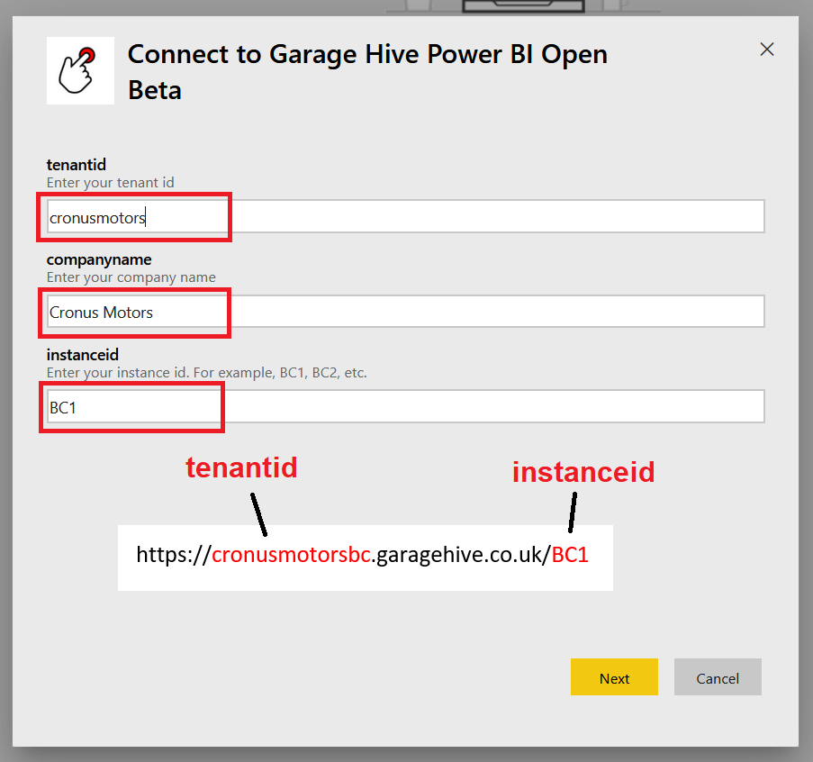
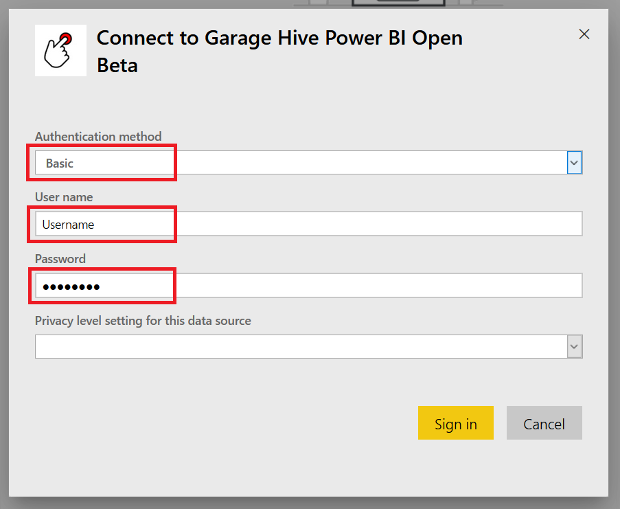
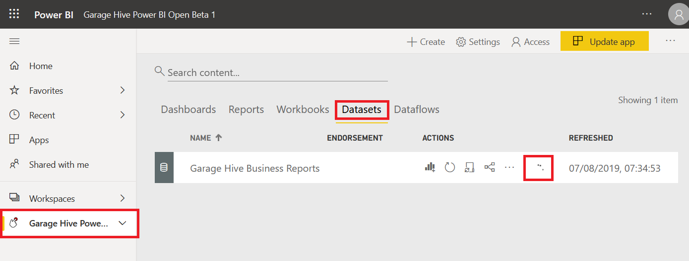
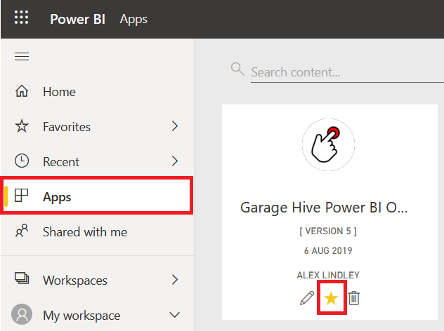

#   How to Install the Power BI APP

**PLEASE NOTE, YOU MUST SET YOUR LABOUR RATE IN GARAGE HIVE BEFORE INSTALLING THE APP -  [HOW TO SET YOUR AVERAGE LABOUR RATE](https://docs.garagehive.co.uk/docs/powerbi-labourrate.html "Set Average Labour Rate")** 



## Admin Portal Settings.

To install the Power BI App you must enable the ability to "install template apps not listed in AppSource"

To do this, login to your Garage Hive Power BI and go to your Admin portal. 

Once you are in your Admin Portal, select "Tenant settings", scroll to the bottom of the page and enable "Install template apps not listed in AppSource" and click Apply. 

## Installing the App.

## BETA - Garage Hive Power BI App Version 45
> [https://app.powerbi.com/Redirect?action=InstallApp&appId=99df594f-0769-4fb9-a067-b0f4a9a80880&packageKey=03195f18-e4a7-4e48-a557-ed0558b7a034wHjt1gukTbIFzoqcTjp1--8J6eWJFpUIxDTDSNVoYmc&ownerId=1bde89ad-b4ce-45df-a919-e1e08e47294d](https://app.powerbi.com/Redirect?action=InstallApp&appId=99df594f-0769-4fb9-a067-b0f4a9a80880&packageKey=03195f18-e4a7-4e48-a557-ed0558b7a034wHjt1gukTbIFzoqcTjp1--8J6eWJFpUIxDTDSNVoYmc&ownerId=1bde89ad-b4ce-45df-a919-e1e08e47294d "Power BI Update URL")

To install the app, paste the above URL into your web browser, please make sure you are logged into your Garage Hive Power BI on the same web browser. 

After entering the URL, Power BI will ask if you want to install the app. 

Once the app  has installed, go to your apps on Power BI and open the Garage Hive Power BI app. 

After opening the app you are given 3 options, select "Connect your data"

Enter your company details, you can find these by using the search function to find "GH Power BI App Setup" with Garage Hive. 

Enter these details into the relevant fields. 

You will now be asked to authorise the connection to your Garage Hive system. 

Select the Authentication method as "Basic", enter your Garage Hive username and password and leave the privacy level as blank and sign in. 

If you successfully authorise your Garage Hive system, you should see the data refreshing under the "Datasets" option.

It is now recommended that you add the app to your favourites.

The app is now ready to use. 

You can setup a refresh schedule, learn more here - [How to refresh your data](https://docs.garagehive.co.uk/docs/powerbi-refresh-data.html "How to refresh your data")