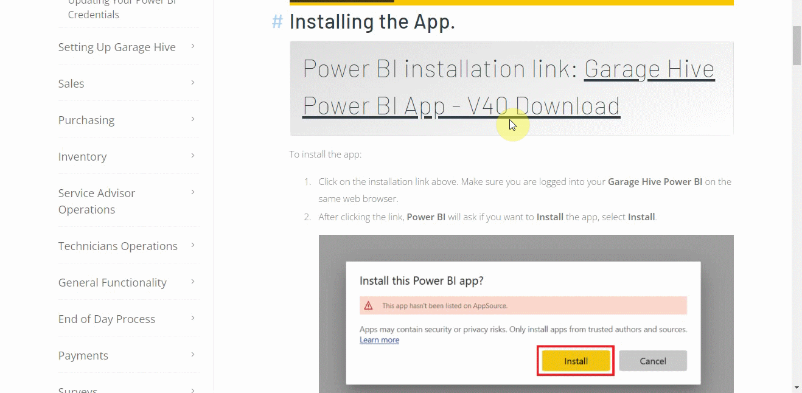
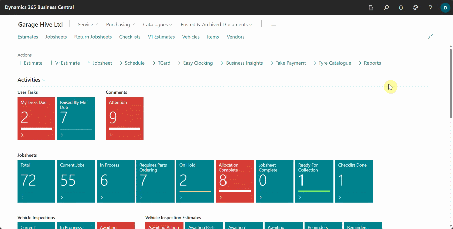
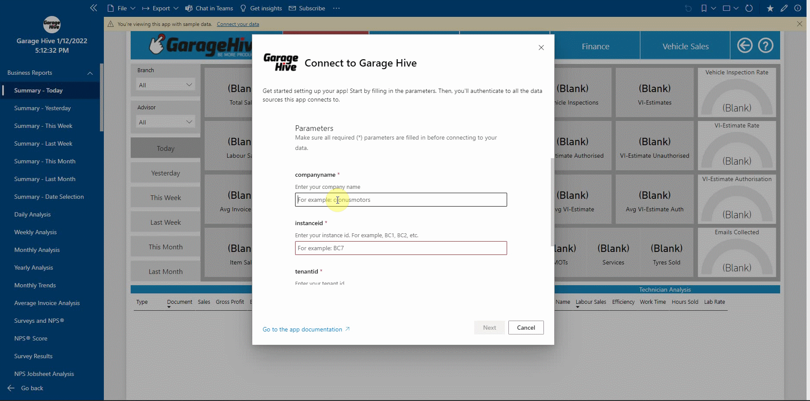
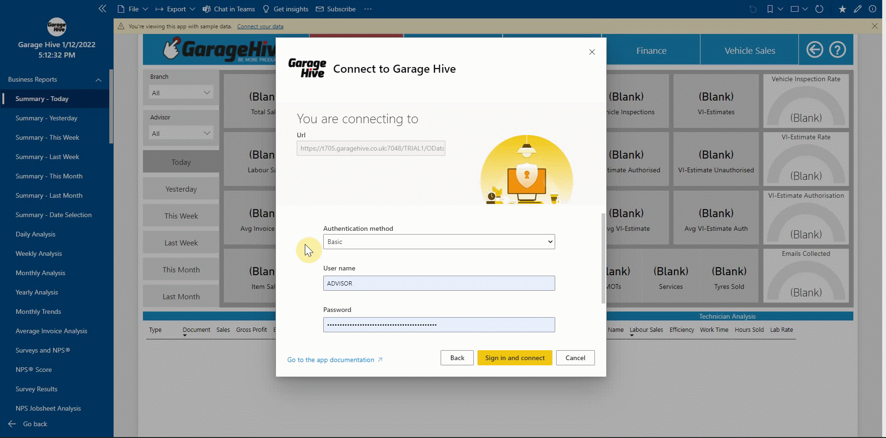
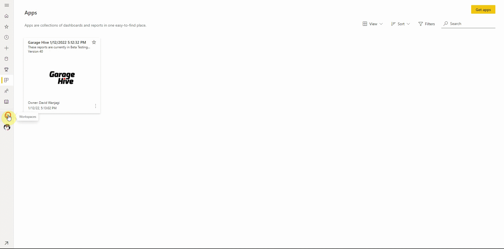
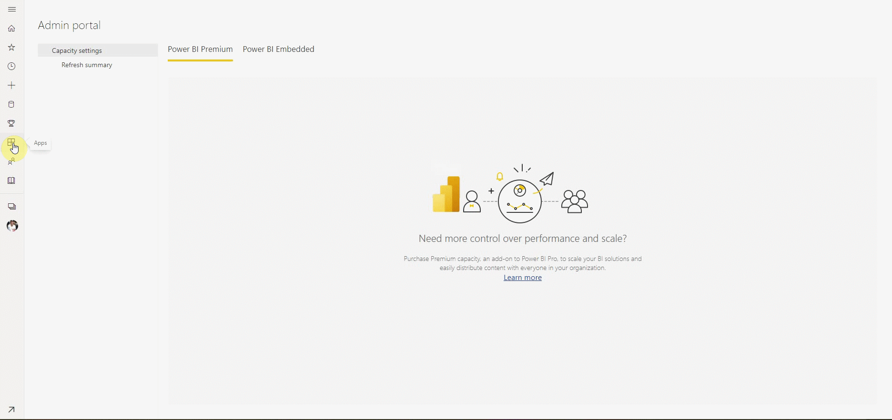

> **Important:**
> 
> Before installing the **Power BI App**, you should first setup your labour rate in Garage Hive. - [How to set your **Average Labour Rate**](https://docs.garagehive.co.uk/docs/garagehive-labour-rate.html "Set Average Labour Rate").

# Installing the Power BI App

> # Power BI installation link: <ins>[Garage Hive Power BI App - V40 Download](https://app.powerbi.com/groups/me/apps/739eb02b-643e-4bc3-a9ae-61191a89452d/package/5036903e-cde3-4bc5-9283-9021165f710bThVxZIUdgL9VO1ue4llxtcWiA6Xy1Q6IF19Rn1oo94g/install?ownerId=1bde89ad-b4ce-45df-a919-e1e08e47294d&referrer=l.facebook.com&forceRedirectToPowerBiPortal=true "Power BI V40 Download")</ins>

To install the app:
1. Click on the installation link above. Make sure you are logged into your **Garage Hive Power BI** on the same web browser. 
2. After clicking the link, **Power BI** will ask if you want to **Install** the app, select **Install**. 

   

3. Once the app  has installed, go to your apps on Power BI and open the **Garage Hive Power BI** app. Select the app to open.
4. When you open the app, you are guided with a warning at the top that says, "You're viewing this app with sample data. **Connect Your Data**." Select **Connect Your Data**. A page to enter your **Company Details** opens.

   

5. Enter your **Company Details**; you can find these by using the search function to find **Power BI App Setup** within **Garage Hive**.

   

6. Enter these details into the relevant fields.

   

7. You will now be asked to authorise the connection to your **Garage Hive** system. 
8. Select the Authentication method as **Basic**, enter your **Username** and **Password** (use the **Web Service Access Key** - click on the three dots to view) from your **Power BI App Setup**.

   > **NOTE:** We recommend using the **Web Service Access Key** since it's independent of the **Garage Hive** system password. This means, if your **Garage Hive** system is reset, your **Power BI App** will continue working as usual without crashing.
   
9. Leave the **Privacy Level Setting** as it is and **Sign In and Connect**. Your will now start refreshing.

   

10. If you successfully authorise your **Garage Hive** system, you should see the data refreshing under **Workspaces**, select **Garage Hive** app and then **Datasets+Dataflows** option.

   

11. You can now add the app to your **Favourites**, for easier accessibility.

   

The app is now ready to use.

You can setup a refresh schedule, learn more here - [How to refresh your data](https://docs.garagehive.co.uk/docs/powerbi-refresh-data.html "How to refresh your data")

## **Admin Portal Settings.**
If you are having any trouble when installing, check the **Admin Portal Settings**.

To do this:
1. login to your **Garage Hive Power BI** and go to your **Admin Portal**. 

   

2. Once you are in your **Admin Portal**, select **Tenant settings**, scroll to the bottom of the page and enable **Install Template Apps Not Listed in AppSource** and click **Apply**. 

 

### **See Also**
[Video - How to install the Garage Hive Power BI report](https://youtu.be/iO17qPjBAc0) \
[How to set your Average Labour Rate](garagehive-labour-rate.html) \
[Installing the Power BI App](powerbi-installing-app.html) \
[Refreshing your Power BI data](powerbi-refresh-data.html) \
[Updating your Power BI App](powerbi-updating-app.html) \
[Updating your Power BI credentials](powerbi-updating-app.html)

