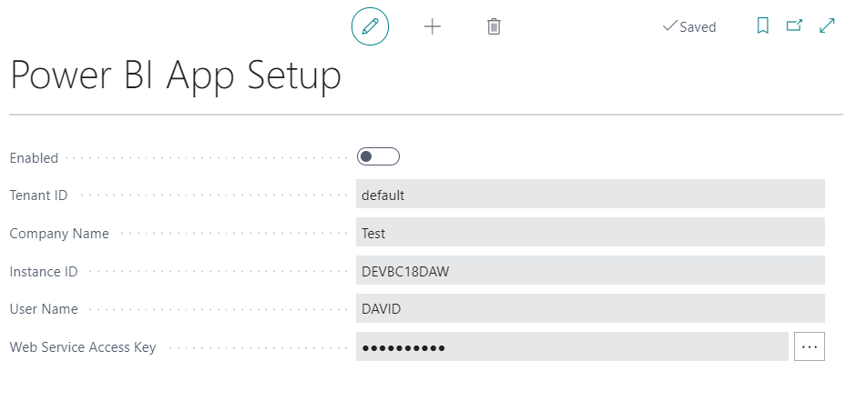

#   How to Install the Power BI APP

> **PLEASE NOTE: YOU MUST SET YOUR LABOUR RATE IN GARAGE HIVE BEFORE INSTALLING THE APP -  [HOW TO SET YOUR AVERAGE LABOUR RATE](https://docs.garagehive.co.uk/docs/powerbi-labourrate.html "Set Average Labour Rate")** 



# **Admin Portal Settings.**

To install the Power BI App you must enable the ability to **install template apps not listed in AppSource**.

To do this:
1. login to your **Garage Hive Power BI** and go to your **Admin Portal**. 

   

2. Once you are in your **Admin Portal**, select **Tenant settings**, scroll to the bottom of the page and enable **Install Template Apps Not Listed in AppSource** and click **Apply**. 

# **Installing the App.**

> # Power BI installation link: [Garage Hive Power BI App - V40 Download](https://app.powerbi.com/groups/me/apps/739eb02b-643e-4bc3-a9ae-61191a89452d/package/5036903e-cde3-4bc5-9283-9021165f710bThVxZIUdgL9VO1ue4llxtcWiA6Xy1Q6IF19Rn1oo94g/install?ownerId=1bde89ad-b4ce-45df-a919-e1e08e47294d&referrer=l.facebook.com&forceRedirectToPowerBiPortal=true "Power BI V40 Download")

To install the app:
1. Click on the installation link above. Make sure you are logged into your **Garage Hive Power BI** on the same web browser. 
2. After clicking the link, **Power BI** will ask if you want to **Install** the app, select **Install**. 

   

2. Once the app  has installed, go to your apps on Power BI and open the **Garage Hive Power BI** app. Select the app to **Open**.

   

3. After opening the app you are given 3 options, select **Connect Your Data**.

   

4. Enter your **Company Details**; you can find these by using the search function to find **Power BI App Setup** within **Garage Hive**.

   

5. Enter these details into the relevant fields. 

   

5. You will now be asked to authorise the connection to your **Garage Hive** system. 
6. Select the Authentication method as **Basic**, enter your **Username** and **Password** (use the **Web Service Access Key** - click on the three dots to view) from your **Power BI App Setup**.

   > **NOTE:** We recommend using the **Web Service Access Key** since it's independent of the **Garage Hive** system password. This means, if your **Garage Hive** system is reset, your **Power BI App** will continue working as usual without crashing.
   
7. Leave the **Privacy Level** as blank and **Sign In**.  

   

8. If you successfully authorise your **Garage Hive** system, you should see the data refreshing under the **Datasets** option.

   

9.  You can now add the app to your favourites, for easier accessbility.

   

The app is now ready to use.

You can setup a refresh schedule, learn more here - [How to refresh your data](https://docs.garagehive.co.uk/docs/powerbi-refresh-data.html "How to refresh your data")