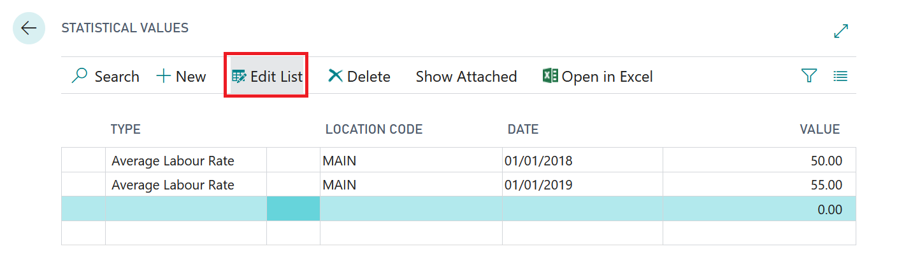

# Statistical Values



# Average Labour Rate

The Garage Hive Efficiency calculation requires that you set your "Average Labour Rate" in the system. This is because the hours sold at full value is calculated by dividing Labour sales by your average labour rate during any particular date range. 

# Setting up Statistical Values

The Statistical value table can be found by using the search function and searching for "Statistical Values"

You must enter the Type, Location Code, Date and Value. 

You only need to enter a single date, which is the date that the labour rate changed. 

