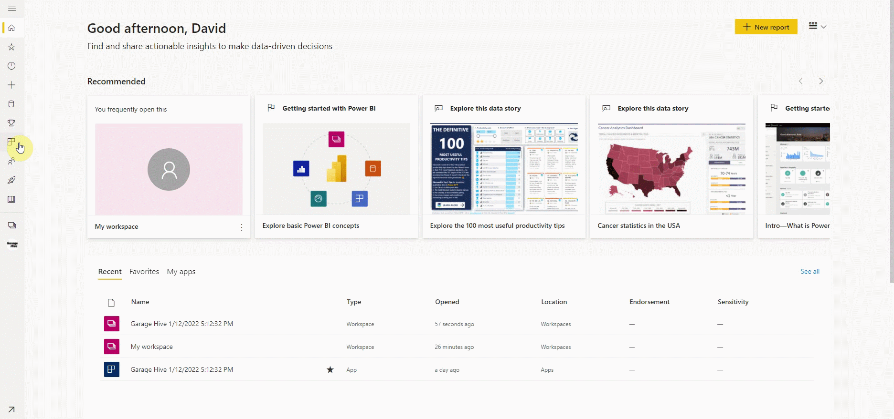
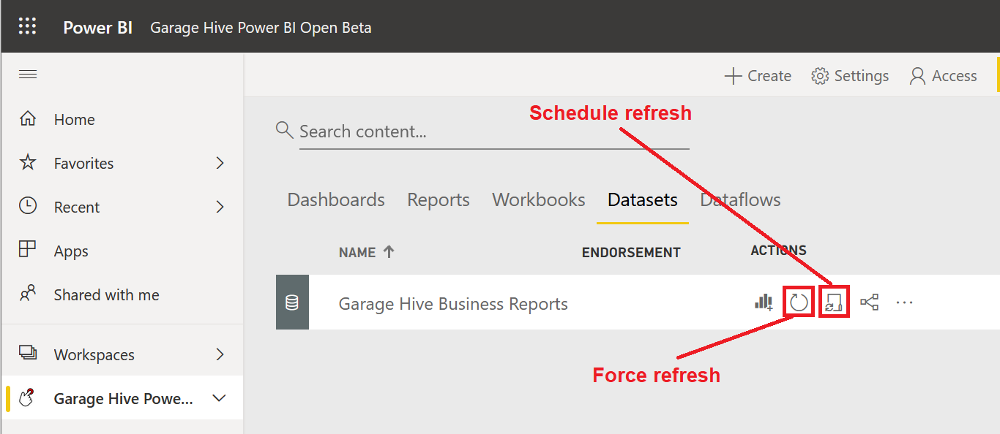
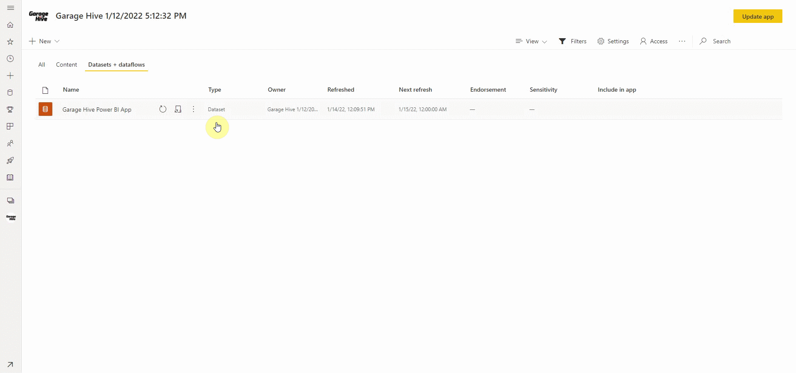

# Refreshing your Power BI Data
You can refresh your Power BI data in two ways: **Refresh Now** or **Schedule Specific Refresh Times**. 

Let's start by looking at how you can force a refresh on your Power BI Data now:
1. Log in to your Power BI app and click on the **Apps** tab on the left. Select **Edit** from the three dots at the bottom-right corner of the Garage Hive App.
2. Select **Datasets + dataflows** at the top, just below the menu bar, from the page that opens. Hover your mouse over the **Garage Hive Power BI App** on the list (but don't click on it), and a **Refresh Now** icon will appear. Click on it to refresh the data now.

   

 

To schedule specific times to refresh the Power BI Data:
1. Repeat the above process of refreshing now, and next to the **Refresh Now** icon, there is a **Schedule Refresh** icon. Click on it.

   

2. Scroll down to **Scheduled Refresh** in the listed menus on the **Datasets** page that opens and select it.
3. Under **Scheduled Refresh**, you can set the **Refresh Frequency** to either **Daily** or **Weekly**, as well as **Add Another Time** for when you want the refresh to occur. Make sure **Keep Your Data Up To Date** is enabled.
4. After you've completed the setup, click **Apply** to apply the new settings.

   

 

### **See Also**
[Video - How to refresh your Power BI Data](https://youtu.be/iB1gOxYTn4k){:target="_blank"} \
[How to set your Average Labour Rate](garagehive-labour-rate.html){:target="_blank"} \
[Installing the Power BI App](powerbi-installing-app.html){:target="_blank"} \
[Updating your Power BI App](powerbi-updating-app.html){:target="_blank"} \
[Updating your Power BI credentials](powerbi-updating-app.html){:target="_blank"} \
[Deleting the Power BI and installing a new one](garagehive-delete-old-powerbi-app-and-install-new-one.html){:target="_blank"} \
[How to Set Business Targets](garagehive-how-to-set-business-targets.html){:target="_blank"}

